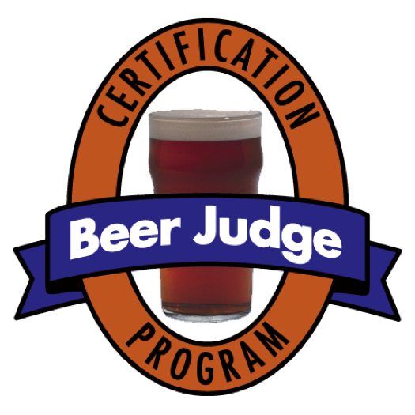

**Beer Judge Certification Program**

**2015 Style Guidelines**

**Beer Style Guidelines**

**Copyright © 2015, BJCP, Inc.**

*The BJCP grants the right to make copies for use in
 BJCP-sanctioned competitions or for educational/judge training purposes. *

*All other rights reserved.*

**Updates available at www.bjcp.org.**

Edited by Gordon Strong

with

Kristen England

> **Past Guideline Analysis:** Don Blake, Agatha Feltus, Tom Fitzpatrick, Mark Linsner, Jamil Zainasheff
>
> **New Style Contributions:** Drew Beechum, Craig Belanger, Dibbs Harting, Antony Hayes, Ben Jankowski, Andew Korty,
> Larry Nadeau, William Shawn Scott, Ron Smith, Lachlan Strong, Peter Symons, Michael Tonsmeire,
> Mike Winnie, Tony Wheeler
>
> **Review and Commentary:** Ray Daniels, Roger Deschner, Rick Garvin, Jan Grmela, Bob Hall, Stan Hieronymus, Marek Mahut,
> Ron Pattinson, Steve Piatz, Evan Rail, Nathan Smith,Petra and Michal Vřes
>
> **Final Review:** Brian Eichhorn, Agatha Feltus, Dennis Mitchell, Michael Wilcox

<!-- MarkdownTOC -->

- [Introduction to the 2015 Guidelines](#introduction-to-the-2015-guidelines)
	- [Styles and Categories](#styles-and-categories)
	- [Naming of Styles and Categories](#naming-of-styles-and-categories)
	- [Using the Style Guidelines](#using-the-style-guidelines)
	- [Format of a Style Description](#format-of-a-style-description)
	- [Style Description Language](#style-description-language)
- [Introduction to Beer Styles](#introduction-to-beer-styles)
	- [Basic Categorization](#basic-categorization)
	- [Common Attributes of All Beer Styles](#common-attributes-of-all-beer-styles)
	- [Glossary](#glossary)
		- [Hop Terms](#hop-terms)
		- [Malt or Mashing Terms](#malt-or-mashing-terms)
		- [Yeast or Fermentation Terms](#yeast-or-fermentation-terms)
		- [Quality or Off-Flavor Terms](#quality-or-off-flavor-terms)
		- [Appearance Terms](#appearance-terms)
	- [Color Reference](#color-reference)
	- [Style Organization](#style-organization)
	- [Style Tag Reference](#style-tag-reference)
- [1. Standard American Beer](#1-standard-american-beer)
	- [1A. American Light Lager](#1a-american-light-lager)
	- [1B. American Lager](#1b-american-lager)
	- [1C. Cream Ale](#1c-cream-ale)
	- [1D. American Wheat Beer](#1d-american-wheat-beer)
- [2. International Lager](#2-international-lager)
	- [2A. International Pale Lager](#2a-international-pale-lager)
	- [2B. International Amber Lager](#2b-international-amber-lager)
	- [2C. International Dark Lager](#2c-international-dark-lager)
- [3. Czech Lager](#3-czech-lager)
	- [3A. Czech Pale Lager](#3a-czech-pale-lager)
	- [3B. Czech Premium Pale Lager](#3b-czech-premium-pale-lager)
	- [3C. Czech Amber Lager](#3c-czech-amber-lager)
	- [3D. Czech Dark Lager](#3d-czech-dark-lager)
- [4. Pale Malty European Lager](#4-pale-malty-european-lager)
	- [4A. Munich Helles](#4a-munich-helles)
	- [4B. Festbier](#4b-festbier)
	- [4C. Helles Bock](#4c-helles-bock)
- [5. Pale Bitter European Beer](#5-pale-bitter-european-beer)
	- [5A. German Leichtbier](#5a-german-leichtbier)
	- [5B. Kölsch](#5b-kölsch)
	- [5C. German Helles Exportbier](#5c-german-helles-exportbier)
	- [5D. German Pils](#5d-german-pils)
- [6. Amber Malty European Lager](#6-amber-malty-european-lager)
	- [6A. Märzen](#6a-märzen)
	- [6B. Rauchbier](#6b-rauchbier)
	- [6C. Dunkles Bock](#6c-dunkles-bock)
- [7. Amber Bitter European Beer](#7-amber-bitter-european-beer)
	- [7A. Vienna Lager](#7a-vienna-lager)
	- [7B. Altbier](#7b-altbier)
	- [7C. Kellerbier](#7c-kellerbier)
		- [Kellerbier: Pale Kellerbier](#kellerbier-pale-kellerbier)
		- [Kellerbier: Amber Kellerbier](#kellerbier-amber-kellerbier)
- [8. Dark European Lager](#8-dark-european-lager)
	- [8A. Munich Dunkel](#8a-munich-dunkel)
	- [8B. Schwarzbier](#8b-schwarzbier)
- [9. Strong European Beer](#9-strong-european-beer)
	- [9A. Doppelbock](#9a-doppelbock)
	- [9B. Eisbock](#9b-eisbock)
	- [9C. Baltic Porter](#9c-baltic-porter)
- [10. German Wheat Beer](#10-german-wheat-beer)
	- [10A. Weissbier](#10a-weissbier)
	- [10B. Dunkles Weissbier](#10b-dunkles-weissbier)
	- [10C. Weizenbock](#10c-weizenbock)
- [11. British Bitter](#11-british-bitter)
	- [11A. Ordinary Bitter](#11a-ordinary-bitter)
	- [11B. Best Bitter](#11b-best-bitter)
	- [11C. Strong Bitter](#11c-strong-bitter)
- [12. Pale Commonwealth Beer](#12-pale-commonwealth-beer)
	- [12A. British Golden Ale](#12a-british-golden-ale)
	- [12B. Australian Sparkling Ale](#12b-australian-sparkling-ale)
	- [12C. English IPA](#12c-english-ipa)
- [13. Brown British Beer](#13-brown-british-beer)
	- [13A. Dark Mild](#13a-dark-mild)
	- [13B. British Brown Ale](#13b-british-brown-ale)
	- [13C. English Porter](#13c-english-porter)
- [14. Scottish Ale](#14-scottish-ale)
	- [14A. Scottish Light](#14a-scottish-light)
	- [14B. Scottish Heavy](#14b-scottish-heavy)
	- [14C. Scottish Export](#14c-scottish-export)
- [15. Irish Beer](#15-irish-beer)
	- [15A. Irish Red Ale](#15a-irish-red-ale)
	- [15B. Irish Stout](#15b-irish-stout)
	- [15C. Irish Extra Stout](#15c-irish-extra-stout)
- [16. Dark British Beer](#16-dark-british-beer)
	- [16A. Sweet Stout](#16a-sweet-stout)
	- [16B. Oatmeal Stout](#16b-oatmeal-stout)
	- [16C. Tropical Stout](#16c-tropical-stout)
	- [16D. Foreign Extra Stout](#16d-foreign-extra-stout)
- [17. Strong British Ale](#17-strong-british-ale)
	- [17A. British Strong Ale](#17a-british-strong-ale)
	- [17B. Old Ale](#17b-old-ale)
	- [17C. Wee Heavy](#17c-wee-heavy)
	- [17D. English Barleywine](#17d-english-barleywine)
- [18. Pale American Ale](#18-pale-american-ale)
	- [18A. Blonde Ale](#18a-blonde-ale)
	- [18B. American Pale Ale](#18b-american-pale-ale)
- [19. Amber and Brown American Beer](#19-amber-and-brown-american-beer)
	- [19A. American Amber Ale](#19a-american-amber-ale)
	- [19B. California Common](#19b-california-common)
	- [19C. American Brown Ale](#19c-american-brown-ale)
- [20. American Porter and Stout](#20-american-porter-and-stout)
	- [20A. American Porter](#20a-american-porter)
	- [20B. American Stout](#20b-american-stout)
	- [20C. Imperial Stout](#20c-imperial-stout)
- [21. IPA](#21-ipa)
	- [21A. American IPA](#21a-american-ipa)
	- [21B. Specialty IPA](#21b-specialty-ipa)
		- [Specialty IPA: Belgian IPA](#specialty-ipa-belgian-ipa)
		- [Specialty IPA: Black IPA](#specialty-ipa-black-ipa)
		- [Specialty IPA: Brown IPA](#specialty-ipa-brown-ipa)
		- [Specialty IPA: Red IPA](#specialty-ipa-red-ipa)
		- [Specialty IPA: Rye IPA](#specialty-ipa-rye-ipa)
		- [Specialty IPA: White IPA](#specialty-ipa-white-ipa)
- [22. Strong American Ale](#22-strong-american-ale)
	- [22A. Double IPA](#22a-double-ipa)
	- [22B. American Strong Ale](#22b-american-strong-ale)
	- [22C. American Barleywine](#22c-american-barleywine)
	- [22D. Wheatwine](#22d-wheatwine)
- [23. European Sour Ale](#23-european-sour-ale)
	- [23A. Berliner Weisse](#23a-berliner-weisse)
	- [23B. Flanders Red Ale](#23b-flanders-red-ale)
	- [23C. Oud Bruin](#23c-oud-bruin)
	- [23D. Lambic](#23d-lambic)
	- [23E. Gueuze](#23e-gueuze)
	- [23F. Fruit Lambic](#23f-fruit-lambic)
- [24. Belgian Ale](#24-belgian-ale)
	- [24A. Witbier](#24a-witbier)
	- [24B. Belgian Pale Ale](#24b-belgian-pale-ale)
	- [24C. Bière de Garde](#24c-bière-de-garde)
- [25. Strong Belgian Ale](#25-strong-belgian-ale)
	- [25A. Belgian Blond Ale](#25a-belgian-blond-ale)
	- [25B. Saison](#25b-saison)
	- [25C. Belgian Golden Strong Ale](#25c-belgian-golden-strong-ale)
- [26. Trappist Ale](#26-trappist-ale)
	- [26A. Trappist Single](#26a-trappist-single)
	- [26B. Belgian Dubbel](#26b-belgian-dubbel)
	- [26C. Belgian Tripel](#26c-belgian-tripel)
	- [26D. Belgian Dark Strong Ale](#26d-belgian-dark-strong-ale)
- [27. Historical Beer](#27-historical-beer)
	- [Historical Beer: Gose](#historical-beer-gose)
	- [Historical Beer: Kentucky Common](#historical-beer-kentucky-common)
	- [Historical Beer: Lichtenhainer](#historical-beer-lichtenhainer)
	- [Historical Beer: London Brown Ale](#historical-beer-london-brown-ale)
	- [Historical Beer: Piwo Grodziskie](#historical-beer-piwo-grodziskie)
	- [Historical Beer: Pre-Prohibition Lager](#historical-beer-pre-prohibition-lager)
	- [Historical Beer: Pre-Prohibition Porter](#historical-beer-pre-prohibition-porter)
	- [Historical Beer: Roggenbier](#historical-beer-roggenbier)
	- [Historical Beer: Sahti](#historical-beer-sahti)
- [Introduction to Specialty-Type Beer](#introduction-to-specialty-type-beer)
	- [Entering Specialty-Type Beers](#entering-specialty-type-beers)
	- [Judging Specialty-Type Beers](#judging-specialty-type-beers)
	- [Balance in Beer](#balance-in-beer)
- [28. American Wild Ale](#28-american-wild-ale)
	- [28A. Brett Beer](#28a-brett-beer)
	- [28B. Mixed-Fermentation Sour Beer](#28b-mixed-fermentation-sour-beer)
	- [28C. Wild Specialty Beer](#28c-wild-specialty-beer)
- [29. Fruit Beer](#29-fruit-beer)
	- [29A. Fruit Beer](#29a-fruit-beer)
	- [29B. Fruit and Spice Beer](#29b-fruit-and-spice-beer)
	- [29C. Specialty Fruit Beer](#29c-specialty-fruit-beer)
- [30. Spiced Beer](#30-spiced-beer)
	- [30A. Spice, Herb, or Vegetable Beer](#30a-spice-herb-or-vegetable-beer)
	- [30B. Autumn Seasonal Beer](#30b-autumn-seasonal-beer)
	- [30C. Winter Seasonal Beer](#30c-winter-seasonal-beer)
- [31. Alternative Fermentables Beer](#31-alternative-fermentables-beer)
	- [31A. Alternative Grain Beer](#31a-alternative-grain-beer)
	- [31B. Alternative Sugar Beer](#31b-alternative-sugar-beer)
- [32. Smoked Beer](#32-smoked-beer)
	- [32A. Classic Style Smoked Beer](#32a-classic-style-smoked-beer)
	- [32B. Specialty Smoked Beer](#32b-specialty-smoked-beer)
- [33. Wood Beer](#33-wood-beer)
	- [33A. Wood-Aged Beer](#33a-wood-aged-beer)
	- [33B. Specialty Wood-Aged Beer](#33b-specialty-wood-aged-beer)
- [34. Specialty Beer](#34-specialty-beer)
	- [34A. Clone Beer](#34a-clone-beer)
	- [34B. Mixed-Style Beer](#34b-mixed-style-beer)
	- [34C. Experimental Beer](#34c-experimental-beer)
- [Appendix A: Alternate Categorizations](#appendix-a-alternate-categorizations)
	- [1. Styles Sorted Using 2008 Categories (Strict)](#1-styles-sorted-using-2008-categories-strict)
	- [2. Styles Sorted Using 2008 Guidelines (Modified)](#2-styles-sorted-using-2008-guidelines-modified)
	- [3. Styles Sorted Using Style Family](#3-styles-sorted-using-style-family)
	- [4. Styles Sorted Using Country of Origin](#4-styles-sorted-using-country-of-origin)
	- [5. Styles Sorted Using History](#5-styles-sorted-using-history)
- [Appendix B: Local Styles](#appendix-b-local-styles)
	- [X1. Dorada Pampeana](#x1-dorada-pampeana)
	- [X2. IPA Argenta](#x2-ipa-argenta)
	- [X3. Italian Grape Ale](#x3-italian-grape-ale)

<!-- /MarkdownTOC -->

Introduction to the 2015 Guidelines
=================================================================================================================================

The 2015 BJCP Style Guidelines are a major revision from the 2008 edition. The goals of the new edition are to better address world beer styles as found in their local markets, keep pace with emerging craft beer market trends, describe historical beers now finding a following, better describe the sensory characteristics of modern brewing ingredients, take advantage of new research and references, and help competition organizers better manage the complexity of their events.

Many new styles have been added, and some existing styles have been divided into multiple categories or simply renamed. The groupings of styles into categories has a new philosophy that groups styles with similar judging characteristics rather than a common heritage or family name. Do not assume that the same primary characteristic (e.g., color, strength, balance, dominant flavor, country of origin) was used to determine each category grouping; the reasoning was more variable and nuanced. Some changes have been made to allow us to be more agile in making future revisions. Finally, we have provided some additional guidance on how to use the guidelines to reduce the potential for misuse that we have observed in past editions.

If you are familiar with the 2008 guidelines, note that many category names and numbers are changing. Note that we have added an Introduction to Beer Styles section, just as we have had in the past with Mead and Cider styles. This new section addresses common characteristics of beer, and attributes that are assumed by default to be present or absent unless otherwise noted.

Styles and Categories
---------------------

The BJCP Style Guidelines use some specific terms with specialized meaning: *Category*, *Subcategory,* and *Style*. When thinking of beer, mead and cider styles, the subcategory is the most important label – *subcategory* means essentially the same thing as *style* and identifies the major characteristic of one type of beer, mead or cider. Each style has a well-defined description, which is the basic tool used during judging. When specialty beer descriptions refer to a *Classic Style*, we mean a *named style (subcategory name) in the BJCP Style Guidelines*; see the Introduction to Specialty-Type Beer section for more information.

The larger *categories* are *arbitrary* groupings of beer, mead, or cider styles, usually with similar characteristics but some subcategories are not necessarily related to others within the same category. The purpose of the structure within the BJCP Style Guidelines is to group styles of beer, mead and cider to facilitate judging during competitions; do not attempt to derive additional meaning from these groupings. No historical or geographic association is implied.

Competitions may create their own *award categories* that are distinct from the *style categories* listed in these guidelines. **There is no requirement that competitions use style categories as award categories!** Individual styles can be grouped in any fashion to create desired award categories in competition, for instance to balance out the number of entries in each award category.

While style categories are more useful for judging purposes since they group beers with similar perceptual characteristics, we recognize this may not be the best way to learn about beer styles. For educational purposes, the styles may be grouped into style families so they may be compared and contrasted. Beers may also be grouped by country of origin to better understand the history of beer in a country, or to learn about a local market. Any of these groupings is perfectly acceptable; the styles have only been grouped as they are to facilitate competition judging. See Appendix A for alternative groupings of styles.

Naming of Styles and Categories
-----------------------------------------------------------------------------------------------------------------------------

Some people get so lost in the specific names we use for beer styles and categories that they don’t seem to understand the descriptions of the actual styles. Our names are simply identifiers that we have chosen to best represent the styles and groupings described. Styles were named first, then grouped by similar characteristics or region of origin, then the groupings were named.

We understand that many of these styles can have different names and are called different things in different (or even the same) parts of the world. In the past, we often used several of these names in the style title to avoid showing a preference, but this too often led to people incorrectly using all the names simultaneously. So understand that we have selected names that are either commonly used or are descriptive of a style that might not have a local name. We are not attempting to tell breweries what they should call their products; we are attempting to have a common name that can be used for easy reference.

Some names we use are protected appellations. We are not saying that these should not be respected, or that all commercial breweries should use these names. Rather that these are the most appropriate names to describe the styles. If this concept is hard to understand, just assume that there is an implied “-style” designation on every style name. We didn’t want to use “-style” anywhere in names since these are style guidelines, and of course everything is a style.

We sometimes had to choose names that included a country or region of origin to differentiate between styles that used the same name (such as Porter). The names we use in these cases are intended to be descriptive, and not necessarily what the products are called in local markets. So one should not infer that we are telling brewers that they should be renaming their beers.

The use of country or region names in style and category names is also not meant to imply that those styles are only made in those countries or regions, simply that they either originated in or were popularized in those areas. Many styles are now quite worldwide, with subtle differences reflective of local ingredients. Remember the implied usage of “-style” when considering the differences in these products, and whether they truly represent a different style or are simply the normal variation you would see between breweries of a similar product.

We are not using country or region names to imply ownership or any other preferred standing. When names in common usage exist, we prefer to use them for styles rather than selecting a broader geographic name. We understand that some names bring along political, ethnic, or social conflict; we take no position on any of these – we’re trying to describe beer, not settle disputes.

Using the Style Guidelines
------------------------------------------------------------------------------------------------------------------------

When we created previous versions of the style guidelines, we had no idea how prevalent and pervasive they would become. We believed we were creating a standardized set of style descriptions for use in homebrew competitions, but then found they were widely adopted worldwide to describe beer in general. Many countries with emerging craft beer markets were using them as handbooks for what to brew. Consumers and trade groups began using the styles to describe their products. And, unfortunately, many made astounding leaps of logic well beyond what was our original intent, and subsequently used the guidelines as a sort of universal Rosetta Stone for beer.

While we understand that the guidelines may have been misused in contexts beyond our original intent, we’ve also observed them being misused in competitions and for other BJCP purposes such as exam preparation and grading. Some people develop their own misinterpretations of the guidelines, and then often unknowingly instruct others in their misuse. Our hope is that the information in this section will help prevent many cases of misinterpretation and misuse in the future. If anyone encounters someone using the guidelines incorrectly, please refer them to this section.

The following maxims express our original intent, and are designed to limit misuse not prevent the guidelines from being adopted for new uses:

1.  **The BJCP Style Guidelines are *guidelines* not *specifications***. Take those words at face value, or their plain meaning. Guidelines are meant to describe general characteristics of the most common examples, and serve as an aid for judging; they are not meant to be rigorously-applied specifications that are used to punish slightly unusual examples. They are suggestions, not hard limits. Allow for some flexibility in judging so that well-crafted examples can be rewarded. The guidelines are written in detail to facilitate the process of the structured evaluation of beer as practiced in homebrewing competitions; don’t take each individual statement in a style description as a reason to disqualify a beer.

2.  **The Style Guidelines were written primarily for homebrew competitions**. Individual style descriptions are written primarily as an aid for judging, and we have in some cases sought to define clear lines between styles to better allow for non-overlapping judging categories. We understand that some styles may overlap in the market, and some commercial examples may straddle boundaries. We have organized style categories for the purpose of organizing homebrew competitions, not for describing and communicating the styles of the world to a different audience.

3.  **We know lots of people use our guidelines**. We understand that many other organizations or groups are using our guidelines for purposes beyond our original intent. To the extent that those groups find value in our work, we are happy to have our guidelines used. We freely allow our naming and numbering system to be used by others. However, don’t make rash assumptions about the nature of beer and beer styles based on applications of the guidelines beyond their original intent. We also know some craft brewers are using our guidelines to rediscover historical styles, or to brew styles not native to their country – we are thrilled to be able to help advance craft beer in this way. Just remember that it’s not our original mission to do this; just a happy side-effect.

4.  **Styles change over time**. Beer styles change over the years, and some styles are open to interpretation and debate. Simply because a style *name* hasn’t changed over the years, doesn’t mean that *the beers themselves* haven’t changed either. Commercial brewers are subject to market forces and government regulation; their products definitely change over time. Because we have a beer known as *porter* now doesn’t mean that it has always been made that way throughout its history. Beer styles described in the guidelines are generally meant to describe modern beers currently available, unless otherwise specified (e.g., in the Historical Beer category).

5.  **Not every commercial beer fits our styles**. Don’t assume that every beer fits neatly into one of our categories. Some breweries revel in creating examples that don’t match our (or anyone else’s) guidelines. Some create beers called a style name that deliberately don’t match our guidelines. It’s perfectly fine for a commercial beer to not match one of our styles; we have not attempted to categorize every commercial beer – that is not our intent or our mission.

6.  **We have not defined every possible beer style**. Of course we know of beer styles that aren’t defined in our guidelines. Perhaps it is because the style is obscure or unpopular, that homebrewers aren’t making the style, that insufficient examples or research material exists to adequately define it to our standards, or that it is from a part of the world we haven’t extensively visited. Perhaps it was a historical style no longer made. Or perhaps it is something we believe is a passing fad. Regardless of reason, don’t believe that our guidelines represent the complete categorization of every beer style ever made – they aren’t. They do, however, describe the beers most commonly made today by homebrewers and many craft breweries.

7.  **Commercial examples change over time**. Just as beer styles change, individual examples change as well. Just because a beer was once a great example of a style does not mean that it will always be a great example of the style. Sometimes the beer changes (with ownership change, perhaps) or sometimes the style trend changes but the beer doesn’t. Anchor Liberty helped define the American IPA style when it was created, but it seems much more like typical American Pale Ales today.

8.  **Ingredients change over time**. Hops are the best example today; there are constantly new varieties coming to market with unique characteristics. Brewers looking for a differentiator may be rapidly adopting (and abandoning) ingredients. It is difficult to say that the character of a beer style is set in stone when the ingredients typically used in it are changing constantly. Allow for these changes when judging beer; not all American or New World hops will be citrusy or piney. Don’t be rigid about judging based on what was available or commonly used at the time of this writing; understand the ingredients typically used, and adapt judging to match the changing ingredients.

9.  **Most styles are fairly broad**. Some believe that our styles inhibit brewer creativity by rigidly prescribing boundaries. That is not our intent; we think creativity can drive innovation, and that brewer interpretation should be allowed. However, not every innovation is a good idea, or results in a beer that is recognizable in the same grouping of others with the same name. So styles should be interpreted as having some flexibility, but within reason.

10. **The Style Guidelines are not the Ten Commandments**. The words in this document are not due to divine inspiration; they were written by people making a good faith effort to describe beer as it is perceived. Don’t treat them as some kind of Holy Scripture. Don’t get so lost in parsing the individual words that you lose sight of the overall intent. The most important part of any style is the overall balance and impression; that is, that the beer reminds you of the style, and is a nicely drinkable product. To get lost in the individual descriptions loses the essence of the style. The mere fact that style descriptions can change from one edition of the guidelines to the next should be the clearest illustration that the words themselves are not sacred.

Format of a Style Description
---------------------------------------------------------------------------------------------------------------------------

We have used a standard format to describe beer styles. The sections within the template have specific meanings that should be understood so as not to be misused:

**Overall Impression**. In past editions, this was often a simple restatement of the basic Appearance, Aroma, Flavor and Mouthfeel sections. However, the section now describes the essence of the style; those points that distinguish it from other styles and that make it unique. The Overall Impression can also be thought of as an expanded consumer-level description that might be used to describe and differentiate the beer to someone who isn’t a beer geek or judge. This section also acknowledges the many uses outside judging, and allows others to describe a beer simply without using the detail needed by judges.

**Appearance, Aroma, Flavor, Mouthfeel**. These four sections are the basic building blocks of the style. They are the perceptual elements that define the style, and are the guidelines against which a beer is judged in competition. These sections have been rewritten from prior guidelines to focus more on the perceptual characteristics of the ingredients, not the ingredients or process themselves. Saying that a Munich Helles tastes like continental Pils malt is a great shorthand for what is perceived; except, of course, if you have no idea what continental Pils malt actually tastes like. Our guidelines are written so that a trained judge unfamiliar with examples of a given style can do a credible job judging it just using the structured evaluation method and using our guidelines as a reference.

**Comments**. This section contains interesting trivia or additional notes about a style that do not affect the perceptual assessment. Not every style has extensive comments; some are quite simple.

**History**. The BJCP is not a historical research organization; we make use of multiple references, although we freely admit that we have defined the history for many modern styles that aren’t found in reference books. Entire books can be (and have been) written on some of the styles we describe; we are only presenting a brief summary of some of the more important points.

**Characteristic Ingredients**. We don’t attempt to provide enough details to create a recipe for every style, but we do try to describe the typical ingredients (and sometimes processes) that help drive the character that distinguishes the style from others. Not every beer is going to be made the same way or using the same ingredients; we are simply describing what is typical, not what is required.

**Style Comparison**. A new section in this edition of the guidelines, the Style Comparison notes help describe how this style differs from similar or related styles. Some people might understand a new style better if it can be described in terms of another style. Judges occasionally want to know the key points that separates one style from another. This section provides those clues, which helps put the perceptual notes in context, particularly for judges unfamiliar with the style.

**Entry Instructions**. This section identifies the required information necessary for judges to judge an example in the given style. Competition entrants should always provide this information. Competition software should always require this information. Competition organizers should always provide this information to the judges. Judges should always ask for this information if it is not provided.

**Vital Statistics**. The general characteristics of the style, expressed in Original Gravity (OG), Final Gravity (FG), Alcohol-by-Volume (ABV), International Bittering Units (IBUs), and Color as expressed in the Standard Reference Method (SRM) from the American Society of Brewing Chemists (ASBC). For those outside the United States that use the European Brewing Convention (EBC) color method, note that an EBC value is roughly double the equivalent SRM value. For those familiar with the Lovibond system, Lovibond is roughly equivalent to SRM for colors that exist in all but the darkest beers. For the purists out there, we’re talking about what is distinguishable to a judge using their eyes, not chemists using analytical equipment in a laboratory setting. Keep in mind that these Vital Stats are still guidelines, not absolutes. They are where most examples fall, not every possible commercial example of a style. They help judges determine judging order, not whether an example should be disqualified.

**Commercial Examples**. The guidelines present well-established commercial examples that are generally representative of the style. The number of examples has been generally reduced from past editions of the guidelines to facilitate maintenance. We intend to publish additional examples on the BJCP web site in the future. Do not assign any additional meaning to the order of examples within the guidelines. Do not assume that every commercial example would score perfectly when evaluated against the style descriptions. Simply because a commercial example is listed as a reference for a style does not mean that every example is going to be world-class. Some beers can be mishandled, and some examples change over time. Do not use commercial examples as the benchmark for a style description; judge competition beers against the guidelines, not expectations from a single commercial example. A single beer rarely defines the entire range of a beer style, so do not limit your expectations in such a restrictive way.

**Tags**. To facilitate the sorting of styles into alternate groupings, we have applied an Information Architecture-type tagging of attributes for each style. The list of tags is in no particular order, and is meant to signify attributes or information about a style. The tags should not be used to imply any deeper meaning.

Style Description Language
------------------------------------------------------------------------------------------------------------------------

The guidelines are a set of long documents, and some style descriptions are quite lengthy. To keep the prose from being bone-dry boring, synonyms (words or phrases meaning exactly the same thing, or having nearly the same meaning) are frequently used. Do not attempt to read more into the use of synonyms than is intended. In the past, some have questioned the difference between *light* and *low*, *medium* and *moderate*, *deep* and *dark*, and many other similar examples – the answer is there is no difference in these words in the context in which they are used; they are intended to mean the same things (often, relative intensities of perceptions). Take these words at their plain meaning. If you find yourself parsing the guidelines like you’re trying to find a secret message if played backwards, you’re trying too hard.

When we use multiple words to mean similar things, we are simply trying to be literate, and to use a reasonably educated vocabulary. We don’t want to be the Language Police and say that one synonym is always right, and others are always wrong. So don’t be looking for inconsistencies in usage or try to add nuanced distinctions in different words used to express the same concept. Don’t require that words in the style guidelines be the exact same words used on scoresheets or exams. Worry more about the concept being conveyed and less about the precise expression of the concept.

Pay careful attention to the modifiers used in describing the styles. Look for guidance on the magnitude and quality of each characteristic. Notice that many characteristics are optional; beers not evidencing these non-required elements should not be marked down. Phrases such as *may have*, *can contain*, *might feature*, *is acceptable*, *is appropriate*, *is typical*, etc. all indicate **optional** elements. **Required** elements are generally written as declaratory phrases, or use words such as *must* or *should*. Elements that must **not** be present often use phrases such as *is inappropriate*, *no*, or *must not*. Again, take these words at their plain meaning.

Do not overly focus on single words or phrases within style descriptions to the exclusion of the broader intent. Understand the overall impression of the style, the general balance, and how the style differs from related or similar styles. Do not disproportionately weight specific phrases if that would change the overall impression, balance, and meaning of the style, or if it would cause the beer to be disqualified or otherwise marked down for style issues.

Introduction to Beer Styles
===========================

In order to reduce the size of style descriptions, we use some basic shorthand or jargon to represent more complex thoughts, and we also omit some items that should only be noted in exception circumstances. Some terminology may have different meanings in certain parts of the world, so we define our usages to avoid confusion. We also identify certain characteristics that are assumed not to be present in all beer styles so we don’t have to repeat those restrictions in every style.

Basic Categorization
--------------------

The most general categorization of beer styles by yeast type is a modern craft brewing phenomenon. American brewers and most other craft brewers call beers *ales* if they use top-fermenting (ale) yeast and *lagers* if they use bottom-fermenting (lager) yeast. Most categorization systems will allow for a third classification, often called spontaneously-fermented because of the method; however, *wild* is perhaps a more widely-used modern craft beer term for these beers fermented with bacteria or non-saccharomyces yeast. The term *wild* in this context does not imply spontaneous fermentation; most are directly inoculated with the desired fermentation strains.

In Germany and other old world brewing centers, the terminology most typically used to differentiate beers is to refer to them as *top-fermenting* or *bottom-fermenting*. Germans think of ale as a type of English beer, and lager as a method of conditioning beer. So Germans would typically speak of Kölsch as a top-fermenting lager beer, not an ale.

English brewers, particularly when dealing in a historical context, might separate ales from porters and stouts as types of beer (although in the next breath, saying there is no difference between porters and stouts). When dealing in even more historical contexts, they might go even further to describe ale as distinct from beer in that beer was hopped (or more highly hopped) than ale. These historical notes are important for understanding old recipes and writings, but have little relevance today in the common usages of terms describing beer.

These guidelines attempt to use the modern craft beer definitions of *ale*, *lager*, and *wild* as the major groupings of beer styles, but will mention how they might be described in local or regional contexts, if possible.

Common Attributes of All Beer Styles
----------------------------------------------------------------------------------------------------------------------------------

The attributes discussed in this section are assumed to be present in every beer style description unless otherwise noted. It is not necessary to repeat all these characteristics for every style description. *Do not assume that since a characteristic (such as diacetyl) isn’t mentioned in a style description that somehow it is allowable.*

*Unless explicitly noted in an individual style description*, all beer styles are assumed to be cleanly fermented and free from technical faults, including acetaldehyde, astringency, chlorophenols, diacetyl, DMS, fusel alcohol, and phenolics. All beer styles are assumed to be free of packaging and handling faults, including oxidation, light-struck, sour, and musty characteristics.

In mouthfeel, all beers are assumed to be free from astringency, and not be creamy or have any other palate sensations unless otherwise noted. Beers with an alcohol level of 6% or less are assumed to not have the flavor or warming nature of alcohol, unless otherwise noted. Higher-alcohol beers that have a noticeable alcohol presence should not be harsh, hot, solventy, or burning. The alcohol character if noted, should be clean and not have fusel alcohols.

Lagers tend to be smooth, clean, and free of esters, but may have slight yeast-derived sulfur notes that are often fleeting. Styles made with a large amount of Pilsner malt may have low DMS notes; this is not a fault, but it is also not required unless otherwise noted. In both cases, the small amounts of sulfur and/or DMS should not be taken as meaning that prominent quantities are somehow desirable – they’re not. Just be aware that the use of some traditional ingredients often leave small sensory indications of their presence that might be considered faults in other contexts; that is perfectly acceptable, although not required.

Unless otherwise noted, assume all lagers to not have any fruitiness (esters). Ales tend to be less smooth than lagers, so unless otherwise noted, assume all ales may have some esters (not required, but not a fault).

Glossary
------------------------------------------------------------------------------------------------------

Some terminology used in the style guidelines may be unfamiliar to some readers. Rather than include a complete dictionary, we have highlighted a few terms that either may not be well understood, or that imply specific meanings within the guidelines. Sometimes ingredient names are used as a shorthand for the character they provide to beer. When judges use these terms, they don’t necessarily imply that those specific ingredients have been used, just that the perceived characteristics match those commonly provided by the mentioned ingredients.

### Hop Terms

**American hops** – modern American brewing hops from the craft beer era, typically having citrusy, resiny, evergreen, or similar characteristics. More modern hops can add even more unusual and experimental characteristics, such as stone fruit, berry, and melon.

**Old World hops** – traditional European brewing hops, including Saazer-type hops, British brewing hops, and those other varieties from continental Europe. Typically described as floral, spicy, herbal, or earthy. Generally less intense than many New World hops.

**New World hops** – American hops, along with those from Australia and New Zealand, and other non-Old World locations. Can have all the attributes of classic American hops, as well as tropical fruit, stone fruit, white grape, and other interesting aromatics.

**Saazer-type hops** – often called noble hops, traditionally among the finest continental European brewing hops. Often having a lightly floral, spicy, or herbal character; rarely brash and aggressive, typically more subtle and elegant in nature.

### Malt or Mashing Terms

**Munich malt** – can provide a bready, richly malty quality that enhances the malt backbone of a beer without adding residual sweetness, although some can confuse maltiness with sweetness. Darker Munich malts can add a deeply toasted malt quality similar to toasted bread crusts.

**Vienna malt** – can provide a bready-toasty malt presence, but don’t expect the toasted notes to be extreme – they’re more like untoasted bread crusts than toasted bread.

**Pilsner or Pils malt** – continental Pilsner malt is quite distinctive, and has a slightly sweet, lightly grainy character with a soft, slightly toasty, honey-like quality. Higher in DMS precursors than other malts, its use can sometimes result in a low corny DMS flavor.

**Maillard products** – a class of compounds produced from complex interactions between sugars and amino acids at high temperatures, resulting in brown colors and rich, malty, sometimes even somewhat meaty compounds. In previous versions of the guidelines, known as melanoidins, which are a subset of Maillard products responsible for red-brown colors (and, according to Kunze, are “aroma-intensive”). In some brewing literature, melanoidin and Maillard product are used interchangeably. The chemistry and flavor characterization is not well understood, so brewers and judges should avoid excessively pedantic discussions around these points. The takeaway is that we mean the richly malty flavors, and need some kind of convenient shorthand to discuss them. Maillard is pronounced, roughly, as “my-YARD.”

**Biscuity** – dry, toasted grain, flour, or dough flavor reminiscent of English digestive biscuits; in brewing, a flavor commonly associated with Biscuit malt and some traditional English malts.

### Yeast or Fermentation Terms

**Clean fermentation profile** – the quality of having very low to no yeast-derived fermentation by-products in the finished beer, typically implying that there are no esters, diacetyl, acetaldehyde, or similar components, except if specifically mentioned. A shorthand for saying that the long list of possible fermentation by-products are not present in significant or appreciable quantities (barely perceived trace quantities at the threshold of perception are typically acceptable, nonetheless).

**Pome fruit** – apple, pear, quince. The botanical classification contains other fruit, but these are the common ones we mean.

**Stone fruit** – fleshy fruit with a single pit (or stone), such as cherry, plum, peach, apricot, mango, etc.

**Brett** – shorthand term for *Brettanomyces*, an attenuative genus of yeast that often is used to produce fruity or funky complex flavors (leather, sweat, funk, etc.) in fermented beverages. Literally means “British fungus” and is often associated with qualities produced during barrel aging. Common species used in brewing include *B. bruxellensis* and *B. anomalous*, although they are sometimes known by other names; several strains exist with very different profiles (as with *S. cerevisiae*). May be used as a primary fermentation or secondary fermentation strain.

### Quality or Off-Flavor Terms

**Adjunct quality** – a characteristic of beer aroma, flavor, and mouthfeel that reflects the use of higher percentages of non-malt fermentables. Can present as a corny character, a lighter body than an all-malt product, or a generally thinner-tasting beer. Does not necessarily imply the use of any specific adjunct.

**DMS** – Dimethyl Sulfide, which can take on a wide range of perceptual characteristics. Most are inappropriate in any style of beer; however, a light cooked corn quality may be apparent in beers with high levels of Pilsner malt. When the guidelines state that any levels of DMS are appropriate, it is this light cooked corn flavor, not other cooked vegetable characteristics or other DMS flavors.

**Rustic** – coarse, hearty, robust character reminiscent of older, traditional ingredients; perhaps less refined as a general sensory experience.

**Elegant** – smooth, tasteful, refined, pleasant character suggestive of high quality ingredients handled with care; lacking rough edges, sharp flavors, and palate-attacking sensations.

**Funky** – A positive or negative term, depending on the context. If expected or desirable, can often take on a barnyard, wet hay, slightly earthy, horse blanket, or farmyard character. If too intense, unexpected, or undesirable, can take the form of silage, fecal, baby diaper, or horse stall qualities.

### Appearance Terms

**Belgian Lace (Lacing)** – a characteristic and persistent latticework pattern of foam left on the inside of the glass as a beer is consumed. The look is reminiscent of fine lacework from Brussels or Belgium, and is a desirable indicator of beer quality in Belgium.

**Legs** – a pattern that a beverage leaves on the inside of a glass after a portion has been consumed. The term refers to the droplets that slowly fall in streams from beverage residue on the side of the glass. Not an indication of quality, but can indicate a higher alcohol, sugar, or glycerol content.

Color Reference
-------------------------------------------------------------------------------------------------------------

Note that SRM is a measure of beer color density more than hue/tint. Keep this in mind when attempting to use only SRM numbers when describing beers. Within these Guidelines, beer color descriptors generally follow this mapping to SRM values:

Straw 2-3
Yellow 3-4
Gold 5-6
Amber 6-9
Deep amber/light copper 10-14
Copper 14-17
Deep copper/light brown 17-18
Brown 19-22
Dark Brown 22-30
Very Dark Brown 30-35
Black 30+
Black, opaque 40+

Style Organization
----------------------------------------------------------------------------------------------------------------

The beer styles described in the guidelines have been categorized to assist with running homebrew competitions. Categories (the major groupings of styles) are artificial constructs that represent a collection of individual sub-categories (beer styles) that may or may not have any historical, geographic, or traditional relationship with each other. Do not infer that membership in a style category somehow relates beer styles with each other. The only reason why they are grouped together is to assist with managing the scale and complexity of competitions. The names given to the groupings are for competition purposes only, and may not be used in any broader contexts in the beer and brewing industries.

**Competitions do not have to judge each style category separately**; they may be combined, split, or otherwise reorganized for competition purposes. Competition organizers are free to combine style sub-categories into their own competition categories. As long as each submitted beer is judged against the identified sub-category (style), any logical grouping is permitted.

Style Tag Reference
-------------------

To assist with regrouping styles for other purposes, we have added informational tags to each style. These tags indicate certain attributes of the beer that may be used for grouping purposes. The ‘meaning’ column explains the general intent of the tag, but is not meant to be rigorous, formal definition. In no way do the tags supersede the actual descriptions of the style.

| Category                  | Tag                | Meaning                                               |
|---------------------------|--------------------|-------------------------------------------------------|
| Strength                  |
|                           | session-strength   | \<4% ABV                                              |
|                           | standard-strength  | 4-6% ABV                                              |
|                           | high-strength      | 6-9% ABV                                              |
|                           | very-high-strength | \>9% ABV                                              |
| Color                     |
|                           | pale-color         | straw to gold                                         |
|                           | amber-color        | amber to copper-brown                                 |
|                           | dark-color         | dark brown to black                                   |
| Fermentation/Conditioning |
|                           | top-fermented      | ale yeast                                             |
|                           | bottom-fermented   | lager yeast                                           |
|                           | any-fermentation   | ale yeast or lager yeast                              |
|                           | wild-fermented     | non-Saccharomyces yeast/bacteria                      |
|                           | lagered            | cold conditioned                                      |
|                           | aged               | long conditioning before release                      |
| Region of Origin          |
|                           | british-isles      | England, Wales, Scotland, Ireland                     |
|                           | western-europe     | Belgium, France, Netherlands                          |
|                           | central-europe     | Germany, Austria, Czech Republic, Scandinavia         |
|                           | eastern-europe     | Poland, Baltic States, Russia                         |
|                           | north-america      | United States, Canada, Mexico                         |
|                           | pacific            | Australia, New Zealand                                |
| Style Family              |
|                           | ipa-family         |                                                       |
|                           | brown-ale-family   |                                                       |
|                           | pale-ale-family    |                                                       |
|                           | pale-lager-family  |                                                       |
|                           | pilsner-family     |                                                       |
|                           | amber-ale-family   |                                                       |
|                           | amber-lager-family |                                                       |
|                           | dark-lager-family  |                                                       |
|                           | porter-family      |                                                       |
|                           | stout-family       |                                                       |
|                           | bock-family        |                                                       |
|                           | strong-ale-family  |                                                       |
|                           | wheat-beer-family  |                                                       |
|                           | specialty-beer     |                                                       |
| Era                       |
|                           | craft-style        | developed in the modern craft beer era                |
|                           | traditional-style  | developed before the modern craft beer era            |
|                           | historical-style   | no longer made, or very limited production            |
| Dominant Flavor           |
|                           | malty              | malt-forward flavor                                   |
|                           | bitter             | bitter-forward flavor                                 |
|                           | balanced           | similar malt and bitter intensity                     |
|                           | hoppy              | hop flavor                                            |
|                           | roasty             | roasted malt/grain                                    |
|                           | sweet              | noticeable residual sweetness or sugar flavor         |
|                           | smoke              | flavor of smoked malt or grain                        |
|                           | sour               | noticeable sourness or intentionally elevated acidity |
|                           | wood               | wood or barrel age character                          |
|                           | fruit              | noticeable flavor and/or aroma of fruit               |
|                           | spice              | noticeable flavor and/or aroma of spices              |

1. Standard American Beer
=========================

This category describes everyday American beers that have a wide public appeal. Containing both ales and lagers, the beers of this category are not typically complex, and have smooth, accessible flavors. The ales tend to have lager-like qualities, or are designed to appeal to mass-market lager drinkers as crossover beers. Mass-market beers with a more international appeal or origin are described in the International Lager category.

1A. American Light Lager
------------------------

**Overall Impression:** Highly carbonated, very light-bodied, nearly flavorless lager designed to be consumed very cold. Very refreshing and thirst quenching.

**Aroma:** Low to no malt aroma, although it can be perceived as grainy, sweet, or corn-like if present. Hop aroma is light to none, with a spicy or floral hop character if present. While a clean fermentation character is desirable, a light amount of yeast character (particularly a light apple fruitiness) is not a fault. Light DMS is not a fault.

**Appearance:** Very pale straw to pale yellow color. White, frothy head seldom persists. Very clear.

**Flavor:** Relatively neutral palate with a crisp and dry finish and a low to very low grainy or corn-like flavor that might be perceived as sweetness due to the low bitterness. Hop flavor ranges from none to low levels, and can have a floral, spicy, or herbal quality (although rarely strong enough to detect). Low to very low hop bitterness. Balance may vary from slightly malty to slightly bitter, but is relatively close to even. High levels of carbonation may accentuate the crispness of the dry finish. Clean lager fermentation character.

**Mouthfeel:** Very light (sometimes watery) body. Very highly carbonated with slight carbonic bite on the tongue.

**Comments:** Designed to appeal to as broad a range of the general public as possible. Strong flavors are a fault.

**History:** Coors briefly made a light lager in the early 1940s. Modern versions were first produced by Rheingold in 1967 to appeal to diet-conscious drinkers, but only became popular starting in 1973 after Miller Brewing acquired the recipe and marketed the beer heavily to sports fans with the “tastes great, less filling” campaign. Beers of this genre became the largest sellers in the United States in the 1990s.

**Characteristic Ingredients:** Two- or six-row barley with high percentage (up to 40%) of rice or corn as adjuncts. Additional enzymes can further lighten the body and lower carbohydrates.

**Style Comparison:** A lighter-bodied, lower-alcohol, lower calorie version of an American Lager. Less hop character and bitterness than a Leichtbier.

**Vital Statistics:** OG: 1.028 – 1.040

IBUs: 8 – 12 FG: 0.998 – 1.008

SRM: 2 – 3 ABV: 2.8 – 4.2%

**Commercial Examples:** Bud Light, Coors Light, Keystone Light, Michelob Light, Miller Lite, Old Milwaukee Light

**Tags:** session-strength, pale-color, bottom-fermented, lagered, north-america, traditional-style, pale-lager-family, balanced

1B. American Lager
---------------------------------------------------------------------------------------------------------------------------------------------------------------

**Overall Impression:** A very pale, highly-carbonated, light-bodied, well-attenuated lager with a very neutral flavor profile and low bitterness. Served very cold, it can be a very refreshing and thirst quenching drink.

**Aroma:** Low to no malt aroma, although it can be perceived as grainy, sweet or corn-like if present. Hop aroma may range from none to a light, spicy or floral hop presence. While a clean fermentation character is desirable, a light amount of yeast character (particularly a light apple character) is not a fault. Light DMS is also not a fault.

**Appearance:** Very pale straw to medium yellow color. White, frothy head seldom persists. Very clear.

**Flavor:** Relatively neutral palate with a crisp and dry finish and a moderately-low to low grainy or corn-like flavor that might be perceived as sweetness due to the low bitterness. Hop flavor ranges from none to moderately-low levels, and can have a floral, spicy, or herbal quality (although often not strong enough to distinguish). Hop bitterness at low to medium-low level. Balance may vary from slightly malty to slightly bitter, but is relatively close to even. High levels of carbonation may accentuate the crispness of the dry finish. Clean lager fermentation character.

**Mouthfeel:** Low to medium-low body. Very highly carbonated with slight carbonic bite on the tongue.

**Comments:** Strong flavors are a fault. Often what non-craft beer drinkers expect to be served if they order *beer* in the United States. May be marketed as Pilsner beers outside of Europe, but should not be confused with traditional examples.

**History:** Although German immigrants had brewed traditional Pilsner-inspired lager beer in the United States since the mid-late 1800s, the modern American lager style was heavily influenced by Prohibition and World War II. Surviving breweries consolidated, expanded distribution, and heavily promoted a beer style that was appealing to a broad range of the population. Became the dominant beer style for many decades, and spawning many international rivals who would develop similarly bland products for the mass market supported by heavy advertising.

**Characteristic Ingredients:** Two- or six-row barley with high percentage (up to 40%) of rice or corn as adjuncts.

**Style Comparison:** Stronger, more flavor and body than a Light American Lager. Less bitterness and flavor than an International Lager. Significantly less flavor, hops, and bitterness than traditional European Pilsners.

**Vital Statistics:** OG: 1.040 – 1.050

IBUs: 8 – 18 FG: 1.004 – 1.010

SRM: 2 – 4 ABV: 4.2 – 5.3%

**Commercial Examples:** Budweiser, Coors Original, Grain Belt Premium Lager, Miller High Life, Pabst Blue Ribbon, Special Export

**Tags:** standard-strength, pale-color, bottom-fermented, lagered, north-america, traditional-style, pale-lager-family, balanced

1C. Cream Ale
----------------------------------------------------------------------------------------------------------------------------------------------------------

**Overall Impression:** A clean, well-attenuated, flavorful American “lawnmower” beer. Easily drinkable and refreshing, with more character than typical American lagers.

**Aroma:** Medium-low to low malt notes, with a sweet, corn-like aroma. Low levels of DMS are allowable, but are not required. Hop aroma medium low to none, and can be of any variety although floral, spicy, or herbal notes are most common. Overall, a subtle aroma with neither hops nor malt dominating. Low fruity esters are optional.

**Appearance:** Pale straw to moderate gold color, although usually on the pale side. Low to medium head with medium to high carbonation. Fair head retention. Brilliant, sparkling clarity.

**Flavor:** Low to medium-low hop bitterness. Low to moderate maltiness and sweetness, varying with gravity and attenuation. Usually well-attenuated. Neither malt nor hops dominate the palate. A low to moderate corny flavor is commonly found, as is light DMS (optional). Finish can vary from somewhat dry to faintly sweet. Low fruity esters are optional. Low to medium-low hop flavor (any variety, but typically floral, spicy, or herbal).

**Mouthfeel:** Generally light and crisp, although body can reach medium. Smooth mouthfeel with medium to high attenuation; higher attenuation levels can lend a “thirst quenching” quality. High carbonation.

**Comments:** Pre-prohibition Cream Ales were slightly stronger, hoppier (including some dry hopping) and more bitter (25-30+ IBUs). These versions should be entered in the historical category. Most commercial examples are in the 1.050–1.053 OG range, and bitterness rarely rises above 20 IBUs.

**History:** A sparkling or present-use ale that existed in the 1800s and survived prohibition. An ale version of the American lager style. Produced by ale brewers to compete with lager brewers in Canada and the Northeast, Mid-Atlantic, and Midwest states. Originally known as sparkling or present use ales, lager strains were (and sometimes still are) used by some brewers, but were not historically mixed with ale strains. Many examples are kräusened to achieve carbonation. Cold conditioning isn’t traditional, although modern brewers sometimes use it.

**Characteristic Ingredients:** American ingredients most commonly used. A grain bill of six-row malt, or a combination of six-row and North American two-row, is common. Adjuncts can include up to 20% maize in the mash, and up to 20% glucose or other sugars in the boil. Any variety of hops can be used for bittering and finishing.

**Style Comparison:** Similar to a Standard American Lager, but with more character.

**Vital Statistics:** OG: 1.042 – 1.055

IBUs: 8 – 20 FG: 1.006 – 1.012

SRM: 2.5 – 5 ABV: 4.2 – 5.6%

**Commercial Examples:** Genesee Cream Ale, Liebotschaner Cream Ale, Little Kings Cream Ale, New Glarus Spotted Cow, Old Style, Sleeman Cream Ale

**Tags:** standard-strength, pale-color, any-fermentation, north-america, traditional-style, pale-ale-family, balanced

1D. American Wheat Beer
--------------------------------------------------------------------------------------------------------------------------------------------------------------------

**Overall Impression:** Refreshing wheat beers that can display more hop character and less yeast character than their German cousins. A clean fermentation character allows bready, doughy, or grainy wheat flavors to be complemented by hop flavor and bitterness rather than yeast qualities.

**Aroma:** Low to moderate grainy, bready, or doughy wheat character. A light to moderate malty sweetness is acceptable. Esters can be moderate to none, although should reflect relatively neutral yeast strains; banana is inappropriate. Hop aroma may be low to moderate, and can have a citrusy, spicy, floral, or fruity character. No clove phenols.

**Appearance:** Usually pale yellow to gold. Clarity may range from brilliant to hazy with yeast approximating the German weissbier style of beer. Big, long-lasting white head.

**Flavor:** Light to moderately-strong bready, doughy, or grainy wheat flavor, which can linger into the finish. May have a moderate malty sweetness or finish quite dry. Low to moderate hop bitterness, which sometimes lasts into the finish. Balance is usually even, but may be slightly bitter. Low to moderate hop flavor (citrusy, spicy, floral, or fruity). Esters can be moderate to none, but should not include banana. No clove phenols. May have a slightly crisp finish.

**Mouthfeel:** Medium-light to medium body. Medium-high to high carbonation. Slight creaminess is optional; wheat beers sometimes have a soft, ‘fluffy’ impression.

**Comments:** Different variations exist, from an easy-drinking fairly sweet beer to a dry, aggressively-hopped beer with a strong wheat flavor. American rye beers should be entered in the Alternative Fermentables specialty category.

**History:** An American craft beer adaptation of the German weissbier style using a cleaner yeast and more hops, first widely popularized by Widmer in the mid-1980s.

**Characteristic Ingredients:** Clean American ale or lager yeast (German weissbier yeast is inappropriate). Large proportion of wheat malt (often 30–50%, which is lower than is typical in German weissbiers). American, German, or New World hops are typical.

**Style Comparison:** More hop character and less yeast character than German weissbier. Never with the banana and clove character of German weissbier. Generally can have the same range and balance as Blonde Ales, but with a wheat character as the primary malt flavor.

**Vital Statistics:** OG: 1.040 – 1.055

IBUs: 15 – 30 FG: 1.008 – 1.013

SRM: 3 – 6 ABV: 4.0 – 5.5%

**Commercial Examples:** Bell’s Oberon, Boulevard Unfiltered Wheat Beer, Goose Island 312 Urban Wheat Ale, Widmer Hefeweizen

**Tags:** standard-strength, pale-color, any-fermentation, north-america, craft-style, wheat-beer-family, balanced

2. International Lager
======================

International lagers are the premium mass-market lagers produced in most countries in the world. Whether developed from American or European styles, they all tend to have a fairly uniform character and are heavily marketed. Loosely derived from original Pilsner-type lagers, with colored variations having additional malt flavors while retaining a broad appeal to most palates. In many countries, the styles will be referred to by their local country names. The use of the term “international” doesn’t mean that any beers are actually labeled as such; it is more of a categorization of similar beers produced worldwide.

2A. International Pale Lager
----------------------------

**Overall Impression:** A highly-attenuated pale lager without strong flavors, typically well-balanced and highly carbonated. Served cold, it is refreshing and thirst-quenching.

**Aroma:** Low to medium-low malt aroma, which can be grainy-malty or slightly corny-sweet. Hop aroma may range from very low to a medium, spicy or floral hop presence. While a clean fermentation profile is generally most desirable, low levels of yeast character (such as a light apple fruitiness) are not a fault. A light amount of DMS or corn aroma is not a fault.

**Appearance:** Pale straw to gold color. White, frothy head may not be long lasting. Very clear.

**Flavor:** Low to moderate levels of grainy-malt flavor, with a crisp, dry, well-attenuated finish. The grain character can be somewhat neutral, or show a light bready-crackery quality or up to moderate corny or malty sweetness. Hop flavor ranges from none to medium levels, and often showing a floral, spicy, or herbal character if detected. Hop bitterness at medium-low to medium level. Balance may vary from slightly malty to slightly bitter, but is relatively close to even. Neutral aftertaste with light malt and sometimes hop flavors. A light amount of DMS is not a fault.

**Mouthfeel:** Light to medium body. Moderately high to highly carbonated. Can have a slight carbonic bite on the tongue.

**Comments:** International lagers tend to have fewer adjuncts than standard American lagers. They may be all-malt, although strong flavors are still a fault. A broad category of international mass-market lagers ranging from up-scale American lagers to the typical “import” or “green bottle” international beers found in America and many export markets. Often confusingly labeled as a “Pilsner.” Any skunkiness in commercial beers from being lightstruck in a green bottle is a mishandling fault, not a characteristic of the style.

**History:** In the United States, developed as a premium version of the standard American lager, with a similar history. Outside the United States, developed either as an imitation of American style lagers, or as a more accessible (and often drier and less bitter) version of a Pilsner-type beer. Often heavily marketed and exported by large industrial or multi-national breweries.

**Characteristic Ingredients:** Two- or six-row barley. May use rice, corn, or sugar as adjuncts, or may be all malt.

**Style Comparison:** Generally more bitter and filling than American lager. Less hoppy and bitter than a German Pils. Less body, malt flavor, and hop character than a Czech Premium Pale Lager. More robust versions can approach a Munich Helles in flavor, although with more of an adjunct quality.

**Vital Statistics:** OG: 1.042 – 1.050

IBUs: 18 – 25 FG: 1.008 – 1.012

SRM: 2 – 6 ABV: 4.6 – 6.0%

**Commercial Examples:** Asahi Super Dry, Birra Moretti, Corona Extra, Devils Backbone Gold Leaf Lager, Full Sail Session Premium Lager, Heineken, Red Stripe, Singha

**Tags:** standard-strength, pale-color, bottom-fermented, lagered, traditional-style, pale-lager-family, balanced

2B. International Amber Lager
---------------------------------------------------------------------------------------------------------------------------

**Overall Impression:** A well-attenuated malty amber lager with an interesting caramel or toast quality and restrained bitterness. Usually fairly well-attenuated, often with an adjunct quality. Smooth, easily-drinkable lager character.

**Aroma:** Low to moderate malt aroma which can be grainy, with a very low to moderate caramel-sweet to toasty-malty aroma. Hop aroma can range from low to none with a mildly floral or spicy character. Clean lager profile. A slight DMS or corny aroma is acceptable.

**Appearance:** Golden-amber to reddish-copper color. Bright clarity. White to off-white foam stand which may not last.

**Flavor:** Low to moderate malt profile which can vary from dry to grainy-sweet. Low to moderate levels of caramel and toasty-bready notes can be evident. Low to medium-low corny sweetness is optional, but not a fault. Hop bitterness is low to moderate, and hop flavor is low to moderate with a spicy, herbal, or floral character. The balance can be fairly malty to nearly even, with the bitterness becoming more noticeable but not objectionable. The bitterness level can increase if the malt character increases to match. Clean fermentation profile. Finish is moderately dry with a moderately malty aftertaste.

**Mouthfeel:** Light to medium body. Medium to high carbonation. Smooth; some examples can be creamy.

**Comments:** A wide spectrum of mass-market Amber lagers developed either independently in various countries, or describing rather generic amber beers that may have had more historical relevance but who eventually changed into an indistinguishable product in modern times.

**History:** Varies by country, but generally represents an adaptation of the mass-market International Lager or an evolution of indigenous styles into a more generic product.

**Characteristic Ingredients:** Two-row or six-row base malt. Color malts such as victory, amber, etc. Caramel malt adjuncts. European or American hops or a combination of both.

**Style Comparison:** Less well-developed malt flavor than a Vienna lager, often with an adjunct taste.

**Vital Statistics:** OG: 1.042 – 1.055

IBUs: 8 – 25 FG: 1.008 – 1.014

SRM: 7 – 14 ABV: 4.6 – 6.0%

**Commercial Examples:** Brooklyn Lager, Capital Winter Skål, Dos Equis Amber, Schell’s Oktoberfest, Yuengling Lager

**Tags:** standard-strength, amber-color, bottom-fermented, lagered, traditional-style, amber-lager-family, malty

2C. International Dark Lager
----------------------------

**Overall Impression:** A darker and somewhat sweeter version of international pale lager with a little more body and flavor, but equally restrained in bitterness. The low bitterness leaves the malt as the primary flavor element, and the low hop levels provide very little in the way of balance.

**Aroma:** Little to no malt aroma; may have a light corn character. Medium-low to no roast and caramel malt aroma. Hop aroma may range from none to light spicy or floral hop presence. While a clean fermentation profile is generally most desirable, low levels of yeast character (such as a light apple fruitiness) are not a fault. A light amount of DMS or corn aroma is not a fault.

**Appearance:** Deep amber to dark brown with bright clarity and ruby highlights. Foam stand may not be long lasting, and is beige to light tan in color.

**Flavor:** Low to medium malty sweetness with medium-low to no caramel and/or roasted malt flavors (and may include hints of coffee, molasses or cocoa). Hop flavor ranges from none to low levels, and is typically floral, spicy, or herbal. Low to medium hop bitterness. May have a very light fruitiness. Moderately crisp finish. The balance is typically somewhat malty. Burnt or moderately strong roasted malt flavors are a defect.

**Mouthfeel:** Light to medium-light body. Smooth with a light creaminess. Medium to high carbonation.

**Comments:** A broad range of international lagers that are darker than pale, and not assertively bitter and/or roasted.

**History:** Darker versions of International Pale Lagers often created by the same large, industrial breweries and meant to appeal to a broad audience. Often either a colored or sweetened adaptation of the standard pale industrial lager, or a more broadly accessible (and inexpensive) version of more traditional dark lagers.

**Characteristic Ingredients:** Two- or six-row barley, corn, rice, or sugars as adjuncts. Light use of caramel and darker malts. Commercial versions may use coloring agents.

**Style Comparison:** Less flavor and richness than Munich Dunkel, Schwarzbier, or other dark lagers. Frequently uses adjuncts, as is typical of other International Lagers.

**Vital Statistics:** OG: 1.044 – 1.056

IBUs: 8 – 20 FG: 1.008 – 1.012

SRM: 14 – 22 ABV: 4.2 – 6.0%

**Commercial Examples:** Baltika \#4 Original, Devils Backbone Old Virginia Dark, Dixie Blackened Voodoo, Saint Pauli Girl Dark, San Miguel Dark, Session Black Dark Lager, Shiner Bock

**Tags:** standard-strength, dark-color, bottom-fermented, lagered, traditional-style, dark-lager-family, malty

3. Czech Lager
============================================================================================================

Czech lagers are generally divided by gravity class (draft, lager, special) and color (pale, amber, dark). The Czech names for these categories are světlé (pale), polotmavé (amber), and tmavé (dark). The gravity classes are výčepní (draft, 7–10 °P), ležák (lager, 11–12 °P), and speciální (special, 13 °P+). Pivo is of course the Czech word for beer. The division into gravity classes is similar to the German groupings of schankbier, vollbier, and starkbier, although at different gravity ranges. Czech beers within the classes are often simply referenced by their gravity. There are often variations within the gravity-color groupings, particularly within the speciální class. The style guidelines combine some of these classes, while other beers in the Czech market are not described (such as the strong Czech Porter). This is not to imply that the categories below are the full coverage of Czech beers, simply a way of grouping some of the more commonly found types for judging purposes.

Czech lagers in general are differentiated from German and other Western lagers in that German lagers are almost always fully attenuated, while Czech lagers can have a slight amount of unfermented extract remaining in the finished beer. This helps provide a slightly higher finishing gravity (and thus slightly lower apparent attenuation), slightly fuller body and mouthfeel, and a richer, slightly more complex flavor profile in equivalent color and strength beers. German lagers tend to have a cleaner fermentation profile, while Czech lagers are often fermented cooler (7–10 °C) and for a longer time, and can have a light, barely noticeable (near threshold) amount of diacetyl that often is perceived more as a rounded body than overtly in aroma and flavor [significant buttery diacetyl is a flaw]. Czech lager yeast strains are not always as clean and attenuative as German strains, which helps achieve the higher finishing gravity (along with the mashing methods and cooler fermentation). Czech lagers are traditionally made with decoction mashes (often double decoction), even with modern malts, while most modern German lagers are made with infusion or step infusion mashes. These differences characterize the richness, mouthfeel, and flavor profile that distinguishes Czech lagers.

3A. Czech Pale Lager
--------------------

**Overall Impression:** A lighter-bodied, rich, refreshing, hoppy, bitter pale Czech lager having the familiar flavors of the stronger Czech Premium Pale Lager (Pilsner-type) beer but in a lower alcohol, lighter-bodied, and slightly less intense format.

**Aroma:** Light to moderate bready-rich malt combined with light to moderate spicy or herbal hop bouquet; the balance between the malt and hops may vary. Faint hint of caramel is acceptable. Light (but never intrusive) diacetyl and light, fruity hop-derived esters are acceptable, but need not be present. No sulfur.

**Appearance:** Light gold to deep gold color. Brilliant to very clear, with a long-lasting, creamy white head.

**Flavor:** Medium-low to medium bready-rich malt flavor with a rounded, hoppy finish. Low to medium-high spicy or herbal hop flavor. Bitterness is prominent but never harsh. Flavorful and refreshing. Diacetyl or fruity esters are acceptable at low levels, but need not be present and should never be overbearing.

**Mouthfeel:** Medium-light to medium body. Moderate carbonation.

**Comments:** The Czech name of the style is *světlé výčepní pivo*.

**History:** Josef Groll initially brewed two types of beer in 1842–3, a *výčepní* and a *ležák*, with the smaller beer having twice the production; Evan Rail speculates that these were probably 10 *°*P and 12 *°*P beers, but that the *výčepní* could have been weaker. This is the most consumed type of beer in the Czech Republic at present.

**Characteristic Ingredients:** Soft water with low sulfate and carbonate content, Saazer-type hops, Czech Pilsner malt, Czech lager yeast. Low ion water provides a distinctively soft, rounded hop profile despite high hopping rates.

**Style Comparison:** A lighter-bodied, lower-intensity, refreshing, everyday version of Czech Premium Pale Lager.

**Vital Statistics:** OG: 1.028 – 1.044

IBUs: 20 – 35 FG: 1.008 – 1.014

SRM: 3 – 6 ABV: 3.0 – 4.1%

**Commercial Examples:** Březňák Světlé výčepní pivo, Notch Session Pils, Pivovar Kout na Šumavě Koutská 10°, Únětické pivo 10°

**Tags:** session-strength, pale-color, bottom-fermented, lagered, central-europe, traditional-style, pale-lager-family, bitter, hoppy

3B. Czech Premium Pale Lager
--------------------------------------------------------------------------------------------------------------------------

**Overall Impression:** Rich, characterful, pale Czech lager, with considerable malt and hop character and a long, rounded finish. Complex yet well-balanced and refreshing. The malt flavors are complex for a Pilsner-type beer, and the bitterness is strong but clean and without harshness, which gives a rounded impression that enhances drinkability.

**Aroma:** Medium to medium-high bready-rich malt and medium-low to medium-high spicy, floral, or herbal hop bouquet; though the balance between the malt and hops may vary, the interplay is rich and complex. Light diacetyl, or very low fruity hop-derived esters are acceptable, but need not be present.

**Appearance:** Gold to deep gold color. Brilliant to very clear clarity. Dense, long-lasting, creamy white head.

**Flavor:** Rich, complex, bready maltiness combined with a pronounced yet soft and rounded bitterness and floral and spicy hop flavor. Malt and hop flavors are medium to medium-high, and the malt may contain a slight impression of caramel. Bitterness is prominent but never harsh. The long finish can be balanced towards hops or malt but is never aggressively tilted either way. Light to moderate diacetyl and low hop-derived esters are acceptable, but need not be present.

**Mouthfeel:** Medium body. Moderate to low carbonation.

**Comments:** Generally a group of *pivo Plzeňského typu*, or Pilsner-type beers. This style is a combination of the Czech styles *světlý ležák* (11–12.9 *°*P) and *světlé speciální pivo* (13–14.9 *°*P). In the Czech Republic, only Pilsner Urquell is called a Pilsner, despite how widely adopted this name is worldwide. *Kvasnicové* (“yeast beer”) versions are popular in the Czech Republic, and may be either kräusened with yeasted wort or given a fresh dose of pure yeast after fermentation. These beers are sometimes cloudy, with subtle yeastiness and enhanced hop character. Modern examples vary in their malt to hop balance and many are not as hop-forward as Pilsner Urquell.

**History:** Commonly associated with Pilsner Urquell, which was first brewed in 1842 after construction of a new brewhouse by burghers dissatisfied with the standard of beer brewed in Plzeň. Bavarian brewer Josef Groll is credited with first brewing the beer.

**Characteristic Ingredients:** Soft water with low sulfate and carbonate content, Saazer-type hops, Czech malt, Czech lager yeast. Low ion water provides a distinctively soft, rounded hop profile despite high hopping rates. The bitterness level of some larger commercial examples has dropped in recent years, although not as much as in many contemporary German examples.

**Style Comparison:** More color, malt richness, and body than a German Pils, with a fuller finish and a cleaner, softer impression. Stronger than a Czech Pale Lager.

**Vital Statistics:** OG: 1.044 – 1.060

IBUs: 30 – 45 FG: 1.013 – 1.017

SRM: 3.5 – 6 ABV: 4.2 – 5.8%

**Commercial Examples:** Bernard Sváteční ležák, Gambrinus Premium, Kout na Šumavě Koutská 12°, Pilsner Urquell, Pivovar Jihlava Ježek 11°, Primátor Premium, Únětická 12°

**Tags:** standard-strength, pale-color, bottom-fermented, lagered, central-europe, traditional-style, pilsner-family, balanced, hoppy

3C. Czech Amber Lager
-------------------------------------------------------------------------------------------------------------------

**Overall Impression:** Malt-driven amber Czech lager with hop character that can vary from low to quite significant. The malt flavors can vary quite a bit, leading to different interpretations ranging from drier, bready, and slightly biscuity to sweeter and somewhat caramelly.

**Aroma:** Moderate intensity, rich malt aroma that can be either bready and Maillard product-dominant or slightly caramelly and candy-like. Spicy, floral or herbal hop character may be moderate to none. Clean lager character, though low fruity esters (stone fruit or berries) may be present. Diacetyl is optional and can range from low to none.

**Appearance:** Deep amber to copper color. Clear to bright clarity. Large, off-white, persistent head.

**Flavor:** Complex malt flavor is dominant (medium to medium-high), though its nature may vary from dry and Maillard product-dominant to caramelly and almost sweet. Some examples have a candy-like to graham-cracker malt character. Low to moderate spicy hop flavor. Prominent but clean hop bitterness provides a balanced finish. Subtle plum or berry esters optional. Low diacetyl optional. No roasted malt flavor. Finish may vary from dry and hoppy to relatively sweet.

**Mouthfeel:** Medium-full to medium body. Soft and round, often with a gentle creaminess. Moderate to low carbonation.

**Comments:** The Czech name of the style is *polotmavé pivo*, which translates as *half dark*. This style is a combination of the Czech styles *polotmavý ležák* (11–12.9 *°*P) and *polotmavé speciální pivo* (13–14.9 *°*P).

**History:** A Vienna-style lager which has continued to be brewed in the Czech Republic. A resurgence of small breweries opening in the Czech Republic has increased the number of examples of this style.

**Characteristic Ingredients:** Pilsner and caramel malts, but Vienna and Munich malts may also be used. Low mineral content water, Saazer-type hops, Czech lager yeast.

**Style Comparison:** The style can be similar to a Vienna lager but with Saazer-type hop character, or that approaching an English bitter but significantly richer with more of a deep caramel character. Large brewery versions are generally similar to Czech Premium Pale Lager with slightly darker malt flavors and less hop, while smaller breweries often make versions with considerable hop character, malt complexity, or residual sweetness.

**Vital Statistics:** OG: 1.044 – 1.060

IBUs: 20 – 35 FG: 1.013 – 1.017

SRM: 10 – 16 ABV: 4.4 – 5.8%**
**

**Commercial Examples:** Bernard Jantarový ležák, Pivovar Vysoký Chlumec Démon, Primátor polotmavý 13°, Strakonický Dudák Klostermann polotmavý ležák 13°

**Tags:** standard-strength, amber-color, bottom-fermented, lagered, central-europe, traditional-style, amber-lager-family, balanced

3D. Czech Dark Lager
------------------------------------------------------------------------------------------------------------------

**Overall Impression:** A rich, dark, malty Czech lager with a roast character that can vary from almost absent to quite prominent. Malty with an interesting and complex flavor profile, with variable levels of hopping providing a range of possible interpretations.

**Aroma:** Medium to medium-high rich, deep, sometimes sweet maltiness, with optional qualities such as bread crusts, toast, nuts, cola, dark fruit, or caramel. Roasted malt characters such as chocolate or sweetened coffee can vary from moderate to none but should not overwhelm the base malt character. Low, spicy hop aroma is optional. Low diacetyl and low fruity esters (plums or berries) may be present.

**Appearance:** Dark copper to almost black color, often with a red or garnet tint. Clear to bright clarity. Large, off-white to tan, persistent head.

**Flavor:** Medium to medium-high deep, complex maltiness dominates, typically with malty-rich Maillard products and a light to moderate residual malt sweetness. Malt flavors such as caramel, toast, nuts, licorice, dried dark fruit, chocolate and coffee may also be present, with very low to moderate roast character. Spicy hop flavor can be moderately-low to none. Hop bitterness may be moderate to medium-low but should be perceptible. Balance can vary from malty to relatively well-balanced to gently hop-forward. Low to moderate diacetyl and light plum or berry esters may be present.

**Mouthfeel:** Medium to medium-full body, considerable mouthfeel without being heavy or cloying. Moderately creamy in texture. Smooth. Moderate to low carbonation. Can have a slight alcohol warmth in stronger versions.

**Comments:** This style is a combination of the Czech styles *tmavý ležák* (11–12.9 *°*P) and *tmavé speciální pivo* (13–14.9 *°*P). More modern examples are drier and have higher bitterness while traditional versions often have IBUs in the 18–20 range with a sweeter balance.

**History:** The U Fleků brewery has been operating in Prague since 1499. Many small, new breweries are brewing this style.

**Characteristic Ingredients:** Pilsner and dark caramel malts with the addition of debittered roasted malts are most common, but additions of Vienna or Munich malt are also appropriate. Low mineral content water, Saazer-type hops, Czech lager yeast. Any fruity esters are typically from malt, not yeast.

**Style Comparison:** The beer is the Czech equivalent of a dark lager ranging in character from Munich Dunkel to Schwarzbier, but typically with greater malt richness and hop character (aroma, flavor, and/or bitterness).

**Vital Statistics:** OG: 1.044 – 1.060

IBUs: 18 – 34 FG: 1.013 – 1.017

SRM: 14 – 35 ABV: 4.4 – 5.8%

**Commercial Examples:** Bohemian Brewery Cherny Bock 4%, Budweiser Budvar B:Dark tmavý ležák, Devils Backbone Morana, Kout na Šumavě Koutský tmavý speciál 14°, Notch Černé Pivo, Pivovar Březnice Herold, U Fleků Flekovský tmavý 13° ležák

**Tags:** standard-strength, dark-color, bottom-fermented, lagered, central-europe, traditional-style, dark-lager-family, balanced

4. Pale Malty European Lager
=========================================================================================================================================================================

This style category contains malty, pale, Pilsner malt-driven German lagers of vollbier to starkbier strength. While malty, they are still well-attenuated, clean lagers, as are most German beers.

4A. Munich Helles
-----------------

**Overall Impression:** A clean, malty, gold-colored German lager with a smooth grainy-sweet malty flavor and a soft, dry finish. Subtle spicy, floral, or herbal hops and restrained bitterness help keep the balance malty but not sweet, which helps make this beer a refreshing, everyday drink.

**Aroma:** Moderate grainy-sweet malt aroma. Low to moderately-low spicy, floral, or herbal hop aroma. While a clean aroma is most desirable, a very low background note of DMS is not a fault. Pleasant, clean fermentation profile, with malt dominating the balance. The freshest examples will have more of a malty-sweet aroma.

**Appearance:** Medium yellow to pale gold. Clear. Persistent creamy white head.

**Flavor:** Moderately malty start with the suggestion of sweetness, moderate grainy-sweet malt flavor with a soft, rounded palate impression, supported by a low to medium-low hop bitterness. The finish is soft and dry, not crisp and biting. Low to moderately-low spicy, floral or herbal hop flavor. The malt dominates the hops in the palate, finish, and aftertaste, but the hops should be noticeable. There should not be any residual sweetness, simply the impression of maltiness with restrained bitterness. Very fresh examples will seem sweeter due to the fresh, rich malt character that can fade with time. Clean fermentation profile.

**Mouthfeel:** Medium body. Medium carbonation. Smooth, well-lagered character.

**Comments:** A fully-attenuated Pils malt showcase, Helles is a malt-accentuated beer that is not overly sweet, but rather focuses on malt flavor with underlying hop bitterness in a supporting role. Export examples can quickly lose some of the rich malt character that often suggests sweetness. Helles in Munich tends to be lighter in all aspects than those outside the city, which can be more assertive with more body, flavor, and hop character.

**History:** Created in Munich in 1894 at the Spaten brewery to compete with pale Pilsner-type beers. Currently the most popular style in Southern Germany.

**Characteristic Ingredients:** Continental Pilsner malt, traditional German Saazer-type hop varieties, clean German lager yeast.

**Style Comparison:** Similar in malt balance and bitterness to Munich Dunkel, but less malty-sweet in nature and pale rather than dark. More body and malt presence than a German Pils, with less hop character throughout. Similar malt profile as a German Exportbier, but with less hops in the balance.

**Vital Statistics:** OG: 1.044 – 1.048

IBUs: 16 – 22 FG: 1.006 – 1.012

SRM: 3 – 5 ABV: 4.7 – 5.4%

**Commercial Examples:** Augustiner Lagerbier Hell, Bürgerbräu Wolznacher Hell Naturtrüb, Hacker-Pschorr Münchner Gold, Löwenbraü Original, Paulaner Premium Lager, Spaten Premium Lager, Weihenstephaner Original

**Tags:** standard-strength, pale-color, bottom-fermented, lagered, central-europe, traditional-style, pale-lager-family, malty

4B. Festbier
---------------------------------------------------------------------------------------------------------------------------------------------------------

**Overall Impression:** A smooth, clean, pale German lager with a moderately strong malty flavor and a light hop character. Deftly balances strength and drinkability, with a palate impression and finish that encourages drinking. Showcases elegant German malt flavors without becoming too heavy or filling.

**Aroma:** Moderate malty richness, with an emphasis on toasty-doughy aromatics and an impression of sweetness. Low to medium-low floral, herbal, or spicy hops. The malt should not have a deeply toasted, caramel, or biscuity quality. Clean lager fermentation character.

**Appearance:** Deep yellow to deep gold color; should not have amber hues. Bright clarity. Persistent white to off-white foam stand. Most commercial examples are medium gold in color.

**Flavor:** Medium to medium-high malty flavor initially, with a lightly toasty, bread dough quality and an impression of soft sweetness. Medium to medium-low bitterness, definitely malty in the balance. Well-attenuated and crisp, but not dry. Medium-low to medium floral, herbal, or spicy hop flavor. Clean lager fermentation character. The taste is mostly of Pils malt, but with slightly toasty hints. The bitterness is supportive, but still should yield a malty, flavorful finish.

**Mouthfeel:** Medium body, with a smooth, somewhat creamy texture. Medium carbonation. Alcohol strength barely noticeable as warming, if at all.

**Comments:** This style represents the modern German beer served at Oktoberfest (although it is not solely reserved for Oktoberfest; it can be found at many other ‘fests’), and is sometimes called Wiesn (“the meadow” or local name for the Oktoberfest festival). We chose to call this style *Festbier* since by German and EU regulations, *Oktoberfestbier* is a protected appellation for beer produced at large breweries within the Munich city limits for consumption at Oktoberfest. Other countries are not bound by these rules, so many craft breweries in the US produce beer called Oktoberfest, but based on the traditional style described in these guidelines as *Märzen*.

**History:** Since 1990, the majority of beer served at Oktoberfest in Munich has been this style. Export beer specifically made for the United States is still mainly of the traditional amber style, as are US-produced interpretations. Paulaner first created the golden version in the mid-1970s because they thought the traditional Oktoberfest was too filling. So they developed a lighter, more drinkable but still malty version that they wanted to be “more poundable” (according to the head brewer at Paulaner). But the actual type of beer served at Oktoberfest is set by a Munich city committee.

**Characteristic Ingredients:** Majority Pils malt, but with some Vienna and/or Munich malt to increase maltiness. Differences in commercial examples are mostly due to different maltsters and yeast, not major grist differences.

**Style Comparison:** Less intense and less richly toasted than a Märzen. More rich-heavy in body than a Helles, with more hop flavor and higher alcohol. Less rich in malt intensity than a Maibock. The malt complexity is similar to a higher-gravity Czech Premium Pale Lager, although without the associated hops.

**Vital Statistics:** OG: 1.054 – 1.057

IBUs: 18 – 25 FG: 1.010 – 1.012

SRM: 4 – 7 ABV: 5.8 – 6.3%

**Commercial Examples:** Augustiner Oktoberfest, Hacker-Pschorr Superior Festbier, Hofbräu Festbier, Löwenbräu Oktoberfestbier, Paulaner Wiesn, Schönramer Gold, Weihenstephaner Festbier

**Tags:** standard-strength, pale-color, bottom-fermented, lagered, central-europe, traditional-style, pale-lager-family, malty

4C. Helles Bock
------------------------------------------------------------------------------------------------------------------------------------------------------------

**Overall Impression:** A relatively pale, strong, malty German lager beer with a nicely attenuated finish that enhances drinkability. The hop character is generally more apparent than in other bocks.

**Aroma:** Moderate to strong grainy-sweet malt aroma, often with a lightly toasted quality and low Maillard products. Moderately-low to no hop aroma, often with a spicy, herbal, or floral quality. Clean fermentation profile. Fruity esters should be low to none. Very light alcohol may be noticeable. May have a light DMS aroma.

**Appearance:** Deep gold to light amber in color. Bright to clear clarity. Large, creamy, persistent, white head.

**Flavor:** Moderately to moderately strong grainy-sweet malt flavor dominates with some toasty notes and/or Maillard products providing added interest. Little to no caramel flavors. May have a light DMS flavor. Moderate to no hop flavor (spicy, herbal, floral, peppery). Moderate hop bitterness (more so in the balance than in other bocks). Clean fermentation profile. Well-attenuated, not cloying, with a moderately-dry finish that may taste of both malt and hops.

**Mouthfeel:** Medium-bodied. Moderate to moderately-high carbonation. Smooth and clean with no harshness or astringency, despite the increased hop bitterness. A light alcohol warming may be present.

**Comments:** Also known as Mai Bock, but there is some dispute whether Helles (“pale”) Bock and Mai (“May”) Bock are synonymous. Most agree that they are identical, but some believe that Maibock is a “fest” type beer hitting the upper limits of hopping and color for the range. Any fruitiness is due to Munich and other specialty malts, not yeast-derived esters developed during fermentation. The hops compensate for the lower level of Maillard products.

**History:** A fairly recent development in comparison to the other members of the bock family. The serving of Maibock is specifically associated with springtime and the month of May.

**Characteristic Ingredients:** Base of Pils and/or Vienna malt with some Munich malt to add character (although much less than in a traditional bock). No non-malt adjuncts. Saazer-type hops. Clean lager yeast. Decoction mash is typical, but boiling is less than in Dunkles Bock to restrain color development.

**Style Comparison:** Can be thought of as either a pale version of a Dunkles Bock, or a Munich Helles brewed to bock strength. While quite malty, this beer typically has less dark and rich malt flavors, and can be drier, hoppier, and more bitter than a Dunkles Bock. Has more of a rich malt character and more alcohol than a Festbier.

**Vital Statistics:** OG: 1.064 – 1.072

IBUs: 23 – 35 FG: 1.011 – 1.018

SRM: 6 – 11 ABV: 6.3 – 7.4%

**Commercial Examples:** Altenmünster Maibock, Ayinger Maibock, Capital Maibock, Blind Tiger Maibock, Einbecker Mai-Urbock, Hacker-Pschorr Hubertus Bock, Mahr’s Bock

**Tags:** high-strength, pale-color, bottom-fermented, lagered, central-europe, traditional-style, bock-family, malty

5. Pale Bitter European Beer
=========================================================================================================================================================================

This category describes German-origin beers that are pale and have an even to bitter balance with a mild to moderately strong hoppy character featuring classic German hops. They are generally bottom-fermented or are lagered to provide a smooth profile, and are well-attenuated as are most German beers.

5A. German Leichtbier
---------------------

**Overall Impression:** A pale, highly-attenuated, light-bodied German lager with lower alcohol and calories than normal-strength beers. Moderately bitter with noticeable malt and hop flavors, the beer is still interesting to drink.

**Aroma:** Low to medium hop aroma, with a spicy, herbal, or floral character. Low to medium-low grainy-sweet or slightly crackery malt aroma. Clean fermentation profile.

**Appearance:** Straw to pale gold in color. Brilliant clarity. Moderate white head with average to below average persistence.

**Flavor:** Low to medium grainy-sweet malt flavor initially. Medium hop bitterness. Low to medium hop flavor, with a spicy, herbal, or floral quality. Clean fermentation character, well-lagered. Dry finish with a light malty and hoppy aftertaste.

**Mouthfeel:** Light to very light body. Medium to high carbonation. Smooth, well-attenuated.

**Comments:** Marketed primarily as a diet-oriented beer with lower carbohydrates, alcohol, and calories. Pronounced “LYESHT-beer.” May also be known as a Diat Pils or Helles, this style is in the schankbier gravity class. Other variations of Leicht class beers can be made from Weissbier, Kölsch, and Altbier; those beers are best entered in the *Mixed-Style Beer* category.

**History:** Traditional versions existed as drinks for physical laborers in factories or fields, but modern versions are more based on popular American products in the same class.

**Characteristic Ingredients:** Similar to a German Pils or Helles, continental Pils malt, German lager yeast, Saazer-type hops.

**Style Comparison:** Like a lower-alcohol, lighter-bodied, slightly less aggressive German Pils or Helles.

**Vital Statistics:** OG: 1.026 – 1.034

IBUs: 15 – 28 FG: 1.006 – 1.010

SRM: 2 – 5 ABV: 2.4 – 3.6%

**Commercial Examples:** Beck’s Light, Bitburger Light, Mahr’s Leicht, Paulaner Münchner Hell Leicht, Paulaner Premium Leicht

**Tags:** session-strength, pale-color, bottom-fermented, lagered, central-europe, traditional-style, pale-lager-family, bitter, hoppy

5B. Kölsch
-------------------------------------------------------------------------------------------------------------------------------------------------------

**Overall Impression:** A clean, crisp, delicately-balanced beer usually with a very subtle fruit and hop character. Subdued maltiness throughout leads into a pleasantly well-attenuated and refreshing finish. Freshness makes a huge difference with this beer, as the delicate character can fade quickly with age. Brilliant clarity is characteristic.

**Aroma:** Low to very low malt aroma, with a grainy-sweet character. A pleasant, subtle fruit aroma from fermentation (apple, cherry or pear) is acceptable, but not always present. A low floral, spicy or herbal hop aroma is optional but not out of style. Some yeast strains may give a slight winy or sulfury character (this characteristic is also optional, but not a fault). Overall, the intensity of aromatics is fairly subtle but generally balanced, clean, and fresh.

**Appearance:** Very pale gold to light gold. Very clear (authentic commercial versions are filtered to a brilliant clarity). Has a delicate white head that may not persist.

**Flavor:** Soft, rounded palate comprised of a delicate flavor balance between soft yet attenuated malt, an almost imperceptible fruity sweetness from fermentation, and a medium-low to medium bitterness with a delicate dryness and slight crispness in the finish (but no harsh aftertaste). The malt tends to be grainy-sweet, possibly with a very light bready or honey quality. The hop flavor is variable, and can range from low to moderately-high; most are medium-low to medium intensity and have a floral, spicy, or herbal character. May have a malty-sweet impression at the start, but this is not required. No noticeable residual sweetness. May have a slightly winy, minerally, or sulfury accent that accentuates the dryness and flavor balance. A slight wheat taste is rare but not a fault. Otherwise, very clean.

**Mouthfeel:** Medium-light to medium body (most are medium-light). Medium to medium-high carbonation. Smooth and generally crisp and well-attenuated.

**Comments:** Characterized in Germany as a top-fermented, lagered beer. Each Köln brewery produces a beer of different character, and each interprets the *Kölsch Konvention* slightly differently. Allow for a range of variation within the style when judging. Note that drier versions may seem hoppier or more bitter than the IBU specifications might suggest. Due to its delicate flavor profile, Kölsch tends to have a relatively short shelf-life; older examples and imports can easily show some oxidation defects. Served in Köln in a tall, narrow 200ml glass called a *Stange*.

**History:** Cologne, Germany (Köln) has a top-fermenting brewing tradition since the Middle Ages, but developed the beer now known as Kölsch in the late 1800s to combat encroaching bottom-fermented pale lagers. Kölsch is an appellation protected by the *Kölsch Konvention* (1986), and is restricted to the 20 or so breweries in and around Köln. The *Konvention* simply defines the beer as a “light, highly attenuated, hop-accentuated, clear, top-fermenting *Vollbier*.”

**Characteristic Ingredients:** Traditional German hops (Hallertau, Tettnang, Spalt or Hersbrucker). German Pils or pale malt. Attenuative, clean ale yeast. Up to 20% wheat malt may be used, but this is quite rare in authentic versions. Current commercial practice is to ferment warm, cold condition for a short period of time, and serve young.

**Style Comparison:** To the untrained taster, easily mistaken for a cream ale or somewhat subtle Pils.

**Vital Statistics:** OG: 1.044 – 1.050

IBUs: 18 – 30 FG: 1.007 – 1.011

SRM: 3.5 – 5 ABV: 4.4 – 5.2%

**Commercial Examples:** Früh Kölsch, Gaffel Kölsch, Mühlen Kölsch, Reissdorf Kölsch, Sion Kölsch, Sünner Kölsch

**Tags:** standard-strength, pale-color, top-fermented, lagered, central-europe, traditional-style, pale-ale-family, balanced

5C. German Helles Exportbier
-------------------------------------------------------------------------------------------------------------------------------------------------------------------------

**Overall Impression:** A pale, well-balanced, smooth German lager that is slightly stronger than the average beer with a moderate body and a mild, aromatic hop and malt character.

**Aroma:** Low to medium hop aroma, typically floral, spicy, or herbal in character. Moderate grainy-sweet malt aroma. Clean fermentation profile. A slight sulfury note at the start that dissipates is not a fault, neither is a low background note of DMS.

**Appearance:** Light gold to deep gold. Clear. Persistent white head.

**Flavor:** Neither grainy-sweet malt nor floral, spicy, or herbal hops dominate, but both are in good balance with a touch of malty sweetness, providing a smooth yet crisply refreshing beer. Balance continues through the finish and the hop bitterness lingers in aftertaste (although some examples may finish slightly sweet). Clean fermentation character. Some mineral character might be noted from the water, although it usually does not come across as an overt minerally flavor.

**Mouthfeel:** Medium body, medium carbonation. Smooth but crisp.

**Comments:** Sometimes known as Dortmunder or Dortmunder Export. Brewed to a slightly higher starting gravity than other light lagers, providing a firm malty body and underlying maltiness to complement the sulfate-accentuated hop bitterness. The term “Export” is a beer strength descriptor under German brewing tradition, and is not strictly synonymous with the “Dortmunder” style; beer from other cities or regions can be brewed to Export strength, and labeled as such (even if not necessarily exported).

**History:** The Dortmunder style developed in the Dortmund industrial region in the 1870s in response to pale Pilsner-type beers, it became very popular after World War II but declined in the 1970s. Other Export-class beers developed independently, and reflected a slightly stronger version of existing beers. The modern German style is typically 12-13 °P.

**Characteristic Ingredients:** Minerally water with high levels of sulfates, carbonates and chlorides, German or Czech noble hops, Pilsner malt, German lager yeast. Newer commercial versions can contain adjuncts and hop extract.

**Style Comparison:** Less finishing hops and more body than a Pils but more bitter than a Helles.

**Vital Statistics:** OG: 1.048 – 1.056

IBUs: 20 – 30 FG: 1.010 – 1.015

SRM: 4 – 7 ABV: 4.8 – 6.0%

**Commercial Examples:** DAB Original, Dortmunder Kronen, Dortmunder Union Export, Flensburger Gold, Gordon Biersch Golden Export, Great Lakes Dortmunder Gold

**Tags:** standard-strength, pale-color, bottom-fermented, lagered, central-europe, traditional-style, pale-lager-family, balanced,

5D. German Pils
-------------------------------------------------------------------------------------------------------------

**Overall Impression:** A light-bodied, highly-attenuated, gold-colored, bottom-fermented bitter German beer showing excellent head retention and an elegant, floral hop aroma. Crisp, clean, and refreshing, a German Pils showcases the finest quality German malt and hops.

**Aroma:** Medium-low to low grainy-sweet-rich malt character (often with a light honey and slightly toasted cracker quality) and distinctive flowery, spicy, or herbal hops. Clean fermentation profile. May optionally have a very light sulfury note that comes from water as much as yeast. The hops are moderately-low to moderately-high, but should not totally dominate the malt presence. One-dimensional examples are inferior to the more complex qualities when all ingredients are sensed. May have a very low background note of DMS.

**Appearance:** Straw to light gold, brilliant to very clear, with a creamy, long-lasting white head.

**Flavor:** Medium to high hop bitterness dominates the palate and lingers into the aftertaste. Moderate to moderately-low grainy-sweet malt character supports the hop bitterness. Low to high floral, spicy, or herbal hop flavor. Clean fermentation profile. Dry to medium-dry, crisp, well-attenuated finish with a bitter aftertaste and light malt flavor. Examples made with water with higher sulfate levels often will have a low sulfury flavor that accentuates the dryness and lengthens the finish; this is acceptable but not mandatory. Some versions have a soft finish with more of a malt flavor, but still with noticeable hop bitterness and flavor, with the balance still towards bitterness.

**Mouthfeel:** Medium-light body. Medium to high carbonation.

**Comments:** Modern examples of Pils tend to become paler in color, drier in finish, and more bitter as you move from South to North in Germany, often mirroring the increase in sulfate in the water. The Pils found in Bavaria tend to be a bit softer in bitterness with more malt flavor and late hop character, yet still with sufficient hops and crispness of finish to differentiate itself from a Helles. The use of the term ‘Pils’ is more common in Germany than ‘Pilsner’ to differentiate it from the Czech style, and (some say) to show respect.

**History:** Adapted from Czech Pilsner to suit brewing conditions in Germany, particularly water with higher mineral content and domestic hop varieties. First brewed in Germany in the early 1870s. Became more popular after WWII as German brewing schools emphasized modern techniques. Along with its sister beer, Czech Pilsner, is the ancestor of the most widely produced beer styles today. Average IBUs of many well-regarded commercial examples have dropped over time.

**Characteristic Ingredients:** Continental Pilsner malt, German hop varieties (especially Saazer-type varieties such as Tettnanger, Hallertauer, and Spalt for taste and aroma; Saaz is less common), German lager yeast.

**Style Comparison:** Lighter in body and color, drier, crisper, and more fully attenuated, with more of a lingering bitterness, and with higher carbonation than a Czech Premium Pale Lager. More hop character, malt flavor, and bitterness than International Pale Lagers. More hop character and bitterness with a drier, crisper finish than a Munich Helles; the Helles has more malt flavor, but of the same character as the Pils.

**Vital Statistics:** OG: 1.044 – 1.050

IBUs: 22 – 40 FG: 1.008 – 1.013

SRM: 2 – 5 ABV: 4.4 – 5.2%

**Commercial Examples:** König Pilsener, Left Hand Polestar Pils, Paulaner Premium Pils, Schönramer Pils, Stoudt Pils, Tröegs Sunshine Pils, Trumer Pils

**Tags:** standard-strength, pale-color, bottom-fermented, lagered, central-europe, traditional-style, pilsner-family, bitter, hoppy

6. Amber Malty European Lager
=============================

This category groups amber-colored, German-origin, bottom-fermented lagerbiers that have a malty balance and are vollbier to starkbier in strength.

6A. Märzen
----------

**Overall Impression:** An elegant, malty German amber lager with a clean, rich, toasty and bready malt flavor, restrained bitterness, and a dry finish that encourages another drink. The overall malt impression is soft, elegant, and complex, with a rich aftertaste that is never cloying or heavy.

**Aroma:** Moderate intensity aroma of German malt, typically rich, bready, somewhat toasty, with light bread crust notes. Clean lager fermentation character. No hop aroma. Caramel, dry-biscuity, or roasted malt aromas inappropriate. Very light alcohol might be detected, but should never be sharp. Clean, elegant malt richness should be the primary aroma.

**Appearance:** Amber-orange to deep reddish-copper color; should not be golden. Bright clarity, with persistent, off-white foam stand.

**Flavor:** Initial malt flavor often suggests sweetness, but finish is moderately-dry to dry. Distinctive and complex maltiness often includes a bready, toasty aspect. Hop bitterness is moderate, and the hop flavor is low to none (German types: complex, floral, herbal, or spicy). Hops provide sufficient balance that the malty palate and finish do not seem sweet. The aftertaste is malty, with the same elegant, rich malt flavors lingering. Noticeable caramel, biscuit, or roasted flavors are inappropriate. Clean lager fermentation profile.

**Mouthfeel:** Medium body, with a smooth, creamy texture that often suggests a fuller mouthfeel. Medium carbonation. Fully attenuated, without a sweet or cloying impression. May be slightly warming, but the strength should be relatively hidden.

**Comments:** Modern domestic German Oktoberfest versions are golden – see the *Festbier* style for this version. Export German versions (to the United States, at least) are typically orange-amber in color, have a distinctive toasty malt character, and are most often labeled *Oktoberfest*. American craft versions of Oktoberfest are generally based on this style, and most Americans will recognize this beer as *Oktoberfest*. Historic versions of the beer tended to be darker, towards the brown color range, but there have been many ‘shades’ of Märzen (when the name is used as a strength); this style description specifically refers to the stronger amber lager version. The modern *Festbier* can be thought of as a pale Märzen by these terms.

**History:** As the name suggests, brewed as a stronger “March beer” in March and lagered in cold caves over the summer. Modern versions trace back to the lager developed by Spaten in 1841, contemporaneous to the development of Vienna lager. However, the Märzen name is much older than 1841; the early ones were dark brown, and in Austria the name implied a strength band (14 °P) rather than a style. The German amber lager version (in the Viennese style of the time) was first served at Oktoberfest in 1872, a tradition that lasted until 1990 when the golden *Festbier* was adopted as the standard festival beer.

**Characteristic Ingredients:** Grist varies, although traditional German versions emphasized Munich malt. The notion of elegance is derived from the finest quality ingredients, particularly the base malts. A decoction mash was traditionally used to develop the rich malt profile.

**Style Comparison:** Not as strong and rich as a Dunkles Bock. More malt depth and richness than a Festbier, with a heavier body and slightly less hops. Less hoppy and equally malty as a Czech Amber Lager.

**Vital Statistics:** OG: 1.054 – 1.060

IBUs: 18 – 24 FG: 1.010 – 1.014

SRM: 8 – 17 ABV: 5.8 – 6.3%

**Commercial Examples:** Buergerliches Ur-Saalfelder, Hacker-Pschorr Original Oktoberfest, Paulaner Oktoberfest, Weltenburg Kloster Anno 1050

**Tags:** standard-strength, amber-color, bottom-fermented, lagered, central-europe, traditional-style, amber-lager-family, malty

6B. Rauchbier
----------------------------------------------------------------------------------------------------------------------------------------------------------

**Overall Impression:** An elegant, malty German amber lager with a balanced, complementary beechwood smoke character. Toasty-rich malt in aroma and flavor, restrained bitterness, low to high smoke flavor, clean fermentation profile, and an attenuated finish are characteristic.

**Aroma:** Blend of smoke and malt, with a varying balance and intensity. The beechwood smoke character can range from subtle to fairly strong, and can seem smoky, woody, or bacon-like. The malt character can be low to moderate, and be somewhat rich, toasty, or malty-sweet. The malt and smoke components are often inversely proportional (i.e., when smoke increases, malt decreases, and vice versa). Hop aroma may be very low to none. Clean lager fermentation character.

**Appearance:** This should be a very clear beer, with a large, creamy, rich, tan- to cream-colored head. Medium amber/light copper to dark brown color.

**Flavor:** Generally follows the aroma profile, with a blend of smoke and malt in varying balance and intensity, yet always complementary. Märzen-like qualities should be noticeable, particularly a malty, toasty richness, but the beechwood smoke flavor can be low to high. At higher levels, the smoke can take on a ham- or bacon-like character, which is acceptable as long as it doesn’t veer into the greasy range. The palate can be somewhat malty, rich, and sweet, yet the finish tends to be medium-dry to dry with the smoke character sometimes enhancing the dryness of the finish. The aftertaste can reflect both malt richness and smoke flavors, with a balanced presentation desirable. Moderate, balanced, hop bitterness. Moderate to none hop flavor with spicy, floral, or herbal notes. Clean lager fermentation character. Harsh, bitter, burnt, charred, rubbery, sulfury or phenolic smoky characteristics are inappropriate.

**Mouthfeel:** Medium body. Medium to medium-high carbonation. Smooth lager character. Significant astringent, phenolic harshness is inappropriate.

**Comments:** Literally “smoke beer” in German. The intensity of smoke character can vary widely; not all examples are highly smoked. Allow for variation in the style when judging. Other examples of smoked beers are available in Germany based on styles such as Dunkles Bock, Weissbier, Dunkel, Schwarzbier, and Helles, including examples such as Spezial Lager; these should be entered in the Classic Style Smoked Beer category. This description specifically refers to the smoked Märzen version.

**History:** A historical specialty of the city of Bamberg, in the Franconian region of Bavaria in Germany. Beechwood-smoked malt is used to make a Märzen-style amber lager. The smoke character of the malt varies by maltster; some breweries produce their own smoked malt *(rauchmalz)*.

**Characteristic Ingredients:** German Rauchmalz (beechwood-smoked Vienna-type malt) typically makes up 20-100% of the grain bill, with the remainder being German malts typically used in a Märzen. Some breweries adjust the color slightly with a bit of roasted malt. German lager yeast. German or Czech hops.

**Style Comparison:** Like a Märzen with but with a balanced, sweet, smoky aroma and flavor and a somewhat darker color.

Vital Statistics: OG: 1.050 – 1.057

IBUs: 20 – 30 FG: 1.012 – 1.016

SRM: 12 – 22 ABV: 4.8 – 6%

**Commercial Examples:** Eisenbahn Rauchbier, Kaiserdom Rauchbier, Schlenkerla Rauchbier Märzen, Spezial Rauchbier Märzen Victory Scarlet Fire Rauchbier

**Tags:** standard-strength, amber-color, bottom-fermented, lagered, central-europe, traditional-style, amber-lager-family, malty, smoke

6C. Dunkles Bock
-------------------------------------------------------------------------------------------------------------------------------------------------------------

**Overall Impression:** A dark, strong, malty German lager beer that emphasizes the malty-rich and somewhat toasty qualities of continental malts without being sweet in the finish.

**Aroma:** Medium to medium-high bready-malty-rich aroma, often with moderate amounts of rich Maillard products and/or toasty overtones. Virtually no hop aroma. Some alcohol may be noticeable. Clean lager character, although the malts can provide a slight (low to none) dark fruit character, particularly in aged examples.

**Appearance:** Light copper to brown color, often with attractive garnet highlights. Lagering should provide good clarity despite the dark color. Large, creamy, persistent, off-white head.

**Flavor:** Complex, rich maltiness is dominated by the toasty-rich Maillard products. Some caramel notes may be present. Hop bitterness is generally only high enough to support the malt flavors, allowing a bit of sweetness to linger into the finish. Well-attenuated, not cloying. Clean fermentation profile, although the malt can provide a slight dark fruit character. No hop flavor. No roasted or burnt character.

**Mouthfeel:** Medium to medium-full bodied. Moderate to moderately low carbonation. Some alcohol warmth may be found, but should never be hot. Smooth, without harshness or astringency.

**Comments:** Decoction mashing and long boiling plays an important part of flavor development, as it enhances the caramel and Maillard flavor aspects of the malt. Any fruitiness is due to Munich and other specialty malts, not yeast-derived esters developed during fermentation.

**History:** Originated in the Northern German city of Einbeck, which was a brewing center and popular exporter in the days of the Hanseatic League (14th to 17th century). Recreated in Munich starting in the 17th century. The name “bock” is based on a corruption of the name “Einbeck” in the Bavarian dialect, and was thus only used after the beer came to Munich. “Bock” also means “Ram” in German, and is often used in logos and advertisements.

**Characteristic Ingredients:** Munich and Vienna malts, rarely a tiny bit of dark roasted malts for color adjustment, never any non-malt adjuncts. Continental European hop varieties are used. Clean German lager yeast.

**Style Comparison:** Darker, with a richer malty flavor and less apparent bitterness than a Helles Bock. Less alcohol and malty richness than a Doppelbock. Stronger malt flavors and higher alcohol than a Märzen. Richer, less attenuated, and less hoppy than a Czech Amber Lager.

**Vital Statistics:** OG: 1.064 – 1.072

IBUs: 20 – 27 FG: 1.013 – 1.019

SRM: 14 – 22 ABV: 6.3 – 7.2%

**Commercial Examples:** Aass Bock, Einbecker Ur-Bock Dunkel, Great Lakes Rockefeller Bock, Kneitinger Bock, New Glarus Uff-da Bock, Penn Brewery St. Nikolaus Bock

**Tags:** high-strength, amber-color, bottom-fermented, lagered, central-europe, traditional-style, bock-family, malty

7. Amber Bitter European Beer
=============================

This category groups amber-colored, evenly balanced to bitter balanced beers of German or Austrian origin.

7A. Vienna Lager
----------------

**Overall Impression:** A moderate-strength amber lager with a soft, smooth maltiness and moderate bitterness, yet finishing relatively dry. The malt flavor is clean, bready-rich, and somewhat toasty, with an elegant impression derived from quality base malts and process, not specialty malts and adjuncts.

**Aroma:** Moderately-intense malt aroma, with toasty and malty-rich aromatics. Clean lager character. Floral, spicy hop aroma may be low to none. A significant caramel or roasted aroma is inappropriate.

**Appearance:** Light reddish amber to copper color. Bright clarity. Large, off-white, persistent head.

**Flavor:** Soft, elegant malt complexity is in the forefront, with a firm enough hop bitterness to provide a balanced finish. The malt flavor tends towards a rich, toasty character, without significant caramel or roast flavors. Fairly dry, crisp finish, with both rich malt and hop bitterness present in the aftertaste. Floral, spicy hop flavor may be low to none. Clean lager fermentation character.

**Mouthfeel:** Medium-light to medium body, with a gentle creaminess. Moderate carbonation. Smooth.

**Comments:** A standard-strength everyday beer, not a beer brewed for festivals. American versions can be a bit stronger, drier and more bitter, while modern European versions tend to be sweeter. Many Mexican amber and dark lagers used to be more authentic, but unfortunately are now more like sweet, adjunct-laden Amber/Dark International Lagers. Regrettably, many modern examples use adjuncts which lessen the rich malt complexity characteristic of the best examples of this style. This style is on the watch list to move to the Historical category in future guidelines; that would allow the classic style to be described while moving the sweeter modern versions to the International Amber or Dark Lager styles.

**History:** Developed by Anton Dreher in Vienna in 1841, became popular in the mid-late 1800s. Now nearly extinct in its area of origin, the style continues in Mexico where it was brought by Santiago Graf and other Austrian immigrant brewers in the late 1800s. Authentic examples are increasingly hard to find (except perhaps in the craft beer industry) as formerly good examples become sweeter and use more adjuncts.

**Characteristic Ingredients:** Vienna malt provides a lightly toasty and complex, Maillard-rich malt profile. As with Märzens, only the finest quality malt should be used, along with Continental hops (preferably Saazer types or Styrians). Can use some caramel malts and/or darker malts to add color and sweetness, but caramel malts shouldn’t add significant aroma and flavor and dark malts shouldn’t provide any roasted character.

**Style Comparison:** Lighter malt character, slightly less body, and slightly more bitter in the balance than a Märzen, yet with many of the same malt-derived flavors. The malt character is similar to a Märzen, but less intense and more balanced. Lower in alcohol than Märzen or Festbier. Less rich, less malty and less hop-centered compared to Czech Amber Lager.

**Vital Statistics:** OG: 1.048 – 1.055

IBUs: 18 – 30 FG: 1.010 – 1.014

SRM: 9 – 15 ABV: 4.7 – 5.5%

**Commercial Examples:** Cuauhtémoc Noche Buena, Chuckanut Vienna Lager, Devils Backbone Vienna Lager, Figueroa Mountain Danish-style Red Lager, Heavy Seas Cutlass Amber Lager, Schell’s Firebrick

**Tags:** standard-strength, amber-color, bottom-fermented, lagered, central-europe, traditional-style, amber-lager-family, balanced

7B. Altbier
--------------------------------------------------------------------------------------------------------------------------------------------------------

**Overall Impression:** A well-balanced, well-attenuated, bitter yet malty, clean, and smooth, amber- to copper-colored German beer. The bitterness is balanced by the malt richness, but the malt intensity and character can range from moderate to high (the bitterness increases with the malt richness).

**Aroma:** Clean yet robust and complex aroma of grainy-rich malt and spicy hops with restrained (low to medium-low) fruity esters. The malt character reflects German base malt varieties, with rich baked bread and nutty-toasty bread crust notes. The hop aroma may vary from moderate to low, and can have a peppery, spicy, floral, herbal or perfumy character associated with Saazer-type hops.

**Appearance:** The color ranges from light amber to deep copper color, stopping short of brown; bronze-orange is most common. Brilliant clarity. Thick, creamy, long-lasting off-white head.

**Flavor:** Assertive hop bitterness well balanced by a sturdy yet clean and crisp malt character. The malt presence is moderated by medium-high to high attenuation, but considerable rich, complex, and somewhat grainy malt flavors can remain. Some fruity esters (especially cherry-like) may survive the lagering period. A long-lasting, medium-dry to dry, bittersweet or nutty finish reflects both the hop bitterness and malt complexity. Spicy, peppery or floral hop flavor can be moderate to low. No roasted malt flavors or harshness. The apparent bitterness level is sometimes masked by the malt character; the bitterness can seem as low as moderate if the finish is not very dry. Light sulfury or minerally character optional.

**Mouthfeel:** Medium-bodied. Smooth. Medium to medium-high carbonation, although can be lower when served from the cask. Astringency low to none. Despite being very full of flavor, is light-bodied enough to be consumed as a gravity-fed session beer in its home brewpubs in Düsseldorf.

**Comments:** A top-fermented lagered beer, fermented at cool ale temperature (59–68 °F), often conditioned at bottom-fermentation temperatures (about 50 °F) and then lagered at cold temperatures to produce a cleaner, smoother palate than is typical for most ales. Zum Uerige is a wonderful beer, but much more aggressively bitter and complex than most other German examples. It may be like the Fuller’s ESB of the strong bitter category – well-known but somewhat of a stylistic outlier. Do not judge all Altbiers as if they were Zum Uerige clones; allow for a more balanced bitterness in the beer (25–35 IBUs is more typical for most other German examples). Stronger *sticke* and *doppelsticke* beers should not be entered here.

**History:** The traditional style of beer from Düsseldorf. “Alt” refers to the “old” style of brewing (i.e., using top-fermenting yeast) that was common before bottom-fermenting lager brewing became popular. Predates the isolation of bottom-fermenting yeast strains, though it approximates many characteristics of bottom-fermenting lager beers. Many of the classic examples can be found in brewpubs in the Altstadt (“old town”) section of Düsseldorf.

**Characteristic Ingredients:** Grists vary, but usually consist of German base malts (usually Pils, sometimes Munich) with small amounts of crystal, chocolate, and/or black malts used to adjust color. Occasionally will include some wheat, including roasted wheat. Spalt hops are traditional, but other Saazer-type hops can also be used. Clean, highly attenuative ale yeast. A step mash or decoction mash program is traditional.

**Style Comparison:** More bitter and malty than international amber lagers. Somewhat similar to California Common, both in production technique and finished flavor and color, though not in ingredients.

**Vital Statistics:** OG: 1.044 – 1.052

IBUs: 25 – 50 FG: 1.008 – 1.014

SRM: 11 – 17 ABV: 4.3 – 5.5%

**Commercial Examples:** Bolten Alt, Diebels Alt, Füchschen Alt, Original Schlüssel Alt, Schlösser Alt, Schumacher Alt, Uerige Altbier

**Tags:** standard-strength, amber-color, top-fermented, lagered, central-europe, traditional-style, amber-ale-family, bitter

7C. Kellerbier
------------------------------------------------------------------------------------------------------------

**Aroma:** Reflects base style. Typically has additional yeast character, with byproducts not frequently found in well-lagered German beers (such as diacetyl, sulfur, and acetaldehyde).

**Appearance:** Reflects base style. Typically can be somewhat hazy or cloudy, and likely a little darker in appearance than the base style.

**Flavor:** Reflects base style. Typically has additional yeast character, with some byproducts not frequently found in well-lagered German beers (such as diacetyl, sulfur, and acetaldehyde), although not at objectionable levels.

**Mouthfeel:** Reflects base style. Has a bit more body and creamy texture due to yeast in suspension, and may have a slight slickness if diacetyl is present. May have a lower carbonation than the base style.

**Comments:** Young, unfiltered, unpasteurized versions of the traditional German beer styles, traditionally served on tap from the lagering vessel. The name literally means “cellar beer” – implying a beer served straight from the lagering cellar. Since this serving method can be applied to a wide range of beers, the style is somewhat hard to pin down. However, there are several common variants that can be described and used as templates for other versions. Sometimes described as *Naturtrüb* or naturally cloudy. Also sometimes called *Zwickelbier*, after the name of the tap used to sample from a lagering tank.

**History:** Originally, Kellerbier referred to any Lager beer being matured in the caves or cellars under the brewery. In the 19th century, Kellerbier was a strong, aged beer meant to last the summer (Sommerbier), stored in rock cellars and served straight from them. But when refrigeration began to be used, the term shifted to describing special beers that were served young, directly from the cellar or lagering vessel. Today some breweries use the term purely for marketing purposes to make their beers appear special. While a kellerbier is sometimes considered more of a serving style than a beer style, the serving technique is still predominately used with certain styles in certain regions (such as Helles around the Munich area, or a Märzen in the Franconia region).

**Entry Instructions:** The entrant **must** specify whether the entry is a *Pale Kellerbier* (based on Helles) or an *Amber Kellerbier* (based on Märzen). The entrant may specify another type of Kellerbier based on other base styles such as Pils, Bock, Schwarzbier, but should supply a style description for judges.

### Kellerbier: Pale Kellerbier

A very common seasonal summer beer brewed by many of the Munich area breweries and served in the beer gardens, where they are very popular.

**Overall Impression:** A young, fresh Helles, so while still a malty, fully-attenuated Pils malt showcase, the hop character (aroma, flavor and bitterness) is more pronounced, and the beer is cloudy, often with some level of diacetyl, and possibly has some green apple and/or other yeast-derived notes. As with the traditional Helles, the Keller version is still a beer intended to be drunk by the liter, so overall it should remain a light, refreshing, easy drinking golden lager.

**Aroma:** Moderately-low to moderately-high spicy, floral, or herbal hop aroma. Very low to moderate diacetyl, possible very low green apple or other yeast derived notes. Pleasantly grainy-sweet, clean malt aroma, with possible low background note of DMS.

**Appearance:** Slight haze to moderately cloudy, but never extremely cloudy or murky. Medium yellow to pale gold color. Creamy white head with good persistence. When served on cask, can have low carbonation and very low head.

**Flavor:** Moderately malty with a rounded, grainy-sweet profile. Low to moderately-high spicy, floral, or herbal hop flavor, with a moderate hop bitterness that can linger. Finish is crisp and dry, but the aftertaste remains malty. Very low to moderate diacetyl, which should always remain at a pleasant, drinkable level that balances somewhat with the other characteristics of the beer; overwhelming diacetyl is not appropriate. Possible very low green apple or other yeast derived notes, and possible low background note of DMS.

**Mouthfeel:** Medium body. Low to medium carbonation. Depending on the level of yeast in suspension, it may assist in creating a slightly creamy texture. A slight slickness on the tongue may be present from the diacetyl.

**Comments:** Most Pale Kellerbiers are young, unfiltered, unpasteurized versions of Munich Helles beer, although Pils or a different, custom golden lager beer designed specifically for serving young could also be used. The best examples are served only on tap at many of the Munich area breweries. Bottled versions are not likely to have the freshness, hop character and young beer notes exhibited by the draft versions.

**History:** Modern adaptation from the traditional Franconian style, using Helles instead of Märzen. Today, a popular summer seasonal beer.

**Characteristic Ingredients:** Pilsner malt, German hops, German lager yeast; same as a Munich Helles.

**Style Comparison:** Most commonly, a young, unfiltered and unpasteurized version of a Munich Helles, though it can be a young, unfiltered and unpasteurized version of other golden German lagers, such as a Pilsner or a seasonal golden lager made specifically for serving young.

**Vital Statistics:** OG: 1.045 – 1.051

IBUs: 20 – 35 FG: 1.008 – 1.012

SRM: 3 –7 ABV: 4.7 – 5.4%

**Commercial Examples:** (local) Paulaner, Paulaner Brauhaus, Hofbrau, Tegernseer Tal. (bottled) Ayinger Kellerbier, Hacker-Pschorr Munchner Kellerbier Anno 1417, Hofbrau Munchner Sommer Naturtrub, Wolnzacher Hell Naturtrüb

**Tags:** standard-strength, pale-color, bottom-fermented, central-europe, traditional-style, balanced, pale-lager-family

### Kellerbier: Amber Kellerbier

The original style of Kellerbier from the Franconia area of Germany. A much older style compared to the relatively more recent pale Helles-Style Kellerbier that is popular in the Munich area today.

**Overall Impression:** A young, unfiltered, and unpasteurized beer that is between a Helles and Märzen in color, spicier in the hops with greater attenuation. Interpretations range in color and balance, but remain in the drinkable 4.8% ABV neighborhood. Balance ranges from the dry, spicy and pale-colored interpretations by St. Georgen and Löwenbräu of Buttenheim, to darker and maltier interpretations in the Fränkische Schweiz. This style is above all a method of producing simple drinkable beers for neighbors out of local ingredients to be served fresh. Balance with a focus on drinkability and digestibility is important.

**Aroma:** Moderate intensity of German malt, typically rich, bready, somewhat toasty, with light bread crust notes. Moderately-low to moderate spicy peppery hop aroma. Very low to low diacetyl, occasionally low to moderately-low sulfur and very low green apple or other yeast-derived notes. Caramel, biscuity, or roasted malt aroma is inappropriate.

**Appearance:** Moderately cloudy to clear depending on age, but never extremely cloudy or murky. Gold to deep reddish-amber color. Off-white, creamy head. When served on cask, can have low carbonation and very low head.

**Flavor:** Initial malt flavor may suggest sweetness, but finish is moderately dry to dry, and slightly bitter. Distinctive and complex maltiness often includes a bready-toasty aspect. Hop bitterness is moderate to moderately high, and spicy or herbal hop flavor is low to moderately high. Balance can be either on the malt or hop side, but the finish is not sweet. Noticeable caramel or roasted malt flavors are inappropriate. Very low to low diacetyl. Possible very low green apple or other yeast-derived notes. Smooth, malty aftertaste.

**Mouthfeel:** Medium body, with a creamy texture and medium carbonation. Fully fermented, without a sweet or cloying impression.

**Comments:** The best examples of Amber Kellerbier are served only on tap at many of the small Franconia area breweries (as this is a beer best served fresh and the serving style being an important part of the style). Bottled versions are not likely to have the freshness, hop character and young beer notes exhibited by the draft versions.

**History:** This was the classic, historical style before it was adapted in other areas. This original, older style of Kellerbier would have simply been beer served from local taverns that did not lager long enough to drop bright. Many breweries in Franconia would use some of this young beer during the summer months, for festivals such as the Annafest (est. 1840) in July in Forchheim, where it was traditional to drink directly from the lagering vessels.

**Characteristic Ingredients:** Grist varies, although traditional German versions emphasized Franconian pale and color malt. The notion of elegance is derived from the high-quality local ingredients, particularly the malts. Spalt or other typically spicy local hops are most common. Frugal Franconian brewers rarely used decoction brewing due to the cost of energy.

**Style Comparison:** Most commonly, this style is a young, unfiltered, unpasteurized, hoppier version of Munich Helles or Märzen. Fränkische Schweiz versions can edge up to dark amber or brown.

**Vital Statistics:** OG: 1.048 – 1.054

IBUs: 25 – 40 FG: 1.012 – 1.016

SRM: 7 – 17 ABV: 4.8 – 5.4%

**Commercial Examples:** (local) Greif, Eichhorn, Nederkeller, Hebendanz (bottled) Buttenheimer Kaiserdom Kellerbier, Kulmbacher Monchshof Kellerbier, Leikeim Kellerbier, Löwenbräu Kellerbier, Mahr’s Kellerbier, St. Georgen Kellerbier, Tucher Kellerbier Naturtrub

**Tags:** standard-strength, amber-color, bottom-fermenting, central-europe, traditional-style, balanced, amber-lager-family

8. Dark European Lager
======================

This category contains German vollbier lagers darker than amber-brown color.

8A. Munich Dunkel
-----------------

**Overall Impression:** Characterized by depth, richness and complexity typical of darker Munich malts with the accompanying Maillard products. Deeply bready-toasty, often with chocolate-like flavors in the freshest examples, but never harsh, roasty, or astringent; a decidedly malt-balanced beer, yet still easily drinkable.

**Aroma:** Rich, elegant, deep malt sweetness, typically like bread crusts (often toasted bread crusts). Hints of chocolate, nuts, caramel, and/or toffee are also acceptable, with fresh traditional versions often showing higher levels of chocolate. Clean fermentation profile. A slight spicy, floral, or herbal hop aroma is acceptable.

**Appearance:** Deep copper to dark brown, often with a red or garnet tint. Creamy, light to medium tan head. Usually clear, although murky unfiltered versions exist.

**Flavor:** Dominated by the soft, rich, and complex flavor of darker Munich malts, usually with overtones reminiscent of toasted bread crusts, but without a burnt-harsh-grainy toastiness. The palate can be moderately malty, although it should not be overwhelming or cloyingly sweet. Mild caramel, toast or nuttiness may be present. Very fresh examples often have a pleasant malty-chocolate character that isn’t roasty or sweet. Burnt or bitter flavors from roasted malts are inappropriate, as are pronounced caramel flavors from crystal malt. Hop bitterness is moderately low but perceptible, with the balance tipped firmly towards maltiness. Hop flavor is low to none; if noted, should reflect floral, spicy, or herbal German-type varieties. Aftertaste remains malty, although the hop bitterness may become more apparent in the medium-dry finish. Clean fermentation profile and lager character.

**Mouthfeel:** Medium to medium-full body, providing a soft and dextrinous mouthfeel without being heavy or cloying. Moderate carbonation. The use of continental Munich-type malts should provide a richness, not a harsh or biting astringency.

**Comments:** Unfiltered versions from Germany can taste like liquid bread, with a yeasty, earthy richness not found in exported filtered examples.

**History:** The classic brown lager style of Munich which developed as a darker, more malt-accented beer than other regional lagers. While originating in Munich, the style became popular throughout Bavaria (especially Franconia). Franconian versions are often darker and more bitter.

**Characteristic Ingredients:** Grist is traditionally made up of German Munich malt (up to 100% in some cases) with the remainder German Pilsner malt. Small amounts of crystal malt can add dextrins and color but should not introduce excessive residual sweetness. Slight additions of roasted malts (such as Carafa or chocolate) may be used to improve color but should not add strong flavors. Traditional German hop varieties and German lager yeast strains should be used. Often decoction mashed (up to a triple decoction) to enhance the malt flavors and create the depth of color.

**Style Comparison:** Not as intense in maltiness as a bock (and thus more drinkable in quantity). Lacking the more roasted flavors (and often hop bitterness) of a schwarzbier. Richer, more malt-centric, and less hoppy than a Czech Dark Lager.

**Vital Statistics:** OG: 1.048 – 1.056

IBUs: 18 – 28 FG: 1.010 – 1.016

SRM: 14 – 28 ABV: 4.5 – 5.6%

**Commercial Examples:** Ayinger Altbairisch Dunkel, Chuckanut Dunkel Lager, Ettaler Kloster Dunkel, Hacker-Pschorr Alt Munich Dark, Weltenburger Kloster Barock-Dunkel

**Tags:** standard-strength, dark-color, bottom-fermented, lagered, central-europe, traditional-style, malty, dark-lager-family

8B. Schwarzbier
------------------------------------------------------------------------------------------------------------------------------------------------------------

**Overall Impression:** A dark German lager that balances roasted yet smooth malt flavors with moderate hop bitterness. The lighter body, dryness, and lack of a harsh, burnt, or heavy aftertaste helps make this beer quite drinkable.

**Aroma:** Low to moderate malt, with low aromatic malty sweetness and/or hints of roast malt often apparent. The malt can be clean and neutral or moderately rich and bready, and may have a hint of dark caramel. The roast character can be somewhat dark chocolate- or coffee-like but should never be burnt. A low spicy, floral, or herbal hop aroma is optional. Clean lager yeast character, although a light sulfur is possible.

**Appearance:** Medium to very dark brown in color, often with deep ruby to garnet highlights, yet almost never truly black. Very clear. Large, persistent, tan-colored head.

**Flavor:** Light to moderate malt flavor, which can have a clean, neutral character to a moderately rich, bread-malty quality. Light to moderate roasted malt flavors can give a bitter-chocolate palate that lasts into the finish, but which are never burnt. Medium-low to medium bitterness, which can last into the finish. Light to moderate spicy, floral, or herbal hop flavor. Clean lager character. Aftertaste tends to dry out slowly and linger, featuring hop bitterness with a complementary but subtle roastiness in the background. Some residual sweetness is acceptable but not required.

**Mouthfeel:** Medium-light to medium body. Moderate to moderately-high carbonation. Smooth. No harshness or astringency, despite the use of dark, roasted malts.

**Comments:** Literally means “black beer” in German. While sometimes called a “black Pils,” the beer is rarely as dark as black or as bitter as a Pils; don’t expect strongly roasted, porter-like flavors.

**History:** A regional specialty from Thuringia, Saxony and Franconia in Germany. History is a bit sketchy, but is suspected of being originally a top-fermented beer. Popularity grew after German reunification. Served as the inspiration for black lagers brewed in Japan.

**Characteristic Ingredients:** German Munich malt and/or Pilsner malts for the base, supplemented by a judicious use of roasted malts (such as Carafa types) for the dark color and subtle roast flavors. Huskless dark roasted malts can add roast flavors without burnt flavors. German hop varieties and clean German lager yeasts are traditional.

**Style Comparison:** In comparison with a Munich Dunkel, usually darker in color, drier on the palate, lighter in body, and with a noticeable (but not high) roasted malt edge to balance the malt base. Should not taste like an American Porter made with lager yeast. Drier, less malty, with less hop character than a Czech Dark Lager.

**Vital Statistics:** OG: 1.046 – 1.052

IBUs: 20 – 30 FG: 1.010 – 1.016

SRM: 17 – 30 ABV: 4.4 – 5.4%

**Commercial Examples:** Devils Backbone Schwartz Bier, Einbecker Schwarzbier, Eisenbahn Dunkel, Köstritzer Schwarzbier, Mönchshof Schwarzbier, Nuezeller Original Badebier

**Tags:** standard-strength, dark-color, bottom-fermented, lagered, central-europe, traditional-style, balanced, dark-lager-family

9. Strong European Beer
=======================

This category contains more strongly flavored and higher alcohol lagers from Germany and the Baltic region. Most are dark, but some pale versions are known.

9A. Doppelbock
--------------

**Overall Impression:** A strong, rich, and very malty German lager that can have both pale and dark variants. The darker versions have more richly-developed, deeper malt flavors, while the paler versions have slightly more hops and dryness.

**Aroma:** Very strong maltiness. Darker versions will have significant Maillard products and often some toasty aromas. A light caramel aroma is acceptable. Lighter versions will have a strong malt presence with some Maillard products and toasty notes. Virtually no hop aroma, although a light noble hop aroma is acceptable in pale versions. A moderately low malt-derived dark fruit character may be present (but is optional) in dark versions. A very slight chocolate-like aroma may be present in darker versions, but no roasted or burned aromatics should ever be present. Moderate alcohol aroma may be present.

**Appearance:** Deep gold to dark brown in color. Darker versions often have ruby highlights. Lagering should provide good clarity. Large, creamy, persistent head (color varies with base style: white for pale versions, off-white for dark varieties). Stronger versions might have impaired head retention, and can display noticeable legs.

**Flavor:** Very rich and malty. Darker versions will have significant Maillard products and often some toasty flavors. Lighter versions will have a strong malt flavor with some Maillard products and toasty notes. A very slight chocolate flavor is optional in darker versions, but should never be perceived as roasty or burnt. Clean lager character. A moderately low malt-derived dark fruit character is optional in darker versions. Invariably there will be an impression of alcoholic strength, but this should be smooth and warming rather than harsh or burning. Little to no hop flavor (more is acceptable in pale versions). Hop bitterness varies from moderate to moderately low but always allows malt to dominate the flavor. Most versions are fairly malty-sweet, but should have an impression of attenuation. The sweetness comes from low hopping, not from incomplete fermentation. Paler versions generally have a drier finish.

**Mouthfeel:** Medium-full to full body. Moderate to moderately-low carbonation. Very smooth without harshness, astringency. A light alcohol warmth may be noted, but it should never burn.

**Comments:** Most versions are dark colored and may display the caramelizing and Maillard products of decoction mashing, but excellent pale versions also exist. The pale versions will not have the same richness and darker malt flavors of the dark versions, and may be a bit drier, hoppier and more bitter. While most traditional examples are in the lower end of the ranges cited, the style can be considered to have no upper limit for gravity, alcohol and bitterness (thus providing a home for very strong lagers).

**History:** A Bavarian specialty first brewed in Munich by the monks of St. Francis of Paula. Historical versions were less well-attenuated than modern interpretations, with consequently higher sweetness and lower alcohol levels (and hence was considered “liquid bread” by the monks). The term “doppel (double) bock” was coined by Munich consumers. Many commercial doppelbocks have names ending in “-ator,” either as a tribute to the prototypical Salvator or to take advantage of the beer’s popularity. Traditionally dark brown in color; paler examples are a more recent development.

**Characteristic Ingredients:** Pils and/or Vienna malt for pale versions (with some Munich), Munich and Vienna malts for darker ones and occasionally a tiny bit of darker color malts (such as Carafa). Saazer-type hops. Clean lager yeast. Decoction mashing is traditional.

**Style Comparison:** A stronger, richer, more full-bodied version of either a Dunkles Bock or a Helles Bock. Pale versions will show higher attenuation and less dark fruity character than the darker versions.

**Entry Instructions:** The entrant will specify whether the entry is a **pale** or a **dark** variant.

**Vital Statistics:** OG: 1.072 – 1.112

IBUs: 16 – 26 FG: 1.016 – 1.024

SRM: 6 – 25 ABV: 7.0 – 10.0%

**Commercial Examples:** **Dark Versions** –Andechser Doppelbock Dunkel, Ayinger Celebrator, Paulaner Salvator, Spaten Optimator, Tröegs Troegenator, Weihenstephaner Korbinian,; **Pale Versions** – Eggenberg Urbock 23º, EKU 28, Plank Bavarian Heller Doppelbock

**Tags:** high-strength, amber-color, pale-color, bottom-fermented, lagered, central-europe, traditional-style, bock-family, malty

9B. Eisbock
--------------------------------------------------------------------------------------------------------------------------------------------------------

**Overall Impression:** A strong, full-bodied, rich, and malty dark German lager often with a viscous quality and strong flavors. Even though flavors are concentrated, the alcohol should be smooth and warming, not burning.

**Aroma:** Dominated by a balance of rich, intense malt and a definite alcohol presence. No hop aroma. May have significant malt-derived dark fruit esters. Alcohol aromas should not be harsh or solventy.

**Appearance:** Deep copper to dark brown in color, often with attractive ruby highlights. Lagering should provide good clarity. Head retention may be moderate to poor. Off-white to deep ivory colored head. Pronounced legs are often evident.

**Flavor:** Rich, sweet malt balanced by a significant alcohol presence. The malt can have Maillard products, toasty qualities, some caramel, and occasionally a slight chocolate flavor. No hop flavor. Hop bitterness just offsets the malt sweetness enough to avoid a cloying character. May have significant malt-derived dark fruit esters. The alcohol should be smooth, not harsh or hot, and should help the hop bitterness balance the strong malt presence. The finish should be of malt and alcohol, and can have a certain dryness from the alcohol. It should not by sticky, syrupy or cloyingly sweet. Clean lager character.

**Mouthfeel:** Full to very full-bodied. Low carbonation. Significant alcohol warmth without sharp hotness. Very smooth without harsh edges from alcohol, bitterness, fusels, or other concentrated flavors.

**Comments:** Extended lagering is often needed post-freezing to smooth the alcohol and enhance the malt and alcohol balance. Pronounced “ICE-bock.”

**History:** A traditional Kulmbach specialty brewed by freezing a doppelbock and removing the ice to concentrate the flavor and alcohol content (as well as any defects).

**Characteristic Ingredients:** Same as doppelbock. Commercial eisbocks are generally concentrated anywhere from 7% to 33% (by volume).

**Style Comparison:** Eisbocks are not simply stronger doppelbocks; the name refers to the process of freezing and concentrating the beer and is *not* a statement on alcohol; some doppelbocks are stronger than Eisbocks. Not as thick, rich, or sweet as a Wheatwine.

**Vital Statistics:** OG: 1.078 – 1.120

IBUs: 25 – 35 FG: 1.020 – 1.035

SRM: 18 – 30 ABV: 9.0 – 14.0%

**Commercial Examples:** Kulmbacher Eisbock

**Tags:** very-high-strength, amber-color, bottom-fermented, lagered, central-europe, traditional-style, bock-family, malty

9C. Baltic Porter
--------------------------------------------------------------------------------------------------------------------------------------------------------------

**Overall Impression:** A Baltic Porter often has the malt flavors reminiscent of an English porter and the restrained roast of a schwarzbier, but with a higher OG and alcohol content than either. Very complex, with multi-layered malt and dark fruit flavors.

**Aroma:** Rich malty sweetness often containing caramel, toffee, nutty to deep toast, and/or licorice notes. Complex alcohol and ester profile of moderate strength, and reminiscent of plums, prunes, raisins, cherries or currants, occasionally with a vinous Port-like quality. Some darker malt character that is deep chocolate, coffee or molasses but never burnt. No hops. No sourness. Very smooth.

**Appearance:** Dark reddish-copper to opaque dark brown (not black). Thick, persistent tan-colored head. Clear, although darker versions can be opaque.

**Flavor:** As with aroma, has a rich malty sweetness with a complex blend of deep malt, dried fruit esters, and alcohol. Has a prominent yet smooth schwarzbier-like roasted flavor that stops short of burnt. Mouth-filling and very smooth. Clean lager character. Starts sweet but darker malt flavors quickly dominates and persists through finish. Just a touch dry with a hint of roast coffee or licorice in the finish. Malt can have a caramel, toffee, nutty, molasses and/or licorice complexity. Light hints of black currant and dark fruits. Medium-low to medium bitterness from malt and hops, just to provide balance. Hop flavor from slightly spicy hops ranges from none to medium-low.

**Mouthfeel:** Generally quite full-bodied and smooth, with a well-aged alcohol warmth. Medium to medium-high carbonation, making it seem even more mouth-filling. Not heavy on the tongue due to carbonation level.

**Comments:** May also be described today as an Imperial Porter, although heavily roasted or hopped versions are not appropriate for this style. Most versions are in the 7–8.5% ABV range. Danish breweries often refer to them as Stouts, which indicates their historic lineage from the days when Porter was used as a generic name for Porter and Stout.

**History:** Traditional beer from countries bordering the Baltic Sea, developed indigenously after higher-gravity export brown or imperial stouts from England were established. Historically top-fermented, many breweries adapted the recipes for bottom-fermenting yeast along with the rest of their production.

**Characteristic Ingredients:** Generally lager yeast (cold fermented if using ale yeast, as is required when brewed in Russia). Debittered chocolate or black malt. Munich or Vienna base malt. Continental hops (Saazer-type, typically). May contain crystal malts and/or adjuncts. Brown or amber malt common in historical recipes.

**Style Comparison:** Much less roasted and smoother than an Imperial Stout, typically with less alcohol. Lacks the roasty qualities of stouts in general, more taking on the roasted-but-not-burnt characteristics of a schwarzbier. Quite fruity compared to other porters. Higher alcohol than other porters.

**Vital Statistics:** OG: 1.060 – 1.090

IBUs: 20 – 40 FG: 1.016 – 1.024

SRM: 17 – 30 ABV: 6.5 – 9.5%

**Commercial Examples:** Aldaris Porteris, Baltika \#6 Porter, Devils Backbone Danzig, Okocim Porter, Sinebrychoff Porter, Zywiec Porter

**Tags:** high-strength, dark-color, any-fermentation, lagered, eastern-europe, traditional-style, porter-family, malty

10. German Wheat Beer
=====================

This category contains vollbier- and starkbier-strength German wheat beers without sourness, in light and dark colors.

10A. Weissbier
--------------

**Overall Impression:** A pale, refreshing German wheat beer with high carbonation, dry finish, a fluffy mouthfeel, and a distinctive banana-and-clove yeast character.

**Aroma:** Moderate to strong phenols (usually clove) and fruity esters (typically banana). The balance and intensity of the phenol and ester components can vary but the best examples are reasonably balanced and fairly prominent. The hop character ranges from low to none. A light to moderate wheat aroma (which might be perceived as bready or grainy) may be present but other malt characteristics should not. Optional, but acceptable, aromatics can include a light to moderate vanilla character, and/or a faint bubblegum aroma. None of these optional characteristics should be high or dominant, but often can add to the complexity and balance.

**Appearance:** Pale straw to gold in color. A very thick, moussy, long-lasting white head is characteristic. The high protein content of wheat impairs clarity in an unfiltered beer, although the level of haze is somewhat variable.

**Flavor:** Low to moderately strong banana and clove flavor. The balance and intensity of the phenol and ester components can vary but the best examples are reasonably balanced and fairly prominent. Optionally, a very light to moderate vanilla character and/or faint bubblegum notes can accentuate the banana flavor, sweetness and roundness; neither should be dominant if present. The soft, somewhat bready or grainy flavor of wheat is complementary, as is a slightly grainy-sweet malt character. Hop flavor is very low to none, and hop bitterness is very low to moderately low. Well-rounded, flavorful palate with a relatively dry finish. The perception of sweetness is more due to the absence of hop bitterness than actual residual sweetness; a sweet or heavy finish would significantly impair drinkability.

**Mouthfeel:** Medium-light to medium body; never heavy. Suspended yeast may increase the perception of body. The texture of wheat imparts the sensation of a fluffy, creamy fullness that may progress to a light, spritzy finish aided by high to very high carbonation. Always effervescent.

**Comments:** These are refreshing, fast-maturing beers that are lightly hopped and show a unique banana-and-clove yeast character. These beers often don’t age well and are best enjoyed while young and fresh. The version *mit hefe* is served with suspended yeast; the *krystal* version is filtered for excellent clarity. The character of a krystal weizen is generally fruitier and less phenolic than that of the weissbier mit hefe. May be known as *hefeweizen*, particularly in the United States.

**History:** While Bavaria has a wheat beer tradition dating back hundreds of years, brewing wheat beer used to be a monopoly reserved for Bavarian royalty. Modern weissbier dates from 1872 when Schneider began production. However, pale weissbier only became popular since the 1960s. It is quite popular today, particularly in southern Germany.

**Characteristic Ingredients:** By German brewing tradition, at least 50% of the grist must be malted wheat, although some versions use up to 70%; the remainder is typically Pilsner malt. A decoction mash is traditional, although modern brewers typically don’t follow this practice. Weizen ale yeast produces the typical spicy and fruity character, although high fermentation temperatures can affect the balance and produce off-flavors.

**Vital Statistics:** OG: 1.044 – 1.052

IBUs: 8 – 15 FG: 1.010 – 1.014

SRM: 2 – 6 ABV: 4.3 – 5.6%

**Commercial Examples:** Ayinger Bräu Weisse, Hacker-Pschorr Weisse, Paulaner Hefe-Weizen Naturtrüb, Schneider Weisse Unser Original, Weihenstephaner Hefeweissbier

**Tags:** standard-strength, pale-color, top-fermented, central-europe, traditional-style, wheat-beer-family, malty

10B. Dunkles Weissbier
-------------------------------------------------------------------------------------------------------------------------------------------------------------------

**Overall Impression:** A moderately dark German wheat beer with a distinctive banana-and-clove yeast character, supported by a toasted bread or caramel malt flavor. Highly carbonated and refreshing, with a creamy, fluffy texture and light finish that encourages drinking.

**Aroma:** Moderate phenols (usually clove) and fruity esters (usually banana). The balance and intensity of the phenol and ester components can vary but the best examples are reasonably balanced. Optionally, a low to moderate vanilla character and/or faint bubblegum notes may be present, but should not dominate. Hop aroma ranges from low to none, and may be lightly floral, spicy, or herbal. A light to moderate wheat aroma (which might be perceived as bready, doughy or grainy) may be present and is often accompanied by a caramel, bread crust, or richer malt aroma. The malt aroma may moderate the phenols and esters somewhat.

**Appearance:** Light copper to mahogany brown in color. A very thick, moussy, long-lasting off-white head is characteristic. The high protein content of wheat impairs clarity in this traditionally unfiltered style, although the level of haze is somewhat variable. Suspended yeast sediment can contribute to cloudiness.

**Flavor:** Low to moderately strong banana and clove flavor. The balance and intensity of the phenol and ester components can vary but the best examples are reasonably balanced and fairly prominent. Optionally, a very light to moderate vanilla character and/or faint bubblegum notes can accentuate the banana flavor, sweetness and roundness; neither should be dominant if present. The soft, somewhat bready, doughy, or grainy flavor of wheat is complementary, as is a richer caramel, toast, or bread crust flavor. The malty richness can be low to medium-high, and supports the yeast character. A roasted malt character is inappropriate. A spicy, herbal, or floral hop flavor is very low to none, and hop bitterness is very low to low. Well-rounded, flavorful, often somewhat malty palate with a relatively dry finish.

**Mouthfeel:** Medium-light to medium-full body. The texture of wheat as well as yeast in suspension imparts the sensation of a fluffy, creamy fullness that may progress to a lighter finish, aided by moderate to high carbonation. Effervescent.

**Comments:** The presence of Munich and/or Vienna-type barley malts gives this style a deep, rich barley malt character not found in a weissbier. Often known as *dunkelweizen*, particularly in the United States.

**History:** Bavaria has a wheat beer brewing traditional hundreds of years old, but the brewing right was reserved for Bavarian royalty until the late 1700s. Old-fashioned Bavarian wheat beer was often dark, as were most beer of the day. Pale weissbier started to become popular in the 1960s, but traditional dark wheat beer remained somewhat of an old person’s drink.

**Characteristic Ingredients:** By German brewing tradition, at least 50% of the grist must be malted wheat, although some versions use up to 70%; the remainder is usually Munich, Vienna, or dark or caramel wheat malts, or Pilsner malt with color malt. A decoction mash is traditional, but infrequently used today. Weizen ale yeasts produce the typical spicy and fruity character, although extreme fermentation temperatures can affect the balance and produce off-flavors.

**Style Comparison:** Reflecting the best yeast and wheat character of a weissbier blended with the malty richness of a Munich dunkel. The banana and clove character is often less apparent than in a weissbier due to the increased maltiness.

**Vital Statistics:** OG: 1.044 – 1.056

IBUs: 10 – 18 FG: 1.010 – 1.014

SRM: 14 – 23 ABV: 4.3 – 5.6%

**Commercial Examples:** Ayinger Ur-Weisse, Ettaler Weissbier Dunkel, Franziskaner Hefe-Weisse Dunkel, Hacker-Pschorr Weisse Dark, Tucher Dunkles Hefe Weizen, Weihenstephaner Hefeweissbier Dunkel

**Tags:** standard-strength, amber-color, top-fermented, central-europe, traditional-style, wheat-beer-family, malty

10C. Weizenbock
------------------------------------------------------------------------------------------------------------------------------------------------------------

**Overall Impression:** A strong, malty, fruity, wheat-based ale combining the best malt and yeast flavors of a weissbier (pale or dark) with the malty-rich flavor, strength, and body of a Dunkles Bock or Doppelbock.

**Aroma:** Medium-high to high malty-rich character with a significant bready-grainy wheat component. Paler versions will have a bready-toasty malty richness, while darker versions will have a deeper, richer malt presence with significant Maillard products. The malt component is similar to a helles bock for pale versions (grainy-sweet-rich, lightly toasted) or a dunkles bock for dark versions (bready-malty-rich, highly toasted, optional caramel). The yeast contributes a typical weizen character of banana and spice (clove, vanilla), which can be medium-low to medium-high. Darker versions can have some dark fruit aroma (plums, prunes, grapes, raisins), particularly as they age. A low to moderate alcohol aroma is acceptable, but shouldn’t be hot or solventy. No hop aroma. The malt, yeast, and alcohol intertwine to produce a complex, inviting, prominent bouquet.

**Appearance:** Pale and dark versions exist, with pale versions being light gold to light amber, and dark versions being dark amber to dark ruby-brown in color. A very thick, moussy, long-lasting white to off-white (pale versions) or light tan (dark versions) head is characteristic. The high protein content of wheat impairs clarity in this traditionally unfiltered style, although the level of haze is somewhat variable. Suspended yeast sediment can contribute to the cloudiness.

**Flavor:** Similar to the aroma, a medium-high to high malty-rich flavor together with a significant bready-grainy wheat flavor. Paler versions will have a bready, toasty, grainy-sweet malt richness, while darker versions will have deeper, bready-rich or toasted malt flavors with significant Maillard products, optional caramel. Low to moderate banana and spice (clove, vanilla) yeast character. Darker versions can have some dark fruit flavor (plums, prunes, grapes, raisins), particularly as they age. A light chocolate character (but not roast) is optional in darker versions. No hop flavor. A low hop bitterness can give a slightly sweet palate impression, but the beer typically finishes dry (sometimes enhanced by a light alcohol character). The interplay between the malt, yeast, and alcohol adds complexity and interest, which is often enhanced with age.

**Mouthfeel:** Medium-full to full body. A fluffy or creamy texture is typical, as is the mild warming sensation of substantial alcohol content. Moderate to high carbonation.

**Comments:** A Weissbier brewed to bock or doppelbock strength. Schneider also produces an Eisbock version. Pale and dark versions exist, although dark are more common. Pale versions have less rich malt complexity and often more hops, as with doppelbocks. Lightly oxidized Maillard products can produce some rich, intense flavors and aromas that are often seen in aged imported commercial products; fresher versions will not have this character. Well-aged examples might also take on a slight sherry-like complexity.

**History:** Aventinus, the world’s oldest top-fermented wheat doppelbock, was created in 1907 at the Schneider Weisse Brauhaus in Munich.

**Characteristic Ingredients:** A high percentage of malted wheat is used (by German brewing tradition must be at least 50%, although it may contain up to 70%), with the remainder being Munich- and/or Vienna-type barley malts in darker versions, and more Pils malt in paler versions. Some color malts may be used sparingly. A traditional decoction mash can give the appropriate body without cloying sweetness. Weizen ale yeasts produce the typical spicy and fruity character. Too warm or too cold fermentation will cause the phenols and esters to be out of balance and may create off-flavors. Hop choice is essentially irrelevant, but German varieties are most traditional.

**Style Comparison:** Stronger and richer than a Weissbier or Dunkles Weissbier, but with similar yeast character. More directly comparable to the Doppelbock style, with the pale and dark variations. Can vary widely in strength, but most are in the bock to doppelbock range.

**Entry Instructions:** The entrant will specify whether the entry is a **pale** or a **dark** version.

**Vital Statistics:** OG: 1.064 – 1.090

IBUs: 15 – 30 FG: 1.015 – 1.022

SRM: 6 – 25 ABV: 6.5 – 9.0%

**Commercial Examples:** **Dark** –Eisenbahn Weizenbock, Plank Bavarian Dunkler Weizenbock, Penn Weizenbock, Schneider Unser Aventinus; **Pale** –Plank Bavarian Heller Weizenbock, Weihenstephaner Vitus

**Tags:** high-strength, amber-color, pale-color, top-fermented, central-europe, traditional-style, wheat-beer-family, malty

11. British Bitter
==================

The family of British bitters grew out of English pale ales as a draught product in the late 1800s. The use of crystal malts in bitters became more widespread after WWI. Traditionally served very fresh under no pressure (gravity or hand pump only) at cellar temperatures (i.e., “real ale”). Most bottled or kegged versions of UK-produced bitters are often higher-alcohol and more highly carbonated versions of cask products produced for export, and have a different character and balance than their draught counterparts in Britain (often being sweeter and less hoppy than the cask versions). These guidelines reflect the “real ale” version of the style, not the export formulations of commercial products.

Several regional variations of bitter exist, ranging from darker, sweeter versions served with nearly no head to brighter, hoppier, paler versions with large foam stands, and everything in between.

Judges should not over-emphasize the caramel component of these styles. Exported bitters can be oxidized, which increases caramel-like flavors (as well as more negative flavors). Do not assume that oxidation-derived flavors are traditional or required for the style.

11A. Ordinary Bitter
--------------------

**Overall Impression:** Low gravity, low alcohol levels, and low carbonation make this an easy-drinking session beer. The malt profile can vary in flavor and intensity, but should never override the overall bitter impression. Drinkability is a critical component of the style

**Aroma:** Low to moderate malt aroma, often (but not always) with a light caramel quality. Bready, biscuity, or lightly toasty malt complexity is common. Mild to moderate fruitiness. Hop aroma can range from moderate to none, typically with a floral, earthy, resiny, and/or fruity character. Generally no diacetyl, although very low levels are allowed.

**Appearance:** Pale amber to light copper color. Good to brilliant clarity. Low to moderate white to off-white head. May have very little head due to low carbonation.

**Flavor:** Medium to moderately high bitterness. Moderately low to moderately high fruity esters. Moderate to low hop flavor, typically with an earthy, resiny, fruity, and/or floral character. Low to medium maltiness with a dry finish. The malt profile is typically bready, biscuity, or lightly toasty. Low to moderate caramel or toffee flavors are optional. Balance is often decidedly bitter, although the bitterness should not completely overpower the malt flavor, esters and hop flavor. Generally no diacetyl, although very low levels are allowed.

**Mouthfeel:** Light to medium-light body. Low carbonation, although bottled examples can have moderate carbonation.

**Comments:** The lowest gravity member of the British Bitter family, typically known to consumers simply as “bitter” (although brewers tend to refer to it as Ordinary Bitter to distinguish it from other members of the family).

**History:** See comments in category introduction.

**Characteristic Ingredients:** Pale ale, amber, and/or crystal malts. May use a touch of dark malt for color adjustment. May use sugar adjuncts, corn, or wheat. English finishing hops are most traditional, but any hops are fair game; if American hops are used, a light touch is required. Characterful British yeast.

**Style Comparison:** Some modern variants are brewed exclusively with pale malt and are known as golden ales, summer ales, or golden bitters. Emphasis is on the bittering hop addition as opposed to the aggressive middle and late hopping seen in American ales.

**Vital Statistics:** OG: 1.030 – 1.039

IBUs: 25 – 35 FG: 1.007 – 1.011

SRM: 8 – 14 ABV: 3.2 – 3.8%

**Commercial Examples:** Adnams Southwold Bitter, Brains Bitter, Fuller's Chiswick Bitter, Greene King IPA, Tetley’s Original Bitter, Young's Bitter

**Tags:** session-strength, amber-color, top-fermented, british-isles, traditional-style, amber-ale-family, bitter

11B. Best Bitter
-------------------------------------------------------------------------------------------------------------------------------------------------------------

**Overall Impression:** A flavorful, yet refreshing, session beer. Some examples can be more malt balanced, but this should not override the overall bitter impression. Drinkability is a critical component of the style.

**Aroma:** Low to moderate malt aroma, often (but not always) with a low to medium-low caramel quality. Bready, biscuit, or lightly toasty malt complexity is common. Mild to moderate fruitiness. Hop aroma can range from moderate to none, typically with a floral, earthy, resiny, and/or fruity character. Generally no diacetyl, although very low levels are allowed.

**Appearance:** Pale amber to medium copper color. Good to brilliant clarity. Low to moderate white to off-white head. May have very little head due to low carbonation.

**Flavor:** Medium to moderately high bitterness. Moderately low to moderately high fruity esters. Moderate to low hop flavor, typically with an earthy, resiny, fruity, and/or floral character. Low to medium maltiness with a dry finish. The malt profile is typically bready, biscuity, or lightly toasty. Low to moderate caramel or toffee flavors are optional. Balance is often decidedly bitter, although the bitterness should not completely overpower the malt flavor, esters and hop flavor. Generally no diacetyl, although very low levels are allowed.

**Mouthfeel:** Medium-light to medium body. Low carbonation, although bottled examples can have moderate carbonation.

**Comments:** More evident malt flavor than in an ordinary bitter, this is a stronger, session-strength ale.

**History:** See comments in category introduction.

**Characteristic Ingredients:** Pale ale, amber, and/or crystal malts. May use a touch of dark malt for color adjustment. May use sugar adjuncts, corn or wheat. English finishing hops are most traditional, but any hops are fair game; if American hops are used, a light touch is required. Characterful British yeast.

**Style Comparison:** More alcohol than an ordinary bitter, and often using higher-quality ingredients. Less alcohol than a strong bitter. More caramel or base malt character and color than a British Golden Ale. Emphasis is on the bittering hop addition as opposed to the aggressive middle and late hopping seen in American ales.

**Vital Statistics:** OG: 1.040 – 1.048

IBUs: 25 – 40 FG: 1.008 – 1.012

SRM: 8 – 16 ABV: 3.8 – 4.6%

**Commercial Examples:** Adnams SSB, Coniston Bluebird Bitter, Fuller's London Pride, Harvey’s Sussex Best Bitter, Shepherd Neame Master Brew Kentish Ale, Timothy Taylor Landlord, Young’s Special

**Tags:** standard-strength, amber-color, top-fermented, british-isles, traditional-style, amber-ale-family, bitter

11C. Strong Bitter
---------------------------------------------------------------------------------------------------------------------------------------------------------------

**Overall Impression:** An average-strength to moderately-strong British bitter ale. The balance may be fairly even between malt and hops to somewhat bitter. Drinkability is a critical component of the style. A rather broad style that allows for considerable interpretation by the brewer.

**Aroma:** Hop aroma moderately-high to moderately-low, typically with a floral, earthy, resiny, and/or fruity character. Medium to medium-high malt aroma, optionally with a low to moderate caramel component. Medium-low to medium-high fruity esters. Generally no diacetyl, although very low levels are allowed.

**Appearance:** Light amber to deep copper color. Good to brilliant clarity. Low to moderate white to off-white head. A low head is acceptable when carbonation is also low.

**Flavor:** Medium to medium-high bitterness with supporting malt flavors evident. The malt profile is typically bready, biscuity, nutty, or lightly toasty, and optionally has a moderately low to moderate caramel or toffee flavor. Hop flavor moderate to moderately high, typically with a floral, earthy, resiny, and/or fruity character. Hop bitterness and flavor should be noticeable, but should not totally dominate malt flavors. Moderately-low to high fruity esters. Optionally may have low amounts of alcohol. Medium-dry to dry finish. Generally no diacetyl, although very low levels are allowed.

**Mouthfeel:** Medium-light to medium-full body. Low to moderate carbonation, although bottled versions will be higher. Stronger versions may have a slight alcohol warmth but this character should not be too high.

**Comments:** In England today, “ESB” is a Fullers trademark, and no one thinks of it as a generic class of beer. It is a unique (but very well-known) beer that has a very strong, complex malt profile not found in other examples, often leading judges to overly penalize traditional English strong bitters. In America, ESB has been co-opted to describe a malty, bitter, reddish, standard-strength (for the US) British-type ale, and is a popular craft beer style. This may cause some judges to think of US brewpub ESBs as representative of this style.

**History:** See comments in category introduction. Strong bitters can be seen as a higher-gravity version of best bitters (although not necessarily “more premium” since best bitters are traditionally the brewer’s finest product). British pale ales are generally considered a premium, export-strength pale, bitter beer that roughly approximates a strong bitter, although reformulated for bottling (including increasing carbonation levels). While modern British pale ale is considered a bottled bitter, historically the styles were different.

**Characteristic Ingredients:** Pale ale, amber, and/or crystal malts, may use a touch of black malt for color adjustment. May use sugar adjuncts, corn or wheat. English finishing hops are most traditional, but any hops are fair game; if American hops are used, a light touch is required. Characterful British yeast. Burton versions use medium to high sulfate water, which can increase the perception of dryness and add a minerally or sulfury aroma and flavor.

**Style Comparison:** More evident malt and hop flavors than in a special or best bitter, as well as more alcohol. Stronger versions may overlap somewhat with British strong ales, although strong bitters will tend to be paler and more bitter. More malt flavor (particularly caramel) and esters than an American Pale Ale, with different finishing hop character.

**Vital Statistics:** OG: 1.048 – 1.060

IBUs: 30 – 50 FG: 1.010 – 1.016

SRM: 8 – 18 ABV: 4.6 – 6.2%

**Commercial Examples:** Bass Ale, Highland Orkney Blast, Samuel Smith’s Old Brewery Pale Ale, Shepherd Neame Bishop's Finger, Shepherd Neame Spitfire, West Berkshire Dr. Hexter’s Healer, Whitbread Pale Ale, Young’s Ram Rod

**Tags:** session-strength, amber-color, top-fermented, british-isles, traditional-style, amber-ale-family, bitter

12. Pale Commonwealth Beer
==========================

This category contains pale, moderately-strong, hop-forward, bitter ales from countries within the former British Empire.

12A. British Golden Ale
-----------------------

**Overall Impression:** A hop-forward, average-strength to moderately-strong pale bitter. Drinkability and a refreshing quality are critical components of the style.

**Aroma:** Hop aroma is moderately low to moderately high, and can use any variety of hops – floral, herbal, or earthy English hops and citrusy American hops are most common. Frequently a single hop varietal will be showcased. Little to no malt aroma; no caramel. Medium-low to low fruity aroma from the hops rather than esters. Little to no diacetyl.

**Appearance:** Straw to golden in color. Good to brilliant clarity. Low to moderate white head. A low head is acceptable when carbonation is also low.

**Flavor:** Medium to medium-high bitterness. Hop flavor is moderate to moderately high of any hop variety, although citrus flavors are increasingly common. Medium-low to low malt character, generally bready with perhaps a little biscuity flavor. Caramel flavors are typically absent. Little to no diacetyl. Hop bitterness and flavor should be pronounced. Moderately-low to low esters. Medium-dry to dry finish. Bitterness increases with alcohol level, but is always balanced.

**Mouthfeel:** Light to medium body. Low to moderate carbonation on draught, although bottled commercial versions will be higher. Stronger versions may have a slight alcohol warmth, but this character should not be too high.

**Comments:** Well-hopped, quenching beer with an emphasis on showcasing hops. Served colder than traditional bitters, this style was originally positioned as a refreshing summer beer, but is now often brewed year-round. Although early on the beers were brewed with English hops, increasingly American citrus-flavored hops are used. Golden Ales are also called Golden Bitters, Summer Ales, or British Blonde Ales. Can be found in cask, keg, and bottle.

**History:** Modern golden ales were developed in England to take on strongly-marketed lagers. While it is difficult to identify the first, Hop Back's Summer Lightning, first brewed in 1986, is thought by many to have got the style off the ground.

**Characteristic Ingredients:** Low-color pale or lager malt acting as a blank canvas for the hop character. May use sugar adjuncts, corn or wheat. English hops frequently used, although citrusy American varietals are becoming more common. Somewhat clean-fermenting British yeast.

**Style Comparison:** More similar to an American Pale Ale than anything else, although it is often lower in alcohol and usually features British ingredients. Has no caramel and fewer esters compared to British bitters and pale ales. Dry as bitters but with less malt character to support the hops, giving a different balance. Often uses (and features) American hops, more so than most other modern British styles.

**Vital Statistics:** OG: 1.038 – 1.053

IBUs: 20 – 45 FG: 1.006 – 1.012

SRM: 2 – 6 ABV: 3.8 – 5.0%

**Commercial Examples:** Crouch Vale Brewers Gold, Fuller's Discovery, Golden Hill Exmoor Gold, Hop Back Summer Lightning, Kelham Island Pale Rider, Morland Old Golden Hen, Oakham JHB

**Tags:** standard-strength, pale-color, top-fermented, british-isles, craft-style, pale-ale-family, bitter, hoppy

12B. Australian Sparkling Ale
---------------------------------------------------------------------------------------------------------------------------

**Overall Impression:** Smooth and balanced, all components merge together with similar intensities. Moderate flavors showcasing Australian ingredients. Large flavor dimension. Very drinkable, suited to a hot climate. Relies on yeast character.

**Aroma:** Fairly soft, clean aroma with a balanced mix of esters, hops, malt, and yeast – all moderate to low in intensity. The esters are frequently pears and apples, possibly with a very light touch of banana (optional). The hops are earthy, herbaceous, or might show the characteristic iron-like Pride of Ringwood nose. The malt can range from neutral grainy to moderately sweet to lightly bready; no caramel should be evident. Very fresh examples can have a lightly yeasty, sulfury nose.

**Appearance:** Deep yellow to light amber in color, often medium gold. Tall, frothy, persistent white head with tiny bubbles. Noticeable effervescence due to high carbonation. Brilliant clarity if decanted, but typically poured with yeast to have a cloudy appearance. Not typically cloudy unless yeast roused during the pour.

**Flavor:** Medium to low rounded, grainy to bready malt flavor, initially mild to malty-sweet but a medium to medium-high bitterness rises mid-palate to balance the malt. Caramel flavors typically absent. Highly attenuated, giving a dry finish with lingering bitterness, although the body gives an impression of fullness. Medium to medium-high hop flavor, somewhat earthy and possibly herbal, resinous, peppery, or iron-like but not floral, lasting into aftertaste. Medium-high to medium-low esters, often pears and apples. Banana is optional, but should never dominate. May be lightly minerally or sulfury, especially if yeast is present. Should not be bland.

**Mouthfeel:** High to very high carbonation, giving mouth-filling bubbles and a crisp, spritzy carbonic bite. Medium to medium-full body, tending to the higher side if poured with yeast. Smooth but gassy. Stronger versions may have a light alcohol warmth, but lower alcohol versions will not. Very well-attenuated; should not have any residual sweetness.

**Comments:** Coopers has been making their flagship Sparkling Ale since 1862, although the formulation has changed over the years. Presently the beer will have brilliant clarity if decanted, but publicans often pour most of the beer into a glass then swirl the bottle and dump in all the yeast. In some bars, the bottle is rolled along the bar! When served on draught, the brewery instructs publicans to invert the keg to rouse the yeast. A cloudy appearance for the style seems to be a modern consumer preference. Always naturally carbonated, even in the keg. A present-use ale, best enjoyed fresh.

**History:** Brewing records show that the majority of Australian beer brewed in the 19th century was draught XXX (Mild) and porter. Ale in bottle was originally developed to compete with imported bottled pale ales from British breweries, such as Bass and Wm Younger’ Monk. By the early 20th century, bottled pale ale went out of fashion and “lighter” lager beers were in vogue. Many Australian Sparkling and Pale Ales were labeled as ales, but were actually bottom-fermented lagers with very similar grists to the ales that they replaced. Coopers of Adelaide, South Australia is the only surviving brewer producing the Sparkling Ale style.

**Characteristic Ingredients:** Lightly kilned Australian 2-row pale malt, lager varieties may be used. Small amounts of crystal malt for color adjustment only. Modern examples use no adjuncts, cane sugar for priming only. Historical examples using 45% 2 row, 30% higher protein malt (6 row) would use around 25% sugar to dilute the nitrogen content. Traditionally used Australian hops, Cluster, and Goldings until replaced from mid-1960s by Pride of Ringwood. Highly attenuative Burton-type yeast (Australian-type strain typical). Variable water profile, typically with low carbonate and moderate sulfate.

**Style Comparison:** Superficially similar to English Pale Ales, although much more highly carbonated, with less caramel, less late hops, and showcasing the signature yeast strain and hop variety. More bitter than IBUs might suggest due to high attenuation, low final gravity, and somewhat coarse hops.

**Vital Statistics:** OG: 1.038 – 1.050

IBUs: 20 – 35 FG: 1.004 – 1.006

SRM: 4 – 7 ABV: 4.5 – 6.0%

**Commercial Examples:** Coopers Original Pale Ale, Coopers Sparkling Ale

**Tags:** standard-strength, pale-color, top-fermented, pacific, traditional-style, pale-ale-family, bitter

12C. English IPA
-------------------------------------------------------------------------------------------------------------------------------------------------------------

**Overall Impression:** A hoppy, moderately-strong, very well-attenuated pale British ale with a dry finish and a hoppy aroma and flavor. Classic British ingredients provide the best flavor profile.

**Aroma:** A moderate to moderately-high hop aroma of floral, spicy-peppery or citrus-orange in nature is typical. A slightly grassy dry-hop aroma is acceptable, but not required. A moderately-low caramel-like or toasty malt presence is optional. Low to moderate fruitiness is acceptable. Some versions may have a sulfury note, although this character is not mandatory.

**Appearance:** Color ranges from golden to deep amber, but most are fairly pale. Should be clear, although unfiltered dry-hopped versions may be a bit hazy. Moderate-sized, persistent head stand with off-white color.

**Flavor:** Hop flavor is medium to high, with a moderate to assertive hop bitterness. The hop flavor should be similar to the aroma (floral, spicy-peppery, citrus-orange, and/or slightly grassy). Malt flavor should be medium-low to medium, and be somewhat bready, optionally with light to medium-light biscuit-like, toasty, toffee-like and/or caramelly aspects. Medium-low to medium fruitiness. Finish is medium-dry to very dry, and the bitterness may linger into the aftertaste but should not be harsh. The balance is toward the hops, but the malt should still be noticeable in support. If high sulfate water is used, a distinctively minerally, dry finish, some sulfur flavor, and a lingering bitterness are usually present. Some clean alcohol flavor can be noted in stronger versions. Oak is inappropriate in this style.

**Mouthfeel:** Smooth, medium-light to medium-bodied mouthfeel without hop-derived astringency, although moderate to medium-high carbonation can combine to render an overall dry sensation despite a supportive malt presence. A low, smooth alcohol warming can and should be sensed in stronger (but not all) versions.

**Comments:** The attributes of IPA that were important to its arrival in good condition in India were that it was very well-attenuated, and heavily hopped. Simply because this is how IPA was shipped, doesn’t mean that other beers such as Porter weren’t also sent to India, that IPA was invented to be sent to India, that IPA was more heavily hopped than other keeping beers, or that the alcohol level was unusual for the time. Many modern examples labeled IPA are quite weak in strength. According to CAMRA, “so-called IPAs with strengths of around 3.5% are not true to style.” English beer historian Martyn Cornell has commented that beers like this are “not really distinguishable from an ordinary bitter.” So we choose to agree with these sources for our guidelines rather than what some modern British breweries are calling an IPA; just be aware of these two main types of IPAs in the British market today.

**History:** Accounts of its origins vary, but most agree that what became later known as IPA was pale ale prepared for shipment to India in the late 1700s and early 1800s. George Hodgson of the Bow Brewery became well-known as an exporter of IPA during the early 1800s, and is the first name frequently mentioned with its popularity. As with all English beers with a long history, the popularity and formulation of the product changed over time. Burton breweries with their high-sulfate water were able to successfully brew IPA and began their domination of this market by the 1830s, around the time the name India Pale Ale was first used. Strength and popularity declined over time, and the style virtually disappeared in the second half of the 20th century. The name was often used to describe pale ales and bitters, not anything special (a trend that continues in some modern British examples). The style underwent a craft beer rediscovery in the 1980s, and is what is described in these guidelines. Modern examples are inspired by classic versions, but shouldn’t be assumed to have an unbroken lineage with the exact same profile. White Shield is probably the example with the longest lineage, tracing to the strong Burton IPAs of old and first brewed in 1829.

**Characteristic Ingredients:** Pale ale malt. English hops are traditional, particularly as finishing hops. Attenuative British ale yeast. Refined sugar may be used in some versions. Some versions may show a sulfate character from Burton-type water, but this is not essential to the style.

**Style Comparison:** Generally will have more finish hops and less fruitiness and/or caramel than British pale ales and bitters. Has less hop intensity and a more pronounced malt flavor than typical American versions.

**Vital Statistics:** OG: 1.050 – 1.075

IBUs: 40 – 60 FG: 1.010 – 1.018

SRM: 6 – 14 ABV: 5.0 – 7.5%

**Commercial Examples:** Freeminer Trafalgar IPA, Fuller's Bengal Lancer IPA, Meantime India Pale Ale, Ridgeway IPA, Summit True Brit IPA, Thornbridge Jaipur, Worthington White Shield

**Tags:** high-strength, pale-color, top-fermented, british-isles, traditional-style, ipa-family, bitter, hoppy

13. Brown British Beer
===================================================================================================================================================================

While Dark Mild, Brown Ale, and English Porter may have long and storied histories, these guidelines describe the modern versions. They are grouped together for judging purposes only since they often have similar flavors and balance, not because of any implied common ancestry. The similar characteristics are low to moderate strength, dark color, generally malty balance, and British ancestry. These styles have no historic relationship to each other; especially, none of these styles evolved into any of the others, or was ever a component of another. The category name was never used historically to describe this grouping of beers; it is our name for the judging category. “Brown Beer” was a distinct and important historical product, and is not related to this category name.

13A. Dark Mild
--------------

**Overall Impression:** A dark, low-gravity, malt-focused British session ale readily suited to drinking in quantity. Refreshing, yet flavorful, with a wide range of dark malt or dark sugar expression.

**Aroma:** Low to moderate malt aroma, and may have some fruitiness. The malt expression can take on a wide range of character, which can include caramel, toffee, grainy, toasted, nutty, chocolate, or lightly roasted. Little to no hop aroma, earthy or floral if present. Very low to no diacetyl.

**Appearance:** Copper to dark brown or mahogany color. A few paler examples (medium amber to light brown) exist. Generally clear, although is traditionally unfiltered. Low to moderate off-white to tan head; retention may be poor.

**Flavor:** Generally a malty beer, although may have a very wide range of malt- and yeast-based flavors (e.g., malty, sweet, caramel, toffee, toast, nutty, chocolate, coffee, roast, fruit, licorice, plum, raisin). Can finish sweet to dry. Versions with darker malts may have a dry, roasted finish. Low to moderate bitterness, enough to provide some balance but not enough to overpower the malt. Fruity esters moderate to none. Diacetyl and hop flavor low to none.

**Mouthfeel:** Light to medium body. Generally low to medium-low carbonation. Roast-based versions may have a light astringency. Sweeter versions may seem to have a rather full mouthfeel for the gravity.

**Comments:** Most are low-gravity session beers around 3.2%, although some versions may be made in the stronger (4%+) range for export, festivals, seasonal and/or special occasions. Generally served on cask; session-strength bottled versions don’t often travel well. A wide range of interpretations are possible. Pale versions exist, but these are even more rare than dark milds; these guidelines only describe the modern dark version.

**History:** Historically, ‘mild’ was simply an unaged beer, and could be used as an adjective to distinguish between aged or more highly hopped keeping beers. Modern milds trace their roots to the weaker X-type ales of the 1800s, although dark milds did not appear until the 20th century. In current usage, the term implies a lower-strength beer with less hop bitterness than bitters. The guidelines describe the modern British version. The term ‘mild’ is currently somewhat out of favor with consumers, and many breweries no longer use it. Increasingly rare. ***There is no historic connection or relationship between Mild and Porter.***

**Style Comparison:** Some versions may seem like lower-gravity modern English porters. Much less sweet than London Brown Ale.

**Characteristic Ingredients:** Pale British base malts (often fairly dextrinous), crystal malt, dark malts or dark sugar adjuncts, may also include adjuncts such as flaked maize, and may be colored with brewer’s caramel. Characterful British ale yeast. Any type of hops, since their character is muted and rarely is noticeable.

**Vital Statistics:** OG: 1.030 – 1.038

IBUs: 10 – 25 FG: 1.008 – 1.013

SRM: 12 – 25 ABV: 3.0 – 3.8%

**Commercial Examples:** Banks's Mild, Cain's Dark Mild, Highgate Dark Mild, Brain’s Dark, Moorhouse Black Cat, Rudgate Ruby Mild, Theakston Traditional Mild

**Tags:** session-strength, dark-color, top-fermented, british-isles, traditional-style, brown-ale-family, malty

13B. British Brown Ale
--------------------------------------------------------------------------------------------------------------------

**Overall Impression:** A malty, brown caramel-centric British ale without the roasted flavors of a Porter.

**Aroma:** Light, sweet malt aroma with toffee, nutty, or light chocolate notes, and a light to heavy caramel quality. A light but appealing floral or earthy hop aroma may also be noticed. A light fruity aroma may be evident, but should not dominate.

**Appearance:** Dark amber to dark reddish-brown color. Clear. Low to moderate off-white to light tan head.

**Flavor:** Gentle to moderate malt sweetness, with a light to heavy caramel character and a medium to dry finish. Malt may also have a nutty, toasted, biscuity, toffee, or light chocolate character. Medium to medium-low bitterness. Malt-hop balance ranges from even to malt-focused; hop flavor low to none (floral or earthy qualities). Low to moderate fruity esters can be present.

**Mouthfeel:** Medium-light to medium body. Medium to medium-high carbonation.

**Comments:** A wide-ranging category with different interpretations possible, ranging from lighter-colored to hoppy to deeper, darker, and caramel-focused; however, none of the versions have strongly roasted flavors. A stronger Double Brown Ale was more popular in the past, but is very hard to find now. While London Brown Ales are marketed using the name Brown Ale, we list those as a different judging style due to the significant difference in balance (especially sweetness) and alcohol strength; that doesn’t mean that they aren’t in the same family, though.

**History:** Brown ale has a long history in Great Britain, although several different types of products used that name at various times. Modern brown ale is a 20th century creation as a bottled product; it is not the same as historical products of the same name. A wide range of gravities were brewed, but modern brown ales are generally of the stronger (by current UK standards) interpretation. This style is based on the modern stronger British brown ales, not historical versions or the sweeter London Brown Ale. Predominately but not exclusively a bottled product currently.

**Characteristic Ingredients:** British mild ale or pale ale malt base with caramel malts. May also have small amounts darker malts (e.g., chocolate) to provide color and the nutty character. English hop varieties are most authentic.

**Style Comparison:** More malty balance than British Bitters, with more malt flavors from darker grains. Stronger than a Dark Mild. Less roast than an English Porter. Stronger and much less sweet than London Brown Ale.

**Vital Statistics:** OG: 1.040 – 1.052

IBUs: 20 – 30 FG: 1.008 – 1.013

SRM: 12 – 22 ABV: 4.2 – 5.4%

**Commercial Examples:** Maxim Double Maxim, Newcastle Brown Ale, Riggwelter Yorkshire Ale, Samuel Smith’s Nut Brown Ale, Wychwood Hobgoblin

**Tags:** standard-strength, amber-color, top-fermented, british-isles, traditional-style, brown-ale-family, malty

13C. English Porter
----------------------------------------------------------------------------------------------------------------------------------------------------------------

Simply called “Porter” in Britain, the name “English Porter” is used to differentiate it from other porters described in these guidelines.

**Overall Impression:** A moderate-strength brown beer with a restrained roasty character and bitterness. May have a range of roasted flavors, generally without burnt qualities, and often has a chocolate-caramel-malty profile.

**Aroma:** Moderate to moderately low bready, biscuity, and toasty malt aroma with mild roastiness, and may have a chocolate quality. May also show some non-roasted malt character in support (caramelly, nutty, toffee-like and/or sweet). May have up to a moderate level of floral or earthy hops. Fruity esters moderate to none. Diacetyl low to none.

**Appearance:** Light brown to dark brown in color, often with ruby highlights when held up to light. Good clarity, although may approach being opaque. Moderate off-white to light tan head with good to fair retention.

**Flavor:** Moderate bready, biscuity, and toasty malt flavor includes a mild to moderate roastiness (frequently with a chocolate character) and often a significant caramel, nutty, and/or toffee character. May have other secondary flavors such as coffee, licorice, biscuits or toast in support. Should not have a significant burnt or harsh roasted flavor, although small amounts may contribute a bitter chocolate complexity. Earthy or floral hop flavor moderate to none. Medium-low to medium hop bitterness will vary the balance from slightly malty to slightly bitter. Usually fairly well-attenuated, although can be somewhat sweet. Diacetyl moderately-low to none. Moderate to low fruity esters.

**Mouthfeel:** Medium-light to medium body. Moderately-low to moderately-high carbonation. Light to moderate creamy texture.

**Comments:** This style description describes the modern version of English porter, not every possible variation over time in every region where it existed. Historical re-creations should be entered in the Historical style category, with an appropriate description describing the profile of the beer. Modern craft examples in the UK are bigger and hoppier.

**History:** Originating in London around 300 years ago, porter evolved from earlier sweet, Brown Beer popular at the time. Evolved many times with various technological and ingredient developments and consumer preferences driving these changes. Became a highly-popular, widely-exported style in the 1800s before declining around WWI and disappearing in the 1950s. It was re-introduced in the mid-1970s with the start of the craft beer era. The name is said to have been derived from its popularity with the London working class performing various load-carrying tasks of the day. Parent of various regional interpretations over time, and a predecessor to all stouts (which were originally called “stout porters”). ***There is no historic connection or relationship between Mild and Porter.***

**Characteristic Ingredients:** Grists vary, but something producing a dark color is always involved. Chocolate or other dark-roasted malts, caramel malt, brewing sugars, and the like are common. London-type porters often use brown malt as a characteristic flavor.

**Style Comparison:** Differs from an American Porter in that it usually has softer, sweeter and more caramelly flavors, lower gravities, and usually less alcohol; the American Porter will also typically have more of a hop character. More substance and roast than a British Brown Ale. Higher in gravity than a dark mild.

**Vital Statistics:** OG: 1.040 – 1.052

IBUs: 18 – 35 FG: 1.008 – 1.014

SRM: 20 – 30 ABV: 4.0 – 5.4%

**Commercial Examples:** Burton Bridge Burton Porter, Fuller's London Porter, Nethergate Old Growler Porter, RCH Old Slug Porter, Samuel Smith Taddy Porter

**Tags:** standard-strength, dark-color, top-fermented, british-isles, traditional-style, porter-family, malty, roasty

14. Scottish Ale
================

The original meaning of ‘schilling’ (/-) ales have been described incorrectly for years. A single style of beer was never designated as a 60/-, 70/- or 80/-. The schillings only referring to the cost of the barrel of beer. Meaning there were 54/- Stouts and 86/- IPAs and so on. The Scottish Ales in question were termed Light, Heavy and Export which cover the spectrum of costs from around 60/- to 90/- and simply dark, malt-focused ales. The larger 120/- ales fall outside of this purview as well as the strongest Scotch ales (aka Wee Heavy).The Scottish Light, Heavy and Export guidelines read nearly the same for each style of beers. As the gravity increases, so does the character of the beers in question. Historically, the three types of beer were parti-gyled to different strengths, and represented an adaptation of English pale ales but with reduced strengths and hopping rates, and darker colors (often from added caramel). More modern versions (post-WWII, at least), tended to use more complex grists.

14A. Scottish Light
-------------------

**Overall Impression:** A malt-focused, generally caramelly beer with perhaps a few esters and occasionally a butterscotch aftertaste. Hops only to balance and support the malt. The malt character can range from dry and grainy to rich, toasty, and caramelly, but is never roasty and especially never has a peat smoke character. Traditionally the darkest of the Scottish ales, sometimes nearly black but lacking any burnt, overtly roasted character.

**Aroma:** Low to medium maltiness, often with flavors of toasted breadcrumbs, lady fingers, and English biscuits. Low to medium caramel and low butterscotch is allowable. Light pome fruitiness in best examples. May have low traditional English hop aroma (earthy, floral, orange-citrus, spicy, etc.). Peat smoke is inappropriate.

**Appearance:** Pale copper to very dark brown. Clear. Low to moderate, creamy off-white.

**Flavor:** Entirely malt-focused, with flavors ranging from pale, bready malt with caramel overtones to rich-toasty malt with roasted accents (but never roasty) or a combination thereof. Fruity esters are not required but add depth yet are never high. Hop bitterness to balance the malt. No to low hop flavor is also allowed and should of traditional English character (earthy, floral, orange-citrus, spicy, etc.). Finish ranges from rich and malty to dry and grainy. A subtle butterscotch character is acceptable; however, burnt sugars are not. The malt-hop balance tilts toward malt. Peat smoke is inappropriate.

**Mouthfeel:** Medium-low to medium body. Low to moderate carbonation. Can be relatively rich and creamy to dry and grainy.

**Comments:** Malt-focused ales that gain the vast majority of their character from specialty malts, never the process. Burning malt or wort sugars via ‘kettle caramelization’ is not traditional nor is any blatantly ‘butterscotch’ character. Most frequently a draught product. Smoke character is inappropriate as any found traditionally would have come from the peat in the source water. Scottish ales with smoke character should be entered as a *Classic Style Smoked Beer.*

**Characteristic Ingredients:** Originally used Scottish pale malt, grits or flaked maize, and brewers caramel for color. Later adapted to use additional ingredients, such as amber and brown malts, crystal and wheat malts, and roasted grains or dark sugars for color but not for the ‘roasty’ flavor. Sugar adjuncts are traditional. Clean or slightly fruity yeast. Peat-smoked malt is inauthentic and inappropriate.

**Style Comparison:** Similar character to a Wee Heavy, but much smaller. Similar in color to a Dark Mild, but a little weaker in strength.

**Vital Statistics:** OG: 1.030 – 1.035

IBUs: 10 – 20 FG: 1.010 – 1.013

SRM: 17 – 22 ABV: 2.5 – 3.2%

**Commercial Examples:** McEwan's 60

**Tags:** session-strength, amber-color, top-fermented, british-isles, traditional-style, amber-ale-family, malty

14B. Scottish Heavy
-----------------------------------------------------------------------------------------------------------------

**Overall Impression:** A malt-focused, generally caramelly beer with perhaps a few esters and occasionally a butterscotch aftertaste. Hops only to balance and support the malt. The malt character can range from dry and grainy to rich, toasty, and caramelly, but is never roasty and especially never has a peat smoke character.

**Aroma:** Low to medium maltiness, often with flavors of toasted breadcrumbs, lady fingers, and English biscuits. Low to medium caramel and low butterscotch is allowable. Light pome fruitiness in best examples. May have low traditional English hop aroma (earthy, floral, orange-citrus, spicy, etc.). Peat smoke is inappropriate.

**Appearance:** Pale copper to very dark brown. Clear. Low to moderate, creamy off-white.

**Flavor:** Entirely malt-focused, with flavors ranging from pale, bready malt with caramel overtones to rich-toasty malt with roasted accents (but never roasty) or a combination thereof. Fruity esters are not required but add depth yet are never high. Hop bitterness to balance the malt. No to low hop flavor is also allowed and should of traditional English character (earthy, floral, orange-citrus, spicy, etc.). Finish ranges from rich and malty to dry and grainy. A subtle butterscotch character is acceptable; however, burnt sugars are not. The malt-hop balance tilts toward malt. Peat smoke is inappropriate.

**Mouthfeel:** Medium-low to medium body. Low to moderate carbonation. Can be relatively rich and creamy to dry and grainy.

**Comments:** Malt-focused ales that gain the vast majority of their character from specialty malts, never the process. Burning malt or wort sugars via ‘kettle caramelization’ is not traditional nor is any blatantly ‘butterscotch’ character. Most frequently a draught product. Smoke character is inappropriate as any found traditionally would have come from the peat in the source water. Scottish ales with smoke character should be entered as a *Classic Style Smoked Beer.*

**Characteristic Ingredients:** Originally used Scottish pale malt, grits or flaked maize, and brewers caramel for color. Later adapted to use additional ingredients, such as amber and brown malts, crystal and wheat malts, and roasted grains or dark sugars for color but not for the ‘roasty’ flavor. Sugar adjuncts are traditional. Clean or slightly fruity yeast. Peat-smoked malt is inauthentic and inappropriate.

**Style Comparison:** Similar character to a Wee Heavy, but much smaller.

**Vital Statistics:** OG: 1.035 – 1.040

IBUs: 10 – 20 FG: 1.010 – 1.015

SRM: 13 – 22 ABV: 3.2 – 3.9%

**Commercial Examples:** Broughton Greenmantle Ale, Caledonia Smooth, McEwan's 70, Orkney Raven Ale, Tennent’s Special Ale

**Tags:** session-strength, amber-color, top-fermented, british-isles, traditional-style, amber-ale-family, malty

14C. Scottish Export
------------------------------------------------------------------------------------------------------------------

**Overall Impression:** A malt-focused, generally caramelly beer with perhaps a few esters and occasionally a butterscotch aftertaste. Hops only to balance and support the malt. The malt character can range from dry and grainy to rich, toasty, and caramelly, but is never roasty and especially never has a peat smoke character.

**Aroma:** Low to medium maltiness, often with flavors of toasted breadcrumbs, lady fingers, and English biscuits. Low to medium caramel and low butterscotch is allowable. Light pome fruitiness in best examples. May have low traditional English hop aroma (earthy, floral, orange-citrus, spicy, etc.). Peat smoke is inappropriate.

**Appearance:** Pale copper to very dark brown. Clear. Low to moderate, creamy off-white.

**Flavor:** Entirely malt-focused, with flavors ranging from pale, bready malt with caramel overtones to rich-toasty malt with roasted accents (but never roasty) or a combination thereof. Fruity esters are not required but add depth yet are never high. Hop bitterness to balance the malt. No to low hop flavor is also allowed and should of traditional English character (earthy, floral, orange-citrus, spicy, etc.). Finish ranges from rich and malty to dry and grainy. A subtle butterscotch character is acceptable; however, burnt sugars are not. The malt-hop balance tilts toward malt. Peat smoke is inappropriate.

**Mouthfeel:** Medium-low to medium body. Low to moderate carbonation. Can be relatively rich and creamy to dry and grainy.

**Comments:** Malt-focused ales that gain the vast majority of their character from specialty malts, never the process. Burning malt or wort sugars via ‘kettle caramelization’ is not traditional nor is any blatantly ‘butterscotch’ character. Most frequently a draught product. Smoke character is inappropriate as any found traditionally would have come from the peat in the source water. Scottish ales with smoke character should be entered as a *Classic Style Smoked Beer.*

**Characteristic Ingredients:** Originally used Scottish pale malt, grits or flaked maize, and brewers caramel for color. Later adapted to use additional ingredients, such as amber and brown malts, crystal and wheat malts, and roasted grains or dark sugars for color but not for the ‘roasty’ flavor. Sugar adjuncts are traditional. Clean or slightly fruity yeast. Peat-smoked malt is inauthentic and inappropriate.

**Style Comparison:** Similar character to a Wee Heavy, but much smaller.

**Vital Statistics:** OG: 1.040 – 1.060

IBUs: 15 – 30 FG: 1.010 – 1.016

SRM: 13 – 22 ABV: 3.9 – 6.0%

**Commercial Examples:** Belhaven Scottish Ale, Broughton Exciseman’s Ale, Orkney Dark Island, Pelican MacPelican’s Scottish Style Ale, Weasel Boy Plaid Ferret Scottish Ale

**Tags:** standard-strength, amber-color, top-fermented, british-isles, traditional-style, amber-ale-family, malty

15. Irish Beer
==============

The traditional beers of Ireland contained in this category are amber to dark, top-fermented beers of moderate to slightly strong strength, and are often widely misunderstood due to differences in export versions, or overly focusing on the specific attributes of beer produced by high-volume, well-known breweries. Each of the styles in this grouping has a wider range than is commonly believed.

15A. Irish Red Ale
------------------

**Overall Impression:** An easy-drinking pint, often with subtle flavors. Slightly malty in the balance sometimes with an initial soft toffee/caramel sweetness, a slightly grainy-biscuity palate, and a touch of roasted dryness in the finish. Some versions can emphasize the caramel and sweetness more, while others will favor the grainy palate and roasted dryness.

**Aroma:** Low to moderate malt aroma, either neutral-grainy or with a lightly caramelly-toasty-toffee character. May have a very light buttery character (although this is not required). Hop aroma is low earthy or floral to none (usually not present). Quite clean.

**Appearance:** Medium amber to medium reddish-copper color. Clear. Low off-white to tan colored head, average persistence.

**Flavor:** Moderate to very little caramel malt flavor and sweetness, rarely with a light buttered toast or toffee-like quality. The palate often is fairly neutral and grainy, or can take on a lightly toasty or biscuity note as it finishes with a light taste of roasted grain, which lends a characteristic dryness to the finish. A light earthy or floral hop flavor is optional. Medium to medium-low hop bitterness. Medium-dry to dry finish. Clean and smooth. Little to no esters. The balance tends to be slightly towards the malt, although light use of roasted grains may increase the perception of bitterness slightly.

**Mouthfeel:** Medium-light to medium body, although examples containing low levels of diacetyl may have a slightly slick mouthfeel (not required). Moderate carbonation. Smooth. Moderately attenuated.

**Comments:** Several variations exist within the style, which causes the guidelines to be somewhat broad to accommodate them. Traditional Irish examples are relatively low in hops, are grainy with a slight roast dryness in the finish, fairly neutral in general. Modern export Irish examples are more caramelly and sweet, and might have more esters. American craft versions are often more alcoholic versions of the Irish export examples. An emerging Irish craft beer scene is exploring more bitter versions of traditional examples. Finally, there are some commercial examples that sound Irish but are essentially International Amber Lagers, with sweetish palates and little bitterness. These guidelines are written around the traditional Irish examples, with slight extensions for export Irish versions and modern craft Irish versions.

**History:** While Ireland has a long ale brewing heritage, the modern Irish Red Ale style is essentially an adaptation or interpretation of the popular English Bitter style with less hopping and a bit of roast to add color and dryness. Rediscovered as a craft beer style in Ireland, today it is an essential part of most brewery lineups, along with a pale ale and a stout.

**Characteristic Ingredients:** Generally has a bit of roasted barley or black malt to provide reddish color and dry roasted finish. Pale base malt. Caramel malts were historically imported and more expensive, so not all brewers would use them.

**Style Comparison:** A less-bitter and hoppy Irish equivalent to an English Bitter, with a dryish finish due to roasted barley. More attenuated with less caramel flavor and body than equivalent-strength Scottish ales.

**Vital Statistics:** OG: 1.036 – 1.046

IBUs: 18 – 28 FG: 1.010 – 1.014

SRM: 9 – 14 ABV: 3.8 – 5.0%

**Commercial Examples:** Caffrey’s Irish Ale, Franciscan Well Rebel Red, Kilkenny Irish Beer, O’Hara’s Irish Red Ale, Porterhouse Red Ale, Samuel Adams Irish Red, Smithwick’s Irish Ale

**Tags:** standard-strength, amber-color, top-fermented, british-isles, traditional-style, amber-ale-family, balanced

15B. Irish Stout
-------------------------------------------------------------------------------------------------------------------------------------------------------------

**Overall Impression:** A black beer with a pronounced roasted flavor, often similar to coffee. The balance can range from fairly even to quite bitter, with the more balanced versions having a little malty sweetness and the bitter versions being quite dry. Draught versions typically are creamy from a nitro pour, but bottled versions will not have this dispense-derived character. The roasted flavor can be dry and coffee-like to somewhat chocolaty.

**Aroma:** Moderate coffee-like aroma typically dominates; may have slight dark chocolate, cocoa and/or roasted grain secondary notes. Esters medium-low to none. Hop aroma low to none, may be lightly earthy or floral, but is typically absent.

**Appearance:** Jet black to very deep brown with garnet highlights in color. According to Guinness, “Guinness beer may appear black, but it is actually a very dark shade of ruby.” Opaque. A thick, creamy, long-lasting, tan- to brown-colored head is characteristic when served on nitro, but don’t expect the tight, creamy head on a bottled beer.

**Flavor:** Moderate roasted grain or malt flavor with a medium to high hop bitterness. The finish can be dry and coffee-like to moderately balanced with a touch of caramel or malty sweetness. Typically has coffee-like flavors, but also may have a bittersweet or unsweetened chocolate character in the palate, lasting into the finish. Balancing factors may include some creaminess, medium-low to no fruitiness, and medium to no hop flavor (often earthy). The level of bitterness is somewhat variable, as is the roasted character and the dryness of the finish; allow for interpretation by brewers.

**Mouthfeel:** Medium-light to medium-full body, with a somewhat creamy character (particularly when served with a nitro pour). Low to moderate carbonation. For the high hop bitterness and significant proportion of dark grains present, this beer is remarkably smooth. May have a light astringency from the roasted grains, although harshness is undesirable.

**Comments:** When a brewery offered a stout and a porter, the stout was always the stronger beer (it was originally called a “Stout Porter”). Modern versions are brewed from a lower OG and no longer necessarily reflect a higher strength than porters. This is typically a draught product today; bottled versions are typically brewed from a higher OG and are usually called Extra Stouts. Regional differences exist in Ireland, similar to variability in English Bitters. Dublin-type stouts use roasted barley, are more bitter, and are drier. Cork-type stouts are sweeter, less bitter, and have flavors from chocolate and specialty malts. Commercial examples of this style are almost always associated with a nitro pour. Do not expect traditional bottle-conditioned beers to have the full, creamy texture or very long-lasting head traditionally associated with nitrogen dispense.

**History:** The style evolved from attempts to capitalize on the success of London porters, but originally reflected a fuller, creamier, more “stout” body and strength. Guinness began brewing only porter in 1799, and a “stouter kind of porter” around 1810. Irish stout diverged from London single stout (or simply porter) in the late 1800s, with an emphasis on darker malts. Guinness was among the first breweries to use black patent malt for porters and stouts in the 1820s. Guinness began using roasted barley after WWII, while London brewers continued to use brown malt. Guinness started using flaked barley in the 1950s, also increasing attenuation greatly. Guinness Draught was launched as a brand in 1959. Draught cans and bottles were developed in the late 1980s and 1990s.

**Characteristic Ingredients:** Guinness is made using roasted barley, flaked barley, and pale malt, but other breweries don’t necessarily use roasted barley; they can use chocolate or other dark and specialty malts. Whatever combination of malts or grains is used, the resulting product should be black. Cork-type stouts are perhaps closer to historical London-type stouts in composition with a varied grist not dominated by roasted barley.

**Style Comparison:** Lower strength than an Irish Extra Stout, but with similar flavors. Darker in color (black) than an English porter (brown).

**Vital Statistics:** OG: 1.036 – 1.044

IBUs: 25 – 45 FG: 1.007 – 1.011

SRM: 25 – 40 ABV: 4.0 – 4.5%

**Commercial Examples:** Beamish Irish Stout, Guinness Draught, Harpoon Boston Irish Stout, Murphy's Irish Stout, O’Hara’s Irish Stout, Porterhouse Wrasslers 4X

**Tags:** standard-strength, dark-color, top-fermented, british-isles, traditional-style, stout-family, bitter, roasty

15C. Irish Extra Stout
--------------------------------------------------------------------------------------------------------------------

**Overall Impression:** A fuller-bodied black beer with a pronounced roasted flavor, often similar to coffee and dark chocolate with some malty complexity. The balance can range from moderately bittersweet to bitter, with the more balanced versions having up to moderate malty richness and the bitter versions being quite dry.

**Aroma:** Moderate to moderately high coffee-like aroma, often with slight dark chocolate, cocoa, biscuit, vanilla and/or roasted grain secondary notes. Esters medium-low to none. Hop aroma low to none, may be lightly earthy or spicy, but is typically absent. Malt and roast dominate the aroma.

**Appearance:** Jet black. Opaque. A thick, creamy, tan head is characteristic.

**Flavor:** Moderate to moderately high dark-roasted grain or malt flavor with a medium to medium-high hop bitterness. The finish can be dry and coffee-like to moderately balanced with up to moderate caramel or malty sweetness. Typically has roasted coffee-like flavors, but also often has a dark chocolate character in the palate, lasting into the finish. Background mocha, biscuit, or vanilla flavors are often present and add complexity. Medium-low to no fruitiness. Medium to no hop flavor (often earthy or spicy). The level of bitterness is somewhat variable, as is the roasted character and the dryness of the finish; allow for interpretation by brewers.

**Mouthfeel:** Medium-full to full body, with a somewhat creamy character. Moderate carbonation. Very smooth. May have a light astringency from the roasted grains, although harshness is undesirable. A slightly warming character may be detected.

**Comments:** Traditionally a bottled product. Consumers expect a stout to always have a black color; the flavor intensity from whatever made it black is what consumers expect in their beer. Not all breweries make a dry, roasty version typical of Guinness; a more balanced and chocolaty version is equally acceptable.

**History:** Same roots as Irish stout, but as a stronger product. Guinness Extra Stout (Extra Superior Porter, later Double Stout) was first brewed in 1821, and was primarily a bottled product. Described by Guinness as a “more full-bodied beer with a deeper characteristic roasted bitterness and a rich, mature texture. Of all the types of Guinness available today, this is the closest to the porter originally brewed by Arthur Guinness.” Note that in modern times, Guinness Extra Stout has different strengths in different regions; the European version is around 4.2% and fits in the Irish Stout style.

**Characteristic Ingredients:** Similar to Irish Stout.

**Style Comparison:** Midway between an Irish Stout and a Foreign Extra Stout in strength and flavor intensity, although with a similar balance. More body, richness, and often malt complexity than an Irish Stout. Black in color, not brown like a porter.

**Vital Statistics:** OG: 1.052 – 1.062

IBUs: 35 – 50 FG: 1.010 – 1.014

SRM: 25 – 40 ABV: 5.5 – 6.5%

**Commercial Examples:** Guinness Extra Stout (US version), O’Hara’s Leann Folláin, Sheaf Stout

**Tags:** high-strength, dark-color, top-fermented, british-isles, traditional-style, stout-family, bitter, roasty

16. Dark British Beer
=====================

This category contains average to strong, bitter to sweet, modern British and Irish stouts that originated in England even if some are now more widely associated with Ireland. In this case, “British” means the broader British Isles not Great Britain.

16A. Sweet Stout
----------------

**Overall Impression:** A very dark, sweet, full-bodied, slightly roasty ale that can suggest coffee-and-cream, or sweetened espresso.

**Aroma:** Mild roasted grain aroma, sometimes with coffee and/or chocolate notes. An impression of cream-like sweetness often exists. Fruitiness can be low to moderately high. Diacetyl low to none. Hop aroma low to none, with floral or earthy notes.

**Appearance:** Very dark brown to black in color. Can be opaque (if not, it should be clear). Creamy tan to brown head.

**Flavor:** Dark roasted grain/malt impression with coffee and/or chocolate flavors dominate the palate. Hop bitterness is moderate. Medium to high sweetness provides a counterpoint to the roasted character and hop bitterness, and lasts into the finish. Low to moderate fruity esters. Diacetyl low to none. The balance between dark grains/malts and sweetness can vary, from quite sweet to moderately dry and somewhat roasty.

**Mouthfeel:** Medium-full to full-bodied and creamy. Low to moderate carbonation. High residual sweetness from unfermented sugars enhances the full-tasting mouthfeel.

**Comments:** Gravities are low in England, higher in exported and US products. Variations exist, with the level of residual sweetness, the intensity of the roast character, and the balance between the two being the variables most subject to interpretation. Some versions in England are very sweet (low attenuation) and also low in ABV (Tennent’s Sweetheart Stout is 2%), but is an outlier compared to the other examples. These guidelines mostly describe the higher gravity, more balanced, export versions rather than the low alcohol, very sweet versions that many find quite difficult to drink.

**History:** An English style of stout developed in the early 1900s. Historically known as “Milk” or “Cream” stouts, legally this designation is no longer permitted in England (but is acceptable elsewhere). The “milk” name is derived from the use of lactose, or milk sugar, as a sweetener. Originally marketed as a tonic for invalids and nursing mothers.

**Characteristic Ingredients:** The sweetness in most Sweet Stouts comes from a lower bitterness level than most other stouts and a high percentage of unfermentable dextrins. Lactose, an unfermentable sugar, is frequently added to provide additional residual sweetness. Base of pale malt, and may use roasted barley, black malt, chocolate malt, crystal malt, and adjuncts such as maize or brewing sugars.

**Style Comparison:** Much sweeter and less bitter than other stouts (except the stronger tropical stout). The roast character is mild, not burnt like other stouts. Somewhat similar in balance to oatmeal stouts, albeit with more sweetness.

**Vital Statistics:** OG: 1.044 – 1.060

IBUs: 20 – 40 FG: 1.012 – 1.024

SRM: 30 – 40 ABV: 4.0 – 6.0%

**Commercial Examples:** Bristol Beer Factory Milk Stout, Left Hand Milk Stout, Lancaster Milk Stout, Mackeson's XXX Stout, Marston’s Oyster Stout, Samuel Adams Cream Stout

**Tags:** standard-strength, dark-color, top-fermented, british-isles, traditional-style, stout-family, malty, roasty, sweet

16B. Oatmeal Stout
---------------------------------------------------------------------------------------------------------------------------------------------------------------

**Overall Impression:** A very dark, full-bodied, roasty, malty ale with a complementary oatmeal flavor. The sweetness, balance, and oatmeal impression can vary considerably.

**Aroma:** Mild roasted grain aromas, generally with a coffee-like character. A light malty sweetness can suggest a coffee-and-cream impression. Fruitiness should be low to medium-high. Diacetyl medium-low to none. Hop aroma medium-low to none, earthy or floral. A light grainy-nutty oatmeal aroma is optional.

**Appearance:** Medium brown to black in color. Thick, creamy, persistent tan- to brown-colored head. Can be opaque (if not, it should be clear).

**Flavor:** Similar to the aroma, with a mild roasted coffee to coffee-and-cream flavor, and low to moderately-high fruitiness. Oats and dark roasted grains provide some flavor complexity; the oats can add a nutty, grainy or earthy flavor. Dark grains can combine with malt sweetness to give the impression of milk chocolate or coffee with cream. Medium hop bitterness with the balance toward malt. Medium-sweet to medium-dry finish. Diacetyl medium-low to none. Hop flavor medium-low to none, typically earthy or floral.

**Mouthfeel:** Medium-full to full body, with a smooth, silky, velvety, sometimes an almost oily slickness from the oatmeal. Creamy. Medium to medium-high carbonation.

**Comments:** Generally between Sweet and Irish Stouts in sweetness. Variations exist, from fairly sweet to quite dry, as well as English and American versions (American versions tend to be more hoppy, less sweet, and less fruity). The level of bitterness also varies, as does the oatmeal impression. Light use of oatmeal may give a certain silkiness of body and richness of flavor, while heavy use of oatmeal can be fairly intense in flavor with an almost oily mouthfeel, dryish finish, and slight grainy astringency. When judging, allow for differences in interpretation.

**History:** A variant of nourishing or invalid stouts of the late 1800s using oatmeal in the grist, similar to the development of sweet stout that used lactose. An original Scottish version used a significant amount of oat malt. Later went through a shady phase where some English brewers would throw a handful of oats into their parti-gyled stouts in order to legally produce a ‘healthy’ Oatmeal Stout for marketing purposes. Most popular in England between the World Wars, was revived in the craft beer era for export, which helped lead to its adoption as a popular modern American craft beer style that uses a noticeable (not symbolic) quantity of oats.

**Characteristic Ingredients:** Pale, caramel and dark roasted malts (often chocolate) and grains. Oatmeal or malted oats (5-20% or more) used to enhance fullness of body and complexity of flavor. Hops primarily for bittering. Can use brewing sugars or syrups. English ale yeast.

**Style Comparison:** Most are like a cross between an Irish Extra Stout and a Sweet Stout with oatmeal added. Several variations exist, with the sweeter versions more like a Sweet Stout with oatmeal instead of lactose, and the drier versions more like a more nutty, flavorful Irish Extra Stout. Both tend to emphasize the body and mouthfeel.

**Vital Statistics:** OG: 1.045 – 1.065

IBUs: 25 – 40 FG: 1.010 – 1.018

SRM: 22 – 40 ABV: 4.2 – 5.9%

**Commercial Examples:** Anderson Valley Barney Flats Oatmeal Stout, Broughton Scottish Oatmeal Stout, Figueroa Mountain Stagecoach Stout, St-Ambroise Oatmeal Stout, Samuel Smith Oatmeal Stout, Young's Oatmeal Stout

**Tags:** standard-strength, dark-color, top-fermented, british-isles, traditional-style, stout-family, balanced, roasty

16C. Tropical Stout
-----------------------------------------------------------------------------------------------------------------

**Overall Impression:** A very dark, sweet, fruity, moderately strong ale with smooth roasty flavors without a burnt harshness.

**Aroma:** Sweetness evident, moderate to high intensity. Roasted grain aromas moderate to high, and can have coffee or chocolate notes. Fruitiness medium to high. May have a molasses, licorice, dried fruit, and/or vinous aromatics. Stronger versions can have a subtle clean aroma of alcohol. Hop aroma low to none. Diacetyl low to none.

**Appearance:** Very deep brown to black in color. Clarity usually obscured by deep color (if not opaque, should be clear). Large tan to brown head with good retention.

**Flavor:** Quite sweet with a smooth dark grain flavors, and restrained bitterness. Roasted grain and malt character can be moderate to high with a smooth coffee or chocolate flavor, although the roast character is moderated in the balance by the sweet finish. Moderate to high fruity esters. Can have a sweet, dark rum-like quality. Little to no hop flavor. Medium-low to no diacetyl.

**Mouthfeel:** Medium-full to full body, often with a smooth, creamy character. May give a warming (but never hot) impression from alcohol presence. Moderate to moderately-high carbonation.

**Comments:** Sweetness levels can vary significantly. Surprisingly refreshing in a hot climate.

**History:** Originally high-gravity stouts brewed for tropical markets, became popular and imitated by local brewers often using local sugars and ingredients.

**Characteristic Ingredients:** Similar to a sweet stout, but with more gravity. Pale and dark roasted malts and grains. Hops mostly for bitterness. May use adjuncts and sugar to boost gravity. Typically made with warm-fermented lager yeast.

**Style Comparison:** Tastes like a scaled-up sweet stout with higher fruitiness. Similar to some Imperial Stouts without the high bitterness, strong/burnt roastiness, and late hops, and with lower alcohol. Much more sweet and less hoppy than American Stouts. Much sweeter and less bitter than the similar-gravity Export Stouts.

**Vital Statistics:** OG: 1.056 – 1.075

IBUs: 30 – 50 FG: 1.010 – 1.018

SRM: 30 – 40 ABV: 5.5 – 8.0%

**Commercial Examples:** ABC Extra Stout, Dragon Stout, Jamaica Stout, Lion Stout, Royal Extra Stout

**Tags:** high-strength, dark-color, top-fermented, british-isles, traditional-style, stout-family, malty, roasty, sweet

16D. Foreign Extra Stout
----------------------------------------------------------------------------------------------------------------------

**Overall Impression:** A very dark, moderately strong, fairly dry, stout with prominent roast flavors.

**Aroma:** Moderate to high roasted grain aromas, often with coffee, chocolate and/or lightly burnt notes. Low to medium fruitiness. May have a sweet aroma, or molasses, licorice, dried fruit, and/or vinous aromatics. Stronger versions can have a subtle, clean aroma of alcohol. Hop aroma moderately low to none, can be earthy, herbal or floral. Diacetyl low to none.

**Appearance:** Very deep brown to black in color. Clarity usually obscured by deep color (if not opaque, should be clear). Large tan to brown head with good retention.

**Flavor:** Moderate to high roasted grain and malt flavor with a coffee, chocolate, or lightly burnt grain character, although without a sharp bite. Moderately dry. Low to medium esters. Medium to high bitterness. Moderate to no hop flavor, can be earthy, herbal, or floral. Diacetyl medium-low to none.

**Mouthfeel:** Medium-full to full body, often with a smooth, sometimes creamy character. May give a warming (but never hot) impression from alcohol presence. Moderate to moderately-high carbonation.

**Comments:** Also known as Foreign Stout, Export Stout, Foreign Export Stout. Historic versions (before WWI, at least) had the same OG as domestic Extra Stouts, but had a higher ABV because it had a long secondary with Brettanomyces chewing away at it. The difference between domestic and foreign versions were the hopping and length of maturation.

**History:** Stronger stouts brewed for the export market today, but with a history stretching back to the 18th and 19th centuries when they were more heavily-hopped versions of stronger export stouts. Guinness Foreign Extra Stout (originally, West India Porter, later Foreign Extra Double Stout) was first brewed in 1801 according to Guinness with “extra hops to give it a distinctive taste and a longer shelf life in hot weather, this is brewed [today] in Africa, Asia and the Caribbean. It [currently] makes up 40% of all the Guinness brewed around the world.”

**Characteristic Ingredients:** Pale and dark roasted malts and grains, historically also could have used brown and amber malts. Hops mostly for bitterness, typically English varieties. May use adjuncts and sugar to boost gravity.

**Style Comparison:** Similar in balance to an Irish Extra Stout, but with more alcohol. Not as big or intense as a Russian Imperial Stout. Lacking the strong bitterness and high late hops of American Stouts. Similar gravity as Tropical Stout, but with a drier finish, higher bitterness, and less esters.

**Vital Statistics:** OG: 1.056 – 1.075

IBUs: 50 – 70 FG: 1.010 – 1.018

SRM: 30 – 40 ABV: 6.3 – 8.0%

**Commercial Examples:** Coopers Best Extra Stout, Guinness Foreign Extra Stout, The Kernel Export Stout, Ridgeway Foreign Export Stout, Southwark Old Stout

**Tags:** high-strength, dark-color, top-fermented, british-isles, traditional-style, stout-family, balanced, roasty

17. Strong British Ale
======================

This category contains the stronger, non-roasty beers of the British Isles.

17A. British Strong Ale
-----------------------

**Overall Impression:** An ale of respectable alcoholic strength, traditionally bottled-conditioned and cellared. Can have a wide range of interpretations, but most will have varying degrees of malty richness, late hops and bitterness, fruity esters, and alcohol warmth. Judges should allow for a significant range in character, as long as the beer is within the alcohol strength range and has an interesting ‘British’ character, it likely fits the style. The malt and adjunct flavors and intensity can vary widely, but any combination should result in an agreeable palate experience.

**Aroma:** Malty-sweet with fruity esters, often with a complex blend of dried-fruit, caramel, nuts, toffee, and/or other specialty malt aromas. Some alcohol notes are acceptable, but shouldn’t be hot or solventy. Hop aromas can vary widely, but typically have earthy, resiny, fruity, and/or floral notes. The balance can vary widely, but most examples will have a blend of malt, fruit, hops, and alcohol in varying intensities.

**Appearance:** Deep gold to dark reddish-brown color (many are fairly dark). Generally clear, although darker versions may be almost opaque. Moderate to low cream- to light tan-colored head; average retention.

**Flavor:** Medium to high malt character often rich with nutty, toffee, or caramel flavors. Light chocolate notes are sometimes found in darker beers. May have interesting flavor complexity from brewing sugars. Balance is often malty, but may be well hopped, which affects the impression of maltiness. Moderate fruity esters are common, often with a dark fruit or dried fruit character. The finish may vary from medium dry to somewhat sweet. Alcoholic strength should be evident, though not overwhelming. Diacetyl low to none, and is generally not desirable.

**Mouthfeel:** Medium to full, chewy body. Alcohol warmth is often evident and always welcome. Low to moderate carbonation. Smooth texture.

**Comments:** As an entry category more than a style, the strength and character of examples can vary widely. Fits in the style space between normal gravity beers (strong bitters, brown ales, English porters) and barleywines. Can include pale malty-hoppy beers, English winter warmers, strong dark milds, smaller Burton ales, and other unique beers in the general gravity range that don’t fit other categories. Traditionally a bottle-conditioned product suitable for cellaring.

**History:** The heritage varies since this category generally reflects a grouping of unrelated minor styles with limited production. Some are historical recreations while others are modern. Some directly descend from older styles such as Burton ales, while others maintain a historical connection with older beers. As a grouping, the notion is relatively modern since beers of this strength category would not have been abnormal in past centuries. Do not use this category grouping to infer historical relationships between examples; this is almost a modern British specialty category where the ‘special’ attribute is alcohol level.

**Characteristic Ingredients:** Grists vary, often based on pale malt with caramel and specialty malts. Some darker examples suggest that dark malts (e.g., chocolate, black malt) may be appropriate, though sparingly so as to avoid an overly roasted character. Sugary adjuncts are common, as are starchy adjuncts (maize, flaked barley, wheat). Finishing hops are traditionally English.

**Style Comparison:** Significant overlap in gravity with old ales, but not having a stale or aged character. A wide range of interpretations is possible. Should not be as rich or strong as an English Barleywine. Stronger than the stronger everyday beers (strong bitters, brown ales, porters). More specialty malt and/or sugar character than American Strong Ales.

**Vital Statistics:** OG: 1.055 – 1.080

IBUs: 30 – 60 FG: 1.015 – 1.022

SRM: 8 – 22 ABV: 5.5 – 8.0%

**Commercial Examples:** Fuller’s 1845, Harvey’s Elizabethan Ale, J.W. Lees Manchester Star, Samuel Smith’s Winter Welcome, Young's Winter Warmer

**Tags:** high-strength, amber-color, top-fermented, british-isles, traditional-style, strong-ale-family, malty

17B. Old Ale
----------------------------------------------------------------------------------------------------------

**Overall Impression:** An ale of moderate to fairly significant alcoholic strength, bigger than standard beers, though usually not as strong or rich as barleywine. Often tilted towards a maltier balance. “It should be a warming beer of the type that is best drunk in half pints by a warm fire on a cold winter’s night” – Michael Jackson.

**Aroma:** Malty-sweet with fruity esters, often with a complex blend of dried-fruit, vinous, caramelly, molasses, nutty, toffee, light treacle, and/or other specialty malt aromas. Some alcohol and oxidative notes are acceptable, akin to those found in Sherry or Port. Hop aromas not usually present due to extended aging.

**Appearance:** Light amber to very dark reddish-brown color (most are fairly dark). Age and oxidation may darken the beer further. May be almost opaque (if not, should be clear). Moderate to low cream- to light tan-colored head; may be adversely affected by alcohol and age.

**Flavor:** Medium to high malt character with a luscious malt complexity, often with nutty, caramelly and/or molasses-like flavors. Light chocolate or roasted malt flavors are optional, but should never be prominent. Balance is often malty-sweet, but may be well hopped (the impression of bitterness often depends on amount of aging). Moderate to high fruity esters are common, and may take on a dried-fruit or vinous character. The finish may vary from dry to somewhat sweet. Extended aging may contribute oxidative flavors similar to a fine old Sherry, Port or Madeira. Alcoholic strength should be evident, though not overwhelming. Diacetyl low to none. Some wood-aged or blended versions may have a lactic or Brettanomyces character; but this is optional and should not be too strong. Any acidity or tannin from age should be well-integrated and contribute to complexity in the flavor profile, not be a dominant experience.

**Mouthfeel:** Medium to full, chewy body, although older examples may be lower in body due to continued attenuation during conditioning. Alcohol warmth is often evident and always welcome. Low to moderate carbonation, depending on age and conditioning. Light acidity may be present, as well as some tannin if wood-aged; both are optional.

**Comments:** Strength and character varies widely. The predominant defining quality for this style is the impression of age, which can manifest itself in different ways (complexity, lactic, Brett, oxidation, leather, vinous qualities, etc.). Even if these qualities are otherwise faults, if the resulting character of the beer is still pleasantly drinkable and complex, then those characteristics are acceptable. In no way should those allowable characteristics be interpreted as making an undrinkably off beer as somehow in style. Old Peculier is a fairly unique type of beer that is quite different than other Old Ales.

**History:** Historically, an aged ale used as stock ales for blending or enjoyed at full strength (stale or stock refers to beers that were aged or stored for a significant period of time). There are at least two definite types in Britain today, weaker draught ones that are similar aged milds of around 4.5%, and stronger ones that are often 6-8% or more.

**Characteristic Ingredients:** Composition varies, although generally similar to British Strong Ales. The age character is the biggest driver of the final style profile, which is more handling than brewing. May be aged in wood, but should not have a strong wood character.

**Style Comparison:** Roughly overlapping the British Strong Ale and the lower end of the English Barleywine styles, but always having an aged quality. The distinction between an Old Ale and a Barleywine is somewhat arbitrary above 7% ABV, and generally means having a more significant aged quality (particularly from wood). Barleywines tend to develop more of a ‘mature’ quality, while Old Ales can show more of the barrel qualities (lactic, Brett, vinous, etc.).

**Vital Statistics:** OG: 1.055 – 1.088

IBUs: 30 – 60 FG: 1.015 – 1.022

SRM: 10 – 22 ABV: 5.5 – 9.0%

**Commercial Examples:** Burton Bridge Olde Expensive, Gale’s Prize Old Ale, Greene King Strong Suffolk Ale, Marston Owd Roger, Theakston Old Peculier

**Tags:** high-strength, amber-color, top-fermented, british-isles, traditional-style, strong-ale-family, malty, aged

17C. Wee Heavy
-----------------------------------------------------------------------------------------------------------------------------------------------------------

**Overall Impression:** Rich, malty, dextrinous, and usually caramel-sweet, these beers can give an impression that is suggestive of a dessert. Complex secondary malt and alcohol flavors prevent a one-dimensional quality. Strength and maltiness can vary, but should not be cloying or syrupy.

**Aroma:** Deeply malty, with a strong caramel component. Lightly smoky secondary aromas may also be present, adding complexity; peat smoke is inappropriate. Diacetyl should be low to none. Low to moderate esters and alcohol are often present in stronger versions. Hops are very low to none, and can be slightly earthy or floral.

**Appearance:** Light copper to dark brown color, often with deep ruby highlights. Clear. Usually has a large tan head, which may not persist. Legs may be evident in stronger versions.

**Flavor:** Richly malty with significant caramel (particularly in stronger versions). Hints of roasted malt may be present (sometimes perceived as a faint smoke character), as may some nutty character, all of which may last into the finish. Peat smoke is inappropriate. Hop flavors and bitterness are low to medium-low, so the malt presence should dominate the balance. Diacetyl should be low to none. Low to moderate esters and alcohol are usually present. Esters may suggest plums, raisins or dried fruit. The palate is usually full and sweet, but the finish may be sweet to medium-dry, sometimes with a light roasty-grainy note.

**Mouthfeel:** Medium-full to full-bodied, with some versions (but not all) having a thick, chewy viscosity. A smooth, alcoholic warmth is usually present and is quite welcome since it balances the malty sweetness. Moderate carbonation.

**Comments:** Also known as “strong Scotch ale.” The term “wee heavy” means “small strong” and traces to the beer that made the term famous, Fowler’s Wee Heavy, a 12 Guinea Ale. Historically, the strongest beer from a Scottish ale parti-gyle.

**History:** More related to historical brews than modern lower-strength Scottish ales, these beers have their roots in the strong ales of the 1700s and 1800s, although formulations and methods have changed. A premium product, often produced for export. Modern versions have lower starting and finishing gravities than their historical ancestors.

**Characteristic Ingredients:** Well-modified pale malt, with roasted barley for color. May use some crystal malt for color adjustment. Slight smoke character may be present in some versions, but derives from roasted grains or from the boil. Peated malt is absolutely not traditional.

**Style Comparison:** Somewhat similar to an English Barleywine.

**Vital Statistics:** OG: 1.070 – 1.130

IBUs: 17 – 35 FG: 1.018 – 1.040

SRM: 14 – 25 ABV: 6.5 – 10.0%

**Commercial Examples:** Belhaven Wee Heavy, Gordon Highland Scotch Ale, Inveralmond Blackfriar, McEwan's Scotch Ale, Orkney Skull Splitter, Traquair House Ale

**Tags:** high-strength, amber-color, top-fermented, british-isles, traditional-style, strong-ale-family, malty

17D. English Barleywine
-----------------------

**Overall Impression:** A showcase of malty richness and complex, intense flavors. Chewy and rich in body, with warming alcohol and a pleasant fruity or hoppy interest. When aged, it can take on port-like flavors. A wintertime sipper.

**Aroma:** Very rich and strongly malty, often with a caramel-like aroma in darker versions or a light toffee character in paler versions. May have moderate to strong fruitiness, often with a dark- or dried-fruit character, particularly in dark versions. The hop aroma may range from mild to assertive, and is typically floral, earthy, or marmalade-like. Alcohol aromatics may be low to moderate, but are soft and rounded. The intensity of these aromatics often subsides with age. The aroma may have a rich character including bready, toasty, toffee, and/or molasses notes. Aged versions may have a sherry-like quality, possibly vinous or port-like aromatics, and generally more muted malt aromas.

**Appearance:** Color may range from rich gold to very dark amber or even dark brown (often has ruby highlights, but should not be opaque). Low to moderate off-white head; may have low head retention. May be cloudy with chill haze at cooler temperatures, but generally clears to good to brilliant clarity as it warms. The color may appear to have great depth, as if viewed through a thick glass lens. High alcohol and viscosity may be visible in “legs” when beer is swirled in a glass.

**Flavor:** Strong, intense, complex, multi-layered malt flavors ranging from bready, toffee, and biscuity in paler versions through nutty, deep toast, dark caramel, and/or molasses in darker versions. Moderate to high malty sweetness on the palate, although the finish may be moderately sweet to moderately dry (depending on aging). Some oxidative or vinous flavors may be present, and often complex alcohol flavors should be evident. Moderate to fairly high fruitiness, often with a dark- or dried-fruit character. Hop bitterness may range from just enough for balance to a firm presence; balance therefore ranges from malty to somewhat bitter. Pale versions are often more bitter, better attenuated, and might show more hop character than darker versions; however, all versions are malty in the balance. Low to moderately high hop flavor, often floral, earthy, or marmalade-like English varieties.

**Mouthfeel:** Full-bodied and chewy, with a velvety, luscious texture (although the body may decline with long conditioning). A smooth warmth from aged alcohol should be present. Carbonation may be low to moderate, depending on age and conditioning.

**Comments:** The richest and strongest of modern English Ales. The character of these ales can change significantly over time; both young and old versions should be appreciated for what they are. The malt profile can vary widely; not all examples will have all possible flavors or aromas. Paler varieties won’t have the caramel and richer malt flavors, nor will they typically have the darker dried fruits – don’t expect flavors and aromatics that are impossible from a beer of that color. Typically written as “Barley Wine” in the UK, and “Barleywine” in the US.

**History:** Strong ales of various formulations have long been brewed in England, and were known by several names. The modern barleywine traces back to Bass No. 1, which was first called a barleywine in 1872. Barleywines were darker beers until Tennant (now Whitbread) first produced Gold Label, a gold-colored barleywine in 1951. Usually the strongest ale offered by a brewery, and in recent years many commercial examples are now vintage-dated and offered as a limited-release winter seasonal specialty. The original barleywine style that inspired derivative variations in Belgium, the United States, and elsewhere in the world.

**Characteristic Ingredients:** High-quality, well-modified pale malt should form the backbone of the grist, with judicious amounts of caramel malts. Dark malts should be used with great restraint, if at all, as most of the color arises from a lengthy boil. English hops such as Northdown, Target, East Kent Goldings and Fuggles are typical. Characterful British yeast.

**Style Comparison:** Although often a hoppy beer, the English Barleywine places less emphasis on hop character than the American Barleywine and features English hops. English versions can be darker, maltier, fruitier, and feature richer specialty malt flavors than American Barleywines. Has some overlap British Old Ale on the lower end, but generally does not have the vinous qualities of age; rather, it tends to display the mature, elegant signs of age.

**Vital Statistics:** OG: 1.080 – 1.120

IBUs: 35 – 70 FG: 1.018 – 1.030

SRM: 8 – 22 ABV: 8.0 – 12.0%

**Commercial Examples:** Adnams Tally-Ho, Burton Bridge Thomas Sykes Old Ale, Coniston No. 9 Barley Wine, Fuller’s Golden Pride, J.W. Lee’s Vintage Harvest Ale, Robinson’s Old Tom

**Tags:** very-high-strength, amber-color, top-fermented, british-isles, traditional-style, strong-ale-family, malty

18. Pale American Ale
==================================================================================================================================================================

This category contains modern American ales of average strength and light color that are moderately malty to moderately bitter.

18A. Blonde Ale
---------------

**Overall Impression:** Easy-drinking, approachable, malt-oriented American craft beer, often with interesting fruit, hop, or character malt notes. Well-balanced and clean, is a refreshing pint without aggressive flavors.

**Aroma:** Light to moderate sweet malty aroma, possibly with a light bready or caramelly note. Low to moderate fruitiness is optional, but acceptable. May have a low to medium hop aroma, and can reflect almost any hop variety although citrusy, floral, fruity, and spicy notes are common.

**Appearance:** Light yellow to deep gold in color. Clear to brilliant. Low to medium white head with fair to good retention.

**Flavor:** Initial soft malty sweetness, but optionally some light character malt flavor (e.g., bread, toast, biscuit, wheat) can also be present. Caramel flavors typically absent; if present, they are typically low-color caramel notes. Low to medium fruity esters optional, but are welcome. Light to moderate hop flavor (any variety), but shouldn’t be overly aggressive. Medium-low to medium bitterness, but the balance is normally towards the malt or even between malt and hops. Finishes medium-dry to slightly malty-sweet; impression of sweetness is often an expression of lower bitterness than actual residual sweetness.

**Mouthfeel:** Medium-light to medium body. Medium to high carbonation. Smooth without being heavy.

**Comments:** Brewpub alternative to standard American lagers, typically offered as an entry-level craft beer.

**History:** An American craft beer style produced by many microbreweries and brewpubs, particularly those who cannot produce lagers. Regional variations exist (many US West Coast brewpub examples are more assertive, like pale ales) but in most areas this beer is designed as the least challenging beer in their lineup.

**Characteristic Ingredients:** Generally all malt, but can include up to 25% wheat malt and some sugar adjuncts. Any hop variety can be used. Clean American, lightly fruity English, or Kölsch yeast. May also be made with lager yeast, or cold-conditioned. Some versions may have honey, spices and/or fruit added, although if any of these ingredients are stronger than a background flavor they should be entered in those specialty categories instead.

**Style Comparison:** Typically has more flavor than American Lagers and Cream Ales. Less bitterness than an American Pale Ale.

Vital Statistics: OG: 1.038 – 1.054

IBUs: 15 – 28 FG: 1.008 – 1.013

SRM: 3 – 6 ABV: 3.8 – 5.5%

**Commercial Examples:** Kona Big Wave Golden Ale, Pelican Kiwanda Cream Ale, Russian River Aud Blonde, Victory Summer Love, Widmer Citra Summer Blonde Brew

**Tags:** standard-strength, pale-color, any-fermentation, north-america, craft-style, pale-ale-family, balanced

18B. American Pale Ale
-------------------------------------------------------------------------------------------------------------------------------------------------------------------

**Overall Impression:** A pale, refreshing and hoppy ale, yet with sufficient supporting malt to make the beer balanced and drinkable. The clean hop presence can reflect classic or modern American or New World hop varieties with a wide range of characteristics. An average-strength hop-forward pale American craft beer, generally balanced to be more accessible than modern American IPAs.

**Aroma:** Moderate to strong hop aroma from American or New World hop varieties with a wide range of possible characteristics, including citrus, floral, pine, resinous, spicy, tropical fruit, stone fruit, berry, or melon. None of these specific characteristics are required, but hops should be apparent. Low to moderate maltiness supports the hop presentation, and may optionally show small amounts of specialty malt character (bready, toasty, biscuit, caramelly). Fruity esters vary from moderate to none. Dry hopping (if used) may add grassy notes, although this character should not be excessive.

**Appearance:** Pale golden to light amber. Moderately large white to off-white head with good retention. Generally quite clear, although dry-hopped versions may be slightly hazy.

**Flavor:** Moderate to high hop flavor, typically showing an American or New World hop character (citrus, floral, pine, resinous, spicy, tropical fruit, stone fruit, berry, melon, etc.). Low to moderate clean grainy-malt character supports the hop presentation, and may optionally show small amounts of specialty malt character (bready, toasty, biscuity). The balance is typically towards the late hops and bitterness, but the malt presence should be supportive, not distracting. Caramel flavors are often absent or fairly restrained (but are acceptable as long as they don’t clash with the hops). Fruity yeast esters can be moderate to none, although many hop varieties are quite fruity. Moderate to high hop bitterness with a medium to dry finish. Hop flavor and bitterness often lingers into the finish, but the aftertaste should generally be clean and not harsh. Dry hopping (if used) may add grassy notes, although this character should not be excessive.

**Mouthfeel:** Medium-light to medium body. Moderate to high carbonation. Overall smooth finish without astringency and harshness.

**Comments:** New hop varieties and usage methods continue to be developed. Judges should allow for characteristics of modern hops in this style, as well as classic varieties. Becoming more of an international craft style, with local adaptations appearing in many countries with an emerging craft beer market. Hopping styles can vary from the classic large bitterness addition, to more modern late hop-bursted examples; all variations are allowable.

**History:** A modern American craft beer era adaptation of English pale ale, reflecting indigenous ingredients (hops, malt, yeast, and water). Prior to the explosion in popularity of IPAs, was traditionally the most well-known and popular of American craft beers.

**Characteristic Ingredients:** Pale ale malt, typically North American two-row. American or New World hops, with a wide range of allowable characteristics. American or English ale yeast (neutral to lightly fruity). Specialty grains may add character and complexity, but generally make up a relatively small portion of the grist. Grains that add malt flavor and richness, light sweetness, and toasty or bready notes are often used (along with late hops) to differentiate brands.

**Style Comparison:** Typically lighter in color, cleaner in fermentation by-products, and having less caramel flavors than English counterparts. There can be some overlap in color between American pale ale and American amber ale. The American pale ale will generally be cleaner, have a less caramelly malt profile, less body, and often more finishing hops. Less bitterness in the balance and alcohol strength than an American IPA. More balanced and drinkable, and less intensely hop-focused and bitter than session-strength American IPAs (aka Session IPAs).

**Vital Statistics:** OG: 1.045 – 1.060

IBUs: 30 – 50 FG: 1.010 – 1.015

SRM: 5 – 10 ABV: 4.5 – 6.2%

**Commercial Examples:** Ballast Point Grunion Pale Ale, Firestone Walker Pale 31, Great Lakes Burning River, Sierra Nevada Pale Ale, Stone Pale Ale, Tröegs Pale Ale

**Tags:** standard-strength, pale-color, top-fermented, north-america, craft-style, pale-ale-family, bitter, hoppy

19. Amber and Brown American Beer
=================================

This category contains modern American amber and brown warm-fermented beers of standard strength that can be balanced to bitter.

19A. American Amber Ale
-----------------------

**Overall Impression:** An amber, hoppy, moderate-strength American craft beer with a caramel malty flavor. The balance can vary quite a bit, with some versions being fairly malty and others being aggressively hoppy. Hoppy and bitter versions should not have clashing flavors with the caramel malt profile.

**Aroma:** Low to moderate hop aroma with characteristics typical of American or New World hop varieties (citrus, floral, pine, resinous, spicy, tropical fruit, stone fruit, berry, or melon). A citrusy hop character is common, but not required. Moderately-low to moderately-high maltiness (usually with a moderate caramel character), which can either support, balance, or sometimes mask the hop presentation. Esters vary from moderate to none.

**Appearance:** Amber to coppery-brown in color. Moderately large off-white head with good retention. Generally quite clear, although dry-hopped versions may be slightly hazy.

**Flavor:** Moderate to high hop flavor with characteristics typical of American or New World hop varieties (citrus, floral, pine, resinous, spicy, tropical fruit, stone fruit, berry, or melon). A citrusy hop character is common, but not required. Malt flavors are moderate to strong, and usually show an initial malty sweetness followed by a moderate caramel flavor (and sometimes other character malts in lesser amounts). Malt and hop bitterness are usually balanced and mutually supportive, but can vary either way. Fruity esters can be moderate to none. Caramel sweetness and hop flavor/bitterness can linger somewhat into the medium to full finish.

**Mouthfeel:** Medium to medium-full body. Medium to high carbonation. Overall smooth finish without astringency. Stronger versions may have a slight alcohol warmth.

**Comments:** Can overlap in color with darker American pale ales, but with a different malt flavor and balance. Regional variations exist with some being fairly mainstream and others being quite aggressive in hopping. Stronger and more bitter versions are now split into the *Red IPA* style.

**History:** A modern American craft beer style developed as a variation from American Pale Ales. Known simply as Red Ales in some regions, these beers were popularized in the hop-loving Northern California and the Pacific Northwest areas before spreading nationwide.

**Characteristic Ingredients:** Pale ale malt, typically North American two-row. Medium to dark crystal malts. May also contain specialty grains which add additional character and uniqueness. American or New World hops, often with citrusy flavors, are common but others may also be used.

**Style Comparison:** Darker, more caramelly, more body, and generally less bitter in the balance than American Pale Ales. Less alcohol, bitterness, and hop character than Red IPAs. Less strength, malt, and hop character than American Strong Ales. Should not have a strong chocolate or roast character that might suggest an American brown ale (although small amounts are OK).

**Vital Statistics:** OG: 1.045 – 1.060

IBUs: 25 – 40 FG: 1.010 – 1.015

SRM: 10 – 17 ABV: 4.5 – 6.2%

**Commercial Examples:** Deschutes Cinder Cone Red, Full Sail Amber, Kona Lavaman Red Ale, North Coast Ruedrich's Red Seal Ale, Rogue American Amber Ale, Tröegs HopBack Amber Ale

**Tags:** standard-strength, amber-color, top-fermented, north-america, craft-style, amber-ale-family, balanced, hoppy

19B. California Common 
--------------------------------------------------------------------------------------------------------------------------------------------------------------------

**Overall Impression:** A lightly fruity beer with firm, grainy maltiness, interesting toasty and caramel flavors, and showcasing rustic, traditional American hop characteristics.

**Aroma:** Typically showcases rustic, traditional American hops (often with woody, rustic or minty qualities) in moderate to high strength. Light fruitiness acceptable. Low to moderate caramel and/or toasty malt aromatics support the hops.

**Appearance:** Medium amber to light copper color. Generally clear. Moderate off-white head with good retention.

**Flavor:** Moderately malty with a pronounced hop bitterness. The malt character is usually toasty (not roasted) and caramelly. Low to moderately high hop flavor, usually showing rustic, traditional American hop qualities (often woody, rustic, minty). Finish fairly dry and crisp, with a lingering hop bitterness and a firm, grainy malt flavor. Light fruity esters are acceptable, but otherwise clean.

**Mouthfeel:** Medium-bodied. Medium to medium-high carbonation.

**Comments:** This style is narrowly defined around the prototypical Anchor Steam example, although allowing other typical ingredients of the era. Northern Brewer hops are not a strict requirement for the style; modern American and New World-type hops (especially citrusy ones) are inappropriate, however.

**History:** American West Coast original, brewed originally as Steam Beer in the Gold Rush era. Large shallow open fermenters (coolships) were traditionally used to compensate for the absence of refrigeration and to take advantage of the cool ambient temperatures in the San Francisco Bay area. Fermented with a lager yeast, but one that was selected to ferment relatively clean beer at warmer temperatures. Modern versions are based on Anchor Brewing re-launching the style in the 1970s.

**Characteristic Ingredients:** Pale ale malt, non-citrusy hops (often Northern Brewer), small amounts of toasted malt and/or crystal malts. Lager yeast; however, some strains (often with the mention of “California” in the name) work better than others at the warmer fermentation temperatures (55 to 60 °F) typically used. Note that some German yeast strains produce inappropriate sulfury character.

**Style Comparison:** Superficially similar to an American Amber Ale, but with specific choices for malt and hopping – the hop flavor/aroma is traditional (not modern) American hops, malt flavors are more toasty, the hopping is always assertive, and a warm-fermented lager yeast is used. Less attenuated, less carbonated and less fruity than Australian Sparkling ale.

**Vital Statistics:** OG: 1.048 – 1.054

IBUs: 30 – 45 FG: 1.011 – 1.014

SRM: 10 – 14 ABV: 4.5 – 5.5%

**Commercial Examples:** Anchor Steam, Flying Dog Old Scratch Amber Lager, Schlafly Pi Common, Steamworks Steam Engine Lager

**Tags:** standard-strength, amber-color, bottom-fermented, north-america, traditional-style, amber-lager-family, bitter, hoppy

19C. American Brown Ale
--------------------------------------------------------------------------------------------------------------------------------------------------------------------

**Overall Impression:** A malty but hoppy beer frequently with chocolate and caramel flavors. The hop flavor and aroma complements and enhances the malt rather than clashing with it.

**Aroma:** Moderate malty-sweet to malty-rich aroma with chocolate, caramel, nutty, and/or toasty qualities. Hop aroma is typically low to moderate, of almost any variety that complements the malt. Some interpretations of the style may feature a stronger hop aroma, an American or New World hop character (citrusy, fruity, tropical, etc.), and/or a fresh dry-hopped aroma (all are optional). Fruity esters are moderate to very low. The dark malt character is more robust than other brown ales, yet stops short of being overly porter-like. The malt and hops are generally balanced.

**Appearance:** Light to very dark brown color. Clear. Low to moderate off-white to light tan head.

**Flavor:** Medium to moderately-high malty-sweet or malty-rich flavor with chocolate, caramel, nutty, and/or toasty malt complexity, with medium to medium-high bitterness. The medium to medium-dry finish provides an aftertaste having both malt and hops. Hop flavor can be light to moderate, and may optionally have a citrusy, fruity, or tropical character, although any hop flavor that complements the malt is acceptable. Very low to moderate fruity esters.

**Mouthfeel:** Medium to medium-full body. More bitter versions may have a dry, resiny impression. Moderate to moderately-high carbonation.

**Comments:** Most commercial American Browns are not as aggressive as the original homebrewed versions, and some modern craft-brewed examples. This style reflects the current commercial offerings typically marketed as American Brown Ales rather than the hoppier, stronger homebrew versions from the early days of homebrewing. These IPA-strength brown ales should be entered in the *Specialty IPA* as Brown IPAs.

**History:** An American style from the modern craft beer era. Derived from English Brown Ales, but with more hops. Pete’s Wicked Ale was one of the first and best known examples, and inspired many imitations. Popular with homebrewers, where very hoppy versions were sometimes called *Texas Brown Ales* (this is now more appropriately a Brown IPA).

**Characteristic Ingredients:** Well-modified pale malt, plus crystal and darker malts (typically chocolate). American hops are typical, but continental or New World hops can also be used.

**Style Comparison:** More chocolate and caramel type flavors than American Pale or Amber Ales, typically with less prominent bitterness in the balance. Less bitterness, alcohol, and hop character than Brown IPAs. More bitter and generally hoppier than English Brown Ales, with a richer malt presence, usually higher alcohol, and American/New World hop character.

**Vital Statistics:** OG: 1.045 – 1.060

IBUs: 20 – 30 FG: 1.010 – 1.016

SRM: 18 – 35 ABV: 4.3 – 6.2%

**Commercial Examples:** Anchor Brekle’s Brown, Big Sky Moose Drool Brown Ale, Brooklyn Brown Ale, Bell’s Best Brown, Cigar City Maduro Brown Ale, Smuttynose Old Brown Dog Ale, Telluride Face Down Brown

**Tags:** standard-strength, dark-color, top-fermented, north-america, craft-style, brown-ale-family, balanced, hoppy

20. American Porter and Stout
=============================

These beers all evolved from their English namesakes to be wholly transformed by American craft brewers. Generally, these styles are bigger, stronger, more roast-forward, and more hop-centric than their Anglo cousins. These styles are grouped together due to a similar shared history and flavor profile.

20A. American Porter
--------------------

**Overall Impression:** A substantial, malty dark beer with a complex and flavorful dark malt character.

**Aroma:** Medium-light to medium-strong dark malt aroma, often with a lightly burnt character. Optionally may also show some additional malt character in support (grainy, bready, toffee-like, caramelly, chocolate, coffee, rich, and/or sweet). Hop aroma low to high, often with a resiny, earthy, or floral character. May be dry-hopped. Fruity esters are moderate to none.

**Appearance:** Medium brown to very dark brown, often with ruby- or garnet-like highlights. Can approach black in color. Clarity may be difficult to discern in such a dark beer, but when not opaque will be clear (particularly when held up to the light). Full, tan-colored head with moderately good head retention.

**Flavor:** Moderately strong malt flavor usually features a lightly burnt malt character (and sometimes chocolate and/or coffee flavors) with a bit of grainy, dark malt dryness in the finish. Overall flavor may finish from dry to medium-sweet. May have a sharp character from dark roasted grains, but should not be overly acrid, burnt or harsh. Medium to high bitterness, which can be accentuated by the dark malt. Hop flavor can vary from low to high with a resiny, earthy, or floral character, and balances the dark malt flavors. The dark malt and hops should not clash. Dry-hopped versions may have a resiny flavor. Fruity esters moderate to none.

**Mouthfeel:** Medium to medium-full body. Moderately low to moderately high carbonation. Stronger versions may have a slight alcohol warmth. May have a slight astringency from dark malts, although this character should not be strong.

**Comments:** Although a rather broad style open to brewer interpretation. Dark malt intensity and flavor can vary significantly. May or may not have a strong hop character, and may or may not have significant fermentation by-products; thus may seem to have an “American” or “British” character.

**History:** A stronger, more aggressive version of pre-prohibition porters and/or English porters developed in the modern craft beer era. Historical versions existed, particularly on the US East Coast, some of which are still being produced (see the Historical Beer, Pre-Prohibition Porter). This style describes the modern craft version.

**Characteristic Ingredients:** May contain several malts, prominently dark malts, which often include black malt (chocolate malt is also often used). American hops typically used for bittering, but US or UK finishing hops can be used; a clashing citrus quality is generally undesirable. Ale yeast can either be clean US versions or characterful English varieties.

**Style Comparison:** More bitter and often stronger with more dark malt qualities and dryness than English Porters or Pre-Prohibition Porters. Less strong and assertive than American Stouts.

**Vital Statistics:** OG: 1.050 – 1.070

IBUs: 25 – 50 FG: 1.012 – 1.018

SRM: 22 – 40 ABV: 4.8 – 6.5%

**Commercial Examples:** Anchor Porter, Boulevard Bully! Porter, Deschutes Black Butte Porter, Founders Porter, Great Lakes Edmund Fitzgerald Porter, Smuttynose Robust Porter, Sierra Nevada Porter

**Tags:** standard-strength, dark-color, top-fermented, north-america, craft-style, porter-family, bitter, roasty, hoppy

20B. American Stout
-----------------------------------------------------------------------------------------------------------------

**Overall Impression:** A fairly strong, highly roasted, bitter, hoppy dark stout. Has the body and dark flavors typical of stouts with a more aggressive American hop character and bitterness.

**Aroma:** Moderate to strong aroma of roasted malts, often having a roasted coffee or dark chocolate quality. Burnt or charcoal aromas are acceptable at low levels. Medium to very low hop aroma, often with a citrusy or resiny character. Medium to no esters. Light alcohol-derived aromatics are also optional.

**Appearance:** Generally a jet black color, although some may appear very dark brown. Large, persistent head of light tan to light brown in color. Usually opaque.

**Flavor:** Moderate to very high roasted malt flavors, often tasting of coffee, roasted coffee beans, dark or bittersweet chocolate. May have the flavor of slightly burnt coffee grounds, but this character should not be prominent. Low to medium malt sweetness, often with rich chocolate or caramel flavors. Medium to high bitterness. Low to high hop flavor, generally citrusy or resiny. Low to no esters. Medium to dry finish, occasionally with a lightly burnt quality. Alcohol flavors can be present up to medium levels, but smooth.

**Mouthfeel:** Medium to full body. Can be somewhat creamy, particularly if a small amount of oats have been used to enhance mouthfeel. Can have a bit of roast-derived astringency, but this character should not be excessive. Medium-high to high carbonation. Light to moderately strong alcohol warmth, but smooth and not excessively hot.

**Comments:** Breweries express individuality through varying the roasted malt profile, malt sweetness and flavor, and the amount of finishing hops used. Generally has bolder roasted malt flavors and hopping than other traditional stouts (except Imperial Stouts).

**History:** A modern craft beer and homebrew style that applied an aggressive American hoping regime to a strong traditional English or Irish stout. The homebrew version was previously known as West Coast Stout, which is a common naming scheme for a more highly-hopped beer.

**Characteristic Ingredients:** Common American base malts and yeast. Varied use of dark and roasted malts, as well as caramel-type malts. Adjuncts such as oatmeal may be present in low quantities. American hop varieties.

**Style Comparison:** Like a hoppy, bitter, strongly roasted Extra or Export Stout. Much more roast and body than a Black IPA. Bigger, stronger versions belong in the Russian Imperial Stout style. Stronger and more assertive, particularly in the dark malt/grain additions and hop character, than American Porter.

**Vital Statistics:** OG: 1.050 – 1.075

IBUs: 35 – 75 FG: 1.010 – 1.022

SRM: 30 – 40 ABV: 5.0 – 7.0%

**Commercial Examples:** Avery Out of Bounds Stout, Deschutes Obsidian Stout, North Coast Old No. 38, Rogue Shakespeare Stout, Sierra Nevada Stout

**Tags:** high-strength, dark-color, top-fermented, north-america, craft-style, stout-family, bitter, roasty, hoppy

20C. Imperial Stout
----------------------------------------------------------------------------------------------------------------------------------------------------------------

**Overall Impression:** An intensely-flavored, big, dark ale with a wide range of flavor balances and regional interpretations. Roasty-burnt malt with deep dark or dried fruit flavors, and a warming, bittersweet finish. Despite the intense flavors, the components need to meld together to create a complex, harmonious beer, not a hot mess.

**Aroma:** Rich and complex, with variable amounts of roasted grains, maltiness, fruity esters, hops, and alcohol. The roasted malt character can take on coffee, dark chocolate, or slightly burnt tones and can be light to moderately strong. The malt aroma can be subtle to rich and barleywine-like. May optionally show a slight specialty malt character (e.g., caramel), but this should only add complexity and not dominate. Fruity esters may be low to moderately strong, and may take on a complex, dark fruit (e.g., plums, prunes, raisins) character. Hop aroma can be very low to quite aggressive, and may contain any hop variety. An alcohol character may be present, but shouldn’t be sharp, hot, or solventy. Aged versions may have a slight vinous or port-like quality, but shouldn’t be sour. The balance can vary with any of the aroma elements taking center stage. Not all possible aromas described need be present; many interpretations are possible. Aging affects the intensity, balance and smoothness of aromatics.

**Appearance:** Color may range from very dark reddish-brown to jet black. Opaque. Deep tan to dark brown head. Generally has a well-formed head, although head retention may be low to moderate. High alcohol and viscosity may be visible in “legs” when beer is swirled in a glass.

**Flavor:** Rich, deep, complex and frequently quite intense, with variable amounts of roasted malt/grains, maltiness, fruity esters, hop bitterness and flavor, and alcohol. Medium to aggressively high bitterness. Medium-low to high hop flavor (any variety). Moderate to aggressively high roasted malt/grain flavors can suggest bittersweet or unsweetened chocolate, cocoa, and/or strong coffee. A slightly burnt grain, burnt currant or tarry character may be evident. Fruity esters may be low to intense, and can take on a dark fruit character (raisins, plums, or prunes). Malt backbone can be balanced and supportive to rich and barleywine-like, and may optionally show some supporting caramel, bready or toasty flavors. The palate and finish can vary from relatively dry to moderately sweet, usually with some lingering roastiness, hop bitterness and warming character. The balance and intensity of flavors can be affected by aging, with some flavors becoming more subdued over time and some aged, vinous or port-like qualities developing.

**Mouthfeel:** Full to very full-bodied and chewy, with a velvety, luscious texture (although the body may decline with long conditioning). Gentle smooth warmth from alcohol should be present and noticeable, but not a primary characteristic; in well-conditioned versions, the alcohol can be deceptive. Should not be syrupy or under-attenuated. Carbonation may be low to moderate, depending on age and conditioning.

**Comments:** *Traditionally an English style, but it is currently much more popular and widely available in America where it is a craft beer favorite, not a curiosity.* Variations exist, with English and American interpretations (predictably, the American versions have more bitterness, roasted character, and finishing hops, while the English varieties reflect a more complex specialty malt character and a more forward ester profile). Not all Imperial Stouts have a clearly ‘English’ or ‘American’ character; anything in between the two variants are allowable as well, which is why it is counter-productive to designate a sub-type when entering a competition. The wide range of allowable characteristics allow for maximum brewer creativity. Judges must be aware of the broad range of the style, and not try to judge all examples as clones of a specific commercial beer.

**History:** A style with a long, although not necessarily continuous, heritage. Traces roots to strong English porters brewed for export in the 1700s, and said to have been popular with the Russian Imperial Court. After the Napoleonic wars interrupted trade, these beers were increasingly sold in England. The style eventually all but died out, until being popularly embraced in the modern craft beer era, both in England as a revival and in the United States as a reinterpretation or re-imagination by extending the style with American characteristics.

**Characteristic Ingredients:** Well-modified pale malt, with generous quantities of roasted malts and/or grain. May have a complex grain bill using virtually any variety of malt. Any type of hops may be used. American or English ale yeast.

**Style Comparison:** Like a black barleywine with every dimension of flavor coming into play. More complex, with a broader range of possible flavors than lower-gravity stouts.

**Vital Statistics:** OG: 1.075 – 1.115

IBUs: 50 – 90 FG: 1.018 – 1.030

SRM: 30 – 40 ABV: 8.0 – 12.0%

**Commercial Examples:** **American** –Bell’s Expedition Stout, Cigar City Marshal Zhukov’s Imperial Stout, Great Divide Yeti Imperial Stout, North Coast Old Rasputin Imperial Stout, Sierra Nevada Narwhal Imperial Stout;
**English** – Courage Imperial Russian Stout, Le Coq Imperial Extra Double Stout, Samuel Smith Imperial Stout

**Tags:** very-high-strength, dark-color, top-fermented, british-isles, north-america, traditional-style, craft-style, stout-family, malty, bitter, roasty

21. IPA
=======

The IPA category is for modern American IPAs and their derivatives. This does not imply that English IPAs aren’t proper IPAs or that there isn’t a relationship between them. This is simply a method of grouping similar styles for competition purposes. English IPAs are grouped with other English-derived beers, and the stronger Double IPA is grouped with stronger American beers. The term “IPA” is intentionally not spelled out as “India Pale Ale” since none of these beers historically went to India, and many aren’t pale. However, the term IPA has come to be a balance-defined style in modern craft beer.

21A. American IPA
-----------------

**Overall Impression:** A decidedly hoppy and bitter, moderately strong American pale ale, showcasing modern American or New World hop varieties. The balance is hop-forward, with a clean fermentation profile, dryish finish, and clean, supporting malt allowing a creative range of hop character to shine through.

**Aroma:** A prominent to intense hop aroma featuring one or more characteristics of American or New World hops, such as citrus, floral, pine, resinous, spicy, tropical fruit, stone fruit, berry, melon, etc. Many versions are dry hopped and can have an additional fresh hop aroma; this is desirable but not required. Grassiness should be minimal, if present. A low to medium-low clean, grainy-malty aroma may be found in the background. Fruitiness from yeast may also be detected in some versions, although a neutral fermentation character is also acceptable. A restrained alcohol note may be present, but this character should be minimal at best. Any American or New World hop character is acceptable; new hop varieties continue to be released and should not constrain this style.

**Appearance:** Color ranges from medium gold to light reddish-amber. Should be clear, although unfiltered dry-hopped versions may be a bit hazy. Medium-sized, white to off-white head with good persistence.

**Flavor:** Hop flavor is medium to very high, and should reflect an American or New World hop character, such as citrus, floral, pine, resinous, spicy, tropical fruit, stone fruit, berry, melon, etc. Medium-high to very high hop bitterness. Malt flavor should be low to medium-low, and is generally clean and grainy-malty although some light caramel or toasty flavors are acceptable. Low yeast-derived fruitiness is acceptable but not required. Dry to medium-dry finish; residual sweetness should be low to none. The bitterness and hop flavor may linger into the aftertaste but should not be harsh. A very light, clean alcohol flavor may be noted in stronger versions. May be slightly sulfury, but most examples do not exhibit this character.

**Mouthfeel:** Medium-light to medium body, with a smooth texture. Medium to medium-high carbonation. No harsh hop-derived astringency. Very light, smooth alcohol warming not a fault if it does not intrude into overall balance.

**Comments:** A modern American craft beer interpretation of the historical English style, brewed using American ingredients and attitude. The basis for many modern variations, including the stronger Double IPA as well as IPAs with various other ingredients. Those other IPAs should generally be entered in the Specialty IPA style. Oak is inappropriate in this style; if noticeably oaked, enter in wood-aged category.

**History:** The first modern American craft beer example is generally believed to be Anchor Liberty Ale, first brewed in 1975 and using whole Cascade hops; the style has pushed beyond that original beer, which now tastes more like an American Pale Ale in comparison. American-made IPAs from earlier eras were not unknown (particularly the well-regarded Ballantine’s IPA, an oak-aged beer using an old English recipe). This style is based on the modern craft beer examples.

**Characteristic Ingredients:** Pale ale or 2-row brewers malt as the base, American or New World hops, American or English yeast with a clean or slightly fruity profile. Generally all-malt, but mashed at lower temperatures for high attenuation. Sugar additions to aid attenuation are acceptable. Restrained use of crystal malts, if any, as high amounts can lead to a sweet finish and clash with the hop character.

**Style Comparison:** Stronger and more highly hopped than an American Pale Ale. Compared to an English IPA, has less of the “English” character from malt, hops, and yeast (less caramel, bread, and toast; more American/New World hops than English; less yeast-derived esters), less body, and often has a more hoppy balance and is slightly stronger than most examples. Less alcohol than a Double IPA, but with a similar balance.

**Vital Statistics:** OG: 1.056 – 1.070

IBUs: 40 – 70 FG: 1.008 – 1.014

SRM: 6 – 14 ABV: 5.5 – 7.5%

**Commercial Examples:** Alpine Duet, Bell’s Two-Hearted Ale, Fat Heads Head Hunter IPA, Firestone Walker Union Jack, Lagunitas IPA, Russian River Blind Pig IPA, Stone IPA

**Tags:** high-strength, pale-color, top-fermented, north-america, craft-style, ipa-family, bitter, hoppy

21B. Specialty IPA 
-----------------------------------------------------------------------------------------------------------------

**Specialty IPA** isn’t a distinct style, but is more appropriately thought of as a competition entry category. Beers entered as this style are not experimental beers; they are a collection of currently produced types of beer that may or may not have any market longevity. This category also allows for expansion, so potential future IPA variants (St. Patrick’s Day Green IPA, Romulan Blue IPA, Zima Clear IPA, etc.) have a place to be entered without redoing the style guidelines. The only common element is that they have the balance and overall impression of an IPA (typically, an American IPA) but with some minor tweak.

The term ‘IPA’ is used as a singular descriptor of a type of hoppy, bitter beer. It is not meant to be spelled out as ‘India Pale Ale’ when used in the context of a Specialty IPA. None of these beers ever historically went to India, and many aren’t pale. But the craft beer market knows what to expect in balance when a beer is described as an ‘IPA’ – so the modifiers used to differentiate them are based on that concept alone.

**Overall Impression:** Recognizable as an IPA by balance – a hop-forward, bitter, dryish beer – with something else present to distinguish it from the standard categories. Should have good drinkability, regardless of the form. Excessive harshness and heaviness are typically faults, as are strong flavor clashes between the hops and the other specialty ingredients.

**Aroma:** Detectable hop aroma is required; characterization of hops is dependent on the specific type of Specialty IPA. Other aromatics may be present; hop aroma is typically the strongest element.

**Appearance:** Color depends on specific type of Specialty IPA. Most should be clear, although certain styles with high amounts of starchy adjuncts, or unfiltered dry-hopped versions may be slightly hazy. Darker types can be opaque making clarity irrelevant. Good, persistent head stand with color dependent on the specific type of Specialty IPA.

**Flavor:** Hop flavor is typically medium-low to high, with qualities dependent on typical varieties used in the specific Specialty IPA. Hop bitterness is typically medium-high to very high, with qualities dependent on typical varieties used in the specific Specialty IPA. Malt flavor generally low to medium, with qualities dependent on typical varieties used in the specific Specialty IPA. Commonly will have a medium-dry to dry finish. Some clean alcohol flavor can be noted in stronger versions. Various types of Specialty IPAs can show additional malt and yeast characteristics, depending on the type.

**Mouthfeel:** Smooth, medium-light to medium-bodied mouthfeel. Medium carbonation. Some smooth alcohol warming can be sensed in stronger versions.

**Entry Instructions:** Entrant *must* specify a **strength** (session, standard, double); if no strength is specified, standard will be assumed. Entrant *must* specify specific **type** of Specialty IPA from the library of known types listed in the Style Guidelines, or as amended by the BJCP web site; or the entrant must describe the type of Specialty IPA and its key characteristics in comment form so judges will know what to expect. Entrants *may* specify specific **hop varieties** used, if entrants feel that judges may not recognize the varietal characteristics of newer hops. *Entrants may specify a combination of defined IPA types (e.g., Black Rye IPA) without providing additional descriptions.* Entrants may use this category for a different strength version of an IPA defined by its own BJCP subcategory (e.g., session-strength American or English IPA) – except where an existing BJCP subcategory already exists for that style (e.g., double [American] IPA).

**Currently Defined Types:** *Black IPA, Brown IPA, White IPA, Rye IPA, Belgian IPA, Red IPA*

**Vital Statistics:** Variable by type

**Strength classifications:**

Session – ABV: 3.0 – 5.0%

Standard – ABV: 5.0 – 7.5%

Double – ABV: 7.5 – 10.0%

### Specialty IPA: Belgian IPA

**Overall Impression:** An IPA with the fruitiness and spiciness derived from the use of Belgian yeast. The examples from Belgium tend to be lighter in color and more attenuated, similar to a tripel that has been brewed with more hops. This beer has a more complex flavor profile and may be higher in alcohol than a typical IPA.

**Aroma:** Moderate to high hop aroma, often tropical, stone fruit, citrus or pine-like typical of American or New World hop varieties. Floral and spicy aromas are also found indicating European hops. Grassy aroma due to dry hopping may be present. Gentle, grainy-sweet malt aroma, with little to no caramel. Fruity esters are moderate to high and may include aromas of bananas, pears and apples. Light clove-like phenols may be noticeable. Belgian candi sugar-like aromas are sometimes present.

**Appearance:** Light golden to amber in color. Off-white head is moderate to large in size and has good retention. Clarity is fair to quite hazy in dry hopped examples.

**Flavor:** Initial flavor is moderately spicy and estery associated with Belgian yeast strains. Clove-like and peppery flavors are common. Banana, pear and apple flavors are also typical. Hop flavors are moderate to high in intensity and may reflect tropical, stone fruit, melon, citrusy, or piney American/New World varieties or floral and spicy Saazer-type hop flavors. Malt flavor is light and grainy-sweet, sometimes with low toasted or caramel malt flavor but not required. Bitterness is high and may be accentuated by spicy yeast-derived flavors. The finish is dry to medium-dry although some examples have a slight sweetness mixed with the lingering bitterness.

**Mouthfeel:** The body is medium to light and varies due to carbonation level and adjunct use. Carbonation level is medium to high. Some higher alcohol versions may be warming although this may not be readily apparent.

**Comments:** The choice of yeast strain and hop varieties is critical since many choices will horribly clash.

**History:** A relatively new style, started showing up in the mid 2000s. Homebrewers and microbreweries simply substituted Belgian yeast in their American IPA recipes. Belgian breweries added more hops to their tripel and pale ale recipes.

**Characteristic Ingredients:** Belgian yeast strains used in making tripels and golden strong ales. American examples tend to use American or New World hops while Belgian versions tend to use European hops and only pale malt.

**Style Comparison:** A cross between an American IPA/Imperial IPA with a Belgian Golden Strong Ale or Tripel. This style is may be spicier, stronger, drier and more fruity than an American IPA.

**Vital Statistics:** OG: 1.058 – 1.080

IBUs: 50 – 100 FG: 1.008 – 1.016

SRM: 5 – 15 ABV: 6.2 – 9.5%

**Commercial Examples:** Brewery Vivant Triomphe, Houblon Chouffe, Epic Brainless IPA, Green Flash Le Freak, Stone Cali-Belgique, Urthel Hop It

**Tags:** high-strength, pale-color, top-fermented, north-america, craft-style, ipa-family, specialty-family, bitter, hoppy

### Specialty IPA: Black IPA 

**Overall Impression:** A beer with the dryness, hop-forward balance, and flavor characteristics of an American IPA, only darker in color – but without strongly roasted or burnt flavors. The flavor of darker malts is gentle and supportive, not a major flavor component. Drinkability is a key characteristic.

**Aroma:** A moderate to high hop aroma, often with a stone fruit, tropical, citrusy, resinous, piney, berry, or melon character. If dry hopped, can have an additional floral, herbal, or grassy aroma, although this is not required. Very low to moderate dark malt aroma, which can optionally include light chocolate, coffee, or toast notes. Some clean or lightly caramelly malty sweetness may be found in the background. Fruitiness, either from esters or from hops, may also be detected in some versions, although a neutral fermentation character is also acceptable.

**Appearance:** Color ranges from dark brown to black. Should be clear, although unfiltered dry-hopped versions may be a bit hazy; if opaque, should not be murky. Good head stand with light tan to tan color should persist.

**Flavor:** Medium-low to high hop flavor with tropical, stone fruit, melon, citrusy, berry, piney or resinous aspects. Medium-high to very high hop bitterness, although dark malts may contribute to the perceived bitterness. The base malt flavor is generally clean and of low to medium intensity, and can optionally have low caramel or toffee flavors. Dark malt flavors are low to medium-low; restrained chocolate or coffee flavors may be present, but the roasted notes should not be intense, ashy, or burnt, and should not clash with the hops. Low to moderate fruitiness (from yeast or hops) is acceptable but not required. Dry to slightly off-dry finish. The finish may include a light roast character that contributes to perceived dryness, although this is not required. The bitterness may linger into the aftertaste but should not be harsh. Some clean alcohol flavor can be noted in stronger versions.

**Mouthfeel:** Smooth, medium-light to medium-bodied mouthfeel without significant hop- or (especially) roasted malt-derived astringency. Dry-hopped versions may be a bit resiny. Medium carbonation. A bit of creaminess may be present but is not required. Some smooth alcohol warming can and should be sensed in stronger (but not all) versions.

**Comments:** Most examples are standard strength. Strong examples can sometimes seem like big, hoppy porters if made too extreme, which hurts their drinkability. The hops and malt can combine to produce interesting interactions.

**History:** A variation of the American IPA style first commercially produced by Greg Noonan as Blackwatch IPA around 1990. Popularized in the Pacific Northwest and Southern California of the US starting in the early-mid 2000s. This style is sometimes known as Cascadian Dark Ale (CDA), mainly in the Pacific Northwest.

**Characteristic Ingredients:** Debittered roast malts for color and some flavor without harshness and burnt qualities; American or New World hop varieties that don’t clash with roasted malts. Hop characteristics cited are typical of these type of hops; others characteristics are possible, particularly if derived from newer varietals.

**Style Comparison:** Balance and overall impression of an American or Double IPA with restrained roast similar to the type found in Schwarzbiers. Not as roasty-burnt as American stouts and porters, and with less body and increased smoothness and drinkability.

**Vital Statistics:** OG: 1.050 – 1.085

IBUs: 50 – 90 FG: 1.010 – 1.018

SRM: 25 – 40 ABV: 5.5 – 9.0%

**Commercial Examples:** 21st Amendment Back in Black (standard), Deschutes Hop in the Dark CDA (standard), Rogue Dad’s Little Helper (standard), Southern Tier Iniquity (double), Widmer Pitch Black IPA (standard)

**Tags:** high-strength, dark-color, top-fermented, north-america, craft-style, ipa-family, specialty-family, bitter, hoppy

### Specialty IPA: Brown IPA

**Overall Impression:** Hoppy, bitter, and moderately strong like an American IPA, but with some caramel, chocolate, toffee, and/or dark fruit malt character as in an American Brown Ale. Retaining the dryish finish and lean body that makes IPAs so drinkable, a Brown IPA is a little more flavorful and malty than an American IPA without being sweet or heavy.

**Aroma:** A moderate to moderately-strong fresh hop aroma featuring one or more characteristics of American or New World hops, such as tropical fruit, stone fruit, citrus, floral, spicy, berry, melon, pine, resinous, etc. Many versions are dry hopped and can have an additional fresh hop aroma; this is desirable but not required. Grassiness should be minimal, if present. A medium-low to medium malty-sweet aroma mixes in well with the hop selection, and often features chocolate, nuts, dark caramel, toffee, toasted bread, and/or dark fruit character. Fruitiness from yeast may also be detected in some versions, although a neutral fermentation character is also acceptable. A restrained alcohol note may be present, but this character should be minimal at best. Any American or New World hop character is acceptable; new hop varieties continue to be released and should not constrain this style.

**Appearance:** Color ranges from reddish-brown to dark brown but not black. Frequently opaque, but should be clear if visible. Unfiltered dry-hopped versions may be a bit hazy. Medium-sized, cream-colored to tan head with good persistence.

**Flavor:** Hop flavor is medium to high, and should reflect an American or New World hop character, such as citrus, floral, pine, resinous, spicy, tropical fruit, stone fruit, berry, melon, etc. Medium-high to high hop bitterness. Malt flavor should be medium-low to medium, and is generally clean but malty-sweet up front with milk chocolate, cocoa, toffee, nutty, biscuity, dark caramel, toasted bread and/or dark fruit malt flavors. The character malt choices and the hop selections should complement and enhance each other, not clash. The level of malt flavor should nearly balance the hop bitterness and flavor presentation. Low yeast-derived fruitiness is acceptable but not required. Dry to medium finish; residual sweetness should be medium-low to none. The bitterness and hop flavor may linger into the aftertaste but should not be harsh. A very light, clean alcohol flavor may be noted in stronger versions. No roasted, burnt, or harsh-bitter malt character.

**Mouthfeel:** Medium-light to medium body, with a smooth texture. Medium to medium-high carbonation. No harsh hop-derived astringency. Very light, smooth alcohol warming not a fault if it does not intrude into overall balance.

**Comments:** Previously might have been a sub-genre of American Brown Ales, hoppier and stronger than the normal products, but still maintaining the essential drinkability by avoiding sweet flavors or a heavy body or finish. The hops and malt can combine to produce interesting interactions.

**History:** A more modern craft beer name for a style that has long been popular with US homebrewers, when it was known as a hoppier American Brown Ale or sometimes Texas Brown Ale (despite origins in California).

**Characteristic Ingredients:** Similar to an American IPA, but with medium or dark crystal malts, lightly roasted chocolate-type malts, or other intermediate color character malts. May use sugar adjuncts, including brown sugar. American or New World finishing hops with tropical, fruity, citrusy, piney, berry, or melon aspects; the choice of hops and character malts is synergistic – they very much have to complement each other and not clash.

**Style Comparison:** A stronger and more bitter version of an American Brown Ale, with the balance of an American IPA.

**Vital Statistics:** OG: 1.056 – 1.070

IBUs: 40 – 70 FG: 1.008 – 1.016

SRM: 11 – 19 ABV: 5.5 – 7.5%

**Commercial Examples:** Dogfish Head Indian Brown Ale, Grand Teton Bitch Creek, Harpoon Brown IPA, Russian River Janet’s Brown Ale

**Tags:** high-strength, dark-color, top-fermented, north-america, craft-style, ipa-family, specialty-family, bitter, hoppy

### Specialty IPA: Red IPA

**Overall Impression:** Hoppy, bitter, and moderately strong like an American IPA, but with some caramel, toffee, and/or dark fruit malt character. Retaining the dryish finish and lean body that makes IPAs so drinkable, a Red IPA is a little more flavorful and malty than an American IPA without being sweet or heavy.

**Aroma:** A moderate to strong fresh hop aroma featuring one or more characteristics of American or New World hops, such as tropical fruit, stone fruit, citrus, floral, spicy, berry, melon, pine, resinous, etc. Many versions are dry hopped and can have an additional fresh hop aroma; this is desirable but not required. Grassiness should be minimal, if present. A medium-low to medium malty-sweet aroma mixes in well with the hop selection, and often features caramel, toffee, toasty, and/or dark fruit character. Fruitiness from yeast may also be detected in some versions, although a neutral fermentation character is also acceptable. A restrained alcohol note may be present, but this character should be minimal at best. Any American or New World hop character is acceptable; new hop varieties continue to be released and should not constrain this style.

**Appearance:** Color ranges from light reddish-amber to dark reddish-copper. Should be clear, although unfiltered dry-hopped versions may be a bit hazy. Medium-sized, off-white to cream-colored head with good persistence.

**Flavor:** Hop flavor is medium to very high, and should reflect an American or New World hop character, such as citrus, floral, pine, resinous, spicy, tropical fruit, stone fruit, berry, melon, etc. Medium-high to very high hop bitterness. Malt flavor should be medium-low to medium, and is generally clean but malty-sweet up front with medium-dark caramel, toffee, toasty and/or dark fruit malt flavors. The character malt choices and the hop selections should complement and enhance each other, not clash. The level of malt flavor should not adversely constrain the hop bitterness and flavor presentation. Low yeast-derived fruitiness is acceptable but not required. Dry to medium-dry finish; residual sweetness should be medium-low to none. The bitterness and hop flavor may linger into the aftertaste but should not be harsh. A very light, clean alcohol flavor may be noted in stronger versions.

**Mouthfeel:** Medium-light to medium body, with a smooth texture. Medium to medium-high carbonation. No harsh hop-derived astringency. Very light, smooth alcohol warming not a fault if it does not intrude into overall balance.

**Comments:** Previously might have been a sub-genre of American Amber Ales or Double Red Ales, hoppier and stronger than the normal products, but still maintaining the essential drinkability by avoiding sweet flavors or a heavy body or finish.

**History:** A modern American craft beer style, based on American IPA but with the malt flavors of an American Amber Ale.

**Characteristic Ingredients:** Similar to an American IPA, but with medium or dark crystal malts, possibly some character malts with a light toasty aspect. May use sugar adjuncts. American or New World finishing hops with tropical, fruity, citrusy, piney, berry, or melon aspects; the choice of hops and character malts is synergistic – they very much have to complement each other and not clash.

**Style Comparison:** Similar to the difference between an American Amber Ale and an American Pale Ale, a Red IPA will differ from an American IPA with the addition of some darker crystal malts giving a slightly sweeter, more caramelly and dark fruit-based balance. A Red IPA differs from an American Strong Ale in that the malt profile is less intense and there is less body; a Red IPA still has an IPA balance and doesn’t trend towards a barleywine-like malt character. A Red IPA is like a stronger, hoppier American Amber Ale, with the characteristic dry finish, medium-light body, and strong late hop character.

**Vital Statistics:** OG: 1.056 – 1.070

IBUs: 40 – 70 FG: 1.008 – 1.016

SRM: 11 – 19 ABV: 5.5 – 7.5%

**Commercial Examples:** Green Flash Hop Head Red Double Red IPA (double), Midnight Sun Sockeye Red, Sierra Nevada Flipside Red IPA, Summit Horizon Red IPA, Odell Runoff Red IPA

**Tags:** high-strength, amber-color, top-fermented, north-america, craft-style, ipa-family, specialty-family, bitter, hoppy

### Specialty IPA: Rye IPA

**Overall Impression:** A decidedly hoppy and bitter, moderately strong American pale ale, showcasing modern American and New World hop varieties and rye malt. The balance is hop-forward, with a clean fermentation profile, dry finish, and clean, supporting malt allowing a creative range of hop character to shine through.

**Aroma:** A prominent to intense hop aroma featuring one or more characteristics of American or New World hops, such as citrus, floral, pine, resinous, spicy, tropical fruit, stone fruit, berry, melon, etc. Many versions are dry hopped and can have an additional fresh hop aroma; this is desirable but not required. Grassiness should be minimal, if present. It may have low peppery rye malt aroma. A low to medium-low clean grainy-malty aroma may be found in the background. Fruitiness from yeast may also be detected in some versions, although a neutral fermentation character is also acceptable. A restrained alcohol note may be present, but this character should be minimal at best. Any American or New World hop character is acceptable; new hop varieties continue to be released and should not constrain this style.

**Appearance:** Color ranges from medium gold to light reddish-amber. Should be clear, although unfiltered dry-hopped versions may be a bit hazy. Medium-sized, white to off-white head with good persistence.

**Flavor:** Hop flavor is medium to very high, and should reflect an American or New World hop character, such as citrus, floral, pine, resinous, spicy, tropical fruit, stone fruit, berry, melon, etc. Medium-high to very high hop bitterness. Malt flavor should be low to medium-low, and is generally clean and grainy-malty although some light caramel or toasty flavors are acceptable. A light grainy spiciness from rye malt should be present. Low yeast-derived fruitiness is acceptable but not required. Rye malt contributes to a dry finish; residual sweetness should be low to none. The bitterness, hop flavor and dryness may linger into the aftertaste but should not be harsh. A very light, clean alcohol flavor may be noted in stronger versions.

**Mouthfeel:** Medium-light to medium body, with a smooth texture. Medium to medium-high carbonation. No harsh hop-derived astringency. Very light, smooth alcohol warming not a fault if it does not intrude into overall balance.

**Comments:** A modern American craft beer variation of American IPA. Rye malt character should be noticeable, otherwise enter in American IPA. Oak is inappropriate in this style; if noticeably oaked, enter in wood-aged category.

**History:** Looking to add complexity and variety to their IPAs, craft brewers and homebrewers substituted rye malt for a portion of their base malt. Rye IPAs, RyePAs or RIPAs have found a place in many craft breweries seasonal rotations.

**Characteristic Ingredients:** Pale ale or 2-row brewers malt as the base, 15-20% Rye malt, American or New World hops, American or English yeast with a clean or slightly fruity profile. Generally all-malt, but mashed at lower temperatures for high attenuation. Sugar additions to aid attenuation are acceptable. Water character varies from soft to moderately sulfate. Restrained use of crystal malts, if any, as high amounts can lead to a sweet finish and clash with the hop character.

**Style Comparison:** Drier and slightly spicier than an American IPA. Bitterness and spiciness from rye lingers longer than an American IPA. Does not have the intense rye malt character of a Roggenbier. Some examples are stronger like a Double IPA.

**Vital Statistics:** OG: 1.056 – 1.075

IBUs: 50 – 75 FG: 1.008 – 1.014

SRM: 6 – 14 ABV: 5.5 – 8.0%

**Commercial Examples:** Arcadia Sky High Rye, Bear Republic Hop Rod Rye, Founders Reds Rye, Great Lakes Rye of the Tiger, Sierra Nevada Ruthless Rye

**Tags:** high-strength, amber-color, top-fermented, north-america, craft-style, ipa-family, specialty-family, bitter, hoppy

### Specialty IPA: White IPA

**Overall Impression:** A fruity, spicy, refreshing version of an American IPA, but with a lighter color, less body, and featuring either the distinctive yeast and/or spice additions typical of a Belgian witbier.

**Aroma:** Moderate fruity esters – banana, citrus, perhaps apricot. May have light to moderate spice aroma such as coriander or pepper from actual spice additions and/or Belgian yeast. Hop aroma is moderately-low to medium, usually American or New World type with stone fruit, citrus and tropical aromas. Esters and spices may reduce hop aroma perception. Light clove-like phenolics may be present.

**Appearance:** Pale to deep golden color, typically hazy. Moderate to large, dense white head that persists.

**Flavor:** Light malt flavor, perhaps a bit bready. Fruity esters are moderate to high, with citrus flavors similar to grapefruit and orange, or stone fruit like apricot. Sometimes banana-like flavors are present. Hop flavor is medium-low to medium-high with citrusy or fruity aspects. Some spicy clove-like flavors from Belgian yeast may be present. Coriander and orange peel flavors may be found as well. Bitterness is high which leads to a moderately dry, refreshing finish.

**Mouthfeel:** Medium-light body with medium to medium-high carbonation. Typically no astringency, although highly spiced examples may exhibit a light astringency which is not distracting.

**Comments:** A craft beer interpretation of American IPA crossed with a witbier.

**History:** American craft brewers developed the style as a late winter/spring seasonal beer to appeal to Wit and IPA drinkers alike.

**Characteristic Ingredients:** Pale and wheat malts, Belgian yeast, citrusy American type hops.

**Style Comparison:** Similar to a Belgian Wit style except highly hopped to the level of an American IPA. Bitter and hoppy like the IPA but fruity, spicy and light like the Wit. Typically the hop aroma and flavor are not as prominent as in an American IPA.

**Vital Statistics:** OG: 1.056 – 1.065

IBUs: 40 – 70 FG: 1.010 – 1.016

SRM: 5 – 8 ABV: 5.5 – 7.0%

**Commercial Examples:** Blue Point White IPA, Deschutes Chainbreaker IPA, Harpoon The Long Thaw, New Belgium Accumulation

**Tags:** high-strength, pale-color, top-fermented, north-america, craft-style, ipa-family, specialty-family, bitter, hoppy, spice

22. Strong American Ale
=======================

This category includes modern American strong ales with a varying balance of malt and hops. The category is defined mostly by alcohol strength and a lack of roast.

22A. Double IPA
---------------

**Overall Impression:** An intensely hoppy, fairly strong pale ale without the big, rich, complex maltiness and residual sweetness and body of an American barleywine. Strongly hopped, but clean, dry, and lacking harshness. Drinkability is an important characteristic; this should not be a heavy, sipping beer.

**Aroma:** A prominent to intense hop aroma that typically showcases American or New World hop characteristics (citrus, floral, pine, resinous, spicy, tropical fruit, stone fruit, berry, melon, etc.). Most versions are dry hopped and can have an additional resinous or grassy aroma, although this is not absolutely required. Some clean malty sweetness may be found in the background. Fruitiness, either from esters or hops, may also be detected in some versions, although a neutral fermentation character is typical. Some alcohol can usually be noted, but it should not have a “hot” character.

**Appearance:** Color ranges from golden to light orange-copper; most modern versions are fairly pale. Good clarity, although unfiltered dry-hopped versions may be a bit hazy. Moderate-sized, persistent, white to off-white head.

**Flavor:** Hop flavor is strong and complex, and can reflect the characteristics of modern American or New World hop varieties (citrus, floral, pine, resinous, spicy, tropical fruit, stone fruit, berry, melon, etc.). High to absurdly high hop bitterness. Low to medium malt flavor, generally clean and grainy-malty although low levels of caramel or toasty flavors are acceptable. Low to medium fruitiness is acceptable but not required. A long, lingering bitterness is usually present in the aftertaste but should not be harsh. Dry to medium-dry finish; should not finish sweet or heavy. A light, clean, smooth alcohol flavor is not a fault. Oak is inappropriate in this style. May be slightly sulfury, but most examples do not exhibit this character.

**Mouthfeel:** Medium-light to medium body, with a smooth texture. Medium to medium-high carbonation. No harsh hop-derived astringency. Restrained, smooth alcohol warming acceptable.

**Comments:** A showcase for hops, yet remaining quite drinkable. The adjective “double" is arbitrary and simply implies a stronger version of an IPA; “imperial,” “extra,” “extreme,” or any other variety of adjectives would be equally valid, although the modern American market seems to have now coalesced around the “double” term.

**History:** An American craft beer innovation first developed in the mid-late 1990s reflecting the trend of American craft brewers “pushing the envelope” to satisfy the need of hop aficionados for increasingly intense products. Became more mainstream and popular throughout the 2000s, and inspired additional IPA creativity.

**Characteristic Ingredients:** Clean 2-row malt is typical as a base grain; an excessively complex grist can be distracting. Crystal-type malts often muddy the hop flavors, and are generally considered undesirable in significant quantities. Sugar or other highly fermentable adjuncts are often used to increase attenuation, as are lower-temperature mash rests. Can use a complex variety of hops, typically American or New World, often with cutting-edge profiles providing distinctive differences. Modern hops with unusual characteristics are not out of style. American yeast that can give a clean or slightly fruity profile.

**Style Comparison:** Bigger than either an English or American IPA in both alcohol strength and overall hop level (bittering and finish). Less malty, lower body, less rich and a greater overall hop intensity than an American Barleywine. Typically not as high in gravity/alcohol as a barleywine, since high alcohol and malt tend to limit drinkability.

**Vital Statistics:** OG: 1.065 – 1.085

IBUs: 60 – 120 FG: 1.008 – 1.018

SRM: 6 – 14 ABV: 7.5 – 10.0%

**Commercial Examples:** Avery Maharaja, Fat Heads Hop Juju, Firestone Walker Double Jack, Port Brewing Hop 15, Russian River Pliny the Elder, Stone Ruination IPA, Three Floyds Dreadnaught

**Tags:** very-high-strength, pale-color, top-fermented, north-america, craft-style, ipa-family, bitter, hoppy

22B. American Strong Ale
----------------------------------------------------------------------------------------------------------------------

**Overall Impression:** A strong, full-flavored American ale that challenges and rewards the palate with full malty and hoppy flavors and substantial bitterness. The flavors are bold but complementary, and are stronger and richer than average-strength pale and amber American ales.

**Aroma:** Medium to high hop aroma, most often presenting citrusy or resiny notes although characteristics associated with other American or New World varieties may be found (tropical, stone fruit, melon, etc.). Moderate to bold maltiness supports hop profile, with medium to dark caramel a common presence, bready or toasty possible and background notes of light roast and/or chocolate noticeable in some examples. Generally exhibits clean to moderately fruity ester profile. Moderate alcohol aromatics may be noticeable, but should not be hot, harsh, or solventy.

**Appearance:** Medium amber to deep copper or light brown. Moderate-low to medium-sized off-white to light tan head; may have low head retention. Good clarity. Alcohol level and viscosity may present “legs” when glass is swirled.

**Flavor:** Medium to high dextrinous malt with a full range of caramel, toffee, dark fruit flavors. Low to medium toasty, bready, or Maillard-rich malty flavors are optional, and can add complexity. Medium-high to high hop bitterness. The malt gives a medium to high sweet impression on the palate, although the finish may be slightly sweet to somewhat dry. Moderate to high hop flavor. Low to moderate fruity esters. The hop flavors are similar to the aroma (citrusy, resiny, tropical, stone fruit, melon, etc.). Alcohol presence may be noticeable, but sharp or solventy alcohol flavors are undesirable. Roasted malt flavors are allowable but should be a background note; burnt malt flavors are inappropriate. While strongly malty on the palate, the finish should seem bitter to bittersweet. Should not be syrupy and under-attenuated. The aftertaste typically has malt, hops, and alcohol noticeable.

**Mouthfeel:** Medium to full body. An alcohol warmth may be present, but not be excessively hot. Any astringency present should be attributable to bold hop bitterness and should not be objectionable on the palate. Medium-low to medium carbonation.

**Comments:** A fairly broad style that can describe beers labeled in various ways, including modern Double/Imperial Red/Amber Ales and other strong, malty-but-hoppy beers that aren’t quite in the Barleywine class. Diverse enough to include what may be viewed as a strong American Amber Ale with room for more interpretations of other “Imperial” versions of lower gravity American Ale styles. Many “East Coast” type IPAs might fit better in this category if they have considerable crystal malt or otherwise more of a malty-sweet finish.

**History:** While modern craft versions were developed as “imperial” strength versions of American amber or red ales, the style has much in common with historic American stock ales. Strong, malty beers were highly hopped to keep as provision beers prior to prohibition. There is no continuous legacy of brewing stock ales in this manner, but the resemblance is considerable. Stone Arrogant Bastard was born out of a batch of pale ale that was mistakenly made with excess ingredients, thus creating what may have been the prototype for the imperial amber/red ale. Great Lakes first brewed Nosferatu in the early 1990s and called it a stock ale, although they now call it an imperial red ale. So whether by direct historical inspiration or by accident, the style developed independently in the craft beer era and has subsequently become quite popular.

**Characteristic Ingredients:** Well-modified pale malt as a base; some character malts would be appropriate, medium to dark crystal malts are typical. Citrusy or piney American hops are common, although any American or New World varieties can be used in quantity, provided they do not clash with the malt character. Generally uses an attenuative American yeast.

**Style Comparison:** Generally not as strong and as rich as an American Barleywine. More malt balanced than an American or Double IPA with more American hop intensity than an English Strong Ale style would tolerate.

**Vital Statistics:** OG: 1.062 – 1.090

IBUs: 50 – 100 FG: 1.014 – 1.024

SRM: 7 – 19 ABV: 6.3 – 10.0%

**Commercial Examples:** Bear Republic Red Rocket Ale, Great Lakes Nosferatu, Terrapin Big Hoppy Monster, Port Brewing Shark Attack Double Red, Stone Arrogant Bastard,

**Tags:** high-strength, amber-color, top-fermented, north-america, craft-style, strong-ale-family, bitter, hoppy

22C. American Barleywine
---------------------------------------------------------------------------------------------------------------------------------------------------------------------

**Overall Impression:** A well-hopped American interpretation of the richest and strongest of the English ales. The hop character should be evident throughout, but does not have to be unbalanced. The alcohol strength and hop bitterness often combine to leave a very long finish.

**Aroma:** Hop character moderate to assertive and often showcases citrusy, fruity, or resiny New World varieties (although other varieties, such as floral, earthy or spicy English varieties or a blend of varieties, may be used). Rich maltiness, with a character that may be sweet, caramelly, bready, or fairly neutral. Low to moderately-strong fruity esters and alcohol aromatics. However, the intensity of aromatics often subsides with age. Hops tend to be nearly equal to malt in the aroma, with alcohol and esters far behind.

**Appearance:** Color may range from light amber to medium copper; may rarely be as dark as light brown. Often has ruby highlights. Moderately-low to large off-white to light tan head; may have low head retention. May be cloudy with chill haze at cooler temperatures, but generally clears to good to brilliant clarity as it warms. The color may appear to have great depth, as if viewed through a thick glass lens. High alcohol and viscosity may be visible in “legs” when beer is swirled in a glass.

**Flavor:** Strong, rich malt flavor with a noticeable hop flavor and bitterness in the balance. Moderately-low to moderately-high malty sweetness on the palate, although the finish may be somewhat sweet to quite dry (depending on aging). Hop bitterness may range from moderately strong to aggressive. While strongly malty, the balance should always seem bitter. Moderate to high hop flavor (any variety, but often showing a range of New World hop characteristics). Low to moderate fruity esters. Noticeable alcohol presence, but well-integrated. Flavors will smooth out and decline over time, but any oxidized character should be muted (and generally be masked by the hop character). May have some bready or caramelly malt flavors, but these should not be high; roasted or burnt malt flavors are inappropriate.

**Mouthfeel:** Full-bodied and chewy, with a velvety, luscious texture (although the body may decline with long conditioning). Alcohol warmth should be noticeable but smooth. Should not be syrupy and under-attenuated. Carbonation may be low to moderate, depending on age and conditioning.

**Comments:** Sometimes known as “Barley Wine” or “Barleywine style ale” (the latter due to legal requirements, not brewery preference).

**History:** Usually the strongest ale offered by a brewery, often associated with the winter or holiday season and vintage-dated. As with many American craft beer styles, derived from English examples but using American ingredients and featuring a much more forward hop profile. One of the first American craft beer versions was Anchor Old Foghorn, first brewed in 1975. Sierra Nevada Bigfoot, first brewed in 1983, set the standard for the hop-forward style of today. The story goes that when Sierra Nevada first sent Bigfoot out for lab analysis, the lab called and said, “your barleywine is too bitter” – to which Sierra Nevada replied, “thank you.”

**Characteristic Ingredients:** Well-modified pale malt should form the backbone of the grist. Some specialty or character malts may be used. Dark malts should be used with great restraint, if at all, as most of the color arises from a lengthy boil. New World hops are common, although any varieties can be used in quantity. Generally uses an attenuative American ale yeast.

**Style Comparison:** The American version of the Barleywine tends to have a greater emphasis on hop bitterness, flavor and aroma than the English Barleywine, and often features American hop varieties. Typically paler than the darker English Barleywines (and lacking in the deeper malt flavors) but darker than the golden English Barleywines. Differs from a Double IPA in that the hops are not extreme, the malt is more forward, and the body is fuller and often richer. An American Barleywine typically has more residual sweetness than a Double IPA, which affects the overall drinkability (sipping vs. drinking).

**Vital Statistics:** OG: 1.080 – 1.120

IBUs: 50 – 100 FG: 1.016 – 1.030

SRM: 10 – 19 ABV: 8.0 – 12.0%

**Commercial Examples:** Avery Hog Heaven Barleywine, Anchor Old Foghorn, Great Divide Old Ruffian, Rogue Old Crustacean, Sierra Nevada Bigfoot, Victory Old Horizontal

**Tags:** very-high-strength, amber-color, top-fermented, north-america, craft-style, strong-ale-family, bitter, hoppy

22D. Wheatwine
------------------------------------------------------------------------------------------------------------

**Overall Impression:** A richly textured, high alcohol sipping beer with a significant grainy, bready flavor and sleek body. The emphasis is first on the bready, wheaty flavors with interesting complexity from malt, hops, fruity yeast character and alcohol complexity.

**Aroma:** Hop aroma is mild and can represent just about any late hop aromatic. Moderate to moderately-strong bready, wheaty malt character, often with additional malt complexity such as honey and caramel. A light, clean, alcohol aroma may noted. Low to medium fruity notes may be apparent. Very low levels of diacetyl are acceptable but not required. Weizen yeast character (banana/clove) is inappropriate.

**Appearance:** Color ranges from gold to deep amber, often with garnet or ruby highlights. Low to medium off-white head. The head may have creamy texture, and good retention. Chill haze is allowable, but usually clears up as the beer gets warmer. High alcohol and viscosity may be visible in “legs” when beer is swirled in a glass.

**Flavor:** Moderate to moderately-high wheaty malt flavor, dominant in the flavor balance over any hop character. Low to moderate bready, toasty, caramel, or honey malt notes are a welcome complexity note, although not required. Hop flavor is low to medium, and can reflect any variety. Moderate to moderately-high fruitiness, often with a dried-fruit character. Hop bitterness may range from low to moderate; balance therefore ranges from malty to evenly balanced. Should not be syrupy and under-attenuated. Some oxidative or vinous flavors may be present, as are light alcohol notes that are clean and smooth but complex. A complementary, supportive oak character is welcome, but not required.

**Mouthfeel:** Medium-full to full bodied and chewy, often with a luscious, velvety texture. Low to moderate carbonation. Light to moderate smooth alcohol warming may also be present.

**Comments:** Dark malts should be used with restraint. Much of the color arises from a lengthy boil. Some commercial examples may be larger than the Vital Statistics, and some may not be brewed every year.

**History:** A relatively recent American craft beer style that was first brewed at the Rubicon Brewing Company in 1988. Often a winter seasonal, vintage, or one-off release. Breweries frequently experiment with this style, leading to a range of interpretations.

**Characteristic Ingredients:** Typically brewed with a combination of American two-row and American wheat. Style commonly uses 50% or more wheat malt. Any variety of hops may be used. May be oak-aged.

**Style Comparison:** More than simply a wheat-based barleywine, many versions have very expressive fruity and hoppy notes, while others develop complexity through oak aging. Less emphasis on the hops than American Barleywine. Has roots in American Wheat Beer rather than any German wheat styles, so should not have any German weizen yeast character.

**Vital Statistics:** OG: 1.080 – 1.120

IBUs: 30 – 60 FG: 1.016 – 1.030

SRM: 8 – 15 ABV: 8.0 – 12.0%

**Commercial Examples:** Rubicon Winter Wheat Wine, Two Brothers Bare Trees Weiss Wine, Smuttynose Wheat Wine, Portsmouth Wheat Wine

**Tags:** very-high-strength, amber-color, top-fermented, north-america, craft-style, strong-ale-family, wheat-beer-family, balanced, hoppy

23. European Sour Ale
=====================

This category contains the traditional sour beer styles of Europe that are still produced, many (but not all) with a wheat component. Most have low bitterness, with the sourness of the beer providing the balance that hop bitterness would otherwise contribute. Some are sweetened or flavored, whether at the brewery or upon consumption.

23A. Berliner Weisse
--------------------

**Overall Impression:** A very pale, refreshing, low-alcohol German wheat beer with a clean lactic sourness and a very high carbonation level. A light bread dough malt flavor supports the sourness, which shouldn’t seem artificial. Any *Brettanomyces* funk is restrained.

**Aroma:** A sharply sour character is dominant (moderate to moderately-high). Can have up to a moderately fruity character (often lemony or tart apple). The fruitiness may increase with age and a light flowery character may develop. No hop aroma. The wheat may present as uncooked bread dough in fresher versions; combined with the acidity, may suggest sourdough bread. May optionally have a restrained funky *Brettanomyces* character.

**Appearance:** Very pale straw in color. Clarity ranges from clear to somewhat hazy. Large, dense, white head with poor retention. Always effervescent.

**Flavor:** Clean lactic sourness dominates and can be quite strong. Some complementary doughy, bready or grainy wheat flavor is generally noticeable. Hop bitterness is undetectable; sourness provides the balance rather than hops. Never vinegary. A restrained citrusy-lemony or tart apple fruitiness may be detected. Very dry finish. Balance dominated by sourness, but some malt flavor should be present. No hop flavor. May optionally have a restrained funky *Brettanomyces* character.

**Mouthfeel:** Light body. Very high carbonation. No sensation of alcohol. Crisp, juicy acidity.

**Comments:** In Germany, it is classified as a *Schankbier* denoting a small beer of starting gravity in the range 7-8 °P. Often served with the addition of a shot of sugar syrups *(mit schuss)* flavored with raspberry *(himbeer)*, woodruff *(waldmeister)*, or Caraway schnapps *(Kümmel)* to counter the substantial sourness. Has been described by some as the most purely refreshing beer in the world.

**History:** A regional specialty of Berlin; referred to by Napoleon's troops in 1809 as “the Champagne of the North” due to its lively and elegant character. At one point, it was smoked and there used to be Märzen-strength (14 °P) version. Increasingly rare in German, but some American craft breweries now regularly produce the style.

**Characteristic Ingredients:** Wheat malt content is typically 50% of the grist (as is tradition with all German wheat beers) with the remainder typically being Pilsner malt. A symbiotic fermentation with top-fermenting yeast and *Lactobacillus* (various strains) provides the sharp sourness, which may be enhanced by blending of beers of different ages during fermentation and by extended cool aging. Hop bitterness is non-existent. Decoction mashing with mash hopping is traditional. German brewing scientists believe that *Brettanomyces* is essential to get the correct flavor profile, but this character is never strong.

**Style Comparison:** Compared to a lambic, is generally not as acidic and has a clean lactic sourness with restrained to below sensory threshold funk. Also lower in alcohol content.

**Vital Statistics:** OG: 1.028 – 1.032

IBUs: 3 – 8 FG: 1.003 – 1.006

SRM: 2 – 3 ABV: 2.8 – 3.8%

**Commercial Examples:** Bayerischer Bahnhof Berliner Style Weisse, Berliner Kindl Weisse, Nodding Head Berliner Weisse, The Bruery Hottenroth

**Tags:** session-beer, pale-color, top-fermented, central-europe, traditional-style, wheat-beer-family, sour

23B. Flanders Red Ale
------------------------------------------------------------------------------------------------------------------------------------------------------------------

**Overall Impression:** A sour, fruity, red wine-like Belgian-style ale with interesting supportive malt flavors and fruit complexity. The dry finish and tannin completes the mental image of a fine red wine.

**Aroma:** Complex fruity-sour profile with supporting malt that often gives a wine-like impression. Fruitiness is high, and reminiscent of black cherries, oranges, plums or red currants. There are often low to medium-low vanilla and/or chocolate notes. Spicy phenols can be present in low amounts for complexity. The sour aroma ranges from balanced to intense. Prominent vinegary acetic character is inappropriate. No hop aroma. Diacetyl is perceived only in very minor quantities, if at all, as a complementary aroma.

**Appearance:** Deep red, burgundy to reddish-brown in color. Good clarity. White to very pale tan head. Average to good head retention.

**Flavor:** Intense fruitiness commonly includes plum, orange, black cherry or red currant flavors. A mild vanilla and/or chocolate character is often present. Spicy phenols can be present in low amounts for complexity. Sour flavor ranges from complementary to intense, and can have an acidic bite. Malty flavors range from complementary to prominent, and often have a soft toasty-rich quality. Generally as the sour character increases, the malt character blends to more of a background flavor (and vice versa). No hop flavor. Restrained hop bitterness. An acidic, tannic bitterness is often present in low to moderate amounts, and adds an aged red wine-like character and finish. Prominent vinegary acetic character is inappropriate. Diacetyl is perceived only in very minor quantities, if at all, as a complementary flavor. Balanced to the malt side, but dominated by the fruity, sour, wine-like impression.

**Mouthfeel:** Medium bodied. Low to medium carbonation. Low to medium astringency, like a well-aged red wine, often with a prickly acidity. Deceivingly light and crisp on the palate although a somewhat sweet finish is not uncommon.

**Comments:** Long aging and blending of young and well-aged beer often occurs, adding to the smoothness and complexity, though the aged product is sometimes released as a connoisseur’s beer. Known as the Burgundy of Belgium, it is more wine-like than any other beer style. The reddish color is a product of the malt although an extended, less-than-rolling portion of the boil may help add an attractive Burgundy hue. Aging will also darken the beer. The Flanders red is more acetic (but never vinegar-like) and the fruity flavors more reminiscent of a red wine than an Oud Bruin. Can have an apparent attenuation of up to 98%.

**History:** An indigenous beer of West Flanders, typified by the products of the Rodenbach brewery, established in 1820 in West Flanders but reflective of earlier brewing traditions. The beer is aged for up to two years, often in huge oaken barrels which contain the resident bacteria necessary to sour the beer. It was once common in Belgium and England to blend old beer with young to balance the sourness and acidity found in aged beer. While blending of batches for consistency is now common among larger breweries, this type of blending is a fading art.

**Characteristic Ingredients**: A base of Vienna and/or Munich malts, light to medium cara-malts, and a small amount of Special B are used with up to 20% maize. Low alpha acid continental hops are commonly used (avoid high alpha or distinctive American hops). Saccharomyces, Lactobacillus and Brettanomyces (and acetobacter) contribute to the fermentation and eventual flavor.

**Style Comparison:** Less malty-rich than an Oud Bruin, often with more of a fruity-tart profile.

**Vital Statistics:** OG: 1.048 – 1.057

IBUs: 10 – 25 FG: 1.002 – 1.012

SRM: 10 – 16 ABV: 4.6 – 6.5%

**Commercial Examples:** Cuvée des Jacobins Rouge, Duchesse de Bourgogne, Rodenbach Grand Cru, Rodenbach Klassiek, Vichtenaar Flemish Ale

**Tags:** standard-strength, amber-color, top-fermenting, western-europe, traditional-style, sour-ale-family, balanced, sour, wood

23C. Oud Bruin
-----------------------------------------------------------------------------------------------------------------------------------------------------------

**Overall Impression:** A malty, fruity, aged, somewhat sour Belgian-style brown ale.

**Aroma:** Complex combination of fruity esters and rich malt character. Medium to medium-high esters commonly reminiscent of raisins, plums, figs, dates, black cherries or prunes. Medium low to medium high malt character of caramel, toffee, orange, treacle or chocolate. Spicy phenols can be present in low amounts for complexity. A sherry-like character may be present and generally denotes an aged example. A low sour aroma may be present, and can modestly increase with age but should not grow to a noticeable acetic/vinegary character. Hop aroma absent. Diacetyl is perceived only in very minor quantities, if at all, as a complementary aroma.

**Appearance:** Dark reddish-brown to brown in color. Good clarity. Average to good head retention. Ivory to light tan head color.

**Flavor:** Malty with fruity complexity and typically some caramel character. Medium to medium-high fruitiness commonly includes dark or dried fruit such as raisins, plums, figs, dates, black cherries or prunes. Medium low to medium high malt character of caramel, toffee, orange, treacle or chocolate. Spicy phenols can be present in low amounts for complexity. A slight sourness often becomes more pronounced in well-aged examples, along with some sherry-like character, producing a “sweet-and-sour” profile. The sourness should not grow to a notable acetic/vinegary character. Hop flavor absent. Restrained hop bitterness. Low oxidation is appropriate as a point of complexity. Diacetyl is perceived only in very minor quantities, if at all, as a complementary flavor. Balance is malty, but with fruitiness and sourness present. Sweet and tart finish

**Mouthfeel:** Medium to medium-full body. Low to moderate carbonation. No astringency.

**Comments:** Long aging and blending of young and aged beer may occur, adding smoothness and complexity and balancing any harsh, sour character. This style was designed to lay down so examples with a moderate aged character are considered superior to younger examples. As in fruit lambics, Oud Bruin can be used as a base for fruit-flavored beers such as *kriek* (cherries) or *frambozen* (raspberries), though these should be entered in the *Classic-Style Fruit Beer* category.

**History:** An “old ale” tradition, indigenous to East Flanders, typified by the products of the Liefman brewery (now owned by Riva), which has roots back to the 1600s. Historically brewed as a “provision beer” that would develop some sourness as it aged. These beers were typically more sour than current commercial examples. While Flanders red beers are aged in oak, the brown beers are warm aged in stainless steel.

**Characteristic Ingredients:** A base of Pils malt with judicious amounts of dark cara malts and a tiny bit of black or roast malt. Often includes maize. Low alpha acid continental hops are typical (avoid high alpha or distinctive American hops). Saccharomyces and Lactobacillus (and acetobacter) contribute to the fermentation and eventual flavor. Lactobacillus reacts poorly to elevated levels of alcohol. Water high in carbonates is typical of its home region and will buffer the acidity of darker malts and the lactic sourness. Magnesium in the water accentuates the sourness.

**Style Comparison:** A deeper malt character distinguishes these beers from Flanders red ales. The Oud Bruin is less acetic and maltier than a Flanders Red, and the fruity flavors are more malt-oriented.

**Vital Statistics:** OG: 1.040 – 1.074

IBUs: 20 – 25 FG: 1.008 – 1.012

SRM: 15 – 22 ABV: 4.0 – 8.0%

**Commercial Examples:** Ichtegem Oud Bruin, Liefmans Goudenband, Liefmans Liefmans Oud Bruin, Petrus Oud Bruin, Riva Vondel, Vanderghinste Bellegems Bruin

**Tags:** standard-strength, dark-color, top-fermented, western-europe, traditional-style, sour-ale-family, malty, sour

23D. Lambic
--------------------------------------------------------------------------------------------------------------------------------------------------------

**Overall Impression:** A fairly sour, often moderately funky wild Belgian wheat beer with sourness taking the place of hop bitterness in the balance. Traditionally spontaneously fermented in the Brussels area and served uncarbonated, the refreshing acidity makes for a very pleasant café drink.

**Aroma:** A decidedly sour aroma is often dominant in young examples, but may become more subdued with age as it blends with aromas described as barnyard, earthy, goaty, hay, horsey, and horse blanket. A mild citrus-fruity aroma is considered favorable. An enteric, smoky, cigar-like, or cheesy aroma is unfavorable. Older versions are commonly fruity with aromas of apples or even honey. No hop aroma.

**Appearance:** Pale yellow to deep golden in color; age tends to darken the beer. Clarity is hazy to good. Younger versions are often cloudy, while older ones are generally clear. White colored head generally has poor retention.

**Flavor:** Young examples are often noticeably lactic-sour, but aging can bring this character more in balance with the malt, wheat and barnyard characteristics. Fruity flavors are simpler in young lambics and more complex in the older examples, where they are reminiscent of apples or other light fruits, rhubarb, or honey. Some citrus flavor (often grapefruit) is occasionally noticeable, and is desirable. The malt and wheat character are typically low with some bready-grainy notes. An enteric, smoky or cigar-like character is undesirable. Hop bitterness is low to none, and generally undetectable; sourness provides the balance. Typically has a dry finish. No hop flavor.

**Mouthfeel:** Light to medium-light body. In spite of the low finishing gravity, the many mouth-filling flavors prevent the beer from feeling like water. As a rule of thumb, lambic dries with age, which makes dryness a reasonable indicator of age. Has a medium to high tart, puckering quality without being sharply astringent. Traditional versions are virtually to completely uncarbonated, but bottled examples can pick up moderate carbonation with age.

**Comments:** Straight lambics are single-batch, unblended beers. Since they are unblended, the straight lambic is often a true product of the “house character” of a brewery and will be more variable than a gueuze. They are generally served young (6 months) and on tap as cheap, easy-drinking beers without any filling carbonation. Younger versions tend to be one-dimensionally sour since a complex Brett character often takes upwards of a year to develop. An enteric character is often indicative of a lambic that is too young. A noticeable vinegary or cidery character is considered a fault by Belgian brewers. Since the wild yeast and bacteria will ferment ALL sugars, they are typically bottled only when they have completely fermented.

**History:** Spontaneously fermented wild ales from the area in and around Brussels (the Senne Valley) stem from a farmhouse brewing tradition several centuries old. The number of producers is constantly dwindling.

**Characteristic Ingredients:** Unmalted wheat (30-40%), Pilsner malt and aged hops (3 years) are used. The aged hops are used more for preservative effects than bitterness, and makes actual bitterness levels difficult to estimate. Traditionally these beers are spontaneously fermented with naturally occurring yeast and bacteria in predominately oaken barrels. The barrels used are neutral with little oak character, so don’t expect a fresh or forward oak character – more neutral is typical. Home-brewed and craft-brewed versions are more typically made with pure cultures of yeast commonly including *Saccharomyces, Brettanomyces, Pediococcus* and *Lactobacillus* in an attempt to recreate the effects of the dominant microbiota of Brussels and the surrounding countryside of the Senne River valley. Cultures taken from bottles are sometimes used but there is no simple way of knowing what organisms are still viable.

**Style Comparison:** Generally has a more simple sourness and complexity than a gueuze. Traditionally served uncarbonated from pitchers, while gueuze is bottled and very highly carbonated.

**Vital Statistics:** OG: 1.040 – 1.054

IBUs: 0 – 10 FG: 1.001 – 1.010

SRM: 3 – 7 ABV: 5.0 – 6.5%

**Commercial Examples:** The only bottled version readily available is Cantillon Grand Cru Bruocsella of whatever single batch vintage the brewer deems worthy to bottle. De Cam sometimes bottles their very old (5 years) lambic. In and around Brussels there are specialty cafes that often have draught lambics from traditional brewers or blenders such as Boon, De Cam, Cantillon, Drie Fonteinen, Lindemans, Timmermans and Girardin.

**Tags:** standard-strength, pale-color, wild-fermented, western-europe, traditional-style, wheat-beer-family, sour

23E. Gueuze 
---------------------------------------------------------------------------------------------------------------------------------------------------------

**Overall Impression:** A complex, pleasantly sour but balanced wild Belgian wheat beer that is highly carbonated and very refreshing. The spontaneous fermentation character can provide a very interesting complexity, with a wide range of wild barnyard, horse blanket, or leather characteristics intermingling with citrusy-fruity flavors and acidity.

**Aroma:** A moderately sour aroma blends with aromas described as barnyard, leather, earthy, goaty, hay, horsey, and horse blanket. While some may be more dominantly sour, balance is the key and denotes a better gueuze. Commonly fruity with aromas of citrus fruits (often grapefruit), apples or other light fruits, rhubarb, or honey. A very mild oak aroma is considered favorable. An enteric, smoky, cigar-like, or cheesy aroma is unfavorable. No hop aroma.

**Appearance:** Golden color, with excellent clarity and a thick, rocky, mousse-like, white head that seems to last forever. Always effervescent.

**Flavor:** A moderately sour character is classically in balance with the malt, wheat and barnyard characteristics. A low, complementary sweetness may be present but higher levels are not traditional. While some may be more dominantly sour, balance is the key and denotes a better gueuze. A varied fruit flavor is common, and can have a honey-like character. A mild vanilla and/or oak flavor is occasionally noticeable. The malt is generally low and bready-grainy. An enteric, smoky or cigar-like character is undesirable. Hop bitterness is generally absent but a very low hop bitterness may occasionally be perceived; sourness provides most of the balance. Crisp, dry, and tart finish. No hop flavor.

**Mouthfeel:** Light to medium-light body. In spite of the low finishing gravity, the many mouth-filling flavors prevent the beer from feeling like water. Has a low to high tart, puckering quality without being sharply astringent. Some versions have a light warming character. Highly carbonated.

**Comments:** Gueuze is traditionally produced by mixing one, two, and three-year old lambic. “Young” lambic contains fermentable sugars while old lambic has the characteristic “wild” taste of the Senne River valley. A noticeable vinegary or cidery character is considered a fault by Belgian brewers. A good gueuze is not the most pungent, but possesses a full and tantalizing bouquet, a sharp aroma, and a soft, velvety flavor. Lambic is served uncarbonated, while gueuze is served effervescent. Products marked *oude* or *ville* are considered most traditional.

**History:** Spontaneously fermented wild ales from the area in and around Brussels (the Senne Valley) stem from a farmhouse brewing and blending tradition several centuries old. The number of producers is constantly dwindling and some producers are untraditionally sweetening their products (post-fermentation) to make them more palatable to a wider audience. These guidelines describe the traditional dry product.

**Characteristic Ingredients:** Unmalted wheat (30-40%), Pilsner malt and aged hops (3 years) are used. The aged hops are used more for preservative effects than bitterness, and makes actual bitterness levels difficult to estimate. Traditionally these beers are spontaneously fermented with naturally occurring yeast and bacteria in predominately oaken barrels. The barrels used are old and have little oak character, so don’t expect a fresh or forward oak character – more neutral is typical. Home-brewed and craft-brewed versions are more typically made with pure cultures of yeast commonly including Saccharomyces, Brettanomyces, Pediococcus and Lactobacillus in an attempt to recreate the effects of the dominant microbiota of Brussels and the surrounding countryside of the Senne River valley. Cultures taken from bottles are sometimes used but there is no simple way of knowing what organisms are still viable.

**Style Comparison:** More complex and carbonated than a lambic. The sourness isn’t necessarily higher, but it tends to have more of a well-developed wild character.

**Vital Statistics:** OG: 1.040 – 1.060

IBUs: 0 – 10 FG: 1.000 – 1.006

SRM: 3 – 7 ABV: 5.0 – 8.0%

**Commercial Examples:** Boon Oude Gueuze, Boon Oude Gueuze Mariage Parfait, Cantillon Gueuze, De Cam Gueuze, De Cam/Drei Fonteinen Millennium Gueuze, Drie Fonteinen Oud Gueuze, Girardin Gueuze (Black Label), Hanssens Oude Gueuze, Lindemans Gueuze Cuvée René, Mort Subite (Unfiltered) Gueuze, Oud Beersel Oude Gueuze

**Tags:** high-strength, pale-color, wild-fermented, western-europe, traditional-style, wheat-beer-family, aged, sour

23F. Fruit Lambic
--------------------------------------------------------------------------------------------------------------------------------------------------------------

**Overall Impression:** A complex, fruity, pleasantly sour, wild wheat ale fermented by a variety of Belgian microbiota, and showcasing the fruit contributions blended with the wild character. The type of fruit can sometimes be hard to identify as fermented and aged fruit characteristics can seem different from the more recognizable fresh fruit aromas and flavors.

**Aroma:** The specified fruit should be the dominant aroma. A low to moderately sour character blends with aromas described as barnyard, earthy, goaty, hay, horsey, and horse blanket (and thus should be recognizable as a lambic). The fruit aroma commonly blends well with the other aromas. An enteric, smoky, cigar-like, or cheesy aroma is unfavorable. No hop aroma.

**Appearance:** The variety of fruit generally determines the color, although lighter-colored fruit may have little effect on the color. The color intensity may fade with age. Clarity is often good, although some fruit will not drop bright. A thick rocky, mousse-like head, sometimes a shade of fruit, is generally long-lasting (carbonation-dependent). Carbonation is typically high, but must be specified.

**Flavor:** The specified fruit should be evident. Low to moderately sour flavor, often with an acidic bite in the finish. The classic barnyard characteristics may be low to high. When young, the beer will present its full fruity taste. As it ages, the lambic taste will become dominant at the expense of the fruit character—thus fruit lambics are not intended for long aging. The finish is commonly dry and tart, but a low, complementary sweetness may be present; higher sweetness levels are not traditional but can be included for personal preference (sweetness level must be specified). A mild vanilla and/or oak flavor is occasionally noticeable. An enteric, smoky or cigar-like character is undesirable. Hop bitterness is generally absent; acidity provides the balance. No hop flavor.

**Mouthfeel:** Light to medium-light body. In spite of the low finishing gravity, the many mouth-filling flavors prevent the beer from tasting like water. Has a low to high tart, puckering quality without being sharply astringent. Some versions have a light warming character. Carbonation can vary from sparkling to nearly still (must be specified).

**Comments:** Fruit-based lambics are often produced like gueuze by mixing one, two, and three-year old lambic. “Young” lambic contains fermentable sugars while old lambic has the characteristic “wild” taste of the Senne River valley. Fruit is commonly added halfway through aging and the yeast and bacteria will ferment all sugars from the fruit. Fruit may also be added to unblended lambic. The most traditional styles of fruit lambics include *kriek* (cherries), *framboise* (raspberries) and *druivenlambik* (muscat grapes). IBUs are approximate since aged hops are used; Belgians use hops for anti-bacterial properties more than bittering in lambics.

**History:** Spontaneously fermented wild ales from the area in and around Brussels (the Senne Valley) stem from a farmhouse brewing and blending tradition several centuries old. The number of producers is constantly dwindling and some are untraditionally sweetening their products (post-fermentation) with sugar or sweet fruit to make them more palatable to a wider audience. Fruit was traditionally added to lambic or gueuze, either by the blender or publican, to increase the variety of beers available in local cafes.

**Characteristic Ingredients:** Unmalted wheat (30-40%), Pilsner malt and aged hops (3 years) are used. The aged hops are used more for preservative effects than bitterness, and makes actual bitterness levels difficult to estimate. Traditional products use 10-30% fruit (25%, if cherry). Fruits traditionally used include tart cherries (with pits), raspberries or Muscat grapes. More recent examples include peaches, apricots or merlot grapes. Tart or acidic fruit is traditionally used as its purpose is not to sweeten the beer but to add a new dimension. Traditionally these beers are spontaneously fermented with naturally occurring yeast and bacteria in predominately oaken barrels. The barrels used are old and have little oak character, so don’t expect a fresh or forward oak character – more neutral is typical. Home-brewed and craft-brewed versions are more typically made with pure cultures of yeast commonly including Saccharomyces, Brettanomyces, Pediococcus and Lactobacillus in an attempt to recreate the effects of the dominant microbiota of Brussels and the surrounding countryside of the Senne River valley. Cultures taken from bottles are sometimes used but there is no simple way of knowing what organisms are still viable.

**Style Comparison:** A lambic with fruit, not just a fruit beer; the wild lambic character must be evident.

**Entry Instructions:** The *type of fruit* used **must** be specified. The brewer **must** declare a *carbonation* level (low, medium, high) and a *sweetness* level (low/none, medium, high).

**Vital Statistics:** OG: 1.040 – 1.060

IBUs: 0 – 10 FG: 1.000 – 1.010

SRM: 3 – 7 (varies w/ fruit) ABV: 5.0 – 7.0%

**Commercial Examples:** Boon Framboise Marriage Parfait, Boon Kriek Mariage Parfait, Boon Oude Kriek, Cantillon Fou’ Foune, Cantillon Kriek, Cantillon Lou Pepe Kriek, Cantillon Lou Pepe Framboise, Cantillon Rose de Gambrinus, Cantillon St. Lamvinus, Cantillon Vigneronne, De Cam Oude Kriek, Drie Fonteinen Kriek, Girardin Kriek, Hanssens Oude Kriek, Oud Beersel Kriek, Mort Subite Kriek

**Tags:** standard-strength, pale-color, wild-fermented, western-europe, traditional-style, wheat-beer-family, sour, fruit

24. Belgian Ale
===============

This category contains the maltier to balanced, more highly flavored Belgian and French ales.

24A. Witbier
------------

**Overall Impression:** A refreshing, elegant, tasty, moderate-strength wheat-based ale.

**Aroma:** Moderate malty sweetness (often with light notes of honey and/or vanilla) with light, grainy, spicy wheat aromatics, often with a bit of tartness. Moderate perfumy coriander, often with a complex herbal, spicy, or peppery note in the background. Moderate zesty, citrusy-orangey fruitiness. A low spicy-herbal hop aroma is optional, but should never overpower the other characteristics. Vegetal, celery-like, or ham-like aromas are inappropriate. Spices should blend in with fruity, floral and sweet aromas and should not be overly strong.

**Appearance:** Very pale straw to very light gold in color. The beer will be very cloudy from starch haze and/or yeast, which gives it a milky, whitish-yellow appearance. Dense, white, moussy head. Head retention should be quite good.

**Flavor:** Pleasant malty-sweet grain flavor (often with a honey and/or vanilla character) and a zesty, orange-citrusy fruitiness. Refreshingly crisp with a dry, often tart, finish. Can have a low bready wheat flavor. Optionally has a very light lactic-tasting sourness. Herbal-spicy flavors, which may include coriander and other spices, are common should be subtle and balanced, not overpowering. A spicy-earthy hop flavor is low to none, and if noticeable, never gets in the way of the spices. Hop bitterness is low to medium-low, and doesn’t interfere with refreshing flavors of fruit and spice, nor does it persist into the finish. Bitterness from orange pith should not be present. Vegetal, celery-like, ham-like, or soapy flavors are inappropriate.

**Mouthfeel:** Medium-light to medium body, often having a smoothness and light creaminess from unmalted wheat and the occasional oats. Despite body and creaminess, finishes dry and often a bit tart. Effervescent character from high carbonation. Refreshing, from carbonation, light acidity, and lack of bitterness in finish. No harshness or astringency from orange pith. Should not be overly dry and thin, nor should it be thick and heavy.

**Comments:** The presence, character and degree of spicing and lactic sourness varies. Overly spiced and/or sour beers are not good examples of the style. Coriander of certain origins might give an inappropriate ham or celery character. The beer tends to be fragile and does not age well, so younger, fresher, properly handled examples are most desirable. Most examples seem to be approximately 5% ABV.

**History:** A 400-year-old Belgian beer style that died out in the 1950s; it was later revived by Pierre Celis at Hoegaarden, and has grown steadily in popularity over time, both with modern craft brewers and mass-market producers who see it as a somewhat fruity summer seasonal beer.

**Characteristic Ingredients:** About 50% unmalted wheat and 50% pale barley malt (usually Pils malt) constitute the grist. In some versions, up to 5-10% raw oats may be used. Spices of freshly-ground coriander and Curaçao or sometimes sweet orange peel complement the sweet aroma and are quite characteristic. Other spices (e.g., chamomile, cumin, cinnamon, Grains of Paradise) may be used for complexity but are much less prominent. Ale yeast prone to the production of mild, spicy flavors is very characteristic. In some instances a very limited lactic fermentation, or the actual addition of lactic acid, is done.

**Style Comparison:** Low bitterness level with a balance similar to a Weissbier, but with spice and citrus character coming from additions rather than the yeast.

**Vital Statistics:** OG: 1.044 – 1.052

IBUs: 8 – 20 FG: 1.008 – 1.012

SRM: 2 – 4 ABV: 4.5 – 5.5%

**Commercial Examples:** Allagash White, Blanche de Bruxelles, Celis White, Hoegaarden Wit, Ommegang Witte,
St. Bernardus Witbier, Wittekerke

**Tags:** standard-strength, pale-color, top-fermented, western-europe, traditional-style, wheat-beer-family, spice

24B. Belgian Pale Ale
------------------------------------------------------------------------------------------------------------------------------------------------------------------

**Overall Impression:** A moderately malty, somewhat fruity, easy-drinking, copper-colored Belgian ale that is somewhat less aggressive in flavor profile than many other Belgian beers. The malt character tends to be a bit biscuity with light toasty, honey-like, or caramelly components; the fruit character is noticeable and complementary to the malt. The bitterness level is generally moderate, but may not seem as high due to the flavorful malt profile.

**Aroma:** Moderate malt aroma, which can be a combination of toasty, biscuity, or nutty, possibly with a touch of light caramel or honey. Moderate to moderately high fruitiness with an orange- or pear-like character. Low to moderate strength hop character (spicy, herbal, or floral) optionally blended with background level peppery, spicy phenols. The hop character is lower in balance than the malt and fruitiness.

**Appearance:** Amber to copper in color. Clarity is very good. Creamy, rocky, white head often fades more quickly than other Belgian beers.

**Flavor:** Has an initial soft, smooth, moderately malty flavor with a variable profile of toasty, biscuity, nutty, light caramel and/or honey notes. Moderate to moderately high fruitiness, sometimes orange- or pear-like. Relatively light (medium-low to low) spicy, herbal, or floral hop character. The hop bitterness is medium-high to medium-low, and is optionally enhanced by low to very low amounts of peppery phenols. There is a dry to balanced finish, with hops becoming more pronounced in the aftertaste of those with a drier finish. Fairly well balanced overall, with no single component being high in intensity; malt and fruitiness are more forward initially with a supportive bitterness and drying character coming on late.

**Mouthfeel:** Medium to medium-light body. Smooth palate. Alcohol level is restrained, and any warming character should be low if present. Medium to medium-high carbonation.

**Comments:** Most commonly found in the Flemish provinces of Antwerp and Brabant. Considered “everyday” beers (Category I). Compared to their higher alcohol Category S cousins, they are Belgian “session beers” for ease of drinking. Nothing should be too pronounced or dominant; balance is the key. Yeast character generally more subtle than many Belgian beers, with some of the fruitiness being hop-driven.

**History:** Produced by breweries with roots as far back as the mid-1700s, the most well-known examples were perfected after the Second World War with some influence from Britain, including hops and yeast strains.

**Characteristic Ingredients:** Pilsner or pale ale malt contributes the bulk of the grist with (cara) Vienna and Munich malts adding color, body and complexity. Sugar is not commonly used as high gravity is not desired. Saazer-type hops, Styrian Goldings, East Kent Goldings or Fuggles are commonly used. Yeasts prone to moderate production of phenols are often used but fermentation temperatures should be kept moderate to limit this character.

**Style Comparison:** Fairly similar to pale ales from England *(Strong Bitter* category), typically with a slightly different yeast character and a more varied malt profile. Less yeast character than many other Belgian beers, though.

**Vital Statistics:** OG: 1.048 – 1.054

IBUs: 20 – 30 FG: 1.010 – 1.014

SRM: 8 – 14 ABV: 4.8 – 5.5%

**Commercial Examples:** De Koninck, De Ryck Special, Palm Dobble, Palm Speciale

**Tags:** standard-strength, amber-color, top-fermented, western-europe, traditional-style, pale-ale-family, balanced

24C. Bière de Garde
----------------------------------------------------------------------------------------------------------------------------------------------------------------

**Overall Impression:** A fairly strong, malt-accentuated, lagered artisanal beer with a range of malt flavors appropriate for the color. All are malty yet dry, with clean flavors and a smooth character.

**Aroma:** Prominent malty sweetness, often with a complex, light to moderate intensity toasty-bready-rich malt character. Low to moderate esters. Little to no hop aroma (may be a bit spicy, peppery, or herbal). Paler versions will still be malty but will lack richer, deeper aromatics and may have a bit more hops. Generally quite clean, although stronger versions may have a light, spicy alcohol note as it warms.

**Appearance:** Three main variations exist (blond, amber and brown), so color can range from golden-blonde to reddish-bronze to chestnut brown. Clarity is brilliant to fair, although haze is not unexpected in this type of often unfiltered beer. Well-formed head, generally white to off-white (varies by beer color), average persistence.

**Flavor:** Medium to high malt flavor often with a toasty-rich, biscuity, toffee-like or light caramel-sweet character. Malt flavors and complexity tend to increase with beer color. Low to moderate esters and alcohol flavors. Medium-low hop bitterness provides some support, but the balance is always tilted toward the malt. Darker versions will have more of an initial malty-sweet impression than paler versions, but all should be malty in the palate and finish. The malt flavor lasts into the finish, which is medium-dry to dry, never cloying. Low to no hop flavor (spicy, peppery, or herbal), although paler versions can have slightly higher levels of herbal or spicy hop flavor (which can also come from the yeast). Smooth, well-lagered character, even if made with ale yeast. Aftertaste of malt (character appropriate for the color) with some dryness and light alcohol.

**Mouthfeel:** Medium to medium-light (lean) body, often with a smooth, creamy-silky character. Moderate to high carbonation. Moderate alcohol warming, but should be very smooth and never hot.

**Comments:** Three main variations are included in the style: the **brown** (*brune*), the **blond** (*blonde*), and the **amber** (*ambrée*). The darker versions will have more malt character, while the paler versions can have more hops (but still are malt-focused beers). A related style is Bière de Mars, which is brewed in March (Mars) for present use and will not age as well. Attenuation rates are in the 80-85% range. Some fuller-bodied examples exist, but these are somewhat rare. Age and oxidation in imports often increases fruitiness, caramel flavors, and adds corked and musty notes; these are all signs of mishandling, not characteristic elements of the style.

**History:** Name literally means “beer which has been kept or lagered.” A traditional artisanal ale from Northern France brewed in early spring and kept in cold cellars for consumption in warmer weather. It is now brewed year-round.

**Characteristic Ingredients:** The “cellar” character commonly described in literature is more of a feature of mishandled commercial exports than fresh, authentic products. The somewhat moldy character comes from the corks and/or oxidation in commercial versions, and is incorrectly identified as “musty” or “cellar-like.” Base malts vary by beer color, but usually include pale, Vienna and Munich types. Darker versions will have richer malt complexity and sweetness from crystal-type malts. Sugar may be used to add flavor and aid in the dry finish. Lager or ale yeast fermented at cool ale temperatures, followed by long cold conditioning. Floral, herbal or spicy continental hops.

**Style Comparison:** Related to the Belgian Saison style, the main difference is that the Bière de Garde is rounder, richer, malt-focused, and lacks the spicy, bitter character of a Saison.

**Entry Instructions:** Entrant **must** specify *blond*, *amber*, or *brown* bière de garde. If no color is specified, the judge should attempt to judge based on initial observation, expecting a malt flavor and balance that matches the color.

**Vital Statistics:** OG: 1.060 – 1.080

IBUs: 18 – 28 FG: 1.008 – 1.016

SRM: 6 – 19 ABV: 6.0 – 8.5%

**Commercial Examples:** Ch’Ti (brown and blond), Jenlain (amber and blond), La Choulette (all 3 versions), St. Amand (brown), Saint Sylvestre 3 Monts (blond), Russian River Perdition

**Tags:** high-strength, pale-color, amber-color, any-fermentation, lagered, western-europe, traditional-style, amber-ale-family, malty

25. Strong Belgian Ale
======================

This category contains the pale, well-attenuated, balanced to bitter beers, often more driven by yeast character than malt flavors, with generally higher alcohol (although a range exists within styles).

25A. Belgian Blond Ale
----------------------

**Overall Impression:** A moderate-strength golden ale that has a subtle fruity-spicy Belgian yeast complexity, slightly malty-sweet flavor, and dry finish.

**Aroma:** Light earthy or spicy hop nose, along with a lightly grainy-sweet malt character. Shows a subtle yeast character that may include spicy phenolics, perfumy or honey-like alcohol, or yeasty, fruity esters (commonly orange-like or lemony). Light sweetness that may have a slightly sugar-like character. Subtle yet complex.

**Appearance:** Light to deep gold color. Generally very clear. Large, dense, and creamy white to off-white head. Good head retention with Belgian lace.

**Flavor:** Smooth, light to moderate grainy-sweet malt flavor initially, but finishes medium-dry to dry with some smooth alcohol becoming evident in the aftertaste. Medium hop and alcohol bitterness to balance. Light hop flavor, can be spicy or earthy. Very soft yeast character (esters and alcohols, which are sometimes perfumy or orange/lemon-like). Light spicy phenolics optional. Some lightly caramelized sugar or honey-like sweetness on palate.

**Mouthfeel:** Medium-high to high carbonation, can give mouth-filling bubbly sensation. Medium body. Light to moderate alcohol warmth, but smooth. Can be somewhat creamy.

**Comments:** Often has an almost lager-like character, which gives it a cleaner profile in comparison to many other Belgian styles. Belgians use the term *Blond*, while the French spell it *Blonde*. Most commercial examples are in the 6.5 – 7% ABV range. Many Trappist or artisanal Belgian beers are called *Blond* but those are not representative of this style.

**History:** Relatively recent development to further appeal to European Pils drinkers, becoming more popular as it is heavily marketed and widely distributed.

**Characteristic Ingredients:** Belgian Pils malt, aromatic malts, sugar, Belgian yeast strains that produce complex alcohol, phenolics and perfumy esters, Saazer-type, Styrian Goldings, or East Kent Goldings hops. Spices are not traditionally used, although the ingredients and fermentation by-products may give an impression of spicing (often reminiscent of oranges or lemons). If spices are present, should be a background character only.

**Style Comparison:** Similar strength as a Dubbel, similar character as a Belgian Strong Golden Ale or Tripel, although a bit sweeter and not as bitter.

**Vital Statistics:** OG: 1.062 – 1.075

IBUs: 15 – 30 FG: 1.008 – 1.018

SRM: 4 – 7 ABV: 6.0 – 7.5%

**Commercial Examples:** Affligem Blond, Grimbergen Blond, La Trappe Blond, Leffe Blond, Val-Dieu Blond

**Tags:** high-strength, pale-color, top-fermented, western-europe, traditional-style, balanced

25B. Saison
--------------------------------------------------------------------------------------------------------------------------------------------------------

**Overall Impression:** Most commonly, a pale, refreshing, highly-attenuated, moderately-bitter, moderate-strength Belgian ale with a very dry finish. Typically highly carbonated, and using non-barley cereal grains and optional spices for complexity, as complements the expressive yeast character that is fruity, spicy, and not overly phenolic. Less common variations include both lower-alcohol and higher-alcohol products, as well as darker versions with additional malt character.

**Aroma:** Quite aromatic, with fruity, spicy, and hoppy characteristics evident. The esters can be fairly high (moderate to high), and are often reminiscent of citrus fruits such as oranges or lemons. The hops are low to moderate and are often spicy, floral, earthy, or fruity. Stronger versions can have a soft, spicy alcohol note (low intensity). Spicy notes are typically peppery rather than clove-like, and can be up to moderately-strong (typically yeast-derived). Subtle, complementary herb or spice additions are allowable, but should not dominate. The malt character is typically slightly grainy in character and low in intensity. Darker and stronger versions will have more noticeable malt, with darker versions taking characteristics associated with grains of that color (toasty, biscuity, caramelly, chocolate, etc.). In versions where sourness is present instead of bitterness, some of the sour character can be detected (low to moderate).

**Appearance:** Pale versions are often a distinctive pale orange but may be pale golden to amber in color (gold to amber-gold is most common). Darker versions may run from copper to dark brown. Long-lasting, dense, rocky white to ivory head resulting in characteristic Belgian lace on the glass as it fades. Clarity is poor to good, though haze is not unexpected in this type of unfiltered beer. Effervescent.

**Flavor:** Medium-low to medium-high fruity and spicy flavors, supported by a low to medium soft malt character, often with some grainy flavors. Bitterness is typically moderate to high, although sourness can be present in place of bitterness (both should not be strong flavors at the same time). Attenuation is extremely high, which gives a characteristic dry finish essential to the style; a Saison should never finish sweet. The fruity character is frequently citrusy (orange or lemon), and the spices are typically peppery. Allow for a range of balance in the fruity-spicy characteristics; this is often driven by the yeast selection. Hop flavor is low to moderate, and generally spicy or earthy in character. The balance is towards the fruity, spicy, hoppy character, with any bitterness or sourness not overwhelming these flavors. Darker versions will have more malt character, with a range of flavors derived from darker malts (toasty, bready, biscuity, chocolate, etc.) that support the fruity-spicy character of the beer (roasted flavors are not typical). Stronger versions will have more malt flavor in general, as well as a light alcohol impression. Herbs and spices are completely optional, but if present should be used in moderation and not detract from the yeast character. The finish is very dry and the aftertaste is typically bitter and spicy. The hop bitterness can be restrained, although it can seem accentuated due to the high attenuation levels.

**Mouthfeel:** Light to medium body. Alcohol sensation varies with strength, from none in table version to light in standard versions, to moderate in super versions. However, any warming character should be fairly low. Very high carbonation with an effervescent quality. There is enough prickly acidity on the tongue to balance the very dry finish. In versions with sourness, a low to moderate tart character can add a refreshing bite, but not be puckering (optional).

**Comments:** Variations exist in strength and color, but they all have similar characteristics and balance, in particularly the refreshing, highly-attenuated, dry character with high carbonation. There is no correlation between strength and color. The balance can change somewhat with strength and color variations, but the family resemblance to the original artisanal ale should be evident. Pale versions are likely to be more bitter and have more hop character, while darker versions tend to have more malt character and sweetness, yielding a more balanced presentations. Stronger versions often will have more malt flavor, richness, and body simply due to their higher gravity. Although they tend to be very well-attenuated, they may not be perceived to be as dry as standard-strength saisons due to their strength. The Saison yeast character is a must, although maltier and richer versions will tend to mask this character more. Often called *Farmhouse ales* in the US, but this term is not common in Europe where they are simply part of a larger grouping of *artisanal ales*.

**History:** A provision ale originally brewed in Wallonia, the French-speaking part of Belgium, for consumption during the active farming season. Originally a lower-alcohol product so as to not debilitate field workers, but tavern-strength products also existed. Higher-strength and different-colored products appeared after WWII. The best known modern saison, Saison Dupont, was first produced in the 1920s. Originally a rustic, artisanal ale made with local farm-produced ingredients, it is now brewed mostly in larger breweries yet retains the image of its humble origins.

**Characteristic Ingredients:** Not typically spiced, with the yeast, hops and grain providing the character; but spices are allowed if they provide a complementary character. Continental base malts are typical, but the grist frequently contains other grains such as wheat, oats, rye, or spelt. Adjuncts such as sugar and honey can also serve to add complexity and dry out the beer. Darker versions will typically use richer, darker malts, but not typically roasted types. Saazer-type, Styrian or East Kent Golding hops are commonly used. A wide range of herbs or spices can add complexity and uniqueness, but should always meld well with the yeast and hop character. Brettanomyces is not typical for this style; Saisons with Brett should be entered in the *American Wild Ale* category.

**Style Comparison:** At standard strengths and pale color (the most common variety), like a more highly-attenuated, hoppy, and bitter Belgian blond ale with a stronger yeast character. At super strength and pale color, similar to a Belgian tripel, but often with more of a grainy, rustic quality and sometimes with a spicier yeast character.

**Entry Instructions:** The entrant **must** specify the *strength* (table, standard, super) and the *color* (pale, dark).

**Vital Statistics:** OG: 1.048 – 1.065 *(standard)*

IBUs: 20 – 35 FG: 1.002 – 1.008 *(standard)*

SRM: 5 – 14 *(pale)* ABV: 3.5 – 5.0% *(table) *

15 – 22 *(dark)* 5.0 – 7.0% *(standard)*

7.0 – 9.5% *(super)*

**Commercial Examples:** Ellezelloise Saison, Fantôme Saison, Lefebvre Saison 1900, Saison Dupont Vieille Provision, Saison de Pipaix, Saison Regal, Saison Voisin, Boulevard Tank 7 Farmhouse Ale

**Tags:** standard-strength, pale-color, top-fermented, western-europe, traditional-style, bitter

25C. Belgian Golden Strong Ale
---------------------------------------------------------------------------------------------------------------------------------------------------------------------------

**Overall Impression:** A pale, complex, effervescent, strong Belgian-style ale that is highly attenuated and features fruity and hoppy notes in preference to phenolics.

**Aroma:** Complex with significant fruity esters, moderate spiciness and low to moderate alcohol and hop aromas. Esters are reminiscent of lighter fruits such as pears, oranges or apples. Moderate to moderately low spicy, peppery phenols. A low to moderate yet distinctive perfumy, floral hop character is often present. Alcohols are soft, spicy, perfumy and low-to-moderate in intensity. No hot alcohol or solventy aromas. The malt character is light and slightly grainy-sweet to nearly neutral.

**Appearance:** Yellow to medium gold in color. Good clarity. Effervescent. Massive, long-lasting, rocky, often beady, white head resulting in characteristic Belgian lace on the glass as it fades.

**Flavor:** Marriage of fruity, spicy and alcohol flavors supported by a soft malt character. Esters are reminiscent of pears, oranges or apples. Low to moderately low phenols are peppery in character. A low to moderate spicy hop character is often present. Alcohols are soft and spicy, and are low-to-moderate in intensity. Bitterness is typically medium to high from a combination of hop bitterness and yeast-produced phenolics. Substantial carbonation and bitterness leads to a dry finish with a low to moderately bitter aftertaste.

**Mouthfeel:** Very highly carbonated; effervescent. Light to medium body, although lighter than the substantial gravity would suggest. Smooth but noticeable alcohol warmth. No hot alcohol or solventy character.

**Comments:** References to the devil are included in the names of many commercial examples of this style, referring to their potent alcoholic strength and as a tribute to the original example (Duvel). The best examples are complex and delicate. High carbonation helps to bring out the many flavors and to increase the perception of a dry finish. Traditionally bottle-conditioned (or *refermented in the bottle*).

**History:** Originally developed by the Moortgat brewery after WWI as a response to the growing popularity of Pilsner beers.

**Characteristic Ingredients:** Pilsner malt with substantial sugary adjuncts. Saazer-type hops or Styrian Goldings are commonly used. Belgian yeast strains are used – those that produce fruity esters, spicy phenolics and higher alcohols – often aided by slightly warmer fermentation temperatures. Fairly soft water. Spicing is not traditional; if present, should be a background character only.

**Style Comparison:** Strongly resembles a Tripel, but may be even paler, lighter-bodied and even crisper and drier; the drier finish and lighter body also serves to make the assertive hopping and yeast character more prominent. Tends to use yeast that favor ester development (particularly pome fruit) over spiciness in the balance.

**Vital Statistics:** OG: 1.070 – 1.095

IBUs: 22 – 35 FG: 1.005 – 1.016

SRM: 3 – 6 ABV: 7.5 – 10.5%

**Commercial Examples:** Brigand, Delirium Tremens, Dulle Teve, Duvel, Judas, Lucifer, Piraat, Russian River Damnation

**Tags:** very-high-strength, pale-color, top-fermented, western-europe, traditional-style, bitter

26. Trappist Ale
================

**Trappist** is a protected legal appellation, and cannot be used commercially except by genuine Trappist monasteries that brew their own beer. However, we can use it to describe the type or styles of beer produced by those breweries and those who make beers of a similar style. Trappist type beers are all characterized by very high attenuation, high carbonation through bottle conditioning, and interesting (and often aggressive) yeast character.

26A. Trappist Single
--------------------

**Overall Impression:** A pale, bitter, highly attenuated and well carbonated Trappist ale, showing a fruity-spicy Trappist yeast character, a spicy-floral hop profile, and a soft, supportive grainy-sweet malt palate.

**Aroma:** Medium-low to medium-high Trappist yeast character, showing a fruity-spicy character along with medium-low to medium spicy or floral hops, occasionally enhanced by light herbal/citrusy spice additions. Low to medium-low grainy-sweet malt backdrop, which may have a light honey or sugar quality. Fruit expression can vary widely (citrus, pome fruit, stone fruit). Light spicy, yeast-driven phenolics found in the best examples. Bubblegum inappropriate.

**Appearance:** Pale yellow to medium gold color. Generally good clarity, with a moderate-sized, persistent, billowy white head with characteristic lacing.

**Flavor:** Fruity, hoppy, bitter, and dry. Initial malty-sweet impression, with a grainy-sweet soft malt palate, and a dry, hoppy finish. The malt may have a light honeyed biscuit or cracker impression. Moderate spicy or floral hop flavor. Esters can be citrus (orange, lemon, grapefruit), pome fruit (apple, pear), or stone fruit (apricot, peach). Light to moderate spicy, peppery, or clove phenolics. Bitterness rises towards the crisp, dry finish, with an aftertaste of light malt, moderate hops and yeast character.

**Mouthfeel:** Medium-light to medium body. Smooth. Medium-high to high carbonation, can be somewhat prickly. Should not have noticeable alcohol warmth.

**Comments:** Often not labeled or available outside the monastery, or infrequently brewed. Might also be called monk’s beer or Brother’s beer. Highly attenuated, generally 85% or higher.

**History:** While Trappist breweries have a tradition of brewing a lower-strength beer as a monk’s daily ration, the bitter, pale beer this style describes is a relatively modern invention reflecting current tastes. Westvleteren first brewed theirs in 1999, but replaced older lower-gravity products.

**Characteristic Ingredients:** Pilsner malt, Belgian Trappist yeast, Saazer-type hops.

**Style Comparison:** Like a top-fermented Belgian/Trappist interpretation of a German Pils – pale, hoppy, and well-attenuated, but showing prototypical Belgian yeast character. Has less sweetness, higher attenuation, less character malt, and is more hop-centered than a Belgian Pale Ale. More like a much smaller, more highly hopped tripel than a smaller Belgian Blond Ale.

**Vital Statistics:** OG: 1.044 – 1.054

IBUs: 25 – 45 FG: 1.004 – 1.010

SRM: 3 – 5 ABV: 4.8 – 6.0%

**Commercial Examples:** Achel 5° Blond, St. Bernardus
Extra 4, Westmalle Extra, Westvleteren Blond

**Tags:** standard-strength, pale-color, top-fermenting, western-europe, craft-style, bitter, hoppy

26B. Belgian Dubbel
----------------------------------------------------------------------------------------------------------------------------------------------------------------

**Overall Impression:** A deep reddish-copper, moderately strong, malty, complex Trappist ale with rich malty flavors, dark or dried fruit esters, and light alcohol blended together in a malty presentation that still finishes fairly dry.

**Aroma:** Complex, rich-sweet malty aroma, possibly with hints of chocolate, caramel and/or toast (but never roasted or burnt aromas). Moderate fruity esters (usually including raisins and plums, sometimes also dried cherries). Esters sometimes include banana or apple. Spicy phenols and higher alcohols are common (may include light clove and spice, peppery, rose-like and/or perfumy notes). Spicy qualities can be moderate to very low. Alcohol, if present, is soft and never hot or solventy. Low to no spicy, herbal, or floral hop aroma, typically absent. The malt is most prominent in the balance with esters and a touch of alcohol in support, blending together for a harmonious presentation.

**Appearance:** Dark amber to copper in color, with an attractive reddish depth of color. Generally clear. Large, dense, and long-lasting creamy off-white head.

**Flavor:** Similar qualities as aroma. Rich, complex medium to medium-full rich-sweet malt flavor on the palate yet finishes moderately dry. Complex malt, ester, alcohol and phenol interplay (raisiny flavors are common; dried fruit flavors are welcome; clove or pepper spiciness is optional). Balance is always toward the malt. Medium-low bitterness that doesn’t persist into the aftertaste. Low spicy, floral, or herbal hop flavor is optional and not usually present.

**Mouthfeel:** Medium-full body. Medium-high carbonation, which can influence the perception of body. Low alcohol warmth. Smooth, never hot or solventy.

**Comments:** Most commercial examples are in the 6.5 – 7% ABV range. Traditionally bottle-conditioned (or *refermented in the bottle*).

**History:** Originated at monasteries in the Middle Ages, and was revived in the mid-1800s after the Napoleonic era.

**Characteristic Ingredients:** Belgian yeast strains prone to production of higher alcohols, esters, and phenolics are commonly used. Impression of complex grain bill, although traditional versions are typically Belgian Pils malt with caramelized sugar syrup or other unrefined sugars providing much of the character. Saazer-type, English-type or Styrian Goldings hops commonly used. No spices are traditionally used, although restrained use is allowable (background strength only).

**Style Comparison:** Should not be as malty as a bock and should not have crystal malt-type sweetness. Similar in strength and balance as a Belgian Blond, but with a richer malt and ester profile. Less strong and intense as a Belgian Dark Strong Ale.

**Vital Statistics:** OG: 1.062 – 1.075

IBUs: 15 – 25 FG: 1.008 – 1.018

SRM: 10 – 17 ABV: 6.0 – 7.6%

**Commercial Examples:** Affligem Dubbel, Chimay Première, Corsendonk Pater, Grimbergen Double, La Trappe Dubbel, St. Bernardus Pater 6, Trappistes Rochefort 6, Westmalle Dubbel

**Tags:** high-strength, amber-color, top-fermented, western-europe, traditional-style, malty

26C. Belgian Tripel
----------------------------------------------------------------------------------------------------------------------------------------------------------------

**Overall Impression:** A pale, somewhat spicy, dry, strong Trappist ale with a pleasant rounded malt flavor and firm bitterness. Quite aromatic, with spicy, fruity, and light alcohol notes combining with the supportive clean malt character to produce a surprisingly drinkable beverage considering the high alcohol level.

**Aroma:** Complex bouquet with moderate to significant spiciness, moderate fruity esters and low alcohol and hop aromas. Generous spicy, peppery, sometimes clove-like phenols. Esters are often reminiscent of citrus fruits such as oranges, but may sometimes have a slight banana character. A low yet distinctive spicy, floral, sometimes perfumy hop character is usually found. Alcohols are soft, spicy and low in intensity. The malt character is light, with a soft, slightly grainy-sweet or slightly honey-like impression. The best examples have a seamless, harmonious interplay between the yeast character, hops, malt, and alcohol.

**Appearance:** Deep yellow to deep gold in color. Good clarity. Effervescent. Long-lasting, creamy, rocky, white head resulting in characteristic *Belgian lace* on the glass as it fades.

**Flavor:** Marriage of spicy, fruity and alcohol flavors supported by a soft, rounded grainy-sweet malt impression, occasionally with a very light honey note. Low to moderate phenols are peppery in character. Esters are reminiscent of citrus fruit such as orange or sometimes lemon, and are low to moderate. A low to moderate spicy hop character is usually found. Alcohols are soft, spicy, and low in intensity. Bitterness is typically medium to high from a combination of hop bitterness and yeast-produced phenolics. Substantial carbonation and bitterness lends a dry finish with a moderately bitter aftertaste with substantial spicy-fruity yeast character. The grainy-sweet malt flavor does not imply any residual sweetness.

**Mouthfeel:** Medium-light to medium body, although lighter than the substantial gravity would suggest. Highly carbonated. The alcohol content is deceptive, and has little to no obvious warming sensation. Always effervescent.

**Comments:** High in alcohol but does not taste strongly of alcohol. The best examples are sneaky, not obvious. High carbonation and attenuation helps to bring out the many flavors and to increase the perception of a dry finish. Most Trappist versions have at least 30 IBUs and are very dry. Traditionally bottle-conditioned (or *refermented in the bottle*).

**History:** Originally popularized by the Trappist monastery at Westmalle.

**Characteristic Ingredients:** Pilsner malt, typically with pale sugar adjuncts. Saazer-type hops or Styrian Goldings are commonly used. Belgian yeast strains are used – those that produce fruity esters, spicy phenolics and higher alcohols – often aided by slightly warmer fermentation temperatures. Spice additions are generally not traditional, and if used, should be a background character only. Fairly soft water.

**Style Comparison:** May resemble a Belgian Golden Strong Ale but slightly darker and somewhat fuller-bodied, with more emphasis on phenolics and less on esters. Usually has a more rounded malt flavor but should never be sweet.

**Vital Statistics:** OG: 1.075 – 1.085

IBUs: 20 – 40 FG: 1.008 – 1.014

SRM: 4.5 – 7 ABV: 7.5 – 9.5%

**Commercial Examples:** Affligem Tripel, Chimay Cinq Cents, La Rulles Tripel, La Trappe Tripel, St. Bernardus Tripel, Unibroue La Fin Du Monde, Val-Dieu Triple, Watou Tripel, Westmalle Tripel

**Tags:** high-strength, pale-color, top-fermented, western-europe, traditional-style, bitter

26D. Belgian Dark Strong Ale
-------------------------------------------------------------------------------------------------------------------------------------------------------------------------

**Overall Impression:** A dark, complex, very strong Belgian ale with a delicious blend of malt richness, dark fruit flavors, and spicy elements. Complex, rich, smooth and dangerous.

**Aroma:** Complex, with a rich-sweet malty presence, significant esters and alcohol, and an optional light to moderate spiciness. The malt is rich and strong, and can have a deep bready-toasty quality often with a deep caramel complexity. The fruity esters are strong to moderately low, and can contain raisin, plum, dried cherry, fig or prune notes. Spicy phenols may be present, but usually have a peppery quality not clove-like; light vanilla is possible. Alcohols are soft, spicy, perfumy and/or rose-like, and are low to moderate in intensity. Hops are not usually present (but a very low spicy, floral, or herbal hop aroma is acceptable). No dark/roast malt aroma. No hot alcohols or solventy aromas.

**Appearance:** Deep amber to deep coppery-brown in color (*dark* in this context implies *more deeply colored than golden*). Huge, dense, moussy, persistent cream- to light tan-colored head. Can be clear to somewhat hazy.

**Flavor:** Similar to aroma (same malt, ester, phenol, alcohol, and hop comments apply to flavor as well). Moderately malty-rich on the palate, which can have a sweet impression if bitterness is low. Usually moderately dry to dry finish, although may be up to moderately sweet. Medium-low to moderate bitterness; alcohol provides some of the balance to the malt. Generally malty-rich balance, but can be fairly even with bitterness. The complex and varied flavors should blend smoothly and harmoniously. The finish should not be heavy or syrupy.

**Mouthfeel:** High carbonation but not sharp. Smooth but noticeable alcohol warmth. Body can range from medium-light to medium-full and creamy. Most are medium-bodied.

**Comments:** Authentic Trappist versions tend to be drier (Belgians would say *more digestible*) than Abbey versions, which can be rather sweet and full-bodied. Traditionally bottle-conditioned (or *refermented in the bottle*). Sometimes known as a Trappist Quadruple, most are simply known by their strength or color designation.

**History:** Most versions are unique in character reflecting characteristics of individual breweries, produced in limited quantities and often highly sought-after.

**Characteristic Ingredients:** Belgian yeast strains prone to production of higher alcohols, esters, and sometimes phenolics are commonly used. Impression of a complex grain bill, although many traditional versions are quite simple, with caramelized sugar syrup or unrefined sugars and yeast providing much of the complexity. Saazer-type, English-type or Styrian Goldings hops commonly used. Spices generally not used; if used, keep subtle and in the background.

**Style Comparison:** Like a larger dubbel, with a fuller body and increased malt richness. Not as bitter or hoppy as a tripel, but of similar strength.

**Vital Statistics:** OG: 1.075 – 1.110

IBUs: 20 – 35 FG: 1.010 – 1.024

SRM: 12 – 22 ABV: 8.0 – 12.0%

**Commercial Examples:** Achel Extra Brune, Boulevard The Sixth Glass, Chimay Grande Réserve, Gouden Carolus Grand Cru of the Emperor, Rochefort 8 & 10, St. Bernardus Abt 12, Westvleteren 12

**Tags:** very-high-strength, amber-color, top-fermented, western-europe, traditional-style, malty

27. Historical Beer
===================

The Historical Beer category contains styles that either have all but died out in modern times, or that were much more popular in past times and are known only through recreations. This category can also be used for traditional or indigenous beers of cultural importance within certain countries. Placing a beer in the historical category does not imply that it is not currently being produced, just that it is a very minor style or perhaps is in the process of rediscovery by craft brewers.

**Entry Instructions:** The entrant must either specify a style with a BJCP-supplied description from the list below, or specify a different historical beer style that is not described elsewhere in these guidelines. In the case of a style that has changed substantially over the years (such as Porter or Stout), the entrant may specify an existing BJCP style as well as an era (e.g., 1820 English Porter). When the entrant specifies any style not on the BJCP-supplied list, the entrant must provide a description of the style for the judges in sufficient detail to allow the beer to be judged. If a beer is entered with just a style name and no description, it is very unlikely that judges will understand how to judge it. Currently defined examples: Gose, Piwo Grodziskie, Lichtenhainer, Roggenbier, Sahti, Kentucky Common, Pre-Prohibition Lager, Pre-Prohibition Porter, London Brown Ale.

### Historical Beer: Gose

**Overall Impression:** A highly-carbonated, tart and fruity wheat ale with a restrained coriander and salt character and low bitterness. Very refreshing, with bright flavors and high attenuation.

**Aroma:** Light to moderately fruity aroma of pome fruit. Light sourness, slightly sharp. Noticeable coriander, which can have an aromatic lemony quality, and an intensity up to moderate. Light bready, doughy, yeasty character like uncooked sourdough bread. The acidity and coriander can give a bright, lively impression. The salt may be perceived as a very light, clean sea breeze character or just a general freshness, if noticeable at all.

**Appearance:** Unfiltered, with a moderate to full haze. Moderate to tall sized white head with tight bubbles and good retention. Effervescent. Medium yellow color.

**Flavor:** Moderate to restrained but noticeable sourness, like a squeeze of lemon in iced tea. Moderate bready/doughy malt flavor. Light to moderate fruity character of pome fruit, stone fruit, or lemons. Light to moderate salt character, up to the threshold of taste; the salt should be noticeable (particularly in the initial taste) but not taste overtly salty. Low bitterness, no hop flavor. Dry, fully-attenuated finish, with acidity not hops balancing the malt. Acidity can be more noticeable in the finish, and enhance the refreshing quality of the beer. The acidity should be balanced, not forward (although historical versions could be very sour).

**Mouthfeel:** High to very high carbonation, effervescent. Medium-light to medium-full body. Salt may give a slightly tingly, mouthwatering quality, if perceived at all. The yeast and wheat can give it a little body, but it shouldn’t have a heavy feel.

**Comments:** Served in traditional cylindrical glasses. Historical versions may have been more sour than modern examples due to spontaneous fermentation, and may be blended with syrups as is done with Berliner Weisse, or *Kümmel*, a liqueur flavored with caraway, cumin, and fennel. Modern examples are inoculated with lactobacillus, and are more balanced and generally don’t need sweetening. Pronounced *GOH-zeh*.

**History:** Minor style associated with Leipzig but originating in the Middle Ages in the town of Goslar on the Gose River. Documented to have been in Leipzig by 1740. Leipzig was said to have 80 Gose houses in 1900. Production declined significantly after WWII, and ceased entirely in 1966. Modern production was revived in the 1980s, but the beer is not widely available.

**Characteristic Ingredients:** Pilsner and wheat malt, restrained use of salt and coriander seed, lactobacillus. The coriander should have a fresh, citrusy (lemon or bitter orange), bright note, and not be vegetal, celery-like, or ham-like. The salt should have a sea salt or fresh salt character, not a metallic, iodine note.

**Style Comparison:** Perceived acidity is not as intense as Berliner Weisse or Gueuze. Restrained use of salt, coriander, and lactobacillus – should not taste overtly salty. Coriander aroma can be similar to a witbier. Haziness similar to a Weissbier.

**Vital Statistics:** OG: 1.036 – 1.056

IBUs: 5 – 12 FG: 1.006 – 1.010

SRM: 3 – 4 ABV: 4.2 – 4.8%

**Commercial Examples:** Anderson Valley Gose, Bayerisch Bahnhof Leipziger Gose, Döllnitzer Ritterguts Gose

**Tags:** standard-strength, pale-color, top-fermented, central-europe, historical-style, wheat-beer-family, sour, spice

### Historical Beer: Kentucky Common

**Overall Impression:** A darker-colored, light-flavored, malt-accented beer with a dry finish and interesting character malt flavors. Refreshing due to its high carbonation and mild flavors, and highly sessionable due to being served very fresh and with restrained alcohol levels.

**Aroma:** Low to medium grainy, corn-like or sweet maltiness with a low toast, biscuity-grainy, bready, or caramel malt accent. Medium to moderately-low hop aroma, usually floral or spicy in character. Clean fermentation character, with possible faint berry ester. Low levels of DMS are acceptable. No sourness. Malt-forward in the balance.

**Appearance:** Amber-orange to light brown in color. Typically clear, but may have some light haze due to limited conditioning. Foam stand may not be long lasting, and is usually white to beige in color.

**Flavor:** Moderate grainy-sweet maltiness with low to medium-low caramel, toffee, bready, and/or biscuity notes. Generally light palate flavors typical of adjunct beers; a low grainy, corn-like sweetness is common. Medium to low floral or spicy hop flavor. Medium to low hop bitterness, which should neither be coarse nor have a harsh aftertaste. May exhibit light fruitiness. Balance in the finish is towards the malt. May have a lightly flinty or minerally-sulfate flavor in the finish. The finish is fairly dry, including the contributions of roasted grains and minerals. No sourness.

**Mouthfeel:** Medium to medium-light body with a relatively soft mouthfeel. Highly carbonated. Can have a creamy texture.

**Comments:** Modern characterizations of the style often mention a lactic sourness or sour mashing, but extensive brewing records from the larger breweries at the turn of the century have no indication of long acid rests, sour mashing, or extensive conditioning. This is likely a modern homebrewer invention, based on the supposition that since indigenous Bourbon distillers used a sour mash, beer brewers must also have used this process. No contemporaneous records indicate sour mashing or that the beer had a sour profile; rather the opposite, that the beer was brewed as an inexpensive, present-use ale. Enter soured versions in *American Wild Ale*.

**History:** A true American original style, Kentucky Common was almost exclusively produced and sold around the Louisville Kentucky metropolitan area from some time after the Civil War up to Prohibition. Its hallmark was that it was inexpensive and quickly produced, typically 6 to 8 days from mash to delivery. The beer was racked into barrels while actively fermenting (1.020 – 1.022) and tightly bunged to allow carbonation in the saloon cellar. There is some speculation that it was a variant of the lighter common or cream ale produced throughout much of the East prior to the Civil War and that the darker grains were added by the mostly Germanic brewers to help acidify the typical carbonate water of the Louisville area, or that they had a preference for darker colored beers. Up until the late 19th century, Kentucky Common was not brewed in the summer months unless cellars, usually used for malting, were used for fermentation. With the advent of ice machines, the larger breweries were able to brew year round. In the period from 1900 to prohibition, about 75% of the beer sold in the Louisville area was Kentucky Common. With prohibition, the style died completely as the few larger breweries that survived were almost exclusively lager producers.

**Characteristic Ingredients:** Six-row barley malt was used with 35% corn grits to dilute the excessive protein levels along with 1 to 2% each caramel and black malt. Native American hops, usually about .2 pounds per barrel of Western hops for bittering and a similar amount of New York hops (such as Clusters) for flavor (15 minutes prior to knock out). Imported continental Saazer-type hops (.1 pounds per barrel) were added at knock out for aroma. Water in the Louisville area was typically moderate to high in carbonates. Mash water was often pre-boiled to precipitate the carbonate and Gypsum was commonly added. Considering the time from mash in to kegging for delivery was typically 6 to 8 days, clearly aggressive top-fermenting yeasts was used.

**Style Comparison:** Like a darker-colored cream ale emphasizing corn, but with some light character malt flavor. Malt flavors and balance are probably closest to modern adjunct-driven international amber or dark lagers, Irish red ales, or Belgian pale ales.

**Vital Statistics:** OG: 1.044 – 1.055

IBUs: 15 – 30 FG: 1.010 – 1.018

SRM: 11 – 20 ABV: 4.0 – 5.5%

**Commercial Examples:** Apocalypse Brew Works Ortel’s 1912

**Tags:** standard-strength, amber-color, top-fermented, north-america, historical-style, balanced

### Historical Beer: Lichtenhainer

**Overall Impression:** A sour, smoked, lower-gravity historical German wheat beer. Complex yet refreshing character due to high attenuation and carbonation, along with low bitterness and moderate sourness.

**Aroma:** Moderately strong fresh smoky aroma, light hints of sourness, medium-low fruity esters, possibly apples or lemons, moderate bready-grainy malt. The smoke character is stronger than the bready notes, and the smoke has a ‘dry’ character, like the remnants of an old fire, not a ‘greasy’ smoke.

**Appearance:** Tall off-white head, rocky and persistent. Deep yellow to light gold color. Fair clarity, may be somewhat hazy.

**Flavor:** Moderately strong fruity flavor, possibly lemons or apples. Moderate intensity, clean lactic tartness (no funk). Similar smoky character as aroma (dry wood fire), medium strength. Dry finish, with acidity and smoke in the aftertaste. Low bitterness; the acidity is providing the balance, not hops. Fresh, clean palate and slightly puckery aftertaste. The wheat character is on the low side; the smoke and acidity are more prominent in the balance. The lemony-tart/green apple flavor is strongest in the finish, with smoke a close second. Complex.

**Mouthfeel:** Tingly acidity. High carbonation. Medium to medium-light body.

**Comments:** Served young. Smoke and sour is an unusual combination that is not for everyone.

**History:** Originating in Lichtenhain, in Thüringen (central Germany). Height of popularity was towards the end of the 1800s, and was widely available throughout Thüringen. Like a pre-1840 Berliner Weisse.

**Characteristic Ingredients:** Smoked barley malt, wheat malt, lactobacillus, top-fermenting yeast. Grists vary, but the wheat would typically be 30-50%.

**Style Comparison:** In the same general historical lower-alcohol top-fermenting central European wheat beer family as Gose, Grodziskie, and Berliner weisse, has elements of all of them but having its own unique balance – sour and smoke is not found in any of the other beers. Not as acidic as Berliner weisse, probably more like a smoked Gose without coriander and salt, or a Grodziskie with Gose-like acidity.

**Vital Statistics:** OG: 1.032 – 1.040

IBUs: 5 – 12 FG: 1.004 – 1.008

SRM: 3 – 6 ABV: 3.5 – 4.7%

**Tags:** standard-strength, pale-color, top-fermented, central-europe, historical-style, wheat-beer-family, sour, smoke

### Historical Beer: London Brown Ale

**Overall Impression:** A luscious, sweet, malt-oriented dark brown ale, with caramel and toffee malt complexity and a sweet finish.

**Aroma:** Moderate malty-sweet aroma, often with a rich, caramel or toffee-like character. Low to medium fruity esters, often dark fruit like plums. Very low to no hop aroma, earthy or floral qualities.

**Appearance:** Medium to very dark brown color, but can be nearly black. Nearly opaque, although should be relatively clear if visible. Low to moderate off-white to tan head.

**Flavor:** Deep, caramel or toffee-like malty and sweet flavor on the palate and lasting into the finish. Hints of biscuit and coffee are common. Some fruity esters can be present (typically dark fruit); relatively clean fermentation profile for an English ale. Low hop bitterness. Hop flavor is low to non-existent, possibly earthy or floral in character. Moderately-low to no perceivable roasty or bitter black malt flavor. Moderately sweet finish with a smooth, malty aftertaste. May have a sugary-sweet flavor.

**Mouthfeel:** Medium body, but the residual sweetness may give a heavier impression. Medium-low to medium carbonation. Quite creamy and smooth in texture, particularly for its gravity.

**Comments:** Increasingly rare; Mann’s has over 90% market share in Britain, but in an increasingly small segment. Always bottled. Frequently used as a sweet mixer with cask mild and bitter in pubs. Commercial versions can be pasteurized and back-sweetened, which gives more of a sugary-sweet flavor.

**History:** Developed by Mann’s as a bottled product in 1902. Claimed at the time to be “the sweetest beer in London.” Pre-WWI versions were around 5% ABV, but same general balance. Declined in popularity in second half of 20th century, and now nearly extinct.

**Characteristic Ingredients:** English pale ale malt as a base with a healthy proportion of darker caramel malts and often some roasted (black) malt and wheat malt (this is Mann’s traditional grist – others can rely on dark sugars for color and flavor). Moderate to high carbonate water. English hop varieties are most authentic, though with low flavor and bitterness almost any type could be used. Post-fermentation sweetening with lactose or artificial sweeteners, or sucrose (if pasteurized).

**Style Comparison:** May seem somewhat like a less roasty version of a sweet stout (and lower-gravity, at least for US sweet stout examples) or a sweet version of a dark mild.

**Vital Statistics:** OG: 1.033 – 1.038

IBUs: 15 – 20 FG: 1.012 – 1.015

SRM: 22 – 35 ABV: 2.8 – 3.6%

**Commercial Examples:** Harveys Bloomsbury Brown Ale, Mann's Brown Ale

**Tags:** session-strength, dark-color, top-fermented, british-isles, historical-style, brown-ale-family, malty, sweet

### Historical Beer: Piwo Grodziskie

**Overall Impression:** A low-gravity, highly-carbonated, light-bodied ale combining an oak-smoked flavor with a clean hop bitterness. Highly sessionable.

**Aroma:** Low to moderate oak wood smoke is the most prominent aroma component, but can be subtle and hard to detect. A low spicy, herbal, or floral hop aroma is typically present, and should be lower than or equal to the smoke in intensity. Hints of grainy wheat are also detected in the best examples. The aroma is otherwise clean, although light pome fruit esters (especially ripe red apple or pear) are welcome. No acidity. Slight water-derived sulfury notes may be present.

**Appearance:** Pale yellow to medium gold in color with excellent clarity. A tall, billowy, white, tightly-knit head with excellent retention is distinctive. Murkiness is a fault.

**Flavor:** Moderately-low to medium oak smoke flavor up front which carries into the finish; the smoke can be stronger in flavor than in aroma. The smoke character is gentle, should not be acrid, and can lend an impression of sweetness. A moderate to strong bitterness is readily evident which lingers through the finish. The overall balance is toward bitterness. Low but perceptible spicy, herbal, or floral hop flavor. Low grainy wheat character in the background. Light pome fruit esters (red apple or pear) may be present. Dry, crisp finish. No sourness.

**Mouthfeel:** Light in body, with a crisp and dry finish. Carbonation is quite high and can add a slight carbonic bite or prickly sensation. No noticeable alcohol warmth.

**Comments:** Pronounced in English as “pivo grow-JEES-kee-uh” (meaning: Grodzisk beer). Known as Grätzer (pronounced “GRATE-sir”) in German-speaking countries, and in some beer literature. Traditionally made using a multi-step mash, a long boil (~2 hours), and multiple strains of ale yeast. The beer is never filtered but Isinglass is used to clarify before bottle conditioning. Traditionally served in tall conical glassware to accommodate the vigorous foam stand.

**History:** Developed as a unique style centuries ago in the Polish city of Grodzisk (known as Grätz when ruled by Prussia and Germany). Its fame and popularity rapidly extended to other parts of the world in the late 19th and early 20th century. Regular commercial production declined after WWII and ceased altogether in the early-mid 1990s. This style description describes the traditional version during its period of greatest popularity.

**Characteristic Ingredients:** Grain bill usually consists entirely of oak-smoked wheat malt. Oak-smoked wheat malt has a different (and less intense) smoke character than German beechwood-smoked barley malt; it has a drier, crisper, leaner quality – a bacon/ham smoke flavor is inappropriate. Saazer-type hops (Polish, Czech or German), moderate hardness sulfate water, and a relatively clean and attenuative continental ale yeast fermented at moderate ale temperatures are traditional. German hefeweizen yeast or other strains with a phenol or strong ester character are inappropriate.

**Style Comparison:** Similar in strength to a Berliner Weisse, but never sour. Has a smoked character but less intense than in a Rauchbier.

**Vital Statistics:** OG: 1.028 – 1.032

IBUs: 20 – 35 FG: 1.006 – 1.012

SRM: 3 – 6 ABV: 2.5 – 3.3%

**Tags:** session-strength, pale-color, top-fermented, central-europe, historical-style, wheat-beer-family, bitter, smoke

### Historical Beer: Pre-Prohibition Lager

**Overall Impression:** A clean, refreshing, but bitter pale lager, often showcasing a grainy-sweet corn flavor. All malt or rice-based versions have a crisper, more neutral character. The higher bitterness level is the largest differentiator between this style and most modern mass-market pale lagers, but the more robust flavor profile also sets it apart.

**Aroma:** Low to medium grainy, corn-like or sweet maltiness may be evident (although rice-based beers are more neutral). Medium to moderately high hop aroma, with a range of character from rustic to floral to herbal/spicy; a fruity or citrusy modern hop character is inappropriate. Clean lager character. Low DMS is acceptable. May show some yeast character, as with modern American lagers; allow for a range of subtle supporting yeast notes.

**Appearance:** Yellow to deep gold color. Substantial, long lasting white head. Bright clarity.

**Flavor:** Medium to medium-high maltiness with a grainy flavor, and optionally a corn-like roundness and impression of sweetness. Substantial hop bitterness stands up to the malt and lingers through the dry finish. All malt and rice-based versions are often crisper, drier, and generally lack corn-like flavors. Medium to high hop flavor, with a rustic, floral, or herbal/spicy character. Medium to high hop bitterness, which should neither be overly coarse nor have a harsh aftertaste. Allow for a range of lager yeast character, as with modern American lagers, but generally fairly neutral.

**Mouthfeel:** Medium body with a moderately rich, creamy mouthfeel. Smooth and well-lagered. Medium to high carbonation levels.

**Comments:** The classic American Pilsner was brewed both pre-Prohibition and post-Prohibition with some differences. OGs of 1.050–1.060 would have been appropriate for pre-Prohibition beers while gravities dropped to 1.044–1.048 after Prohibition. Corresponding IBUs dropped from a pre-Prohibition level of 30–40 to 25–30 after Prohibition.

**History:** A version of Pilsner brewed in the USA by immigrant German brewers who brought the process and yeast with them, but who had to adapt their recipes to work with native hops and malt. This style died out after Prohibition but was resurrected by homebrewers in the 1990s. Few commercial versions are made, so the style still remains mostly a homebrew phenomenon.

**Characteristic Ingredients:** Six-row barley with 20% to 30% flaked maize (corn) or rice to dilute the excessive protein levels; modern versions may be all malt. Native American hops such as Clusters, traditional continental hops, or modern noble-type crosses are also appropriate. Modern American hops such as Cascade are inappropriate. Water with a high mineral content can lead to an unpleasant coarseness in flavor and harshness in aftertaste. A wide range of lager yeast character can be exhibited, although modern versions tend to be fairly clean.

**Style Comparison:** Similar balance and bitterness as modern Czech Premium Pale Lagers, but exhibiting native American grains and hops from the era before US Prohibition. More robust, bitter, and flavorful than modern American pale lagers, and often with higher alcohol.

**Vital Statistics:** OG: 1.044 – 1.060

IBUs: 25 – 40 FG: 1.010 – 1.015

SRM: 3 – 6 ABV: 4.5 – 6.0%

**Commercial Examples:** Anchor California Lager, Coors Batch 19, Little Harpeth Chicken Scratch

**Tags:** standard-strength, pale-color, bottom-fermented, lagered, north-america, historical-style, pilsner-family, bitter, hoppy

### Historical Beer: Pre-Prohibition Porter

**Overall Impression:** An American adaptation of English Porter using American ingredients, including adjuncts.

**Aroma:** Base grainy malt aroma with low levels of dark malt (slight burnt or chocolate notes). Low hop aroma. Low to moderate low levels of DMS acceptable. May show low levels of caramel and biscuit aroma. No to very low esters. Light adjunct (licorice, molasses) aroma acceptable. Diacetyl low to none. Clean lager profile acceptable.

**Appearance:** Medium to dark brown, though some examples can be nearly black in color, with ruby or mahogany highlights. Relatively clear. Light to medium tan head which will persist in the glass.

**Flavor:** Grainy base malt flavor, with low levels of chocolate or burnt black malt notes, along with low levels of caramel, biscuit, licorice, and toast notes. Corn/DMS flavor acceptable at low to moderate levels. American hop bitterness low to moderate and American hop flavor low to none. Balance is typically even between malt and hops, with a moderate dry finish.

**Mouthfeel:** Medium light to medium body, moderate carbonation, low to moderate creaminess. May have a slight astringency from the dark malts.

**Comments:** Also sometimes known as Pennsylvania Porter or East Coast Porter.

**History:** Commercially brewed in Philadelphia during the revolutionary period, the beer gained wide acceptance in the newly formed mid-Atlantic states, and was endorsed by President George Washington.

**Characteristic Ingredients:** Two and six row malt (or a combination of both) are used, along with low percentages of dark malts including black, chocolate, and brown malt (roasted barley is not typically used). Adjuncts are acceptable, including corn, brewers licorice, molasses, and porterine. More historical versions will have up to twenty percent adjuncts. Lager or ale yeast. Emphasis on historical or traditional American bittering hops (Cluster, Willamette, Cascade), though finishing and flavor hops may vary.

**Style Comparison:** Smoother and less hoppy-bitter than a (modern) American Porter, less caramelly than an English Porter with more of an adjunct/lager character.

**Vital Statistics:** OG: 1.046 – 1.060

IBUs: 20 – 30 FG: 1.010 – 1.016

SRM: 18 – 30 ABV: 4.5 – 6.0%

**Commercial Examples:** Stegmaier Porter, Yuengling Porter

**Tags:** standard-strength, dark-color, any-fermentation, north-america, historical-style, porter-family, malty

### Historical Beer: Roggenbier

**Overall Impression:** A dunkelweizen made with rye rather than wheat, but with a greater body and light finishing hops.

**Aroma:** Light to moderate spicy rye aroma intermingled with light to moderate weizen yeast aromatics (spicy clove and fruity esters, either banana or citrus). Light spicy, floral, or herbal hops are acceptable.

**Appearance:** Light coppery-orange to very dark reddish or coppery-brown color. Large creamy off-white to tan head, quite dense and persistent (often thick and rocky). Cloudy, hazy appearance.

**Flavor:** Grainy, moderately-low to moderately-strong spicy rye flavor, often having a hearty flavor reminiscent of rye or pumpernickel bread. Medium to medium-low bitterness allows an initial malt sweetness (sometimes with a bit of caramel) to be tasted before yeast and rye character takes over. Low to moderate weizen yeast character (banana, clove), although the balance can vary. Medium-dry, grainy finish with a lightly bitter (from rye) aftertaste. Low to moderate spicy, herbal, or floral hop flavor acceptable, and can persist into aftertaste.

**Mouthfeel:** Medium to medium-full body. High carbonation. Moderately creamy.

**Comments:** Rye is a huskless grain and is difficult to mash, often resulting in a gummy mash texture that is prone to sticking. Rye has been characterized as having the most assertive flavor of all cereal grains. It is inappropriate to add caraway seeds to a roggenbier (as some American brewers do); the rye character is traditionally from the rye grain only.

**History:** A specialty German rye beer originally brewed in Regensburg, Bavaria. Never a widely popular style, it has all but disappeared in modern times.

**Characteristic Ingredients:** Malted rye typically constitutes 50% or greater of the grist (some versions have 60-65% rye). Remainder of grist can include pale malt, Munich malt, wheat malt, crystal malt and/or small amounts of debittered dark malts for color adjustment. Weizen yeast provides distinctive banana esters and clove phenols. Light usage of Saazer-type hops in bitterness, flavor and aroma. Lower fermentation temperatures accentuate the clove character by suppressing ester formation. Decoction mash traditionally used (as with weissbiers).

**Style Comparison:** A more distinctive variant of a dunkelweizen using malted rye instead of malted wheat. American Rye Beers will not have the weizen yeast character, and likely more hops.

**Vital Statistics:** OG: 1.046 – 1.056

IBUs: 10 – 20 FG: 1.010 – 1.014

SRM: 14 – 19 ABV: 4.5 – 6.0%

**Commercial Examples:** Thurn und Taxis Roggen

**Tags:** standard-strength, amber-color, top-fermenting, central-europe, historical-style, wheat-beer-family

### Historical Beer: Sahti

**Overall Impression:** A sweet, heavy, strong traditional Finnish beer with a rye, juniper, and juniper berry flavor and a strong banana-clove yeast character.

**Aroma:** High banana esters with moderate to moderately-high clove-like phenolics. Not sour. May have a low to moderate juniper character. Grainy malt, caramel, and rye in background. Light alcohol aroma. Sweet malt impression.

**Appearance:** Pale yellow to dark brown color; most are medium to dark amber. Generally quite cloudy (unfiltered). Little head, due to low carbonation.

**Flavor:** Strong banana and moderate to moderately-high clove yeast character. Moderate grainy rye flavor. Low bitterness. Fairly sweet finish. Juniper can add a pine-like flavor; juniper berries can add a gin-like flavor; both should be complementary, not dominant. No noticeable hop flavor. Moderate caramel flavor but no roast. Multi-layered and complex, with kind of a wortiness that is unusual in other beer styles. Not sour.

**Mouthfeel:** Thick, viscous, and heavy with protein (no boil means no hot break). Nearly still to medium-low carbonation. Strongly warming from the alcohol level and young age, but often masked by sweetness.

**Comments:** The use of rye doesn’t mean that it should taste like caraway (a dominant flavor in rye bread). The use of juniper berries will give a flavor like gin (similarly flavored with juniper berries). The juniper acts a bit like hops in the balance and flavor, providing some counterpoint to the sweet malt.

**History:** An indigenous traditional style from Finland; a farmhouse tradition for at least 500 years, often brewed for festive occasions like summer weddings, and consumed within a week or two of brewing. A similar tradition exists in Estonia, where the beer is known as *koduolu*.

**Characteristic Ingredients:** Malted barley along with malted and unmalted grains, often rye. Low hops. Juniper boughs used for lautering (traditionally in a hollowed-out log), but often producing a juniper/berry character. Often uses top-fermenting baker’s yeast in a fast, warm fermentation (German Weizen yeast is a good substitute). Not boiled; a long mash steep is used, with a separately added hop tea.

**Style Comparison:** Strong resemblance to Weizenbocks, but sweet and thick with a rye and juniper character.

Vital Statistics: OG: 1.076 – 1.120

IBUs: 7 – 15 FG: 1.016 – 1.020

SRM: 4 – 22 ABV: 7.0 – 11.0%

**Commercial examples:** Now made year-round by several breweries in Finland.

**Tags:** high-strength, amber-color, top-fermented, central-europe, historical-style, spice

Introduction to Specialty-Type Beer
===================================

**Specialty-Type Beer** is a broad term used to refer to the styles described in Categories 28 through 34. They are different from what we call **Classic Styles** that are represented by Categories 1 through 27. The Classic Styles stand alone and can be fully described in a standard BJCP style description. Specialty-Type Beers involve some form of transformation of either a Classic Style or another base beer, either though adding additional ingredients, or handling the beer differently using an alternative process. The Specialty-Type Beer style descriptions cannot completely describe a style on their own, as Classic Style write-ups do. Rather, the Specialty-Type Beer style descriptions discuss how the additional ingredient or process affects the base beer style.

This introduction section is assumed to be part of every Specialty-Type Beer style. It describes in general how to enter and judge a Specialty-Type Beer. Specific instructions for a style will be contained within the individual guidelines.

In general, when submitting a Specialty-Type Beer with a food-type ingredient, keep in mind that we use the culinary definition of ingredients rather than the botanical definition of ingredients. Look for the detailed lists of ingredients in the style category descriptions rather than making an assumption.

Entering Specialty-Type Beers
-----------------------------

Since additional information must be furnished with every entry in a Specialty-Type Beer category, it is critical that entrants closely examine the **Entry Instructions** section of each style description. This section describes the information that judges will expect. Don’t assume that judges will be able to recognize your beer without any additional information; some might, but most won’t. You will almost certainly receive a lower score if you omit this information than if you specify it properly. Put yourself in the position of the judge; write down the useful information needed to properly judge the beer. Judges won’t care if you picked the cherries in your grandmother’s yard, so don’t put down useless information – tell them the variety of cherry or how they taste.

When specifying a base beer style, read the Entry Instructions for the style carefully. Some may say that a Classic Style is required – this means that the beer should be listed as one of the styles in the guidelines (including historical beers, or beers with enumerated alternatives). Some may say that a base style must be described, but that it does not have to be a Classic Style – this is free license to describe the beer style in any way you want. If your base is loosely a porter, but wouldn’t score well as an English, American, or Baltic Porter, then don’t be overly specific – simply call it a porter. Some beers that are designed to showcase the specialty ingredient will often have a fairly neutral base.

When specifying the specialty ingredient, keep in mind that the more specific you are, the more judges will look for a signature characteristic. So be sure to taste your beer and decide how specific you need to be. If you are showcasing an unusual or expensive ingredient, that may be a good time to be specific. However, if the ingredient seems somewhat generic, then just use a generic name. If you use a combination of ingredients, such as spices, you can refer to the blend by a common name (e.g., pumpkin pie spice, curry powder, etc.). If you list every individual ingredient, judges will expect to detect each one. But if the nature of a mixture of ingredients is that the specific character of each ingredient contributes to a greater character, then just describe the resulting character. Understand how judges will use the information you provide.

Deciding where to enter a Specialty-Type Beer is often difficult for entrants. Be sure to reach each style carefully, as some styles will specify where to enter a beer with a certain combination of ingredients. We have arbitrarily defined some ingredients as taking precedence over others (in order of highest precedence: wild, smoke, wood, fruit/spice, grain/sugar), but that only applies if you can perceive that ingredient. When seeking a place to enter your Specialty-Type Beer, look for the *best fit* with the style description in a style where the combination is allowable. Entering a beer as a specific style will be a signal to judges that your beer will have certain identifiable components. If you added an ingredient, but it cannot be detected, then do not enter it in a style that requires the ingredient. If judges cannot perceive it, they will believe it is absent and deduct points accordingly.

Judging Specialty-Type Beers
--------------------------------------------------------------------------------------------------------------------------

Overall balance is the key to a successful Specialty-Type Beer. The entry should be a harmonious marriage of the beer and the special ingredients, with neither overpowering the other. The special ingredients should complement and enhance the underlying beer, and the resulting product should be pleasant to drink. The entry should be recognized as belonging in the entry category, or at least not clearly belonging elsewhere.

Some experienced judges will do take a quick hedonistic pass at a Specialty-Type Beer prior to digging deep at the particulars. The quick assessment is designed to judge whether the combination works or doesn’t (i.e., if flavor clashes exist). If the combination is a bad idea, it doesn’t matter how well the product is brewed; it simply won’t be enjoyable. Judges should keep an open mind, however; some unexpected flavor combinations can be surprisingly delicious.

Judges should not be overly pedantic about seeking the full character of a specified base beer style. After all, the base beer does not usually contain the special ingredient, so its character will not be the same. There can be interactions of flavor that produce additional sensory effects. Likewise, judges should understand that the fermentation process can transform some ingredients (particularly those with fermentable sugars), and that the ingredient character may not be the same as the unadulterated specialty ingredient. Therefore, judges should look for the overall pleasantness and balance of the resulting combination, as long as the beer suggests both the base beer and the specialty ingredient or process.

Creating and judging Specialty-Type Beers can be very rewarding. Judges should keep in mind that a creative element exists in these styles, and that something unusual and delicious should generally be rewarded. Keep an open mind when evaluating these styles, and do not look to judge them as rigidly as Classic Styles.

Balance in Beer
-----------------------------------------------------------------------------------------------------------------------------

The ingredient character should be pleasant and supportive, not artificial and inappropriately overpowering (considering the character of the ingredient), and should not have brewing, fermentation, or handling defects. Aroma hops, yeast by-products and malt components of the underlying beer may not be as noticeable when additional ingredients are present. These components (especially hops) may also be intentionally subdued to allow the ingredient character to come through in the final presentation. If the base beer is an ale then a non-specific fruitiness and/or other fermentation by-products may be present as appropriate for warmer fermentations. If the base beer is a lager, then overall less fermentation by-products would be appropriate. Some malt aroma may be desirable, especially in dark styles. Hop aroma may be absent or balanced with the added ingredients, depending on the style. The added ingredients should add an extra complexity to the beer, but not be so prominent as to unbalance the resulting presentation.

28. American Wild Ale
===================================================================================================================

The name **American Wild Ale** is in common use by craft brewers and homebrewers. However, the word Wild does not imply that these beers are necessarily spontaneously-fermented; rather, it indicates that they are influenced by microbes other than traditional brewer’s yeasts. This category is intended for a wide range of beers that do not fit traditional European sour or wild styles. All of the styles in this category are essentially specialty beers where many creative interpretations are possible, and the styles are defined only by the use of specific fermentation profiles and ingredients. As specialty styles, the mandatory description provided by the entrant is of the utmost importance to the judge.

Throughout this category, Brett is used as an abbreviation for Brettanomyces. This is the term most craft brewers and homebrewers will use in conversation, if not in formal communications.

28A. Brett Beer
---------------

**Overall Impression:** Most often drier and fruitier than the base style suggests. Funky notes range from low to high, depending on the age of the beer and strain(s) of Brett used. Funkiness is generally restrained in younger 100% Brett examples, but tends to increase with age. May possess a light acidity, although this does not come from Brett.

**Aroma:** Variable by base style. Young Brett-fermented beers will possess more fruity notes (e.g., tropical fruit, stone fruit, or citrus), but this is variable by the strain(s) of Brett used. For 100% Brett beers heavily hopped with American hop varieties, the fermentation-derived flavors are often difficult to tease from the hop aromatics. Older 100% Brett beers may start to develop a little funk (e.g., barnyard, wet hay, or slightly earthy or smoky notes), but this character should not dominate. If the beer is fermented with a brewer’s yeast in addition to Brett, some of the character of the primary yeast may remain. A faint sourness is acceptable but should not be a prominent character.

**Appearance:** Variable by base style. Clarity can be variable, and depends on the base style and ingredients used. Some haze is not necessarily a fault.

**Flavor:** Variable by base style. Brett character may range from minimal to aggressive. Can be quite fruity (e.g., tropical fruit, berry, stone fruit, citrus), or have some smoky, earthy, or barnyard character. Should not be unpleasantly funky, such as Band-Aid, fetid, nail polish remover, cheese, etc. Light sourness is acceptable with the beer being lightly tart, but should not be truly sour. Always fruitier when young, gaining more funk with age. May not be acetic or lactic. Malt flavors are often less pronounced than in the base style, leaving a beer most often dry and crisp due to high attenuation by the Brett.

**Mouthfeel:** Variable by base style. Generally a light body, lighter than what might be expected from the base style but an overly thin body is a fault. Generally moderate to high carbonation. Head retention is variable.

**Comments:** The base style describes most of the character of these beers, but the addition of Brett ensures a drier, thinner, and funkier product. Younger versions are brighter and fruitier, while older ones possess more depth of funk and may lose more of the base style character. Wood-aged versions should be entered in the Wild Specialty Beer style. The Brett character should always meld with the style; these beers should never be a ‘Brett bomb’. Note that Brett does not produce lactic acid.

**History:** Modern American craft beer interpretations of Belgian wild ales, or experimentations inspired by Belgian wild ales or historical English beers with Brett. 100% Brett beers gained popularity after the year 2000; Port Brewing Mo Betta Bretta was one of the first celebrated examples.

**Characteristic Ingredients:** Virtually any style of beer, fermented in any manner, then finished with one or more strains of Brett. Alternatively, a beer made with Brett as the sole fermentation strain.

**Style Comparison:** Compared to the same beer style without Brett, a Brett Beer will be drier, more highly attenuated, fruitier, lighter in body, and slightly funkier as it ages. Less sourness and depth than Belgian ‘wild’ ales.

**Entry Instructions:** The entrant **must** specify either a base beer style (Classic Style, or a generic style family) or provide a description of the ingredients/specs/desired character. The entrant **must** specify if a 100% Brett fermentation was conducted. The entrant **may** specify the strain(s) of Brettanomyces used.

**Vital Statistics:** Variable by base style.

**Commercial Examples:** Boulevard Saison Brett, Hill Farmstead Arthur, Logsdon Seizoen Bretta, Russian River Sanctification, The Bruery Saison Rue, Victory Helios

**Tags:** wild-fermentation, north-america, craft-style, specialty-beer

28B. Mixed-Fermentation Sour Beer
-------------------------------------------------------------------------------------------------------------------------------

**Overall Impression:** A sour and/or funky version of a base style of beer.

**Aroma:** Variable by base style. The contribution of non-Saccharomyces microbes should be noticeable to strong, and often contribute a sour and/or funky, wild note. The best examples will display a range of aromatics, rather than a single dominant character. The aroma should be inviting, not harsh or unpleasant.

**Appearance:** Variable by base style. Clarity can be variable; some haze is not a fault. Head retention can be poor due to high levels of acid or anti-foam properties of some lactobacillus strains.

**Flavor:** Variable by base style. Look for an agreeable balance between the base beer and the fermentation character. A range of results is possible from fairly high acidity/funk to a subtle, pleasant, harmonious beer. The best examples are pleasurable to drink with the esters and phenols complementing the malt and/or hops. The wild character can be prominent, but does not need to be dominating in a style with an otherwise strong malt/hop profile. Acidity should be firm yet enjoyable, but should not be biting or vinegary; prominent or objectionable/offensive acetic acid is a fault. Bitterness tends to be low, especially as sourness increases.

**Mouthfeel:** Variable by base style. Generally a light body, almost always lighter than what might be expected from the base style. Generally moderate to high carbonation, although often lower in higher alcohol examples.

**Comments:** These beers may be aged in wood, but any wood character should not be a primary or dominant flavor. Sour beers are typically not bitter as these flavors clash. The base beer style becomes less relevant because the various yeast and bacteria tend to dominate the profile. Inappropriate characteristics include diacetyl, solvent, ropy/viscous texture, and heavy oxidation.

**History:** Modern American craft beer interpretations of Belgian sour ales, or experimentations inspired by Belgian sour ales.

**Characteristic Ingredients:** Virtually any style of beer. Usually fermented by *Lactobacillus* and/or *Pediococcus*, often in conjunction with *Saccharomyces* and/or *Brettanomyces*. Can also be a blend of styles. Wood or barrel aging is very common, but not required.

**Style Comparison:** A sour and/or funky version of a base style.

**Entry Instructions:** The entrant **must** specify a description of the beer, identifying the yeast/bacteria used and either a base style or the ingredients/specs/target character of the beer.

**Vital Statistics:** Variable by style

**Commercial Examples:** Boulevard Love Child, Cascade Vlad the Imp Aler, Jester King Le Petit Prince, Jolly Pumpkin Calabaza Blanca, Russian River Temptation, The Bruery Rueuze, The Bruery Tart of Darkness

**Tags:** wild-fermentation, north-america, craft-style, specialty-beer, sour

28C. Wild Specialty Beer
----------------------------------------------------------------------------------------------------------------------

**Overall Impression:** A sour and/or funky version of a fruit, herb, or spice beer, or a wild beer aged in wood. If wood-aged, the wood should not be the primary or dominant character.

**Aroma:** Variable by base style. Should show the fruit, sour and/or funk of a wild fermentation, as well as the characteristics of the special ingredients used. The best examples will blend the aromatics from the fermentation with the special ingredients, creating an aroma that may be difficult to attribute precisely.

**Appearance:** Variable by base style, generally showing a color, tint, or hue from any fruit (if used) in both the beer and the head. Clarity can be variable; some haze is not a fault. Head retention is often poor.

**Flavor:** Variable by base style. Should show the fruit, sour and/or funk of a wild fermentation, as well as the characteristics of the special ingredients used. Any fruit sweetness is generally gone, so only the esters typically remain from the fruit. The sour character from the fruit and wild fermentation could be prominent, but should not be overwhelming. The acidity and tannin from any fruit can both enhance the dryness of the beer, so care must be taken with the balance. The acidity should enhance the perception of the fruit flavor, not detract from it. Wood notes, if present, add flavor but should be balanced.

**Mouthfeel:** Variable by base style. Generally a light body, lighter than what might be expected from the base style. Generally moderate to high carbonation; carbonation should balance the base style if one is declared. The presence of tannin from some fruit or wood can provide a slight astringency, enhance the body, or make the beer seem drier than it is.

**Comments:** A wild beer featuring fruit, herbs, spices, or wood based on a style other than lambic. Could be another Classic Style (normally sour or not), or something more generic. These beers may be aged in wood, but any wood character should not be a primary or dominant flavor.

**History:** Modern American craft beer interpretations of Belgian wild ales, or experimentations inspired by Belgian wild ales.

**Characteristic Ingredients:** Virtually any style of beer. Any combination of *Saccharomyces*, *Brettanomyces*, *Lactobacillus*, *Pediococcus*, or other similar fermenters. Can also be a blend of styles. While cherries, raspberries, and peaches are most common, other fruits can be used as well. Vegetables with fruit-like characteristics (chile, rhubarb, pumpkin, etc.) may also be used. Wood or barrel aging is very common, but not required.

**Style Comparison:** Like a fruit, herb, spice, or wood beer, but sour and/or funky.

**Entry Instructions:** Entrant **must** specify the type of fruit, spice, herb, or wood used. Entrant **must** specify a description of the beer, identifying the yeast/bacteria used and either a base style or the ingredients/specs/target character of the beer. A general description of the special nature of the beer can cover all the required items.

**Vital Statistics:** Variable by base style.

**Commercial Examples:** Cascade Bourbonic Plague, Jester King Atrial Rubicite, New Belgium Eric’s Ale, New Glarus Belgian Red, Russian River Supplication, The Lost Abbey Cuvee de Tomme

**Tags:** wild-fermentation, north-america, craft-style, specialty-beer, sour, fruit

29. Fruit Beer
==============

The Fruit Beer category is for beer made with any fruit or combination of fruit under the definitions of this category. The **culinary, not botanical,** definition of fruit is used here – fleshy, seed-associated structures of plants that are sweet or sour, and edible in the raw state. Examples include pome fruit (apple, pear, quince), stone fruit (cherry, plum, peach, apricot, mango, etc.), berries (any fruit with the word ‘berry’ in it), currants, citrus fruit, dried fruit (dates, prunes, raisins, etc.), tropical fruit (banana, pineapple, guava, papaya, etc.), figs, pomegranate, prickly pear, and so on. It does not mean spices, herbs, or vegetables as defined in Category 30, especially botanical fruit treated as culinary vegetables. Basically, if you have to justify a fruit using the word “technically” as part of the description, then that’s not what we mean.

29A. Fruit Beer
---------------

See the Introduction to Specialty-Type Beer section for additional comments, particularly on evaluating the balance of added ingredients with the base beer.

**Overall Impression:** A harmonious marriage of fruit and beer, but still recognizable as a beer. The fruit character should be evident but in balance with the beer, not so forward as to suggest an artificial product.

**Aroma:** The distinctive aromatics associated with the declared fruit should be noticeable in the aroma; however, note that some fruit (e.g., raspberries, cherries) have stronger aromas and are more distinctive than others (e.g., blueberries, strawberries) – allow for a range of fruit character and intensity from subtle to aggressive. The additional aromatics should blend well with whatever aromatics are appropriate for the declared base beer style.

**Appearance:** Appearance should be appropriate for the declared base beer and declared fruit. For lighter-colored beers with fruits that exhibit distinctive colors, the color should be noticeable. Note that the color of fruit in beer is often lighter than the flesh of the fruit itself and may take on slightly different shades. Fruit beers may have some haze or be clear, although haze is a generally undesirable. The head may take on some of the color of the fruit.

**Flavor:** As with aroma, the distinctive flavor character associated with the declared fruit should be noticeable, and may range in intensity from subtle to aggressive. The balance of fruit with the underlying beer is vital, and the fruit character should not be so artificial and/or inappropriately overpowering as to suggest a ‘fruit juice drink.’ Hop bitterness, flavor, malt flavors, alcohol content, and fermentation by-products, such as esters, should be appropriate to the base beer and be harmonious and balanced with the distinctive fruit flavors present. Remember that fruit generally add flavor not sweetness to fruit beers. The sugar found in fruit is usually fully fermented and contributes to lighter flavors and a drier finish than might be expected for the declared base style. However, residual sweetness is not necessarily a negative characteristic unless it has a raw, unfermented quality.

**Mouthfeel:** Mouthfeel may vary depending on the base beer selected and as appropriate to that base beer. Body and carbonation levels should be appropriate to the declared base beer style. Fruit generally adds fermentables that tend to thin out the beer; the resulting beer may seem lighter than expected for the declared base style. Smaller and darker fruit have a tendency to add a tannic depth that should overwhelm the base beer.

**Comments:** Overall balance is the key to presenting a well-made fruit beer. The fruit should complement the original style and not overwhelm it. The key attributes of the underlying style will be different with the addition of fruit; do not expect the base beer to taste the same as the unadulterated version. Judge the beer based on the pleasantness and balance of the resulting combination.

**Entry Instructions:** The entrant **must** specify a base style, but the declared style does not have to be a Classic Style. The entrant **must** specify the type(s) of fruit used. Soured fruit beers that aren’t lambics should be entered in the *American Wild Ale* category.

**Vital Statistics:** OG, FG, IBUs, SRM and ABV will vary depending on the underlying base beer, but the fruit will often be reflected in the color.

**Commercial Examples:** Bell’s Cherry Stout, Dogfish Head Aprihop, Ebulum Elderberry Black Ale, Founders Rübæus

**Tags:** specialty-beer, fruit

29B. Fruit and Spice Beer
-----------------------------------------------------------------------------------------------------------------------

See the Introduction to Specialty-Type Beer section for additional comments, particularly on evaluating the balance of added ingredients with the base beer. The definition of Fruit in the preamble to Category 29 and Spice in the preamble to Category 30 apply; any combination of ingredients valid in Styles 29A and 30A are allowable in this category. The use of the word spice does not imply only spices can be used; any Spice, Herb, or Vegetable (SHV) from Category 30 may be used.

**Overall Impression:** A harmonious marriage of fruit, spice, and beer, but still recognizable as a beer. The fruit and spice character should each be evident but in balance with the beer, not so forward as to suggest an artificial product.

**Aroma:** The distinctive aromatics associated with the declared fruit and spices should be noticeable in the aroma; however, note that some fruit (e.g., raspberries, cherries) and some spices (e.g., cinnamon, ginger) have stronger aromas and are more distinctive than others (e.g., blueberries, strawberries) – allow for a range of fruit and spice character and intensity from subtle to aggressive. The additional aromatics should blend well with whatever aromatics are appropriate for the declared base beer style. The hop aroma may be absent or balanced, depending on the declared base style.

**Appearance:** Appearance should be appropriate for the declared base beer and declared fruit and spices. For lighter-colored beers with fruits or spices that exhibit distinctive colors, the color should be noticeable. Note that the color of fruit in beer is often lighter than the flesh of the fruit itself and may take on slightly different shades. May have some haze or be clear, although haze is a generally undesirable. The head may take on some of the color of the fruit or spice.

**Flavor:** As with aroma, the distinctive flavor character associated with the declared fruits and spices should be noticeable, and may range in intensity from subtle to aggressive. The balance of fruit and spices with the underlying beer is vital, and the fruit character should not be so artificial and/or inappropriately overpowering as to suggest a spiced fruit juice drink. Hop bitterness, flavor, malt flavors, alcohol content, and fermentation by-products, such as esters, should be appropriate to the base beer and be harmonious and balanced with the distinctive fruit and spice flavors present. Remember that fruit generally add flavor not sweetness. The sugar found in fruit is usually fully fermented and contributes to lighter flavors and a drier finish than might be expected for the declared base style. However, residual sweetness is not necessarily a negative characteristic unless it has a raw, unfermented quality. Some SHV(s) are inherently bitter and may result in a beer more bitter than the declared base style.

**Mouthfeel:** Mouthfeel may vary depending on the base beer selected and as appropriate to that base beer. Body and carbonation levels should be appropriate to the declared base beer style. Fruit generally adds fermentables that tend to thin out the beer; the resulting beer may seem lighter than expected for the declared base style. Some SHV(s) may add additional body, although fermentable additions may thin out the beer. Some SHV(s) may add a bit of astringency, although a “raw” spice character is undesirable.

**Comments:** Overall balance is the key to presenting a well-made fruit and spice beer. The fruit and spice should each complement the original style and not overwhelm it. The key attributes of the underlying style will be different with the addition of fruit and spice; do not expect the base beer to taste the same as the unadulterated version. Judge the beer based on the pleasantness and balance of the resulting combination. The brewer should recognize that some combinations of base beer styles and fruits/spices work well together while others do not make for harmonious combinations. Whenever fruits, spices, herbs or vegetables are declared, each should be noticeable and distinctive in its own way (although not necessarily individually identifiable; balanced with the other ingredients is still critical) – in other words, the beer should read as a spiced fruit beer but without having to tell that specific fruits and spices are present (even if declared).

**Entry Instructions:** The entrant **must** specify a base style; the declared style does not have to be a *Classic Style*. The entrant **must** specify the type of fruit and spices, herbs, or vegetables (SHV) used; individual SHV ingredients do not need to be specified if a well-known blend of spices is used (e.g., apple pie spice).

**Vital Statistics:** OG, FG, IBUs, SRM and ABV will vary depending on the underlying base beer, but the fruit will often be reflected in the color.

**Tags:** specialty-beer, fruit, spice

29C. Specialty Fruit Beer
-----------------------------------------------------------------------------------------------------------------------

A **Specialty Fruit Beer** is a fruit beer with some additional ingredients or processes, such as fermentable sugars (honey, brown sugar, invert sugar, etc.) added.

See the Introduction to Specialty-Type Beer section for additional comments, particularly on evaluating the balance of added ingredients with the base beer.

**Overall Impression:** A harmonious marriage of fruit, sugar, and beer, but still recognizable as a beer. The fruit and sugar character should both be evident but in balance with the beer, not so forward as to suggest an artificial product.

**Aroma:** Same as fruit beer, except that some additional fermentables (honey, molasses, etc.) may add an aroma component. Whatever additional aroma component is present should be in balance with the fruit and the beer components, and be a pleasant combination.

**Appearance:** Same as fruit beer.

**Flavor:** Same as fruit beer, except that some additional fermentables (honey, molasses, etc.) may add a flavor component. Whatever additional flavor component is present should be in balance with the fruit and the beer components, and be a pleasant combination. Added sugars should not have a raw, unfermented flavor. Some added sugars will have unfermentable elements that may provide a fuller finish; fully fermentable sugars may thin out the finish.

**Mouthfeel:** Same as fruit beer, although depending on the type of sugar added, could increase or decrease the body.

**Comments:** If the additional fermentables or processes do not add a distinguishable character to the beer, enter it as a normal 29A Fruit Beer and omit a description of the extra ingredients or processes.

**Entry Instructions:** The entrant **must** specify a base style; the declared style does not have to be a *Classic Style*. The entrant **must** specify the type of fruit used. The entrant **must** specify the type of additional fermentable sugar or special process employed.

**Vital Statistics:** OG, FG, IBUs, SRM and ABV will vary depending on the underlying base beer, but the fruit will often be reflected in the color.

**Commercial Examples:** New Planet Raspberry Ale

**Tags:** specialty-beer, fruit

30. Spiced Beer
===============

We use the common or culinary definitions of spices, herbs, and vegetables, not botanical or scientific ones. In general, spices are the dried seeds, seed pods, fruit, roots, bark, etc. of plants used for flavoring food. Herbs are leafy plants or parts of plants (leaves, flowers, petals, stalks) used for flavoring foods. Vegetables are savory or less sweet edible plant products, used primarily for cooking or sometimes eating raw. Vegetables can include some botanical fruit. This category explicitly includes all culinary spices, herbs, and vegetables, as well as nuts (anything with ‘nut’ in the name, including coconut), chile peppers, coffee, chocolate, spruce tips, rose hips, hibiscus, fruit peels/zest (but not juice), rhubarb, and the like. It does not include culinary fruit or grains. Flavorful fermentable sugars and syrups (agave nectar, maple syrup, molasses, sorghum, treacle, honey, etc.) can be included only in combination with other allowable ingredients, and should not have a dominant character. Any combination of allowable ingredients may also be entered. See Category 29 for a definition and examples of fruit.

30A. Spice, Herb, or Vegetable Beer
-----------------------------------

See the Introduction to Specialty-Type Beer section for additional comments, particularly on evaluating the balance of added ingredients with the base beer.

**Overall Impression:** A harmonious marriage of SHV and beer, but still recognizable as a beer. The SHV character should be evident but in balance with the beer, not so forward as to suggest an artificial product.

**Aroma:** The character of the particular spices, herbs and/or vegetables (SHV) should be noticeable in the aroma; however, note that some SHV (e.g., ginger, cinnamon) have stronger aromas and are more distinctive than others (e.g., some vegetables) – allow for a range of SHV character and intensity from subtle to aggressive. The individual character of each SHV(s) may not always be identifiable when used in combination. Hop aroma may be absent or balanced with SHV, depending on the style. The SHV(s) should add an extra complexity to the beer, but not be so prominent as to unbalance the resulting presentation.

**Appearance:** Appearance should be appropriate to the declared base beer and declared special ingredients. For lighter-colored beers with spices, herbs or vegetables that exhibit distinctive colors, the colors may be noticeable in the beer and possibly the head. May have some haze or be clear. Head formation may be adversely affected by some ingredients, such as chocolate.

**Flavor:** As with aroma, the distinctive flavor character associated with the particular SHV(s) should be noticeable, and may range in intensity from subtle to aggressive. The individual character of each SHV(s) may not always be identifiable when used in combination. The balance of SHV with the underlying beer is vital, and the SHV character should not be so artificial and/or overpowering as to overwhelm the beer. Hop bitterness, flavor, malt flavors, alcohol content, and fermentation by-products, such as esters, should be appropriate to the base beer and be harmonious and balanced with the distinctive SHV flavors present. Some SHV(s) are inherently bitter and may result in a beer more bitter than the declared base style.

**Mouthfeel:** Mouthfeel may vary depending on the base beer selected and as appropriate to that base beer. Body and carbonation levels should be appropriate to the base beer style being presented. Some SHV(s) may add additional body, although fermentable additions may thin out the beer. Some SHV(s) may add a bit of astringency, although a “raw” spice character is undesirable.

**Comments:** Overall balance is the key to presenting a well-made spice, herb or vegetable (SHV) beer. The SHV(s) should complement the original style and not overwhelm it. The key attributes of the declared base style will be different with the addition of spices, herbs and/or vegetables; do not expect the base beer to taste the same as the unadulterated version. Judge the beer based on the pleasantness and balance of the resulting combination. The individual character of each SHV may not always be individually identifiable when used in combination.

**Entry Instructions:** The entrant **must** specify a base style, but the declared style does not have to be a *Classic Style*. The entrant **must** specify the type of spices, herbs, or vegetables used, but individual ingredients do not need to be specified if a well-known spice blend is used (e.g., apple pie spice, curry powder, chili powder).

**Vital Statistics:** OG, FG, IBUs, SRM and ABV will vary depending on the underlying base beer.

**Commercial Examples:** Alesmith Speedway Stout, Bell’s Java Stout, Elysian Avatar Jasmine IPA, Founders Breakfast Stout, Rogue Chipotle Ale, Traquair Jacobite Ale, Young’s Double Chocolate Stout,

**Tags:** specialty-beer, spice

30B. Autumn Seasonal Beer
-----------------------------------------------------------------------------------------------------------------------

**Autumn Seasonal Beers** are beers that suggest cool weather and the autumn harvest season, and may include pumpkin or other squashes, and the associated spices. See the Introduction to Specialty-Type Beer section for additional comments, particularly on evaluating the balance of added ingredients with the base beer.

**Overall Impression:** An amber to copper, spiced beer that often has a moderately rich body and slightly warming finish suggesting a good accompaniment for the cool fall season, and often evocative of Thanksgiving traditions.

**Aroma:** A wide range of aromatics is possible, although many examples are reminiscent of pumpkin pie, candied yams, or similar harvest or (US) Thanksgiving themed dishes. Any combination of aromatics that suggests the fall season is welcome. The base beer style often has a malty profile that supports the balanced presentation of the aromatics from spices and possibly other special ingredients. Additional fermentables (e.g., brown sugar, honey, molasses, maple syrup, etc.) may lend their own unique aromatics. Hop aromatics are often absent, subdued, or slightly spicy. Alcohol aromatics may be found in some examples, but this character should be restrained. The overall aroma should be balanced and harmonious, and is often fairly complex and inviting.

**Appearance:** Generally medium amber to coppery-brown (lighter versions are more common). Usually clear, although darker versions may be virtually opaque. Some chill haze is acceptable. Generally has a well-formed head that is often off-white to tan. Some versions with squashes will take on an unusual hue for beer, with orange-like hints.

**Flavor:** Many interpretations are possible; allow for brewer creativity as long as the resulting product is balanced and provides some spice (and optionally, sugar and vegetable) presentation. Spices associated with the fall season are typical (as mentioned in the Aroma section). The spices and optional fermentables should be supportive and blend well with the base beer style. Rich, malty and/or sweet malt-based flavors are common, and may include caramel, toasty, biscuity, or nutty flavors (toasted bread crust or cooked pie crust flavors are welcome). May include distinctive flavors from specific fermentables (molasses, honey, brown sugar, etc.), although these elements are not required. Flavor derived from squash-based vegetables are often elusive. The wide range of special ingredients should be supportive and balanced, not so prominent as to overshadow the base beer. Bitterness and hop flavor are generally restrained so as to not interfere with the spices and special ingredients. Generally finishes rather full and satisfying, and often has some alcohol flavor. Roasted malt characteristics are typically absent.

**Mouthfeel:** A wide range of interpretations is possible. Body is generally medium to full, and a certain malty and/or vegetable-based chewiness is often present. Moderately low to moderately high carbonation is typical. Many examples will show some well-aged, warming alcohol content, but without being overly hot. The beers do not have to be overly strong to show some warming effects.

**Comments:** Overall balance is the key to presenting a well-made Autumn Seasonal beer. The special ingredients should complement the base beer and not overwhelm it. The brewer should recognize that some combinations of base beer styles and special ingredients work well together while others do not make for harmonious combinations. If the base beer is a classic style, the original style should come through in aroma and flavor. Whenever spices, herbs or additional fermentables are declared, each should be noticeable and distinctive in its own way (although not necessarily individually identifiable; balanced with the other ingredients is still critical) – in other words, the beer should read as a spiced beer but without having to tell that specific spices are present (even if declared).

**Characteristic Ingredients:** Spices are required, and often include those evocative of the fall or Thanksgiving season (e.g., allspice, nutmeg, cinnamon, cloves, ginger) but any combination is possible and creativity is encouraged. Flavorful adjuncts are often used (e.g., molasses, invert sugar, brown sugar, honey, maple syrup, etc.). Squash-type or gourd-type vegetables (most frequently pumpkin) are often used.

**Entry Instructions:** The entrant **must** specify a base style, but the declared style does not have to be a *Classic Style*. The entrant **must** specify the type of spices, herbs, or vegetables used; individual ingredients do not need to be specified if a well-known blend of spices is used (e.g., pumpkin pie spice). The beer must contain spices, and may contain vegetables and/or sugars.

**Vital Statistics:** OG, FG, IBUs, SRM and ABV will vary depending on the underlying base beer. ABV is generally above 5%, and most examples are somewhat amber-copper in color.

**Commercial Examples:** Dogfish Head Punkin Ale, Schlafly Pumpkin Ale, Southampton Pumpkin Ale

**Tags:** specialty-beer, spice

30C. Winter Seasonal Beer
----------------------------------------------------------------------------------------------------------------------------------------------------------------------

**Winter Seasonal Beers** are beers that suggest cold weather and the Christmas holiday season, and may include holiday spices, specialty sugars, and other products that are reminiscent of mulling spices or Christmas holiday desserts. See the Introduction to Specialty-Type Beer section for additional comments, particularly on evaluating the balance of added ingredients with the base beer.

**Overall Impression:** A stronger, darker, spiced beer that often has a rich body and warming finish suggesting a good accompaniment for the cold winter season.

**Aroma:** A wide range of aromatics is possible, although many examples are reminiscent of Christmas cookies, gingerbread, English-type Christmas pudding, evergreen trees, or mulling spices. Any combination of aromatics that suggests the holiday season is welcome. The base beer style often has a malty profile that supports the balanced presentation of the aromatics from spices and possibly other special ingredients. Additional fermentables (e.g., honey, molasses, maple syrup, etc.) may lend their own unique aromatics. Hop aromatics are often absent, subdued, or slightly spicy. Some fruit character (often of dried citrus peel, or dried fruit such as raisins or plums) is optional but acceptable. Alcohol aromatics may be found in some examples, but this character should be restrained. The overall aroma should be balanced and harmonious, and is often fairly complex and inviting.

**Appearance:** Generally medium amber to very dark brown (darker versions are more common). Usually clear, although darker versions may be virtually opaque. Some chill haze is acceptable. Generally has a well-formed head that is often off-white to tan.

**Flavor:** Many interpretations are possible; allow for brewer creativity as long as the resulting product is balanced and provides some spice presentation. Spices associated with the holiday season are typical (as mentioned in the Aroma section). The spices and optional fermentables should be supportive and blend well with the base beer style. Rich, malty and/or sweet malt-based flavors are common, and may include caramel, toast, nutty, or chocolate flavors. May include some dried fruit or dried fruit peel flavors such as raisin, plum, fig, orange peel or lemon peel. May include distinctive flavors from specific fermentables (molasses, honey, brown sugar, etc.), although these elements are not required. A light evergreen tree character is optional but found in some examples. The wide range of special ingredients should be supportive and balanced, not so prominent as to overshadow the base beer. Bitterness and hop flavor are generally restrained so as to not interfere with the spices and special ingredients. Generally finishes rather full and satisfying, and often has some alcohol flavor. Roasted malt characteristics are rare, and not usually stronger than chocolate.

**Mouthfeel:** A wide range of interpretations is possible. Body is generally medium to full, and a certain malty chewiness is often present. Moderately low to moderately high carbonation is typical. Many examples will show some well-aged, warming alcohol content, but without being overly hot. The beers do not have to be overly strong to show some warming effects.

**Comments:** Overall balance is the key to presenting a well-made Winter Seasonal Beer. The special ingredients should complement the base beer and not overwhelm it. The brewer should recognize that some combinations of base beer styles and special ingredients work well together while others do not make for harmonious combinations. If the base beer is a classic style, the original style should come through in aroma and flavor. Whenever spices, herbs or additional fermentables are declared, each should be noticeable and distinctive in its own way (although not necessarily individually identifiable; balanced with the other ingredients is still critical). Whenever spices, herbs or additional fermentables are declared, each should be noticeable and distinctive in its own way (although not necessarily individually identifiable; balanced with the other ingredients is still critical) – in other words, the beer should read as a spiced beer but without having to tell that specific spices are present (even if declared).

**History:** Throughout history, beer of a somewhat higher alcohol content and richness has been enjoyed during the winter holidays, when old friends get together to enjoy the season. Many breweries produce unique seasonal offerings that may be darker, stronger, spiced, or otherwise more characterful than their normal beers. Spiced versions are an American or Belgian tradition, since English or German breweries traditionally do not use spices in their beer.

**Characteristic Ingredients:** Generally ales, although some dark strong lagers exist. Spices are required, and often include those evocative of the Christmas season (e.g., allspice, nutmeg, cinnamon, cloves, ginger) but any combination is possible and creativity is encouraged. Fruit peel (e.g., oranges, lemon) may be used, as may subtle additions of other fruits. Flavorful adjuncts are often used (e.g., molasses, treacle, invert sugar, brown sugar, honey, maple syrup, etc.).

**Entry Instructions:** The entrant **must** specify a base style, but the declared style does not have to be a *Classic Style*. The entrant **must** specify the type of spices, sugars, fruits, or additional fermentables used; individual ingredients do not need to be specified if a well-known blend of spices is used (e.g., mulling spice).

**Vital Statistics:** OG, FG, IBUs, SRM and ABV will vary depending on the underlying base beer. ABV is generally above 6%, and most examples are somewhat dark in color.

**Commercial Examples:** Anchor Our Special Ale, Goose Island Christmas Ale, Great Lakes Christmas Ale, Harpoon Winter Warmer, Lakefront Holiday Spice Lager Beer, Weyerbacher Winter Ale

**Tags:** specialty-beer, spice

31. Alternative Fermentables Beer
=================================

This category contains specialty beers that have some additional ingredient (grain or sugar) that adds a distinctive character.

31A. Alternative Grain Beer
---------------------------

An **Alternative Fermentables Beer** is a standard beer (Classic Style or not) with additional or non-standard brewing grains (e.g., rye, oats, buckwheat, spelt, millet, sorghum, rice, etc.) added or used exclusively. Gluten-free (GF) beers made from completely gluten-free ingredients may be entered here, while GF beers using process-based gluten removal should be entered in their respective base style categories.

See the Introduction to Specialty-Type Beer section for additional comments, particularly on evaluating the balance of added ingredients with the base beer.

**Overall Impression:** A base beer enhanced by or featuring the character of additional grain or grains. The specific character depends greatly on the character of the added grains.

**Aroma:** Same as base beer style. The added grain will lend a particular character, although with some grains the beer will simply seem a bit more grainy or nutty. The alternative grain should provide the major aroma profile for this beer.

**Appearance:** Same as base beer style, although some additional haze may be noticeable.

**Flavor:** Same as base beer style. The additional grain should be noticeable in flavor, although it may not be necessarily identifiable. However, the alternative grain should provide the major flavor profile for this beer. Different grains have different characters; the additional grain should enhance the flavor of the base beer. Many will add an additional grainy, bready, or nutty flavor.

**Mouthfeel:** Same as the base beer, although many additional grains will tend to increase the body (oats, rye) and increase the viscosity, while some may decrease the body (GF grains) resulting in thinness.

**Comments:** If the alternative grain does not provide a noticeable distinguishable character to the beer, enter it as the base style. This style should not be used for styles where the alternative grain is fundamental to the style definition (e.g., Rye IPA, Oatmeal Stout, Rice- or Corn-based International Lager). Note that sake is not beer, and is not intended for this category.

**Entry Instructions:** The entrant **must** specify a base style, but the declared style does not have to be a *Classic Style*. The entrant **must** specify the type of alternative grain used.

**Vital Statistics:** OG, FG, IBUs, SRM and ABV will vary depending on the underlying base beer.

**Commercial Examples:** Green’s Indian Pale Ale, Lakefront New Grist, New Planet Pale Ale

**Tags:** specialty-beer

31B. Alternative Sugar Beer
-------------------------------------------------------------------------------------------------------------------------

An **Alternative Fermentables Beer** is a standard beer (Classic Style or not) with additional fermentable sugars (e.g., honey, brown sugar, invert sugar, molasses, treacle, maple syrup, sorghum, etc.) added.

See the Introduction to Specialty-Type Beer section for additional comments, particularly on evaluating the balance of added ingredients with the base beer.

**Overall Impression:** A harmonious marriage of sugar and beer, but still recognizable as a beer. The sugar character should both be evident but in balance with the beer, not so forward as to suggest an artificial product.

**Aroma:** Same as the base beer, except that some additional fermentables (honey, molasses, etc.) may add an aroma component. Whatever additional aroma component is present should be in balance with the beer components, and be a pleasant combination.

**Appearance:** Same as the base beer, although some sugars will bring additional colors.

**Flavor:** Same as the base beer, except that some additional fermentables (honey, molasses, etc.) may add a flavor component. Whatever additional flavor component is present should be in balance with the beer components, and be a pleasant combination. Added sugars should not have a raw, unfermented flavor. Some added sugars will have unfermentable elements that may provide a fuller finish; fully fermentable sugars may thin out the finish.

**Mouthfeel:** Same as the base beer, although depending on the type of sugar added, could increase or decrease the body.

**Comments:** If the additional fermentables do not add a distinguishable character to the beer, enter it in the base style category. A honey-based beer should not have so much honey that it reads more like a mead with beer (i.e., a braggot) than a honey beer. This style should not be used for styles where the alternative sugar is fundamental to the style definition, or where a small amount of neutral-flavored sugar is used simply to increase gravity, increase attenuation, or lighten flavor or body; those beers should be entered as the normal base style.

**Entry Instructions:** The entrant **must** specify a base style, but the declared style does not have to be a *Classic Style*. The entrant **must** specify the type of sugar used.

**Vital Statistics:** OG, FG, IBUs, SRM and ABV will vary depending on the underlying base beer.

Commercial Examples: Bell’s Hopslam, Fullers Honey Dew, Lagunitas Brown Shugga’

**Tags:** specialty-beer

32. Smoked Beer
===============

This category contains specialty beers that have a smoke character.

32A. Classic Style Smoked Beer
------------------------------

**Overall Impression:** A smoke-enhanced beer showing good balance between the smoke and beer character, while remaining pleasant to drink. Balance in the use of smoke, hops and malt character is exhibited by the better examples.

**Aroma:** The aroma should be a pleasant balance between the expected aroma of the base beer and the smokiness imparted by the use of smoked malts. The intensity and character of the smoke and base beer style can vary, with either being prominent in the balance. Smokiness may vary from low to assertive; however, balance in the overall presentation is the key to well-made examples. The quality and secondary characteristics of the smoke are reflective of the source of the smoke (e.g., alder, oak, beechwood). Sharp, phenolic, harsh, rubbery, or burnt smoke-derived aromatics are inappropriate.

**Appearance:** Variable. The appearance should reflect the base beer style, although the color of the beer is often a bit darker than the plain base style.

**Flavor:** As with aroma, there should be a balance between smokiness and the expected flavor characteristics of the base beer style. Smokiness may vary from low to assertive. Smoky flavors may range from woody to somewhat bacon-like depending on the type of malts used. The balance of underlying beer characteristics and smoke can vary, although the resulting blend should be somewhat balanced and enjoyable. Smoke can add some dryness to the finish. Harsh, bitter, burnt, charred, rubbery, sulfury, medicinal, or phenolic smoky characteristics are generally inappropriate (although some of these characteristics may be present in some base styles; however, the smoked malt shouldn’t contribute these flavors).

**Mouthfeel:** Varies with the base beer style. Significant astringent, phenolic smoke-derived harshness is inappropriate.

**Comments:** This style is for any beer that exhibits smoke as a principal flavor and aroma characteristic other than the Bamberg-style *Rauchbier* (i.e., beechwood-smoked *Märzen*), which has its own style. Any style of beer can be smoked; the goal is to reach a pleasant balance between the smoke character and the base beer style. Entries should be judged on how well that style is represented, and how well it is balanced with the smoke character. Entries with a specific type or types of smoke cited will be judged on how well that type of smoke is recognizable and marries with the base style. Judges should evaluate the beers mostly on the overall balance, and how well the smoke character enhances the base beer.

**History:** The process of using smoked malts has been adapted by craft brewers to many styles. German brewers have traditionally used smoked malts in bock, doppelbock, weissbier, dunkel, schwarzbier, helles, Pils, and other specialty styles.

**Characteristic Ingredients:** Different materials used to smoke malt result in unique flavor and aroma characteristics. Beechwood, or other hardwood (oak, maple, mesquite, alder, pecan, apple, cherry, other fruitwoods) smoked malts may be used. The various woods may remind one of certain smoked products due to their food association (e.g., hickory with ribs, maple with bacon or sausage, and alder with salmon). Evergreen wood should never be used since it adds a medicinal, piney flavor to the malt. Noticeable peat-smoked malt is universally undesirable due to its sharp, piercing phenolics and dirt-like earthiness. The remaining ingredients vary with the base style. If smoked malts are combined with other unusual ingredients (fruits, vegetables, spices, honey, etc.) in noticeable quantities, the resulting beer should be entered in the Specialty Smoked Beer.

**Entry Instructions:** The entrant **must** specify a *Classic Style* base beer. The entrant **must** specify the type of wood or smoke **if** a varietal smoke character is noticeable.

**Vital Statistics:** Varies with the base beer style.

**Commercial Examples:** Alaskan Smoked Porter, Schlenkerla Weizen Rauchbier and Ur-Bock Rauchbier, Spezial Lagerbier, Weissbier and Bockbier, Stone Smoked Porter

**Tags:** specialty-beer, smoke

32B. Specialty Smoked Beer
------------------------------------------------------------------------------------------------------------------------

A **Specialty Smoked Beer** is either a smoked beer based on something other than a Classic Style, or any type of smoked beer with additional ingredients (fruits, vegetables, spices) or processes employed that transform the beer into something more unique.

**Overall Impression:** A smoke-enhanced beer showing good balance between the smoke, the beer character, and the added ingredients, while remaining pleasant to drink. Balance in the use of smoke, hops and malt character is exhibited by the better examples.

**Aroma:** The aroma should be a pleasant balance between the expected aroma of the base beer, the smokiness imparted by the use of smoked malts, and any additional ingredients. The intensity and character of the smoke, base beer style, and additional ingredients can vary, with any being more prominent in the balance. Smokiness may vary from low to assertive; however, balance in the overall presentation is the key to well-made examples. The quality and secondary characteristics of the smoke are reflective of the source of the smoke (e.g., alder, oak, beechwood). Sharp, phenolic, harsh, rubbery, or burnt smoke-derived aromatics are inappropriate.

**Appearance:** Variable. The appearance should reflect the base beer style, although the color of the beer is often a bit darker than the plain base style. The use of certain fruits and spices may affect the color and hue of the beer as well.

**Flavor:** As with aroma, there should be a balance between smokiness, the expected flavor characteristics of the base beer style, and the additional ingredients. Smokiness may vary from low to assertive. Smoky flavors may range from woody to somewhat bacon-like depending on the type of malts used. The balance of underlying beer characteristics and smoke can vary, although the resulting blend should be somewhat balanced and enjoyable. Smoke can add some dryness to the finish. Harsh, bitter, burnt, charred, rubbery, sulfury, medicinal, or phenolic smoky characteristics are generally inappropriate (although some of these characteristics may be present in some base styles; however, the smoked malt shouldn’t contribute these flavors).

**Mouthfeel:** Varies with the base beer style. Significant astringent, phenolic smoke-derived harshness is inappropriate.

**Comments:** Any style of beer can be smoked; the goal is to reach a pleasant balance between the smoke character and the base beer style. Entries should be judged on how well that style is represented, and how well it is balanced with the smoke character. Entries with a specific type or types of smoke cited will be judged on how well that type of smoke is recognizable and marries with the base style and added ingredients. Judges should evaluate the beers mostly on the overall balance, and how well the smoke character and added ingredients enhances the base beer.

**Characteristic Ingredients:** Different materials used to smoke malt result in unique flavor and aroma characteristics. Beechwood, or other hardwood (oak, maple, mesquite, alder, pecan, apple, cherry, other fruitwoods) smoked malts may be used. The various woods may remind one of certain smoked products due to their food association (e.g., hickory with ribs, maple with bacon or sausage, and alder with salmon). Evergreen wood should never be used since it adds a medicinal, piney flavor to the malt. Noticeable peat-smoked malt is universally undesirable due to its sharp, piercing phenolics and dirt-like earthiness. The beer ingredients vary with the base style. Other unusual ingredients (fruits, vegetables, spices, honey, etc.) used in noticeable quantities.

**Entry Instructions:** The entrant **must** specify a base beer style; the base beer does not have to be a *Classic Style*. The entrant **must** specify the type of wood or smoke **if** a varietal smoke character is noticeable. The entrant **must** specify the additional ingredients or processes that make this a specialty smoked beer.

**Vital Statistics:** Varies with the base beer style.

**Tags:** specialty-beer, smoke

33. Wood Beer
=============

This category contains specialty beers with a wood-aged character, with or without added alcohol character.

33A. Wood-Aged Beer
-------------------

This style is intended for beer aged in wood without added alcohol character from previous use of the barrel. Bourbon-barrel or other similar beers should be entered as a Specialty Wood-Aged Beer.

**Overall Impression:** A harmonious blend of the base beer style with characteristics from aging in contact with wood. The best examples will be smooth, flavorful, well-balanced and well-aged.

**Aroma:** Varies with base style. A low to moderate wood- or oak-based aroma is usually present. Fresh wood can occasionally impart raw “green” aromatics, although this character should never be too strong. Other optional aromatics include a low to moderate vanilla, caramel, toffee, toast, or cocoa character from any char on the wood. Any alcohol character should be smooth and balanced, not hot. Some background oxidation character is optional, and can take on a pleasant, sherry-like character and not be papery or cardboard-like. Should not have added alcohol character.

**Appearance:** Varies with base style. Often darker than the unadulterated base beer style, particularly if toasted/charred barrels are used.

**Flavor:** Varies with base style. Wood usually contributes a woody or oaky flavor, which can occasionally take on a raw “green” flavor if new wood is used. Other flavors that may optionally be present include vanilla (from vanillin in the wood); caramel, butterscotch, toasted bread or almonds (from toasted wood); and coffee, chocolate, cocoa (from charred wood). The wood and/or other cask-derived flavors should be balanced, supportive and noticeable, but should not overpower the base beer style. Some background oxidation character is optional, although this should take on a pleasant, sherry-like character and not be papery or cardboard-like.

**Mouthfeel:** Varies with base style. Wood can add tannins to the beer, depending on age of the cask. The tannins can lead to additional astringency (which should never be high), or simply a fuller mouthfeel. Tart or acidic characteristics should be low to none, and never distracting.

**Comments:** The base beer style should be apparent. The wood-based character should be evident, but not so dominant as to unbalance the beer. The intensity of the wood-based flavors is based on the contact time with the wood; the age, condition, and origin and char level of the barrel; and the type of wood. THIS CATEGORY SHOULD NOT BE USED FOR BASE STYLES WHERE WOOD-AGING IS A FUNDAMENTAL REQUIREMENT FOR THE STYLE (e.g., Flanders Red, Lambic, etc.). *Beers made using either limited wood aging or products that only provide a subtle background character may be entered in the base beer style categories as long as the wood character isn’t prominently featured.*

**History:** A traditional production method that is rarely used by major breweries, and usually only with specialty products. More popular with modern American craft breweries looking for new, distinctive products. Oak cask and barrels are traditional, although other woods are becoming more popular.

**Characteristic Ingredients:** Varies with base style. Aged in wooden casks or barrels, or using wood-based additives (wood chips, wood staves, oak essence). Fuller-bodied, higher-gravity base styles often are used since they can best stand up to the additional flavors, although experimentation is encouraged.

**Entry Instructions:** The entrant **must** specify the *type of wood* used and the *char level* (if charred). The entrant **must** specify the *base style*; the base style can be either a classic BJCP style (i.e., a named subcategory) or may be a generic type of beer (e.g., porter, brown ale). If an unusual wood has been used, the entrant **must** supply a brief description of the sensory aspects the wood adds to beer.

**Vital Statistics:**

OG: varies with base style, typically above-average

FG: varies with base style

ABV: varies with base style, typically above-average

IBUs: varies with base style

SRM: varies with base style, often darker than the unadulterated base style

**Commercial Examples:** Bush Prestige, Cigar City Humidor India Pale Ale, Faust Holzfassgereifter Eisbock, Firestone Walker Double Barrel Ale, Great Divide Oak Aged Yeti Imperial Stout, Petrus Aged Pale, Samuel Smith Yorkshire Stingo

**Tags:** specialty-beer, wood

33B. Specialty Wood-Aged Beer
---------------------------------------------------------------------------------------------------------------------------

This style is intended for beer aged in wood with added alcohol character from previous use of the barrel. Bourbon-barrel or other similar beers should be entered here.

**Overall Impression:** A harmonious blend of the base beer style with characteristics from aging in contact with wood (including alcoholic products previously in contact with the wood). The best examples will be smooth, flavorful, well-balanced and well-aged.

**Aroma:** Varies with base style. A low to moderate wood- or oak-based aroma is usually present. Other aromatics often include a low to moderate vanilla, caramel, toffee, toast, or cocoa character, as well as any aromatics associated with alcohol (distilled spirits, wine, etc.) previously stored in the wood. The added alcohol character should be smooth and balanced, not hot. Some background oxidation character is optional, and can take on a pleasant, sherry-like character and not be papery or cardboard-like.

**Appearance:** Varies with base style. Often darker than the unadulterated base beer style, particularly if whiskey/bourbon barrels are used. Beers aged in wine barrels or other products with distinctive colors may also impart a color to the finished beer.

**Flavor:** Varies with base style. Wood usually contributes a woody or oaky flavor. Other flavors that are typically present include vanilla (from vanillin in the wood); caramel, butterscotch, toasted bread or almonds (from toasted wood); coffee, chocolate, cocoa (from charred wood or bourbon casks); and alcohol flavors from other products previously stored in the wood. The wood and/or other cask-derived flavors should be balanced, supportive and noticeable, but should not overpower the base beer style. Some background oxidation character is optional, although this should take on a pleasant, sherry-like character and not be papery or cardboard-like.

**Mouthfeel:** Varies with base style. Wood can add tannins to the beer, depending on age of the cask. The tannins can lead to additional astringency (which should never be high), or simply a fuller mouthfeel. Usually exhibits additional alcohol warming. Higher alcohol levels should not result in “hot” beers; aged, smooth flavors are most desirable. Tart or acidic characteristics should be low to none.

**History:** A traditional production method that is rarely used by major breweries, and usually only with specialty products. Quite popular with modern American craft breweries looking for new, distinctive products. Oak cask and barrels are traditional, although other woods can be used.

**Comments:** The base beer style should be apparent. The wood-based character should be evident, but not so dominant as to unbalance the beer. The intensity of the wood-based flavors is based on the contact time with the wood; the age, condition, previous usage of the barrel; and the type of wood. Alcoholic products previously stored in the wood should be evident, but should not be so dominant as to unbalance the beer. THIS CATEGORY SHOULD NOT BE USED FOR BASE STYLES WHERE BARREL-AGING IS A FUNDAMENTAL REQUIREMENT FOR THE STYLE (e.g., Flanders Red, Lambic, etc.). Special wood-aged wild ales should be entered in the *Wild Specialty* style.

**Characteristic Ingredients:** Varies with base style. Aged in wooden casks or barrels previously used to store alcohol (e.g., whiskey, bourbon, port, sherry, Madeira, wine, etc). Fuller-bodied, higher-gravity base styles often are used since they can best stand up to the additional flavors, although experimentation is encouraged.

**Entry Instructions:** The entrant **must** specify the additional alcohol character, with information about the barrel if relevant to the finished flavor profile. The entrant **must** specify the *base style*; the base style can be either a classic BJCP style (i.e., a named subcategory) or may be a generic type of beer (e.g., porter, brown ale). If an unusual wood or ingredient has been used, the entrant **must** supply a brief description of the sensory aspects the ingredients adds to the beer.

**Vital Statistics:**

OG: varies with base style, typically above-average

FG: varies with base style

ABV: varies with base style, typically above-average

IBUs: varies with base style

SRM: varies with base style, often darker than the unadulterated base style

**Commercial Examples:** Founders Kentucky Breakfast Stout, Goose Island Bourbon County Stout, J.W. Lees Harvest Ale in Port, Sherry, Lagavulin Whisky or Calvados Casks, The Lost Abbey Angel’s Share Ale; many microbreweries have specialty beers served only on premises often directly from the cask.

**Tags:** specialty-beer, wood

34. Specialty Beer
==================

While there are many Specialty-Type Beers in these guidelines, the Specialty Beer category is intended for those beers that do not fit anywhere else. As the number of Specialty-Type categories is quite large, most beers are expected to be entered elsewhere unless there is something quite unusual or unique about them. Please check each other Specialty-Type category first before deciding to enter a beer in one of these styles.

34A. Clone Beer
---------------

This style is intended for reproductions of specific commercial beers that aren’t good representations of existing styles. The use of the word clone does **not** imply an exact copy; it implies an interpretation of a style represented by a specific beer that does not have a defined style within the guidelines. The beer should be judged as to how well it fits the broader style represented by the example beer, not how well it is an exact copy of a specific commercial product. If a ‘clone beer’ does fit another style, do not enter it here.

**Overall Impression:** Based on declared clone beer.

**Aroma:** Based on declared clone beer.

**Appearance:** Based on declared clone beer.

**Flavor:** Based on declared clone beer.

**Mouthfeel:** Based on declared clone beer.

**Comments:** Intended as a catch-all location for specific beers that are based on unique commercial examples that don’t fit existing styles.

**Entry Instructions:** The entrant **must** specify the name of the commercial beer being cloned, specifications (vital statistics) for the beer, and either a brief sensory description or a list of ingredients used in making the beer. *Without this information, judges who are unfamiliar with the beer will have no basis for comparison.*

**Vital Statistics:** OG, FG, IBUs, SRM and ABV will vary depending on the declared beer.

**Tags:** specialty-beer

34B. Mixed-Style Beer
-------------------------------------------------------------------------------------------------------------------

This style is intended for combinations of existing styles (Classic Beers or Specialty-Type) that are not defined elsewhere in the guidelines. If a ‘mixed-style beer’ does fit another style, do not enter it here.

**Overall Impression:** Based on the declared base styles. As with all Specialty-Type Beers, the resulting combination of beer styles needs to be harmonious and balanced, and be pleasant to drink.

**Aroma:** Based on the declared base styles.

**Appearance:** Based on the declared base styles.

**Flavor:** Based on the declared base styles.

**Mouthfeel:** Based on the declared base styles.

**Comments:** Intended for Specialty-Type combinations of styles not described elsewhere as Specialty-Type Beers, or as hybrid or fusion beers between other existing styles.

**Entry Instructions:** The entrant **must** specify the styles being mixed. The entrant **may** provide an additional description of the sensory profile of the beer or the vital statistics of the resulting beer.

**Tags:** specialty-beer

34C. Experimental Beer
--------------------------------------------------------------------------------------------------------------------

This is explicitly a catch-all category for any beer that does not fit into an existing style description. No beer is ever “out of style” in this style, unless it fits elsewhere. This is the last resort for any beer entered into a competition.

**Overall Impression:** Varies, but should be a unique experience.

**Aroma:** Varies.

**Appearance:** Varies.

**Flavor:** Varies.

**Mouthfeel:** Varies.

**Comments:** This style is the ultimate in creativity, since it cannot represent a well-known commercial beer (otherwise it would be a clone beer) and cannot fit into any other existing Specialty-Type style (including those within this major category).

**Entry Instructions:** The entrant **must** specify the special nature of the experimental beer, including the special ingredients or processes that make it not fit elsewhere in the guidelines. The entrant **must** provide vital statistics for the beer, **and** either a brief sensory description or a list of ingredients used in making the beer. *Without this information, judges will have no basis for comparison.*

**Vital Statistics:** OG, FG, IBUs, SRM and ABV will vary depending on the declared beer.

**Commercial Examples:** None

**Tags:** specialty-beer

Appendix A: Alternate Categorizations
=====================================

Many have requested alternate categorizations of the BJCP styles since the guidelines may be used for purposes other than homebrew competitions (e.g., education, research, study). To better meet these needs, additional systems have been developed. The alternate categories are listed, along with the current 2015 Styles from the main guidelines.

1. Styles Sorted Using 2008 Categories (Strict)
-----------------------------------------------

This system uses the 2008 categories with the equivalent beer styles from the 2015 guidelines. Any 2015 style not present in the 2008 guidelines is categorized as a Category 23 Specialty Beer.

1.  Light Lager

    1.  1A. American Light Lager

    2.  1B. American Lager

    3.  2A. International Pale Lager

    4.  4A. Munich Helles

    5.  5C. Helles Exportbier

2.  Pilsner

    1.  5D. German Pils

    2.  3B. Czech Premium Pale Lager

    3.  27. Historical Beer (Pre-Prohibition Lager)

3.  European Amber Lager

    1.  7A. Vienna Lager

    2.  6A. Märzen

4.  Dark Lager

    1.  2C. International Dark Lager

    2.  8A. Munich Dunkel

    3.  8B. Schwarzbier

5.  Bock

    1.  4C. Helles Bock

    2.  6C. Dunkles Bock

    3.  9A. Doppelbock

    4.  9B. Eisbock

6.  Light Hybrid Beer

    1.  1C. Cream Ale

    2.  18A. Blonde Ale

    3.  5B. Kölsch

    4.  1D. American Wheat Beer

7.  Amber Hybrid Beer

    1.  2B. International Amber Lager

    2.  19B. California Common

    3.  7B. Altbier

8.  English Pale Ale

    1.  11A. Ordinary Bitter

    2.  11B. Best Bitter

    3.  11C. Strong Bitter

9.  Scottish and Irish Ale

    1.  14A. Scottish Light

    2.  14B. Scottish Heavy

    3.  14C. Scottish Export

    4.  15A. Irish Red Ale

    5.  17C. Wee Heavy

10. American Ale

    1.  18B. American Pale Ale

    2.  19A. American Amber Ale

    3.  19C. American Brown Ale

11. English Brown Ale

    1.  13A. Dark Mild

    2.  27. Historical Beer (London Brown Ale)

    3.  13B. British Brown Ale

12. Porter

    1.  13C. English Porter

    2.  20A. American Porter

    3.  9C. Baltic Porter

13. Stout

    1.  15B. Irish Stout

    2.  16A. Sweet Stout

    3.  16B. Oatmeal Stout

    4.  16D. Foreign Export Stout

    5.  20B. American Stout

    6.  20C. Imperial Stout

14. India Pale Ale (IPA)

    1.  12C. English IPA

    2.  21A. American IPA

    3.  22A. Double IPA

15. German Wheat and Rye Beer

    1.  10A. Weissbier

    2.  10B. Dunkles Weissbier

    3.  10C. Weizenbock

    4.  27. Historical Beer (Roggenbier)

16. Belgian and French Ale

    1.  24A. Witbier

    2.  24B. Belgian Pale Ale

    3.  25B. Saison

    4.  24C. Bière de Garde

    5.  34A. Clone Beer (Belgian styles only)

17. Sour Ale

    1.  23A. Berliner Weisse

    2.  23B. Flanders Red Ale

    3.  23C. Oud Bruin

    4.  23D. Lambic

    5.  23E. Gueuze

    6.  23F. Fruit Lambic

18. Belgian Strong Ale

    1.  25A. Belgian Blond Ale

    2.  26B. Belgian Dubbel

    3.  26C. Belgian Tripel

    4.  25C. Belgian Golden Strong Ale

    5.  26D. Belgian Dark Strong Ale

19. Strong Ale

    1.  17B. Old Ale

    2.  17D. English Barleywine

    3.  22C. American Barleywine

20. Fruit Beer

    1.  29A. Fruit Beer

21. Spice/Herb/Vegetable Beer

    1.  30A. Spice, Herb, or Vegetable Beer

    2.  30C. Winter Seasonal Beer

22. Smoke-Flavored and Wood-Aged Beer

    1.  6B. Rauchbier

    2.  32A. Classic Style Smoked Beer

    3.  33A. Wood-Aged Beer

23. Specialty Beer

    1.  3A. Czech Pale Lager

    2.  2B. International Amber Lager

    3.  3C. Czech Amber Lager

    4.  4B. Festbier

    5.  3D. Czech Dark Lager

    6.  5A. German Leichtbier

    7.  7C. Kellerbier

    8.  12A. British Golden Ale

    9.  12B. Australian Sparkling Ale

    10. 21B. Specialty IPA (all)

    11. 15C. Irish Extra Stout

    12. 16C. Tropical Stout

    13. 26A. Trappist Single

    14. 17A. English Strong Ale

    15. 22B. American Strong Ale

    16. 22D. Wheatwine

    17. 27. Historical Beer (those not
        already listed)

    18. 28A. Brett Beer

    19. 28B. Mixed-Fermentation Sour Beer

    20. 28C. Soured Fruit Beer

    21. 29B. Fruit and Spice Beer

    22. 29C. Specialty Fruit Beer

    23. 30B. Autumn Seasonal Beer

    24. 31A. Alternative Grain Beer

    25. 31B. Alternative Sugar Beer

    26. 32B. Specialty Smoked Beer

    27. 33B. Specialty Wood-Aged Beer

    28. 34A. Clone Beer (non-Belgian styles)

    29. 34B. Mixed-Style Beer

    30. 34C. Experimental Beer

2. Styles Sorted Using 2008 Guidelines (Modified)
-----------------------------------------------------------------------------------------------------------------------------------------------

This system uses the 2008 categories with the nearest equivalent beer styles from the 2015 guidelines. New styles introduced in the 2015 guidelines have been added to the (subjectively determined) most appropriate 2008 categories.

1.  Light Lager

    1.  1A. American Light Lager

    2.  1B. American Lager

    3.  2A. International Pale Lager

    4.  4A. Munich Helles

    5.  4B. Festbier

    6.  5C. Helles Exportbier

2.  Pilsner

    1.  5A. German Leichtbier

    2.  3A. Czech Pale Lager

    3.  5D. German Pils

    4.  3B. Czech Premium Pale Lager

    5.  27. Historical Beer (Pre-Pro Lager)

3.  European Amber Lager

    1.  7A. Vienna Lager

    2.  3C. Czech Amber Lager

    3.  6A. Märzen

    4.  7C. Kellerbier

4.  Dark Lager

    1.  2C. International Dark Lager

    2.  8A. Munich Dunkel

    3.  3D. Czech Dark Lager

    4.  8B. Schwarzbier

5.  Bock

    1.  4C. Helles Bock

    2.  6C. Dunkles Bock

    3.  9A. Doppelbock

    4.  9B. Eisbock

6.  Light Hybrid Beer

    1.  1C. Cream Ale

    2.  18A. Blonde Ale

    3.  5B. Kölsch

    4.  1D. American Wheat Beer

7.  Amber Hybrid Beer

    1.  2B. International Amber Lager

    2.  27. Historical Beer (Kentucky Common)

    3.  19B. California Common

    4.  7B. Altbier

8.  English Pale Ale

    1.  11A. Ordinary Bitter

    2.  11B. Best Bitter

    3.  11C. Strong Bitter

    4.  12A. British Golden Ale

    5.  12B. Australian Sparkling Ale

9.  Scottish and Irish Ale

    1.  14A. Scottish Light

    2.  14B. Scottish Heavy

    3.  14C. Scottish Export

    4.  15A. Irish Red Ale

    5.  17C. Wee Heavy

10. American Ale

    1.  18B. American Pale Ale

    2.  19A. American Amber Ale

    3.  19C. American Brown Ale

11. English Brown Ale

    1.  13A. Dark Mild

    2.  27. Historical Beer (London Brown Ale)

    3.  13B. British Brown Ale

12. Porter

    1.  13C. English Porter

    2.  27. Historical Beer (Pre-Pro Porter)

    3.  20A. American Porter

    4.  9C. Baltic Porter

13. Stout

    1.  15B. Irish Stout

    2.  15C. Irish Extra Stout

    3.  16A. Sweet Stout

    4.  16B. Oatmeal Stout

    5.  16C. Tropical Stout

    6.  16D. Foreign Export Stout

    7.  20B. American Stout

    8.  20C. Imperial Stout

14. India Pale Ale (IPA)

    1.  12C. English IPA

    2.  21A. American IPA

    3.  22A. Double IPA

    4.  21B. Specialty IPA (all)

15. German Wheat and Rye Beer

    1.  10A. Weissbier

    2.  10B. Dunkles Weissbier

    3.  10C. Weizenbock

    4.  27. Historical Beer (Roggenbier)

    5.  27. Historical Beer (Sahti)

16. Belgian and French Ale

    1.  24A. Witbier

    2.  26A. Trappist Single

    3.  24B. Belgian Pale Ale

    4.  25B. Saison

    5.  24C. Bière de Garde

    6.  34A. Clone Beer (Belgian styles only)

17. Sour Ale

    1.  23A. Berliner Weisse

    2.  27. Historical Beer (Gose)

    3.  23B. Flanders Red Ale

    4.  23C. Oud Bruin

    5.  23D. Lambic

    6.  23E. Gueuze

    7.  23F. Fruit Lambic

18. Belgian Strong Ale

    1.  25A. Belgian Blond Ale

    2.  26B. Belgian Dubbel

    3.  26C. Belgian Tripel

    4.  25C. Belgian Golden Strong Ale

    5.  26D. Belgian Dark Strong Ale

19. Strong Ale

    1.  17B. Old Ale

    2.  17A. English Strong Ale

    3.  22B. American Strong Ale

    4.  17D. English Barleywine

    5.  22C. American Barleywine

    6.  22D. Wheatwine

20. Fruit Beer

    1.  29A. Fruit Beer

21. Spice/Herb/Vegetable Beer

    1.  30A. Spice, Herb, or Vegetable Beer

    2.  30B. Autumn Seasonal Beer

    3.  30C. Winter Seasonal Beer

22. Smoke-Flavored and Wood-Aged Beer

    1.  27. Historical Beer (Piwo Grodziskie)

    2.  27. Historical Beer (Lichtenhainer)

    3.  6B. Rauchbier

    4.  32A. Classic Style Smoked Beer

    5.  33A. Wood-Aged Beer

23. Specialty Beer

    1.  28A. Brett Beer

    2.  28B. Mixed-Fermentation Sour Beer

    3.  28C. Soured Fruit Beer

    4.  29B. Fruit and Spice Beer

    5.  29C. Specialty Fruit Beer

    6.  31A. Alternative Grain Beer

    7.  31B. Alternative Sugar Beer

    8.  32B. Specialty Smoked Beer

    9.  33B. Specialty Wood-Aged Beer

    10. 34A. Clone Beer (non-Belgian styles)

    11. 34B. Mixed-Style Beer

    12. 34C. Experimental Beer

3. Styles Sorted Using Style Family
---------------------------------------------------------------------------------------------------------------------------------

This system uses new categories based on the style family or beer style name without regard to country of origin or history; based primarily on color and yeast. Has fewer, broader categories.

1.  Pale Lager

    1.  1A. American Light Lager

    2.  1B. American Lager

    3.  2A. International Pale Lager

    4.  3A. Czech Pale Lager

    5.  4A. Munich Helles

    6.  4B. Festbier

    7.  5A. German Leichtbier

    8.  5C. Helles Exportbier

    9.  7C. Kellerbier (Pale Kellerbier)

2.  Pilsner

    1.  3B. Czech Premium Pale Lager

    2.  5D. German Pils

    3.  27. Historical Beer (Pre-Prohibition Lager)

3.  Amber Lager

    1.  2B. International Amber Lager

    2.  3C. Czech Amber Lager

    3.  6A. Märzen

    4.  6B. Rauchbier

    5.  7A. Vienna Lager

    6.  7C. Kellerbier (Amber Kellerbier)

    7.  19B. California Common

4.  Dark Lager

    1.  2C. International Dark Lager

    2.  3D. Czech Dark Lager

    3.  8A. Munich Dunkel

    4.  8B. Schwarzbier

5.  Bock

    1.  4C. Helles Bock

    2.  6C. Dunkles Bock

    3.  9A. Doppelbock

    4.  9B. Eisbock

6.  Pale Ale

    1.  1C. Cream Ale

    2.  5B. Kölsch

    3.  12A. British Golden Ale

    4.  12B. Australian Sparkling Ale

    5.  18A. Blonde Ale

    6.  18B. American Pale Ale

    7.  24B. Belgian Pale Ale

    8.  25A. Belgian Blond Ale

    9.  25B. Saison

    10. 26A. Trappist Single

7.  IPA

    1.  12C. English IPA

    2.  21A. American IPA

    3.  21B. Specialty IPA (all)

    4.  22A. Double IPA

8.  Amber Ale

    1.  7B. Altbier

    2.  11A. Ordinary Bitter

    3.  11B. Best Bitter

    4.  11C. Strong Bitter

    5.  14A. Scottish Light

    6.  14B. Scottish Heavy

    7.  14C. Scottish Export

    8.  15A. Irish Red Ale

    9.  19A. American Amber Ale

    10. 24C. Bière de Garde

    11. 26B. Belgian Dubbel

    12. 27. Historical Beer (Kentucky Common)

9.  Brown Ale

    1.  13A. Dark Mild

    2.  13B. British Brown Ale

    3.  19C. American Brown Ale

    4.  27. Historical Beer (London Brown Ale)

10. Porter

    1.  9C. Baltic Porter

    2.  13C. English Porter

    3.  20A. American Porter

    4.  27. Historical Beer (Pre-Prohibition Porter)

11. Stout

    1.  15B. Irish Stout

    2.  15C. Irish Extra Stout

    3.  16A. Sweet Stout

    4.  16B. Oatmeal Stout

    5.  16C. Tropical Stout

    6.  16D. Foreign Extra Stout

    7.  20B. American Stout

    8.  20C. Imperial Stout

12. Strong Ale

    1.  17A. British Strong Ale

    2.  17B. Old Ale

    3.  17C. Wee Heavy

    4.  17D. English Barleywine

    5.  22B. American Strong Ale

    6.  22C. American Barleywine

    7.  22D. Wheatwine

    8.  25C. Belgian Golden Strong Ale

    9.  26C. Belgian Tripel

    10. 26D. Belgian Dark Strong Ale

13. Wheat Beer

    1.  1D. American Wheat Beer

    2.  10A. Weissbier

    3.  10B. Dunkles Weissbier

    4.  10C. Weizenbock

    5.  23A. Berliner Weisse

    6.  23D. Lambic

    7.  23E. Gueuze

    8.  23F. Fruit Lambic

    9.  24A. Witbier

    10. 27. Historical Beer (Gose)

    11. 27. Historical Beer (Piwo Grodziskie)

    12. 27. Historical Beer (Lichtenhainer)

    13. 27. Historical Beer (Roggenbier)

    14. 27. Historical Beer (Sahti)

14. Sour Ale

    1.  23B. Flanders Red

    2.  23C. Oud Bruin

15. Specialty Beer

    1.  All remaining beers in Categories 28-34

4. Styles Sorted Using Country of Origin
--------------------------------------------------------------------------------------------------------------------------------------

This system uses new categories based on country of origin. Specialty beers omitted.

1.  United States

    1.  1A. American Light Lager

    2.  1B. American Lager

    3.  1C. Cream Ale

    4.  1D. American Wheat Beer

    5.  18A. Blonde Ale

    6.  18B. American Pale Ale

    7.  19A. American Amber Ale

    8.  19B. California Common

    9.  19C. American Brown Ale

    10. 20A. American Porter

    11. 20B. American Stout

    12. 21A. American IPA

    13. 21B. Specialty IPA

    14. 22A. Double IPA

    15. 22B. American Strong Ale

    16. 22C. American Barleywine

    17. 22D. Wheatwine

    18. 27. Historical Beer (Kentucky Common)

    19. 27. Historical Beer (Pre-Pro Lager)

    20. 27. Historical Beer (Pre-Pro Porter)

2.  International

<!-- -->

1.  2A. International Pale Lager

2.  2B. International Amber Lager

3.  2C. International Dark Lager

<!-- -->

1.  England

<!-- -->

1.  11A. Ordinary Bitter

2.  11B. Best Bitter

3.  11C. Strong Bitter

4.  12A. British Golden Ale

5.  12C. English IPA

6.  13A. Dark Mild

7.  13B. British Brown Ale

8.  13C. English Porter

9.  16A. Sweet Stout

10. 16B. Oatmeal Stout

11. 16C. Tropical Stout

12. 16D. Foreign Extra Stout

13. 17A. British Strong Ale

14. 17B. Old Ale

15. 17D. English Barleywine

16. 20C. Imperial Stout

17. 27. Historical Beer (London Brown Ale)

<!-- -->

1.  Scotland

<!-- -->

1.  14A. Scottish Light

2.  14B. Scottish Heavy

3.  14C. Scottish Export

4.  17C. Wee Heavy

<!-- -->

1.  Ireland

<!-- -->

1.  15A. Irish Red Ale

2.  15B. Irish Stout

3.  15C. Irish Extra Stout

<!-- -->

1.  Belgium

<!-- -->

1.  23B. Flanders Red Ale

2.  23C. Oud Bruin

3.  23D. Lambic

4.  23E. Gueuze

5.  23F. Fruit Lambic

6.  24A. Witbier

7.  24B. Belgian Pale Ale

8.  25A. Belgian Blond Ale

9.  25B. Saison

10. 25C. Belgian Golden Strong Ale

11. 26A. Trappist Single

12. 26B. Belgian Dubbel

13. 26C. Belgian Tripel

14. 26D. Belgian Dark Strong Ale

<!-- -->

1.  France

<!-- -->

1.  24C. Bière de Garde

<!-- -->

1.  Germany

<!-- -->

1.  4A. Munich Helles

2.  4B. Festbier

3.  4C. Helles Bock

4.  5A. German Leichtbier

5.  5B. Kölsch

6.  5C. Helles Exportbier

7.  5D. German Pils

8.  6A. Märzen

9.  6B. Rauchbier

10. 6C. Dunkles Bock

11. 7B. Altbier

12. 7C. Kellerbier

13. 8A. Munich Dunkel

14. 8B. Schwarzbier

15. 9A. Doppelbock

16. 8B. Eisbock

17. 10A. Weissbier

18. 10B. Dunkles Weissbier

19. 10C. Weizenbock

20. 23A. Berliner Weisse

21. 27. Historical Beer (Gose)

22. 27. Historical Beer (Lichtenhainer)

23. 27. Historical Beer (Roggenbier)

<!-- -->

1.  Austria

<!-- -->

1.  7A. Vienna Lager

<!-- -->

1.  Czech Republic

<!-- -->

1.  3A. Czech Pale Lager

2.  3B. Czech Premium Pale Lager

3.  3C. Czech Amber Lager

4.  3D. Czech Dark Lager

<!-- -->

1.  Poland

<!-- -->

1.  27. Historical Beer (Piwo Grodziskie)

<!-- -->

1.  Scandinavia

<!-- -->

1.  9C. Baltic Porter

2.  27. Historical Beer (Sahti)

<!-- -->

1.  Australia

<!-- -->

1.  12B. Australian Sparkling Ale

5. Styles Sorted Using History
----------------------------------------------------------------------------------------------------------------------------

This system attempts to break the styles into groups based on historical development and derived styles in a more granular approach than the style family sorting.

1.  Pilsner

    1.  3A. Czech Pale Lager

    2.  3B. Czech Premium Pale Lager

    3.  5D. German Pils

    4.  7C. Kellerbier (Pale Kellerbier)

    5.  27. Historical Beer (Pre-Pro Lager)

    6.  5A. German Leichtbier

2.  Mass Market Pale Lager

    1.  1B. American Lager

    2.  2A. International Pale Lager

    3.  1A. American Light Lager

3.  European Pale Lager

    1.  5C. Helles Exportbier

    2.  4A. Munich Helles

    3.  4B. Festbier

    4.  4C. Helles Bock

4.  Amber Lager

    1.  7A. Vienna Lager

    2.  6A. Märzen

    3.  7C. Kellerbier (Amber Kellerbier)

    4.  3C. Czech Amber Lager

    5.  2B. International Amber Lager

5.  European Smoked Beer

    1.  27. Historical Beer (Piwo Grodziskie)

    2.  27. Historical Beer (Lichtenhainer)

    3.  6B. Rauchbier

6.  Indigenous American Beer

    1.  1C. Cream Ale

    2.  19B. California Common

    3.  27. Historical Beer (Kentucky Common)

    4.  18A. Blonde Ale

7.  Dark Lager

    1.  8A. Munich Dunkel

    2.  3D. Czech Dark Lager

    3.  8B. Schwarzbier

    4.  2C. International Dark Lager

8.  Bock

    1.  6C. Dunkles Bock

    2.  9A. Doppelbock

    3.  9B. Eisbock

9.  English Pale Ale

    1.  11A. Ordinary Bitter

    2.  11B. Best Bitter

    3.  11C. Strong Bitter

    4.  12C. English IPA

10. Pale Ales (derived from English Pale Ale)

    1.  15A. Irish Red Ale

    2.  12B. Australian Sparkling Ale

    3.  24B. Belgian Pale Ale

    4.  12A. British Golden Ale

11. American Pale Beer (derived from English styles)

    1.  18B. American Pale Ale

    2.  19A. American Amber Ale

    3.  21A. American IPA

12. American Bitter Beer (derived from American IPA)

    1.  21B. Specialty IPA (all)

    2.  22A. Double IPA

13. Top-Fermented German Lagers

    1.  5B. Kölsch

    2.  7B. Altbier

14. European Farmhouse Beer

    1.  24C. Bière de Garde

    2.  25B. Saison

    3.  27. Historical Beer (Sahti)

15. English Mild

    1.  13A. Dark Mild

16. Dark American Beer (derived from English Styles)

    1.  19C. American Brown Ale

    2.  27. Historical Beer (Pre-Pro Porter)

    3.  20A. American Porter

    4.  20B. American Stout

17. Porter

    1.  13C. English Porter

    2.  9C. Baltic Porter

18. Irish Stout

    1.  16D. Foreign Extra Stout

    2.  15C. Irish Extra Stout

    3.  15B. Irish Stout

19. English Stout

    1.  20C. Imperial Stout

    2.  16B. Oatmeal Stout

    3.  16A. Sweet Stout

    4.  16C. Tropical Stout

20. Strong Ale

    1.  17B. Old Ale

    2.  17A. British Strong Ale

    3.  22B. American Strong Ale

21. Barleywine

    1.  17D. English Barleywine

    2.  22C. American Barleywine

    3.  22D. Wheatwine

22. Belgian Ale

    1.  25A. Belgian Blond Ale

    2.  26A. Trappist Single

    3.  26B. Belgian Dubbel

23. Belgian Strong Ale

    1.  26C. Belgian Tripel

    2.  25C. Belgian Golden Strong Ale

    3.  26D. Belgian Dark Strong Ale

24. Wheat Beer

    1.  10A. Weissbier

    2.  10B. Dunkles Weissbier

    3.  10C. Weizenbock

    4.  24A. Witbier

    5.  27. Historical Beer (Roggenbier)

    6.  1D. American Wheat Beer

25. German Sour Ale

    1.  23A. Berliner Weisse

    2.  27. Historical Beer (Gose)

26. Belgian Sour Ale

    1.  23B. Flanders Red

    2.  23C. Oud Bruin

    3.  23D. Lambic

    4.  23E. Gueuze

    5.  23F. Fruit Lambic

27. Specialty Beer

    1.  All remaining beers in Categories 28-34

Appendix B: Local Styles
======================================================================================================================

This appendix contains styles submitted by local chapters of the BJCP for styles that are not yet established, but are more important for homebrewers within a single country. They are not included in the main style guidelines, but are available for use by those who wish to use them. The guidelines were written by local members, and were not validated by the BJCP.

Argentine Styles

X1. Dorada Pampeana
-----------------------------------------------------------------------------------------------------------------

Suggested style placement: Category 18 (Pale American Beer)

En sus comienzos los cerveceros caseros argentinos estaban muy limitados: no existían los extractos, sólo malta pilsen y lúpulo Cascade. Sólo levaduras secas, comúnmente Nottingham, Windsor o Safale. Con estos ingredientes, los cerveceros argentinos desarrollaron una versión específica de la Blond Ale, llamda Dorada Pampeana.

**Impresión general:** Fácilmente bebible, accesible, con orientación a malta.

**Aroma:** aroma dulce maltoso ligero a moderado. Es aceptable el aroma frutal bajo a moderado. Debe tener aroma a lúpulo bajo a medio. Sin diacetilo.

**Aspecto:** color amarillo claro a dorado profundo. Claro a brillante. Espuma baja a medio con buena retención.

**Sabor:** Dulzor maltoso inicial suave. Típicamente ausentes los flavors a caramelo. Flavor a lúpulo ligero a moderado (usualmente Cascade), pero no debería ser agresivo. Amargor bajo a moderado, pero el balance tiende a la malta. Final medio-seco o algo dulce. Sin diacetilo.

**Sensación en boca:** Cuerpo mediano ligero a medio. Carbonatación media a alta. Sensación suave sin amargor áspero o astringencia.

**Comentarios:** es dificultoso lograr el balance.

**Historia:** los primeros cerveceros argentinos sólo accedían a malta pilsen y lúpulo cascade y con ellos desarrollaron esta variante de Blond Ale.

**Ingredientes:** usualmente solo malta pálida o pilsen, aunque puede incluir bajas proporciones de malta caramelizadas. Comúnmente lúpulo Cascade. Levaduras americanas limpias, británicas levemente frutadas o Kölsch, usualmente acondicionada en frío.

**Estadísticas vitales:** D.I.: 1.042 – 1.054

IBUs: 15 – 22 D.F.: 1.009 – 1.013

SRM: 3 – 5 G.A.: 4,3º – 5,5º

**Pampas Golden Ale**

**Overall impression:** easy drinkability, malt-oriented.

**Aroma:** light to moderate sweet malty aroma. Low to moderate fruity aroma is acceptable. May have a low to medium hop aroma. No diacetyl.

**Appearance:** light yellow to deep gold color. Clear to brilliant. Low to medium head with good retention.

**Flavor:** Initial soft malty sweetness. Caramel flavors typically are absent. Mild to moderate hop flavor (usually Cascade), but should not be aggressive. Low to moderate hop bitterness, the balance is normally towards the malt. Half-dry to something sweet finish. No diacetyl.

**Mouthfeel:** Medium-light to medium body. Medium to high carbonation. Smooth without harsh bitterness or astringency.

**Comments:** it is difficult to achieve the balance.

**History:** At the beginning argentine homebrewers were very limited: there weren´t extract, they could use only pils malt, Cascade hops and dry yeast, commonly Nottingham, Windsor or Safale. With these ingredients, Argentine brewers developed a specific version of Blond Ale, named *Dorada Pampeana*.

**Ingredients:** usually only pale or pils malt, although may include low rates of caramelized malt. Commonly Cascade hops. Clean American yeast, slightly fruity British or Kölsch, usually packaged in cold.

**Vital Statistics:** OG: 1.042 – 1.054

IBU: 15 – 22 FG: 1.009 – 1.013

SRM: 3 – 5 ABV: 4.3% – 5.5%

X2. IPA Argenta
-------------------------------------------------------------------------------------------------------------

Suggested style placement: Category 21 (IPA)

**IPA Especialidad: IPA ARGENTA**

**Impresión general:** Una Pale Ale Argentina decididamente amarga y lupulada, refrescante y moderadamente fuerte. La clave del estilo está en la tomabilidad sin asperezas y con un buen balance.

**Aroma:** Intenso aroma a lúpulo con carácter floral y cítrico, derivado de los lúpulos argentinos. Muchas versiones tienen dry-hopping, lo que otorga un carácter a hierba adicional, aunque esto no es requerido. Puede hallarse dulzura límpida a malta e inclusive algo de caramelo, pero con menor tenor que en las Ipas inglesas. Un carácter frutal leve de los ésteres es aceptable, al igual que toques fenólicos producto de la fermentación del trigo, que nunca deben ser dominantes y solo deben agregar complejidad. De todos modos, el carácter relativmente neutro de la fermentación es lo más usual. Puede notarse algo de alcohol en las versiones más fuertes. Sin DMS. El diacetil es un demérito importante en esta cerveza ya que apaga el lúpulo, por lo que nunca debe estar presente.

**Aspecto:** El color varía de dorado medio a cobre rojizo medio. Algunas versiones pueden tener un tinte anaranjado. Debe ser clara, aunque las versiones con dry-hopping o que contienen trigo no malteado pueden tener una leve turbiedad. Buena espuma persistente.

**Sabor:** A lúpulo medio a alto, debiendo reflejar el carácter del lúpulo argentino, con aspectos prominentemente cítricos a pomelo rosado y cáscara de mandarina, que deben dominar. Puede tener también tonos florales como flores de azhar o también herbal y/o resinoso aunque es menos habitual y solo debe agregar complejidad. Amargor medio a medio alto, soportado por una maltosidad limpia que proporciona un balance adecuado.

Sabor a malta bajo a medio, límpido, aunque son aceptables bajos niveles acaramelados o picantes por el uso de trigo, sea o no malteado. Sin diacetil. Un bajo carácter frutal es aceptable, pero no requerido. El amargor debe permanecer en el retrogusto pero nunca debe ser áspero. Finish medio seco a seco y refrescante. Puede percibirse algún sabor a alcohol en las versiones más fuertes.

**Sensación en boca:** cuerpo medio liviano a medio, suave, sin astringencias derivadas del lúpulo, aunque la moderada a moderada alta carbonatación puede combinarse con el trigo para dar una sensación seca, aún en presencia de la dulzura de la malta. Suave tibieza a alcohol en las versiones más fuertes (no en todas). Menor cuerpo que la IPA inglesa, y más seca que la IPA Americana. 

**Historia:** La versión Argentina del histórico estilo inglés desarrollada en el marco de una serie de encuentros de la Asociación Civil Somos Cerveceros en 2013, donde se fueron definiendo sus características distintivas. Se diferencia de la IPA Americana por agregado de trigo a la receta de granos y el uso de lúpulos Argentinos que tienen características únicas de sabor y aroma. Se busca que las caracterísiticas cítricas del lúpulo Argentino armonicen con el trigo, como sucede en la Witbier. El agregado de bajas cantidades de trigo puede recordar al grist de la Kölsch, donde también hay un frutado producto de la fermentación.

**Ingredientes:** malta pálida (bien modificada y disponible para maceración simple) y una cantidad de trigo como complemento que no debe superar el 15%; El trigo puede ser malteado o sin maltear. EN el caso de agregar caramelos, deben ser limitados y preferentemente utilizando trigo caramelo. Los lúpulos Argentinos como el Cascade, Mapuche y Nugget son los usuales, aunque puede tener Spalt, Victoria y Bullion para agregar complejidad. Levadura americana que da un perfil límpido o levemente frutal. El agua varía de blanda a moderadamente sulfatada.

**Estadísticas vitales:** DO: 1055 – 1065

IBU: 35 – 60 DF: 1008 – 1015

SRM: 6 – 15 GA 5.0 – 6.5%.

**Ejemplos comerciales:** Antares Ipa Argenta, Kerze Ipa Argenta.

**Argentine IPA**

**Overall Impression:** A decidedly hoppy and bitter, refreshing and moderately strong Argentine pale ale. The clue is drinkability without harshness and best balance.

**Aroma:** Intense hop aroma with a citrusy and floral character derived from Argentine hops. Many versions are dry hopped and can have an additional grassy aroma, although this is not required. Some clean malty sweetness and caramel may be found in the background, but should be at a lower level than in English examples. Fruitiness from esters and light phenolics from fermentation of wheat may also be detected in some versions, although a neutral fermentation character is usual. Some alcohol may be noted in stronger versions. No DMS. The diacetyl is a high demerit because it can cover aroma hops, and never should be present.

**Appearance:** Color ranges from medium gold to medium reddish copper; some versions can have an orange-ish tint. Should be clear, although unfiltered dry-hopped versions or with unmalted wheat may be little hazy. Good head stand, persistent.

**Flavor:** Hop flavor is medium to high, and should reflect an Argentine hop character: citrusy, grapefruit and tangerine peel must be dominant. May have some floral character like orange blossoms, or herbal and resinous, although it is less common and should only add complexity. Medium-high to very high hop bitterness, although the malt backbone will support the strong hop character and provide the best balance. Malt flavor should be low to medium, and is generally clean and malty sweet although some caramel or spicy flavors from wheat, malted or unmalted, are acceptable at low levels. No diacetyl. Low fruitiness is acceptable but not required. The bitterness may linger into the aftertaste but should not be harsh. Medium-dry to dry finish, refreshing. Some clean alcohol flavor can be noted in stronger versions.

**Mouthfeel:** Medium-light to medium-bodied mouthfeel without hop-derived astringency, although moderate to medium-high carbonation can combine with wheat to render an overall dry sensation in the presence of malt sweetness. Some smooth alcohol warming can and should be sensed in stronger (but not all) versions. Body is generally less than in English counterparts, and more dry than American counterparts.

**History:** An Argentine version of the historical English style, developed in 2013 from Somos Cerveceros Association meetings, when its distinctive characteristics were defined. Different from an American IPA in that it is brewed with wheat and using Argentine hops, with its unique flavor and aroma characteristic. Based on a citrus (from Argetine hop) and wheat pairing idea, like in a witbier. Low amounts of wheat are similar to a Kölsh grist, as is some fruitiness from fermentation.

**Ingredients:** Pale ale malt (well-modified and suitable for single-temperature infusion mashing) with up to 15% wheat, either malted or unmalted; Caramel malts should be limited and preferably be caramel wheat. Argentine hops like Cascade, Mapuche and Nugget are typical, although Spalt, Victoria or Bullion may be used to add complexity; American yeast that can give a clean or slightly fruity profile. Water character varies from soft to moderately sulfate.

**Vital Statistics:** OG: 1.055 – 1.065

IBU: 35 – 60 FG: 1.008 – 1.015

SRM: 6 – 15 ABV: 5.0 – 6.5%.

**Commercial Examples:** Antares Ipa Argenta, Kerze Ipa Argenta.

Italian Styles

X3. Italian Grape Ale
-------------------------------------------------------------------------------------------------------------------

Suggested style placement: Category 29 (Fruit Beer)

**Overall Impression:** A sometimes refreshing, sometimes more complex Italian ale characterized by different varieties of grapes.

**Aroma:** Aromatic characteristics of a particular grape have to be noticeable but do should not overpower the other aromas. The grape/wine character should be pleasant and should not have defects such as oxidation. Malt character is usually restrained while hop aroma can range from medium-low to absent. Some examples can have a low to moderately low wild character described as barnyard, earthy, goaty but should not be as intense as in a lambic/fruit lambic. No diacetyl.

**Appearance:** Color can range from gold to dark brown. Reddish/ruby color is usually due to the use of red grape varieties. White to reddish head with generally a medium low retention. Clarity is generally good but can be affected by the use of grape.

**Flavor:** Many interpretations are possible. As with aroma, grape character (must or winey like) must be present but may range from subtle to medium intensity. Varieties of grape can contribute differently on the flavor profile: in general stone/tropical fruit flavors (peach, apricot, pineapple) can come from white grapes and red fruit flavors (e.g., cherry, strawberry) from red grape varieties. Further fruity character of fermentative origin is also common. Different kinds of special malts can be used but should be supportive and balanced, not so prominent as to overshadow the base beer. Roasted and/or strong chocolate character is inappropriate. Some sour notes are common and may help to improve the drinkability but should not be prominent as in Flemish ale/Lambic. Oak flavors, along with some barnyard, earthy, goaty notes, coming from aging in barrels can be present but should not be predominant. Bitterness and hop flavors are generally low. Diacetyl from very low to none.

**Mouthfeel:** Medium-high carbonation improves the perception of aroma. Body is generally from low to medium and some acidity can contribute to increased perception of dryness. Strong examples can show some warming but without being hot or solventy.

**History:** Produced by many Italian craft breweries during the last years, it represents a communion between beer and wine promoted to the large local availability of different varieties of grapes across the country. They can be an expression of territory, biodiversity and creativity of the brewer. Normally seen as speciality beer in the range of products of the brewery.

**Ingredients:** Pils or pale base malt with some adjuncts (if any) or special malts. Grape content can represent up 40% of whole grist. Grape or grape must (sometimes extensively boiled before use) can be used at different stages: boil, primary/secondary fermentation, or aging. Ale or wine yeast can show a neutral character (more common) or a fruity profile (English and Belgian strains). A wide range of hop varieties can be used in low quantities in order not to excessively characterize the beer.

**Vital Statistics:** OG: 1.043 – 1.090

IBUs: 10 – 30 FG: 1.007 – 1.015

SRM: 5 – 30 ABV: 4.8 – 10%

**Commercial Examples:** Montegioco Tibir, Montegioco Open Mind, Birranova Moscata, LoverBeer BeerBera, Loverbeer D’uvaBeer, Birra del Borgo Equilibrista, Barley BB10, Barley BBevò, Cudera, Pasturana Filare!, Gedeone PerBacco! Toccalmatto Jadis, Rocca dei Conti Tarì Giacchè.
